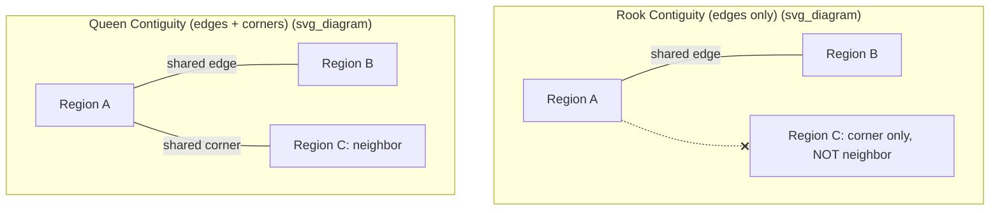

## Spatial Weight Matrices


### Overview

A spatial weight matrix (also called a spatial weights matrix or connectivity matrix) formally encodes the notion of "neighborliness" or spatial proximity between observational units (regions, points, polygons) in spatial econometric analysis. Because standard econometric methods assume independent observations, and spatial data routinely violate this assumption (Tobler's First Law of Geography: "everything is related to everything else, but near things are more related than distant things"), spatial weight matrices provide the mathematical structure needed to model and test for spatial dependence.

Denoted $\mathbf{W}$, this $n \times n$ matrix (for $n$ spatial units) defines, for every pair of units $i$ and $j$, the degree to which $j$ is considered a "neighbor" of $i$. $\mathbf{W}$ is foundational to nearly all spatial econometric models: spatial autocorrelation tests (Moran's I), spatial lag models, spatial error models, and spatial panel models all require a pre-specified $\mathbf{W}$.

### Basic Structure and Notation

For $n$ spatial units, $\mathbf{W}$ is an $n \times n$ matrix with elements $w_{ij}$ representing the spatial relationship between unit $i$ and unit $j$:

$$\mathbf{W} = \begin{bmatrix} w_{11} & w_{12} & \cdots & w_{1n} \\ w_{21} & w_{22} & \cdots & w_{2n} \\ \vdots & \vdots & \ddots & \vdots \\ w_{n1} & w_{n2} & \cdots & w_{nn} \end{bmatrix}$$

**Convention:** the diagonal is set to zero, $w_{ii} = 0$ for all $i$ — a unit is not considered its own neighbor. $\mathbf{W}$ is typically, but not necessarily, symmetric ($w_{ij} = w_{ji}$); asymmetric weight structures arise, for instance, in directed flow networks (e.g., migration or trade flows) where influence is not reciprocal.

### Contiguity-Based Weights

Contiguity weights define neighbors based on shared physical borders between polygons (e.g., administrative regions, census tracts, barangays).

**Rook contiguity:** two units are neighbors if they share a common border (edge), analogous to a rook's movement in chess (horizontal/vertical adjacency only).

**Queen contiguity:** two units are neighbors if they share either a common border or a common vertex (corner point), analogous to a queen's movement (includes diagonal adjacency). Queen contiguity is a superset of rook contiguity and is more commonly used by default in most applied spatial econometrics.

**Binary contiguity weight:**

$$w_{ij} = \begin{cases} 1 & \text{if } i, j \text{ are contiguous (rook or queen)} \\ 0 & \text{otherwise} \end{cases}$$



**Higher-order contiguity:** neighbors of neighbors can be included (second-order contiguity), sometimes used to capture broader spillover ranges, though this risks over-smoothing spatial variation if applied indiscriminately.

### Distance-Based Weights

Distance-based weights define spatial relationships as a function of the geographic (typically Euclidean or great-circle) distance $d_{ij}$ between unit centroids (or point locations).

**Inverse distance weighting:**

$$w_{ij} = \frac{1}{d_{ij}^{\alpha}}$$

where $\alpha$ is a decay parameter (commonly $\alpha = 1$ or $\alpha = 2$), controlling how quickly influence decays with distance. Larger $\alpha$ produces faster decay (more localized influence).

**Distance-band (cutoff) weights:**

$$w_{ij} = \begin{cases} 1 & \text{if } d_{ij} \le d^* \\ 0 & \text{if } d_{ij} > d^* \end{cases}$$

where $d^*$ is a chosen distance threshold (band). A common choice ensures every unit has at least one neighbor (the minimum threshold distance guaranteeing full connectivity), avoiding isolated units with no defined neighbors.

**k-Nearest Neighbors (KNN) weights:**

$$w_{ij} = \begin{cases} 1 & \text{if } j \text{ is among the } k \text{ nearest neighbors of } i \\ 0 & \text{otherwise} \end{cases}$$

KNN weighting guarantees exactly $k$ neighbors per unit regardless of the underlying spatial density, which is useful when unit sizes/densities vary substantially (e.g., mixing dense urban areas with sparse rural areas) — a fixed distance band would otherwise assign very different neighbor counts to units in different density regions. Note that KNN-based $\mathbf{W}$ is generally **asymmetric**: $j$ being among $i$'s $k$ nearest neighbors does not guarantee $i$ is among $j$'s $k$ nearest neighbors.

### Distance-Decay / Kernel Weights

More flexible distance-based schemes apply a continuous decay function (kernel) rather than a hard threshold, commonly used in **Geographically Weighted Regression (GWR)**:

**Gaussian kernel:**

$$w_{ij} = \exp\left(-\frac{d_{ij}^2}{2h^2}\right)$$

**Bisquare kernel:**

$$w_{ij} = \begin{cases} \left(1 - \left(\frac{d_{ij}}{h}\right)^2\right)^2 & \text{if } d_{ij} < h \\ 0 & \text{otherwise} \end{cases}$$

where $h$ is the bandwidth, controlling the effective range of spatial influence. Bandwidth selection (fixed vs. adaptive) is typically optimized via cross-validation or AIC minimization in GWR applications.

### Row-Standardization

Raw (binary or distance-based) weight matrices are almost always **row-standardized** before use in spatial regression models, so that each row sums to 1:

$$w_{ij}^{std} = \frac{w_{ij}}{\sum_{k=1}^{n} w_{ik}}$$

This transforms the spatially lagged variable $\mathbf{Wy}$ into a **weighted average of neighboring values** rather than a raw sum, which is essential for interpretability: the spatial lag term becomes directly comparable in scale to the original variable, and regression coefficients on spatially lagged variables are interpretable as effects of the "average neighbor" rather than depending on the arbitrary number of neighbors each unit happens to have. Row-standardization does, however, break the symmetry of an originally symmetric $\mathbf{W}$ (since row sums generally differ across units with different neighbor counts), which has technical implications for some estimators that assume symmetry.

### Higher-Order and Economic Distance Weights

- **Block/group weights:** units are neighbors if they belong to the same predefined group (e.g., same province, same economic zone), regardless of physical distance — useful for institutional or administrative spillovers.
- **Economic/social distance weights:** $w_{ij}$ based on similarity in economic characteristics (e.g., inverse of the difference in GDP per capita, or trade volume between units) rather than geographic distance — used when the relevant "proximity" is economic/network-based rather than physical.
- **Network-based weights:** derived from actual connectivity graphs (e.g., road networks, migration flows, trade networks, social networks), where $w_{ij}$ reflects network distance, flow volume, or a binary edge indicator from graph data rather than Euclidean geography.

### Role in Spatial Econometric Models

The spatially lagged variable $\mathbf{Wy}$ (or $\mathbf{WX}$, $\mathbf{W}\boldsymbol{\varepsilon}$) enters directly into the core spatial econometric model specifications:

**Spatial Lag Model (SAR):**

$$\mathbf{y} = \rho \mathbf{W}\mathbf{y} + \mathbf{X}\boldsymbol{\beta} + \boldsymbol{\varepsilon}$$

**Spatial Error Model (SEM):**

$$\mathbf{y} = \mathbf{X}\boldsymbol{\beta} + \mathbf{u}, \quad \mathbf{u} = \lambda \mathbf{W}\mathbf{u} + \boldsymbol{\varepsilon}$$

**Spatial Durbin Model (SDM):**

$$\mathbf{y} = \rho \mathbf{W}\mathbf{y} + \mathbf{X}\boldsymbol{\beta} + \mathbf{WX}\boldsymbol{\theta} + \boldsymbol{\varepsilon}$$

In all cases, $\mathbf{W}$ is treated as **known and exogenously specified** by the researcher (not estimated from the data), which places substantial responsibility on the researcher's choice of weight structure, since different reasonable choices of $\mathbf{W}$ can materially change estimated spatial dependence parameters ($\rho$, $\lambda$) and substantive conclusions.

### Moran's I and Weight-Matrix-Dependent Diagnostics

Global spatial autocorrelation is commonly tested via **Moran's I**, which is directly parameterized by $\mathbf{W}$:

$$I = \frac{n}{\sum_{i}\sum_{j} w_{ij}} \cdot \frac{\sum_{i}\sum_{j} w_{ij}(x_i - \bar{x})(x_j - \bar{x})}{\sum_{i}(x_i - \bar{x})^2}$$

Values of $I$ near $+1$ indicate strong positive spatial autocorrelation (clustering of similar values); values near $-1$ indicate negative autocorrelation (dispersion/checkerboard patterns); values near the expected value $E[I] = -1/(n-1)$ indicate spatial randomness. Because $I$ is a direct function of $\mathbf{W}$, different weight matrix specifications can yield materially different Moran's I values and significance levels for the same underlying data.

### Choosing and Validating a Weight Matrix

There is no single universally "correct" $\mathbf{W}$; the choice should be theoretically justified by the substantive spatial process believed to generate dependence (e.g., contiguity for administrative spillovers, distance-decay for diffusion processes, economic distance for trade-linked dependence). Common practical validation approaches:

- **Sensitivity analysis:** re-estimate the spatial model under multiple plausible $\mathbf{W}$ specifications (e.g., queen contiguity vs. KNN vs. distance-band) and check whether substantive conclusions (sign, significance of $\rho$/$\lambda$, and key $\boldsymbol{\beta}$ coefficients) are robust to the choice.
- **Model comparison via information criteria:** compare AIC/BIC across models estimated with different $\mathbf{W}$ specifications, selecting the specification that best fits the data (with the caveat that this is a partly data-driven choice, in tension with the ideally theory-driven nature of $\mathbf{W}$ specification).
- **Ensuring connectivity:** verify no "island" units exist with zero neighbors (a row of all zeros in $\mathbf{W}$), which causes estimation problems in most spatial regression implementations; distance-band matrices are particularly prone to this issue for outlying units.

### Worked Example (Conceptual)

An LGU-level analysis examines whether municipal poverty incidence exhibits spatial clustering across a province's municipalities.

1. Obtain a shapefile of municipal boundaries; construct a queen contiguity matrix $\mathbf{W}_{\text{queen}}$ (municipalities sharing a border or corner are neighbors).
2. Row-standardize $\mathbf{W}_{\text{queen}}$ so each row sums to 1.
3. Compute Moran's I for municipal poverty incidence using $\mathbf{W}_{\text{queen}}$; suppose $I = 0.42$ ($p < .001$) — indicates significant positive spatial clustering (poor municipalities cluster near other poor municipalities).
4. As a robustness check, recompute Moran's I using a 5-nearest-neighbor weight matrix $\mathbf{W}_{\text{KNN-5}}$; suppose the result is qualitatively similar ($I = 0.39$, $p < .001$) — strengthens confidence that the clustering finding is not an artifact of the specific weight structure chosen.
5. Proceed to fit a Spatial Lag or Spatial Error Model using $\mathbf{W}_{\text{queen}}$ as the primary specification, given its natural theoretical justification (municipalities sharing administrative borders plausibly share infrastructure, labor markets, and local governance spillovers).

### Practical Implementation Notes

**Python (PySAL / libpysal):**

```python
import libpysal
from libpysal.weights import Queen, Rook, KNN, DistanceBand

w_queen = Queen.from_dataframe(gdf)      # gdf: GeoDataFrame with polygon geometries
w_rook = Rook.from_dataframe(gdf)
w_knn = KNN.from_dataframe(gdf, k=5)
w_dist = DistanceBand.from_dataframe(gdf, threshold=50000)  # meters

w_queen.transform = "r"  # row-standardization

from esda.moran import Moran
moran_result = Moran(gdf["poverty_incidence"], w_queen)
print(moran_result.I, moran_result.p_sim)
```

**R (spdep):**

```r
library(spdep)
nb_queen <- poly2nb(shp, queen = TRUE)
nb_rook  <- poly2nb(shp, queen = FALSE)
nb_knn   <- knn2nb(knearneigh(coordinates(shp), k = 5))

listw_queen <- nb2listw(nb_queen, style = "W")  # "W" = row-standardized

moran.test(shp$poverty_incidence, listw_queen)
```

**Key Points**

- $\mathbf{W}$ formally defines neighbor relationships between spatial units and is exogenously specified by the researcher, not estimated from the data.
- Contiguity-based weights (rook, queen) use shared borders; distance-based weights (inverse distance, distance-band, KNN) use geographic proximity; economic/network weights use non-geographic similarity or connectivity.
- Row-standardization (rows summing to 1) is standard practice, turning spatial lags into weighted averages of neighboring values, though it sacrifices the symmetry of the original matrix.
- KNN weighting guarantees a fixed neighbor count per unit, useful when spatial unit density varies; distance-band weighting risks isolated ("island") units with no neighbors.
- Moran's I and all spatial regression models (SAR, SEM, SDM) are direct functions of the chosen $\mathbf{W}$; different reasonable specifications can produce materially different results, so sensitivity analysis across weight specifications is standard practice.
- No single "correct" $\mathbf{W}$ exists; the choice should be theoretically motivated by the presumed spatial process, with robustness checks across alternative specifications.

### Common Pitfalls

- Treating the spatial weight matrix as a purely technical/default choice (e.g., always using queen contiguity without justification) rather than a substantive modeling decision tied to the theorized spatial process.
- Failing to check for and address "island" units with no neighbors, which causes estimation failures or undefined spatially lagged values.
- Omitting row-standardization, leading to spatially lagged variables whose scale depends arbitrarily on each unit's neighbor count, complicating coefficient interpretation.
- Not conducting sensitivity analysis across alternative $\mathbf{W}$ specifications, risking substantive conclusions that are artifacts of one particular (and possibly poorly justified) weight choice.
- Using a single global bandwidth or distance threshold across a study area with highly uneven spatial unit density, producing very different effective neighbor counts across regions.
- Conflating geographic weight matrices with genuinely causal spillover channels — spatial autocorrelation detected via $\mathbf{W}$ is descriptive of association patterns and does not by itself establish the mechanism of spillover.

**Related Topics**

- Moran's I and Local Indicators of Spatial Association (LISA)
- Spatial Lag Model (SAR) and Spatial Error Model (SEM)
- Spatial Durbin Model and Spillover Effect Decomposition
- Geographically Weighted Regression (GWR)
- Spatial Panel Data Models
- Network Econometrics and Graph-Based Connectivity Matrices
- Maximum Likelihood and GMM Estimation for Spatial Autoregressive Models