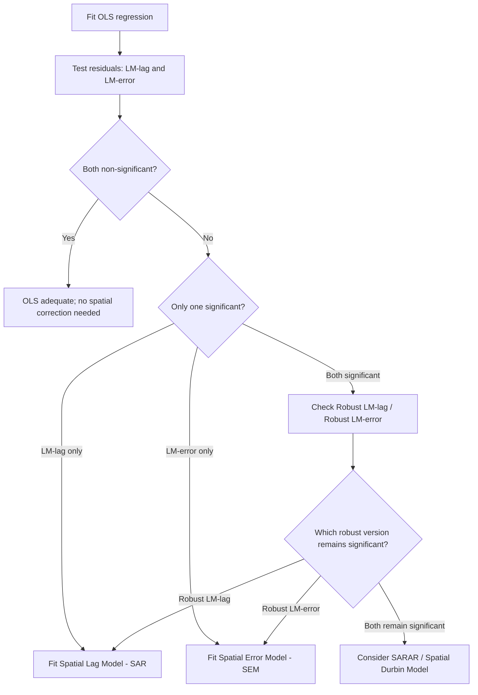

## Tests for Spatial Autocorrelation


### Overview

Tests for spatial autocorrelation formally assess whether the values of a variable observed across spatial units are statistically dependent on the values of that same variable at nearby locations, rather than being independently distributed as classical (non-spatial) statistical methods assume. Spatial autocorrelation can be **positive** (similar values cluster together — high-poverty municipalities near other high-poverty municipalities) or **negative** (dissimilar values cluster together — a checkerboard pattern, less common in socioeconomic data but observed in some competitive/repulsive spatial processes).

These tests are foundational diagnostics in spatial econometrics: detecting spatial autocorrelation in a variable, or in the residuals of a fitted (non-spatial) regression model, motivates the use of spatial regression models (SAR, SEM, SDM) rather than standard OLS, since uncorrected spatial dependence in residuals violates the independence assumption underlying OLS standard errors and can bias coefficient estimates when it stems from an omitted spatially-lagged variable.

All tests discussed here require a pre-specified spatial weight matrix $\mathbf{W}$, since "spatial dependence" is only operationally defined relative to a chosen neighbor structure.

### Global vs. Local Autocorrelation

**Global tests** produce a single statistic summarizing the overall degree of spatial clustering across the entire study area (e.g., Moran's I, Geary's C). **Local tests** (LISA — Local Indicators of Spatial Association) produce a separate statistic for each individual spatial unit, identifying specific local clusters or spatial outliers that a global statistic would average over and potentially mask.

### Moran's I (Global)

The most widely used global test statistic:

$$I = \frac{n}{S_0} \cdot \frac{\sum_{i=1}^{n}\sum_{j=1}^{n} w_{ij}(x_i - \bar{x})(x_j - \bar{x})}{\sum_{i=1}^{n}(x_i - \bar{x})^2}$$

where $n$ is the number of spatial units, $w_{ij}$ are elements of the spatial weight matrix $\mathbf{W}$, and $S_0 = \sum_i \sum_j w_{ij}$ is the sum of all weights.

**Interpretation:**

- $I > E[I]$: positive spatial autocorrelation (clustering of similar values)
- $I < E[I]$: negative spatial autocorrelation (dispersion of similar values)
- $I \approx E[I]$: spatial randomness

where the expected value under the null hypothesis of no spatial autocorrelation is:

$$E[I] = -\frac{1}{n-1}$$

which approaches 0 as $n$ grows large, but is not exactly 0 for finite samples — a common misconception is comparing $I$ against 0 rather than against $E[I]$.

**Significance testing** proceeds via a standardized $z$-score:

$$z_I = \frac{I - E[I]}{\sqrt{\text{Var}(I)}}$$

$\text{Var}(I)$ can be computed under two distributional assumptions:

- **Normality assumption:** assumes $x$ is drawn from a normal distribution.
- **Randomization assumption:** does not assume normality; derives the variance from the actual empirical distribution of $x$ under random permutation — generally preferred in applied work since socioeconomic variables are frequently non-normal.

In practice, significance is very commonly assessed via **conditional permutation** (Monte Carlo simulation): the observed values are randomly reassigned to spatial locations many times (e.g., 999 or 9999 permutations), Moran's I is recomputed under each permutation, and the observed $I$ is compared to this empirical reference distribution to obtain a pseudo p-value. This approach is robust to non-normality and does not rely on the analytic variance formulas.

### Geary's C (Global)

An alternative global statistic based on squared differences between neighboring values rather than covariance:

$$C = \frac{(n-1)}{2 S_0} \cdot \frac{\sum_{i}\sum_{j} w_{ij}(x_i - x_j)^2}{\sum_{i}(x_i - \bar{x})^2}$$

**Interpretation** (note the inverted scale relative to Moran's I):

- $C < 1$: positive spatial autocorrelation (nearby values are similar, so squared differences are small)
- $C > 1$: negative spatial autocorrelation
- $C = 1$: no spatial autocorrelation (expected value under the null)

Geary's C is more sensitive to local/small-scale spatial differences (since it directly uses pairwise squared differences), whereas Moran's I is more sensitive to the global/overall pattern of covariation. The two statistics are correlated but not perfectly so and can occasionally give differing impressions of the strength of spatial structure, particularly in data with extreme values or non-stationary spatial processes. [Inference: the relative sensitivity of Moran's I versus Geary's C to particular spatial patterns is a general property discussed in the spatial statistics literature rather than a guaranteed ranking for any specific dataset.]

### Getis-Ord General G (Global)

Focuses specifically on detecting clustering of **high values** (hot spots) versus **low values** (cold spots), rather than general similarity:

$$G = \frac{\sum_{i}\sum_{j, j \ne i} w_{ij} x_i x_j}{\sum_{i}\sum_{j, j \ne i} x_i x_j}$$

Requires all $x_i > 0$ (or a positive-shifted transformation). A significantly high $G$ indicates clustering of high values; a significantly low $G$ indicates clustering of low values. Unlike Moran's I, General G distinguishes between high-value clustering and low-value clustering rather than treating both as generic "positive autocorrelation."

### Local Indicators of Spatial Association (LISA)

**Local Moran's I** decomposes the global statistic into a unit-specific contribution for each spatial unit $i$:

$$I_i = \frac{(x_i - \bar{x})}{\sum_{k}(x_k-\bar x)^2/n} \sum_{j} w_{ij}(x_j - \bar{x})$$

such that $\sum_i I_i \propto I$ (the global statistic is proportional to the sum of local statistics). Each $I_i$ is tested individually via conditional permutation, producing a local pseudo-significance level and, importantly, a **classification of each significant unit** into one of four quadrant types based on the unit's own value and its neighbors' average value:

- **High-High (HH):** a high-value unit surrounded by high-value neighbors — a "hot spot" cluster.
- **Low-Low (LL):** a low-value unit surrounded by low-value neighbors — a "cold spot" cluster.
- **High-Low (HL):** a high-value unit surrounded by low-value neighbors — a spatial outlier.
- **Low-High (LH):** a low-value unit surrounded by high-value neighbors — a spatial outlier.

These classifications are typically visualized as a **LISA cluster map**, overlaying the quadrant classification (and significance) onto the study area's geography.

```mermaid
quadrantChart
    title LISA Quadrant Classification (svg_diagram)
    x-axis Low Neighbor Value --> High Neighbor Value
    y-axis Low Own Value --> High Own Value
    quadrant-1 High-High (hot spot)
    quadrant-2 Low-High (outlier)
    quadrant-3 Low-Low (cold spot)
    quadrant-4 High-Low (outlier)
```

**Getis-Ord $G_i^*$ statistic** is a related local statistic specifically designed for hot-spot/cold-spot detection (a local analogue of the General G):

$$G_i^* = \frac{\sum_{j} w_{ij} x_j - \bar{x}\sum_j w_{ij}}{s \sqrt{\frac{n\sum_j w_{ij}^2 - (\sum_j w_{ij})^2}{n-1}}}$$

$G_i^*$ (the version including unit $i$ itself in its own neighborhood) is interpreted as a $z$-score directly: large positive values indicate statistically significant hot spots, large negative values indicate statistically significant cold spots. It is a popular choice specifically because it directly outputs an interpretable $z$-score without requiring separate variance derivation for significance, and it explicitly targets value-magnitude clustering (hot/cold spots) rather than general similarity clustering.

### Multiple Testing Considerations

Because LISA statistics are computed for every spatial unit simultaneously (often hundreds or thousands of tests), the family-wise Type I error rate is substantially inflated if each unit's p-value is evaluated at a conventional $\alpha = .05$ without adjustment. Common corrections include the **Bonferroni correction** (highly conservative, dividing $\alpha$ by $n$) and the **False Discovery Rate (FDR)** procedure (Benjamini-Hochberg), which is generally preferred in spatial applications since it offers a less conservative balance between Type I and Type II error control appropriate for exploratory cluster detection.

### Testing Spatial Autocorrelation in Regression Residuals

Beyond testing a raw variable, spatial autocorrelation tests are routinely applied to the **residuals** of a fitted OLS regression to diagnose whether a non-spatial model specification is adequate:

**Moran's I on OLS residuals:** the same Moran's I formula applied to $\hat{\varepsilon}_i$ instead of $x_i$; significant spatial autocorrelation in residuals indicates the model is misspecified with respect to spatial structure (an omitted spatially-structured variable, or a genuinely spatial dependence process).

**Lagrange Multiplier (LM) tests** (Anselin's LM tests) go further, helping distinguish which type of spatial model correction is appropriate:

- **LM-lag:** tests for a missing spatially lagged dependent variable (motivating a Spatial Lag / SAR model).
- **LM-error:** tests for spatially autocorrelated error terms (motivating a Spatial Error / SEM model).
- **Robust LM-lag / Robust LM-error:** versions robust to the presence of the *other* form of misspecification, since LM-lag and LM-error tests can each show significance due to the *other* form of dependence being present (they are not fully discriminating in isolation).

**Decision logic (standard applied practice):**

1. If neither LM-lag nor LM-error is significant → standard OLS is likely adequate (no evidence of spatial dependence).
2. If only one of LM-lag or LM-error is significant → the corresponding model (SAR or SEM respectively) is indicated.
3. If both are significant → examine the Robust LM versions; whichever robust statistic remains significant indicates the appropriate model. If both robust versions remain significant, a more general specification (e.g., Spatial Durbin Model, or a SARAR/SAC model with both lag and error dependence) may be warranted.



### Assumptions and Sensitivity

1. All tests require a pre-specified $\mathbf{W}$; results (magnitude and significance) can vary meaningfully across reasonable alternative weight specifications, so sensitivity analysis across $\mathbf{W}$ choices is standard practice.
2. Moran's I and Geary's C analytic variance formulas assume either normality or a randomization distribution; permutation-based inference relaxes reliance on these analytic assumptions.
3. LM tests for residual autocorrelation assume the non-spatial model is otherwise correctly specified in its functional form; genuine spatial dependence can be confounded with other forms of misspecification (omitted non-spatial variables, nonlinearity) that happen to be spatially clustered.
4. Local statistics (LISA) are less stable in small samples or with sparse neighbor structures, since each local estimate draws only on a small local neighborhood.

### Worked Example (Conceptual)

Continuing the provincial poverty-incidence analysis:

1. Compute global Moran's I on municipal poverty incidence using a queen-contiguity row-standardized $\mathbf{W}$: $I = 0.42$, permutation-based pseudo-$p < .001$ → significant positive global spatial autocorrelation.
2. Compute Local Moran's I for each municipality; apply FDR correction across all local tests.
3. Map significant units: several adjacent northern municipalities classify as High-High (a poverty "hot spot" cluster warranting a coordinated regional intervention), while a cluster of southern municipalities classifies as Low-Low.
4. Identify one municipality classified as Low-High — a relatively low-poverty municipality surrounded by high-poverty neighbors — flagged for further investigation as a potential local success case or a boundary/data artifact.
5. Separately, fit an OLS model of poverty incidence on local economic and infrastructure covariates; test residuals via LM-lag and LM-error. Suppose LM-error is significant and LM-lag is not (and this holds under the robust versions) → proceed to fit a Spatial Error Model rather than OLS.

### Practical Implementation Notes

**Python (PySAL / esda):**

```python
from esda.moran import Moran, Moran_Local
from esda.geary import Geary
from esda.getisord import G, G_Local

moran = Moran(y, w, permutations=999)
print(moran.I, moran.p_sim)

moran_loc = Moran_Local(y, w, permutations=999)
print(moran_loc.q)      # quadrant classification (1=HH, 2=LH, 3=LL, 4=HL)
print(moran_loc.p_sim)  # local pseudo p-values

geary = Geary(y, w, permutations=999)
getis_g = G(y, w, permutations=999)
getis_gi_star = G_Local(y, w, star=True, permutations=999)

# LM tests for spatial regression model selection
from spreg import OLS
ols_model = OLS(y, X, w=w, spat_diag=True, moran=True)
print(ols_model.lm_lag, ols_model.lm_error, ols_model.rlm_lag, ols_model.rlm_error)
```

**R (spdep):**

```r
library(spdep)
moran.test(shp$poverty, listw_queen)
moran.mc(shp$poverty, listw_queen, nsim = 999)  # permutation-based

geary.test(shp$poverty, listw_queen)
globalG.test(shp$poverty, listw_queen)

local_moran <- localmoran(shp$poverty, listw_queen)
localG(shp$poverty, listw_queen)

# LM diagnostics after OLS
lm_model <- lm(poverty ~ x1 + x2, data = shp)
lm.LMtests(lm_model, listw_queen, test = c("LMlag", "LMerr", "RLMlag", "RLMerr"))
```

**Key Points**

- Moran's I is the most widely used global spatial autocorrelation statistic; its expected value under the null is $-1/(n-1)$, not exactly 0, so significance should be assessed via a proper $z$-score or permutation test rather than comparison to 0.
- Geary's C is more sensitive to local/small-scale differences and uses an inverted interpretive scale ($C<1$ indicates positive autocorrelation).
- Getis-Ord statistics (General G, local $G_i^*$) specifically detect value-magnitude clustering (hot spots/cold spots) rather than general similarity clustering.
- Local Moran's I (LISA) decomposes global autocorrelation into per-unit contributions, classified into High-High, Low-Low, High-Low, and Low-High quadrants, and requires multiple-testing correction (commonly FDR) across all units tested simultaneously.
- LM-lag and LM-error tests on OLS residuals guide the choice between Spatial Lag (SAR) and Spatial Error (SEM) models; their robust versions should be consulted when both standard LM tests are significant.
- All spatial autocorrelation tests are conditional on the chosen spatial weight matrix $\mathbf{W}$; results should be checked for robustness across alternative reasonable weight specifications.

### Common Pitfalls

- Comparing observed Moran's I directly to 0 rather than to its correct expected value $E[I] = -1/(n-1)$, especially problematic in small samples where this expected value is not negligible.
- Interpreting a significant global Moran's I as evidence that the entire study area is uniformly clustered, when in fact spatial autocorrelation may be concentrated in a few local hot/cold spots — always following up with local (LISA) analysis when the substantive question concerns *where* clustering occurs.
- Failing to apply a multiple-testing correction (FDR or Bonferroni) when interpreting many simultaneous local LISA test results, inflating false-positive cluster detections.
- Using standard (non-robust) LM-lag and LM-error tests in isolation to select between SAR and SEM when both are significant, without consulting the robust versions — this frequently misidentifies the correct model form.
- Treating detected spatial autocorrelation in residuals as automatically implying a genuine spatial spillover process, when it can equally reflect an omitted non-spatial variable that happens to be spatially clustered (e.g., an unmeasured regional policy or geographic feature).

**Related Topics**

- Spatial Weight Matrices (foundational input to all tests discussed here)
- Spatial Lag Model (SAR) and Spatial Error Model (SEM)
- Spatial Durbin Model and SARAR/SAC Models
- Geographically Weighted Regression (local parameter heterogeneity)
- False Discovery Rate and Multiple Comparison Corrections
- Spatial Panel Data Econometrics
- Exploratory Spatial Data Analysis (ESDA)