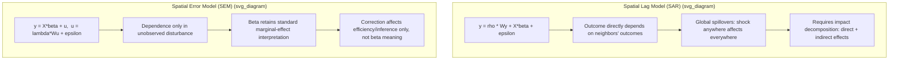

## Spatial Lag and Spatial Error Models


### Overview

Spatial Lag Models (SAR — Spatial Autoregressive Model) and Spatial Error Models (SEM) are the two canonical specifications for incorporating spatial dependence directly into a regression framework, correcting for the violation of the independence assumption that arises when observations are geographically or otherwise spatially linked. They represent two structurally distinct ways spatial dependence can enter a data-generating process: dependence in the **outcome variable itself** (SAR) versus dependence in the **unobserved error/disturbance term** (SEM). Distinguishing which process is operative in a given application has substantive implications for interpretation, since the two models imply different underlying spatial mechanisms and, in the case of SAR, fundamentally different marginal-effect interpretation via spillovers.

Both models require a pre-specified spatial weight matrix $\mathbf{W}$ (see Spatial Weight Matrices) and are typically motivated by a preceding diagnostic stage using Moran's I and Lagrange Multiplier tests on OLS residuals (see Tests for Spatial Autocorrelation).

### Spatial Lag Model (SAR)

#### Specification

The Spatial Lag Model posits that the outcome value at location $i$ directly depends on a weighted average of outcome values at neighboring locations, in addition to its own covariates:

$$\mathbf{y} = \rho \mathbf{W}\mathbf{y} + \mathbf{X}\boldsymbol{\beta} + \boldsymbol{\varepsilon}, \qquad \boldsymbol{\varepsilon} \sim \mathcal{N}(0, \sigma^2 \mathbf{I})$$

where:

- $\mathbf{y}$ is the $n \times 1$ vector of outcomes,
- $\mathbf{W}\mathbf{y}$ is the **spatially lagged dependent variable** — for row-standardized $\mathbf{W}$, this is the weighted average outcome of unit $i$'s neighbors,
- $\rho$ (rho) is the **spatial autoregressive coefficient**, measuring the strength and direction of outcome-to-outcome spatial dependence,
- $\mathbf{X}\boldsymbol{\beta}$ are the usual exogenous covariates and coefficients.

#### Substantive Interpretation

SAR is the appropriate specification when the theorized process is one of genuine **spillover or diffusion in the outcome itself** — e.g., a municipality's local tax rate influences neighboring municipalities' tax rates (tax competition), or a region's infection rate directly affects neighboring regions' infection rates (contagion), or one area's housing prices influence adjacent areas' housing prices (market spillover).

#### Estimation Problem: Simultaneity

Because $\mathbf{y}$ appears on both sides of the equation (through $\mathbf{Wy}$), OLS estimation of the SAR model is **biased and inconsistent** — $\mathbf{Wy}$ is correlated with $\boldsymbol{\varepsilon}$ by construction, since $y_i$ depends on $y_j$ which in turn depends on $\varepsilon_j$, creating a simultaneity problem analogous to endogeneity from a jointly-determined regressor. Two standard estimation approaches address this:

**Maximum Likelihood (ML) estimation:** derives the exact likelihood accounting for the simultaneous structure via the Jacobian of the transformation $(\mathbf{I} - \rho\mathbf{W})$:

$$\ell(\rho, \boldsymbol{\beta}, \sigma^2) = -\frac{n}{2}\ln(2\pi\sigma^2) + \ln|\mathbf{I} - \rho\mathbf{W}| - \frac{1}{2\sigma^2}(\mathbf{y}-\rho\mathbf{Wy}-\mathbf{X}\boldsymbol{\beta})^\top(\mathbf{y}-\rho\mathbf{Wy}-\mathbf{X}\boldsymbol{\beta})$$

The $\ln|\mathbf{I}-\rho\mathbf{W}|$ Jacobian term is what makes this estimator consistent, correcting for the reduced-form dependence of $\mathbf{y}$ on itself; this term also constrains $\rho$ to a range ensuring $(\mathbf{I}-\rho\mathbf{W})$ remains invertible (the **stability condition**, typically $1/\lambda_{min} < \rho < 1/\lambda_{max}$ where $\lambda$ are eigenvalues of $\mathbf{W}$).

**Instrumental Variables / GMM (Kelejian-Prucha, Spatial 2SLS):** treats $\mathbf{Wy}$ as an endogenous regressor and instruments it using spatially lagged exogenous variables, $\mathbf{WX}$, $\mathbf{W}^2\mathbf{X}$, etc. (which are correlated with $\mathbf{Wy}$ via the model's reduced form but uncorrelated with $\boldsymbol{\varepsilon}$ under standard exogeneity assumptions), analogous to using lagged instruments for a jointly determined regressor in standard IV estimation. This approach is often preferred with large $n$ or when the ML approach's computational cost (repeated determinant calculations) becomes prohibitive.

#### The Reduced Form and Global Spillovers

Solving the SAR model for $\mathbf{y}$ explicitly reveals its defining structural feature:

$$\mathbf{y} = (\mathbf{I} - \rho\mathbf{W})^{-1}\mathbf{X}\boldsymbol{\beta} + (\mathbf{I} - \rho\mathbf{W})^{-1}\boldsymbol{\varepsilon}$$

Because $(\mathbf{I}-\rho\mathbf{W})^{-1}$ generally has **no zero entries** (assuming a connected weight structure), a shock to $X_k$ at any single location $j$ theoretically propagates to affect the outcome at **every other location** in the system, not merely $j$'s immediate neighbors — this is the defining "global spillover" property of the SAR model, and is central to why interpreting $\hat{\beta}$ coefficients directly as marginal effects is invalid in a SAR model (see Impact Decomposition below).

### Spatial Error Model (SEM)

#### Specification

The Spatial Error Model instead posits that spatial dependence operates through the **unobserved disturbances**, not the outcome variable directly:

$$\mathbf{y} = \mathbf{X}\boldsymbol{\beta} + \mathbf{u}, \qquad \mathbf{u} = \lambda \mathbf{W}\mathbf{u} + \boldsymbol{\varepsilon}, \qquad \boldsymbol{\varepsilon} \sim \mathcal{N}(0, \sigma^2\mathbf{I})$$

where $\lambda$ (lambda) is the **spatial error autocorrelation coefficient**, and $\mathbf{u}$ follows a spatial autoregressive process in its own right.

#### Substantive Interpretation

SEM is appropriate when spatial dependence is believed to arise from **omitted spatially-correlated variables** (unmeasured factors that are themselves spatially clustered, such as unobserved regional climate, culture, or historical factors affecting the outcome) or from spatially correlated measurement error — i.e., a **nuisance** form of spatial dependence to be corrected for statistically, rather than a substantive spillover mechanism of direct interest.

#### Estimation

Solving for $\mathbf{u} = (\mathbf{I}-\lambda\mathbf{W})^{-1}\boldsymbol{\varepsilon}$ and substituting yields:

$$\mathbf{y} = \mathbf{X}\boldsymbol{\beta} + (\mathbf{I}-\lambda\mathbf{W})^{-1}\boldsymbol{\varepsilon}$$

This implies a non-spherical error covariance structure:

$$\text{Var}(\mathbf{u}) = \sigma^2 \left[(\mathbf{I}-\lambda\mathbf{W})^\top(\mathbf{I}-\lambda\mathbf{W})\right]^{-1}$$

OLS applied to the SEM specification remains **unbiased** for $\boldsymbol{\beta}$ (since $\mathbf{X}$ is not correlated with $\mathbf{u}$ under standard exogeneity), but is **inefficient**, and OLS standard errors are invalid because they ignore this covariance structure — analogous to heteroscedasticity or autocorrelation-consistent standard error corrections in time-series contexts, but here the correlation structure is spatial rather than temporal. Estimation is typically via **Maximum Likelihood** (similarly involving a Jacobian term for $\lambda$) or a **GMM approach** (Kelejian-Prucha's generalized moments estimator, which is computationally lighter than full ML and does not require distributional assumptions on $\boldsymbol{\varepsilon}$).

#### Key Distinction from SAR

Critically, in SEM, a shock to $X$ at location $j$ affects **only** $y_j$ (the standard, non-spatial $\boldsymbol{\beta}$ interpretation holds) — spatial dependence in SEM does not create spillover effects on the outcome; it purely affects the **efficiency and correct inference** on $\boldsymbol{\beta}$, not the substantive interpretation of $\boldsymbol{\beta}$ itself.



### Impact Decomposition in SAR: Direct, Indirect, and Total Effects

Because of the global spillover property, a raw SAR coefficient $\hat{\beta}_k$ cannot be interpreted as "the marginal effect of $X_k$ on $y$" the way an OLS coefficient can. LeSage and Pace's impact-decomposition framework decomposes the full effect of a one-unit change in $X_k$ into:

**Direct effect:** the average effect of a change in $X_k$ at location $i$ on $y_i$ itself, which in a SAR model is *not* simply $\beta_k$, because feedback loops exist (unit $i$ affects its neighbors, who feed back and affect $i$ again through the $(\mathbf{I}-\rho\mathbf{W})^{-1}$ term) — computed as the average of the diagonal elements of $(\mathbf{I}-\rho\mathbf{W})^{-1}\beta_k$.

**Indirect effect (spillover effect):** the average effect of a change in $X_k$ at location $i$ on the outcome at all *other* locations $j \ne i$ — computed as the average of the off-diagonal elements of the same matrix.

**Total effect:** the sum of direct and indirect effects, representing the full system-wide impact of a change in $X_k$ at a single location, summed across all locations affected.

Reporting only the raw $\hat{\beta}_k$ from a SAR model, without this decomposition, is a substantive misinterpretation commonly flagged in applied spatial econometrics.

### The Spatial Durbin Model (SDM) as a Nesting Framework

The **Spatial Durbin Model** nests both SAR and SEM as special cases and is often used as a starting general specification:

$$\mathbf{y} = \rho\mathbf{W}\mathbf{y} + \mathbf{X}\boldsymbol{\beta} + \mathbf{WX}\boldsymbol{\theta} + \boldsymbol{\varepsilon}$$

- If $\boldsymbol{\theta} = 0$: SDM reduces to SAR.
- If $\boldsymbol{\theta} = -\rho\boldsymbol{\beta}$ (the "common factor" restriction): SDM reduces algebraically to SEM.

A **Likelihood Ratio (LR) test** or **Wald test** of the common factor restriction $\boldsymbol{\theta} = -\rho\boldsymbol{\beta}$ provides a formal way to test SEM against the more general SDM, informing model choice. LeSage and Pace have argued that starting with the general SDM specification and testing down is often preferable to relying solely on the LM-lag/LM-error decision sequence (see Tests for Spatial Autocorrelation) applied to OLS residuals, since the latter approach can mis-specify the model when the true process involves both lagged outcomes and lagged covariates. [Inference: this recommendation reflects an established methodological position in the spatial econometrics literature; the field has not settled on it as a universally mandated procedure over the classical LM-based specification search.]

### The SARAR / SAC Model

When both forms of spatial dependence (in the outcome and in the errors) are believed to be present simultaneously — for instance, when both Robust LM-lag and Robust LM-error tests remain significant — a combined specification, variously termed **SARAR** or **SAC (Spatial Autoregressive Combined)**, is used:

$$\mathbf{y} = \rho\mathbf{W}_1\mathbf{y} + \mathbf{X}\boldsymbol{\beta} + \mathbf{u}, \qquad \mathbf{u} = \lambda\mathbf{W}_2\mathbf{u} + \boldsymbol{\varepsilon}$$

where $\mathbf{W}_1$ and $\mathbf{W}_2$ may be the same or different weight matrices. Estimation typically proceeds via GMM (Kelejian-Prucha) given the added computational complexity of joint ML estimation with two spatial parameters.

### Model Selection Workflow

1. Fit OLS; test residuals via Moran's I and LM-lag/LM-error (with robust variants).
2. If neither is significant, retain OLS.
3. If evidence favors one form, fit the corresponding model (SAR or SEM) via ML or GMM/IV.
4. Consider fitting the more general SDM and testing the common factor restriction to check whether SEM is an adequate simplification, or whether covariate spillovers ($\mathbf{WX}$) are also needed.
5. If both lag and error dependence remain evident, consider a SARAR/SAC specification.
6. For a fitted SAR (or SDM with $\rho \ne 0$), always report direct/indirect/total impact decomposition rather than raw coefficients alone.

### Worked Example (Conceptual)

Continuing the provincial poverty-incidence analysis: suppose LM-lag and LM-error diagnostics on the OLS residuals both were significant, but only Robust LM-error remained significant after accounting for the other.

1. Fit a Spatial Error Model via ML: $\hat\lambda = 0.51$ ($p<.001$), indicating substantial spatially correlated unobserved factors (e.g., unmeasured regional geography or historical development patterns) after controlling for observed covariates.
2. Compare $\hat{\boldsymbol{\beta}}$ estimates and standard errors to the naive OLS fit: point estimates are similar (as expected under SEM, since OLS remains unbiased), but SEM standard errors differ (typically larger, reflecting the corrected non-spherical error structure), altering which covariates remain statistically significant.
3. As a robustness check, fit the more general SDM and test the common factor restriction via LR test; suppose the restriction is not rejected ($p = .34$), supporting SEM as an adequate, more parsimonious specification relative to the full SDM.
4. Conclude that a genuine spillover-in-poverty-levels story (which would require SAR/SDM with $\rho \ne 0$) is not strongly supported by the data; instead, unmeasured spatially clustered factors (SEM) better characterize the dependence structure.

### Practical Implementation Notes

**Python (spreg / PySAL):**

```python
from spreg import ML_Lag, ML_Error, GM_Lag, GM_Error_Het

sar_ml = ML_Lag(y, X, w=w, name_y="poverty", name_x=["x1", "x2"])
print(sar_ml.rho, sar_ml.betas)

sem_ml = ML_Error(y, X, w=w, name_y="poverty", name_x=["x1", "x2"])
print(sem_ml.lam, sem_ml.betas)

# GMM/IV alternatives
sar_gmm = GM_Lag(y, X, w=w)
sem_gmm = GM_Error_Het(y, X, w=w)  # heteroskedasticity-robust GMM
```

**R (spatialreg):**

```r
library(spatialreg)

sar_model <- lagsarlm(poverty ~ x1 + x2, data = df, listw = listw_queen)
summary(sar_model)
impacts(sar_model, listw = listw_queen)  # direct/indirect/total decomposition

sem_model <- errorsarlm(poverty ~ x1 + x2, data = df, listw = listw_queen)
summary(sem_model)

sdm_model <- lagsarlm(poverty ~ x1 + x2, data = df, listw = listw_queen, type = "mixed")
LR.Sarlm(sdm_model, sem_model)  # common factor test against SEM

sac_model <- sacsarlm(poverty ~ x1 + x2, data = df, listw = listw_queen)
```

**Key Points**

- SAR models spatial dependence in the outcome variable itself, implying global spillovers where a shock anywhere in the system theoretically affects every location, propagated through $(\mathbf{I}-\rho\mathbf{W})^{-1}$.
- SEM models spatial dependence purely in the unobserved disturbance term; $\boldsymbol{\beta}$ retains its standard marginal-effect interpretation, and the spatial correction affects only efficiency and correct standard errors, not substantive interpretation.
- OLS is biased and inconsistent for SAR (due to simultaneity between $\mathbf{Wy}$ and $\boldsymbol{\varepsilon}$) but remains unbiased (though inefficient, with invalid standard errors) for SEM.
- Raw SAR coefficients must not be interpreted directly as marginal effects; use the direct/indirect/total impact decomposition (LeSage-Pace) instead.
- The Spatial Durbin Model nests both SAR and SEM as special cases and provides a formal common-factor test for whether SEM is an adequate simplification.
- When both lag and error dependence are evidenced (e.g., both robust LM tests significant), a combined SARAR/SAC specification, typically estimated via GMM, may be warranted.

### Common Pitfalls

- Estimating a SAR model by OLS, ignoring the simultaneity bias introduced by $\mathbf{Wy}$ appearing on the right-hand side — this produces inconsistent estimates, not merely inefficient ones.
- Reporting and interpreting raw SAR $\hat\beta$ coefficients as if they were standard marginal effects, without computing the direct/indirect/total impact decomposition.
- Choosing between SAR and SEM based solely on which model produces a "more significant" or "larger" spatial coefficient, rather than on theoretical grounds (a genuine spillover mechanism vs. an omitted-variable/nuisance dependence story) supported by diagnostic tests.
- Applying standard (non-robust) LM-lag/LM-error tests in isolation for model selection when both are significant, rather than consulting robust LM variants or a formal SDM common-factor test.
- Neglecting to check the stability condition on $\rho$ (or $\lambda$) implied by the eigenvalues of $\mathbf{W}$, which can produce an invalid or explosive spatial process if violated.
- Treating a significant SEM $\hat\lambda$ as evidence of a genuine behavioral spillover process, when SEM by construction represents a "nuisance" correction for omitted spatially correlated factors rather than a substantive spillover mechanism.

**Related Topics**

- Spatial Weight Matrices (required input for all models discussed here)
- Tests for Spatial Autocorrelation (Moran's I, LM-lag/LM-error diagnostics motivating model choice)
- Spatial Durbin Model and the Common Factor Restriction
- SARAR/SAC Combined Spatial Models
- LeSage-Pace Impact Decomposition (Direct, Indirect, Total Effects)
- Spatial Panel Data Models (fixed/random effects extensions)
- Geographically Weighted Regression (local, non-global alternative to global spatial dependence models)