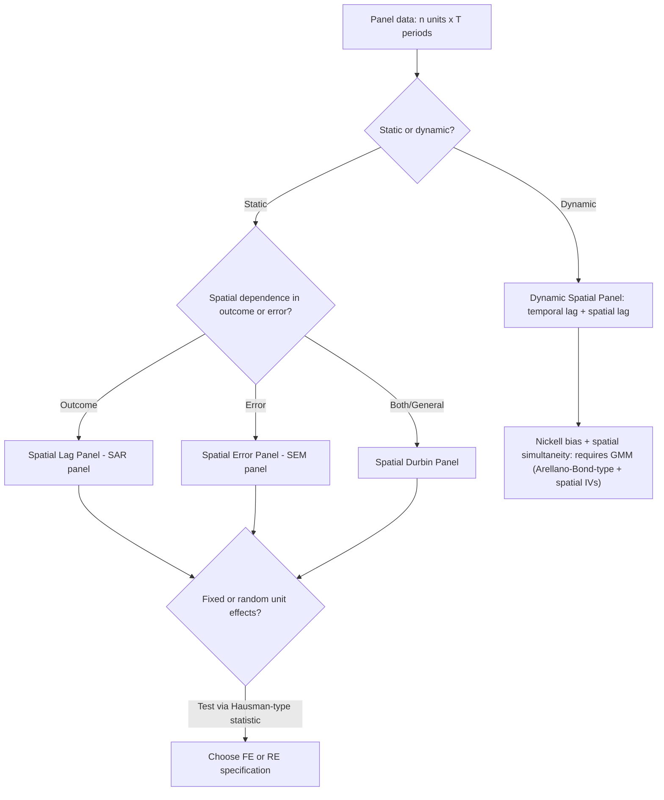

## Spatial Panel Data Models


### Overview

Spatial panel data models extend spatial econometric specifications (SAR, SEM, SDM) to data observed across both space and time — $n$ spatial units observed over $T$ time periods. This combination allows a researcher to simultaneously control for unobserved heterogeneity across units (as in standard panel data methods) and model spatial dependence across units (as in cross-sectional spatial econometrics), addressing two distinct sources of correlation that a purely cross-sectional spatial model or a purely non-spatial panel model would each miss on their own.

Spatial panels are common in regional economics, public finance (inter-jurisdictional policy competition over time), epidemiology (disease spread across regions over time), and environmental economics (pollution spillovers across monitoring stations over time).

### Data Structure and Notation

For spatial unit $i = 1, \dots, n$ and time period $t = 1, \dots, T$, the general spatial panel model is:

$$y_{it} = \rho \sum_{j=1}^{n} w_{ij} y_{jt} + \mathbf{x}_{it}^\top\boldsymbol{\beta} + \mu_i + \gamma_t + \varepsilon_{it}$$

where $\mu_i$ captures unit-specific (spatial) unobserved heterogeneity, $\gamma_t$ captures time-specific unobserved shocks common to all units in a given period (e.g., a national policy change or macroeconomic shock), and $\mathbf{W}$ is applied within each cross-section (i.e., $\mathbf{y}_{jt}$ uses only *other spatial units at the same time $t$*, not lagged in time).

In matrix/stacked notation across the full $nT \times 1$ panel:

$$\mathbf{y} = \rho (\mathbf{I}_T \otimes \mathbf{W})\mathbf{y} + \mathbf{X}\boldsymbol{\beta} + (\boldsymbol{\iota}_T \otimes \boldsymbol{\mu}) + (\boldsymbol{\gamma} \otimes \boldsymbol{\iota}_n) + \boldsymbol{\varepsilon}$$

where $\mathbf{I}_T \otimes \mathbf{W}$ is a block-diagonal matrix applying $\mathbf{W}$ separately within each time period's cross-section (the Kronecker product structure ensures no cross-time spatial linkages are imposed by default).

### Fixed Effects vs. Random Effects

As in standard (non-spatial) panel data econometrics, the treatment of $\mu_i$ (and optionally $\gamma_t$) determines the estimation approach:

**Spatial Fixed Effects (SFE):** $\mu_i$ are treated as unit-specific parameters to be estimated (or eliminated via a within-transformation), allowing $\mu_i$ to be arbitrarily correlated with $\mathbf{X}$. This controls for **all time-invariant unit-specific unobserved heterogeneity** — e.g., a municipality's fixed geographic characteristics, historical baseline development level, or persistent institutional quality — without requiring these factors to be explicitly measured.

**Spatial Random Effects (SRE):** $\mu_i \sim \mathcal{N}(0, \sigma_\mu^2)$ is treated as a random draw, uncorrelated with $\mathbf{X}$, estimated via Generalized Least Squares (GLS)-type methods exploiting the implied error covariance structure. More efficient than fixed effects **if** the (typically strong) assumption of $\mu_i \perp \mathbf{X}$ holds, but inconsistent if it does not.

**Hausman-type specification test:** analogous to the standard panel Hausman test, compares fixed- and random-effects spatial panel estimates to assess whether the random effects assumption ($\mu_i \perp \mathbf{X}$) is tenable; a significant test statistic favors the fixed-effects specification.

**Time Fixed Effects:** $\gamma_t$ are commonly included to absorb any period-specific shock common to all spatial units simultaneously (e.g., a national economic downturn, a nationwide policy change), preventing such shocks from being misattributed to spatial dependence or the covariates of interest. Models including both $\mu_i$ and $\gamma_t$ are termed **two-way fixed effects** spatial panels.

### The Within-Transformation Complication

In standard (non-spatial) fixed-effects panel estimation, the within-transformation (demeaning each unit's data by its own time-average) eliminates $\mu_i$ cleanly, after which pooled OLS on the demeaned data is consistent. In **spatial** fixed-effects panels, this transformation still works to eliminate $\mu_i$, but the resulting demeaned model still contains the spatially lagged dependent variable $(\mathbf{I}_T \otimes \mathbf{W})\mathbf{y}$, so the same simultaneity problem present in the cross-sectional SAR model persists after demeaning — the within-transformation does not resolve the endogeneity of $\mathbf{Wy}$, and ML or GMM/IV estimation is still required on the transformed data.

### Spatial Panel Model Variants

**Spatial Lag Panel Model (SAR panel):**

$$y_{it} = \rho \sum_j w_{ij} y_{jt} + \mathbf{x}_{it}^\top\boldsymbol{\beta} + \mu_i + \varepsilon_{it}$$

Models contemporaneous spatial spillovers in the outcome, within each time period, net of time-invariant unit heterogeneity.

**Spatial Error Panel Model (SEM panel):**

$$y_{it} = \mathbf{x}_{it}^\top\boldsymbol{\beta} + \mu_i + u_{it}, \qquad u_{it} = \lambda\sum_j w_{ij}u_{jt} + \varepsilon_{it}$$

Models spatially correlated disturbances within each cross-section, net of unit fixed effects.

**Spatial Durbin Panel Model:** adds $\mathbf{WX}_{it}$ terms, nesting SAR and SEM panels as in the cross-sectional case, and is often the recommended general starting specification for the same reasons discussed for the cross-sectional SDM.

**Dynamic Spatial Panel Model:** incorporates a **temporally lagged** dependent variable $y_{i,t-1}$ in addition to the spatially lagged $\sum_j w_{ij}y_{jt}$, and sometimes a **space-time lag** $\sum_j w_{ij}y_{j,t-1}$:

$$y_{it} = \tau y_{i,t-1} + \rho \sum_j w_{ij}y_{jt} + \eta \sum_j w_{ij}y_{j,t-1} + \mathbf{x}_{it}^\top\boldsymbol{\beta} + \mu_i + \varepsilon_{it}$$

This specification distinguishes **short-run** effects (immediate period) from **long-run** effects (the cumulative effect once the dynamic system reaches steady state), and is structurally analogous to a spatial extension of the dynamic panel data model (Arellano-Bond family), inheriting the same core estimation challenge: the lagged dependent variable $y_{i,t-1}$ is mechanically correlated with the unit fixed effect $\mu_i$ (the Nickell bias problem), compounded here by the additional spatial simultaneity in $\mathbf{Wy}_{t}$.



### Estimation Methods

**Quasi-Maximum Likelihood (QML):** the standard approach for static spatial panels (Lee and Yu's estimator is a widely used reference), extending the cross-sectional ML approach with the Jacobian correction for $(\mathbf{I}_n - \rho\mathbf{W})$ applied within each time period, combined with the within- or GLS-transformation to handle $\mu_i$.

**GMM/Spatial IV:** extends the Kelejian-Prucha cross-sectional approach to the panel setting, instrumenting $\mathbf{Wy}_{it}$ with spatially and/or temporally lagged exogenous variables; often preferred for dynamic spatial panels given the compounded endogeneity from both the temporal lag and the spatial lag.

**Bayesian MCMC approaches:** used in some applied spatial panel literature, particularly for models with spatially varying (random) coefficients, though this is a less universally standardized approach relative to QML/GMM. [Inference: the relative prevalence of Bayesian versus QML/GMM approaches varies by subfield and specific model complexity, rather than reflecting one clearly dominant convention across all applied spatial panel econometrics.]

### Testing for Spatial Dependence in Panel Settings

Panel extensions of the cross-sectional diagnostics are used prior to model selection:

- **Panel Moran's I:** computed period-by-period, or pooled across the panel, to test for spatial autocorrelation in the outcome or in pooled OLS/fixed-effects residuals.
- **Panel LM tests (Baltagi, Song, and Koh; Debarsy and Ertur):** panel analogues of the cross-sectional LM-lag/LM-error tests, additionally capable of jointly testing for spatial error dependence *and* random effects, disentangling the two sources of correlation.

### Long-Run vs. Short-Run Effects in Dynamic Spatial Panels

In a dynamic spatial panel, the **short-run effect** of a change in $X_k$ is analogous to the cross-sectional SAR impact decomposition (direct/indirect/total) applied within a single period. The **long-run effect** accounts for the full temporal accumulation of the dynamic process as the system converges to its steady state, obtained by solving the model's reduced form as $t \to \infty$:

$$\text{Long-run total effect} = \frac{\beta_k}{1 - \tau - \rho - \eta} \times (\text{spatial multiplier structure})$$

(schematically; the precise long-run multiplier matrix again involves $(\mathbf{I}_n - \rho\mathbf{W})^{-1}$-type terms combined with the temporal geometric-series factor $1/(1-\tau)$). Reporting only the short-run coefficient in a dynamic spatial panel, without the long-run multiplier, substantially understates the ultimate impact of a persistent policy change.

### Worked Example (Conceptual)

Suppose a province wants to evaluate whether local infrastructure spending affects municipal economic activity, using annual municipal-level panel data over 10 years, allowing for both persistent municipal characteristics and neighboring-municipality spillovers.

1. Establish panel structure: $n$ = number of municipalities, $T = 10$ years.
2. Test pooled OLS residuals for spatial dependence using a panel Moran's I; find significant clustering.
3. Estimate a static two-way fixed-effects Spatial Durbin Panel Model (unit and year fixed effects, plus $\mathbf{WX}$ terms) via QML.
4. Conduct a Hausman-type test comparing fixed vs. random unit effects; fixed effects favored ($p < .01$), consistent with the expectation that municipalities have persistent, likely $X$-correlated unobserved characteristics (e.g., historical infrastructure stock, geographic terrain).
5. Given plausible persistence in economic activity (this year's economic output likely depends on last year's), re-specify as a dynamic spatial panel including $y_{i,t-1}$; estimate via a spatial GMM extension of the Arellano-Bond estimator to address both Nickell bias and spatial simultaneity.
6. Report both short-run and long-run direct/indirect/total effects of infrastructure spending; the long-run indirect (spillover) effect indicates how much a municipality's infrastructure investment benefits neighboring municipalities' economic activity once the dynamic system stabilizes.

### Practical Implementation Notes

**R (splm):**

```r
library(splm)

# Static spatial panel, fixed effects, spatial lag
sar_panel_fe <- spml(
  formula = y ~ x1 + x2,
  data = panel_df,
  listw = listw_queen,
  model = "within",     # fixed effects
  effect = "twoways",   # unit + time fixed effects
  lag = TRUE,           # spatial lag (SAR)
  spatial.error = "none"
)
summary(sar_panel_fe)

# Static spatial panel, random effects, spatial error
sem_panel_re <- spml(
  formula = y ~ x1 + x2,
  data = panel_df,
  listw = listw_queen,
  model = "random",
  lag = FALSE,
  spatial.error = "b"   # Baltagi et al. GM-type spatial error
)

# Hausman test for spatial panels
sphtest(sar_panel_fe, sar_panel_re)

# Panel LM tests
bsktest(formula = y ~ x1 + x2, data = panel_df, listw = listw_queen, test = "LM1")
```

**Python (spreg — panel support is more limited than R's splm; often supplemented with manual pooled/within-transformation + spreg cross-sectional spatial estimators, or specialized packages):**

```python
# Conceptual pattern: apply within-transformation per unit, then spatial ML/GMM per period
# or use dedicated spatial panel packages as available in the current Python spatial econometrics ecosystem.
```

**Key Points**

- Spatial panel models jointly address two distinct correlation sources: spatial dependence across units (within each time period) and unobserved heterogeneity across units over time.
- Fixed effects control for time-invariant unit-specific unobserved factors (potentially correlated with $\mathbf{X}$); random effects are more efficient but require the stronger assumption that unit effects are uncorrelated with $\mathbf{X}$, testable via a Hausman-type statistic.
- The within-transformation eliminates fixed effects but does not resolve the spatial simultaneity in $\mathbf{Wy}$; ML or GMM/IV estimation is still required on the transformed model.
- Dynamic spatial panels (including a temporally lagged outcome) compound Nickell bias with spatial simultaneity, typically requiring a spatial extension of GMM dynamic-panel estimators.
- Dynamic specifications require reporting both short-run and long-run direct/indirect/total effects; the short-run coefficient alone substantially understates the cumulative long-run impact of a persistent change.
- Two-way fixed effects (unit and time) are standard practice to separately absorb persistent unit heterogeneity and economy-wide period shocks.

### Common Pitfalls

- Applying a standard non-spatial panel within-transformation and then estimating by pooled OLS, without correcting for the spatial simultaneity that remains in $\mathbf{Wy}$ after demeaning.
- Choosing random effects for computational convenience without testing (or without theoretical justification for) the assumption that unit effects are uncorrelated with the regressors.
- Omitting time fixed effects, allowing economy-wide or nationwide period shocks to be misattributed to spatial dependence or to the covariates of interest.
- Estimating a dynamic spatial panel via standard (non-GMM) fixed-effects methods, ignoring the compounded Nickell bias and spatial simultaneity, which jointly bias the estimated temporal and spatial autoregressive parameters.
- Reporting only short-run coefficients from a dynamic spatial panel model as if they represented the full effect of a policy change, omitting the long-run multiplier.
- Assuming the spatial weight matrix $\mathbf{W}$ is stable across all time periods when the underlying spatial relationships (e.g., trade linkages, migration networks) may plausibly evolve over a long panel — a time-invariant $\mathbf{W}$ is the standard simplifying assumption but is not always substantively appropriate.

**Related Topics**

- Spatial Lag and Spatial Error Models (cross-sectional foundation)
- Spatial Weight Matrices (including time-varying weight matrix considerations)
- Panel Data Fixed and Random Effects Models (non-spatial foundation)
- Dynamic Panel Data Estimation (Arellano-Bond, Nickell Bias)
- LeSage-Pace Impact Decomposition (short-run and long-run analogues)
- Spatial Durbin Model and Common Factor Testing
- Hausman Specification Testing