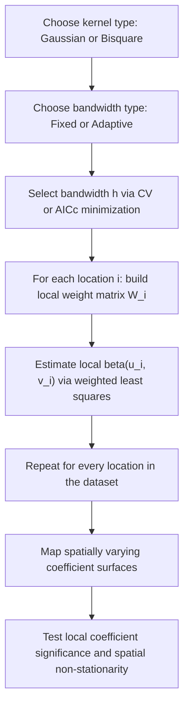

## Geographically Weighted Regression


### Overview

Geographically Weighted Regression (GWR) is a local spatial statistical technique that allows regression coefficients to **vary across geographic space**, directly addressing spatial non-stationarity — the phenomenon where the relationship between a predictor and an outcome is not constant across a study area, but instead differs systematically from place to place. Whereas the spatial models discussed elsewhere in this chapter (SAR, SEM, SDM) produce a single **global** set of coefficients while correcting for spatial dependence in the outcome or errors, GWR produces a **separate local coefficient estimate for every spatial location**, treating spatial heterogeneity in the relationship itself as the primary object of interest rather than a nuisance to correct for.

GWR is widely used in applications where theory or exploratory evidence suggests that a relationship's strength or even direction plausibly differs by location — e.g., the effect of income on housing price may be stronger in urban cores than rural peripheries, or the effect of rainfall on crop yield may vary by soil type across a region.

### Conceptual Basis: From Global to Local Regression

A standard (global) OLS regression assumes a single, spatially constant relationship:

$$y_i = \beta_0 + \sum_{k=1}^{p} \beta_k x_{ik} + \varepsilon_i$$

GWR instead estimates a **separate regression equation centered at every location** $i$, allowing each coefficient to be a function of geographic location $(u_i, v_i)$ (typically the coordinates of location $i$):

$$y_i = \beta_0(u_i, v_i) + \sum_{k=1}^{p} \beta_k(u_i, v_i)\, x_{ik} + \varepsilon_i$$

Rather than fitting one equation using all $n$ observations equally, GWR fits $n$ separate weighted regressions — one centered at each location — where observations closer to the location being estimated receive greater weight, and more distant observations receive progressively less weight.

### Local Weighted Least Squares Estimation

For each location $i$, the local coefficient vector is estimated via **weighted least squares**:

$$\hat{\boldsymbol{\beta}}(u_i, v_i) = (\mathbf{X}^\top \mathbf{W}_i \mathbf{X})^{-1} \mathbf{X}^\top \mathbf{W}_i \mathbf{y}$$

where $\mathbf{W}_i$ is an $n \times n$ diagonal matrix whose $j$-th diagonal entry $w_{ij}$ is a **distance-decay kernel weight** based on the distance $d_{ij}$ between location $i$ (the regression point) and every other observation $j$ in the dataset. This is structurally distinct from the fixed spatial weight matrix $\mathbf{W}$ used in SAR/SEM models (see Spatial Weight Matrices): here, a full new weight matrix $\mathbf{W}_i$ is constructed *for each regression point $i$*, since the kernel is centered on $i$ and recalculated for every location.

### Kernel Functions

**Gaussian kernel:**

$$w_{ij} = \exp\left(-\frac{1}{2}\left(\frac{d_{ij}}{h}\right)^2\right)$$

**Bisquare (bi-square) kernel:**

$$w_{ij} = \begin{cases} \left(1 - \left(\frac{d_{ij}}{h}\right)^2\right)^2 & d_{ij} < h \\ 0 & d_{ij} \ge h \end{cases}$$

The bisquare kernel is compact (weights become exactly zero beyond bandwidth $h$), which is computationally convenient since distant observations can be excluded entirely from each local regression, whereas the Gaussian kernel assigns strictly positive (though vanishingly small) weight to all observations regardless of distance.

### Fixed vs. Adaptive Bandwidth

**Fixed bandwidth:** $h$ is a constant distance applied uniformly across the entire study area. This is problematic when spatial unit density varies substantially — in sparse (rural) areas, a fixed bandwidth may include very few neighboring observations (unstable local estimates), while in dense (urban) areas the same bandwidth may include far more observations than necessary, over-smoothing local variation.

**Adaptive bandwidth:** the bandwidth is defined not as a fixed distance but as the distance required to capture a fixed **number of nearest neighbors** (analogous to KNN weighting), so the effective spatial reach of the kernel expands in sparse areas and contracts in dense areas, holding the *number* of observations used in each local regression roughly constant instead of the geographic *distance*. Adaptive bandwidths are generally preferred when spatial sampling density is uneven across the study area.

### Bandwidth Selection

The bandwidth $h$ (or, for adaptive kernels, the number of nearest neighbors) is the single most consequential tuning parameter in GWR, controlling the fundamental bias-variance trade-off:

- **Small bandwidth:** highly localized regressions using few nearby points — low bias (captures fine-grained local variation) but high variance (unstable coefficient estimates due to small effective local sample size).
- **Large bandwidth:** more global regressions using many/most points — low variance (stable estimates) but high bias (smooths over genuine local heterogeneity; approaches standard global OLS as $h \to \infty$).

**Cross-validation (CV) score minimization:**

$$CV(h) = \sum_{i=1}^{n} \left(y_i - \hat{y}_{\ne i}(h)\right)^2$$

where $\hat{y}_{\ne i}(h)$ is the predicted value at $i$ from a local regression that **excludes** observation $i$ itself (leave-one-out), for a given bandwidth $h$. The bandwidth minimizing CV score is selected.

**Corrected AIC (AICc) minimization:** an alternative criterion accounting for the effective number of parameters implied by the local weighting scheme (see Effective Degrees of Freedom below), often preferred over CV since it directly penalizes model complexity in a way comparable across different bandwidth choices, and is less prone to selecting an implausibly small bandwidth than raw CV minimization in some circumstances. [Inference: whether AICc or CV bandwidth selection performs better in a given application depends on sample size, spatial configuration, and noise level; the general guidance favoring AICc reflects common practice rather than a universal proof of superiority.]



### Effective Degrees of Freedom and Local Coefficient Inference

Because GWR fits $n$ local regressions that share overlapping data (nearby locations' regressions use much of the same underlying data), the **effective number of parameters** is not simply $n \times p$ (as if each local regression were fully independent), but a smaller "effective degrees of freedom" quantity computed from the trace of the hat matrix that maps $\mathbf{y}$ to $\hat{\mathbf{y}}$ across all local regressions jointly. This effective degrees-of-freedom concept underlies both the AICc bandwidth-selection criterion and the local $t$-statistics used to assess whether an individual local coefficient estimate is statistically distinguishable from zero at a specific location.

**Local $t$-statistics** for each coefficient at each location allow mapping not just the coefficient surface itself, but also **where** the relationship is statistically significant versus where the local sample is too sparse or the relationship too weak to detect reliably.

### Testing for Spatial Non-Stationarity

A key diagnostic question is whether the apparent variation in local coefficients across the study area represents *genuine* spatial non-stationarity or merely sampling variability that would be expected even under a truly constant (global) relationship. The standard test compares:

$$F \approx \frac{\text{variance of local } \hat\beta_k \text{ estimates}}{\text{variance expected under a globally constant coefficient}}$$

implemented via a Monte Carlo randomization test (comparing the observed variability in local coefficients to a reference distribution generated by randomly permuting the spatial locations of observations), producing a p-value for each coefficient indicating whether its spatial variation is statistically significant. A non-significant result for a given coefficient suggests that, despite locally varying point estimates, a single global coefficient may be an adequate simplification for that particular variable.

### Multicollinearity: Local Collinearity

A well-documented complication specific to GWR is **local multicollinearity**: even when predictors are only mildly correlated globally, the local subsample of observations used in a specific location's weighted regression (especially with small or adaptive bandwidths in sparse areas) can exhibit severe collinearity, producing unstable, sign-inconsistent, or implausibly large local coefficient estimates at certain locations. Diagnostic tools such as **local condition numbers** and **local variance inflation factors (VIFs)**, computed separately at each regression point, are used to flag locations where local coefficient estimates should be interpreted cautiously.

### Multiscale GWR (MGWR)

A key limitation of standard GWR is that it forces **all** coefficients (including the intercept) to vary according to a **single shared bandwidth**, implicitly assuming every relationship in the model operates at the same spatial scale. **Multiscale GWR (MGWR)** relaxes this by allowing each covariate to have its **own optimal bandwidth**, recognizing that some relationships may genuinely operate at a very local scale (small bandwidth) while others operate more globally (large bandwidth, potentially approaching a constant global coefficient). MGWR is estimated via a backfitting algorithm that iteratively optimizes each covariate's bandwidth conditional on the current estimates of the others, and is generally regarded as a methodological improvement over standard GWR precisely because forcing a single bandwidth across all covariates is a strong and often implausible simplifying assumption.

### Relationship to Global Spatial Econometric Models

GWR and the global spatial regression models (SAR, SEM, SDM) address **fundamentally different forms of spatial dependence** and are not interchangeable diagnostic tools for the same problem:

- **SAR/SEM/SDM** assume a single, spatially *constant* relationship ($\boldsymbol{\beta}$ fixed across space) but explicitly model spatial *autocorrelation* (dependence between nearby observations' outcomes or errors).
- **GWR** typically assumes spatially *independent* observations conditional on location (no explicit $\mathbf{Wy}$ or $\mathbf{Wu}$ term) but explicitly models spatial *non-stationarity* (the relationship itself varying by place).

In principle, both forms of spatial complexity — non-stationary coefficients and residual spatial autocorrelation — could exist simultaneously in a given dataset; extensions incorporating spatial autocorrelation corrections into a GWR framework exist in the specialized literature, but standard GWR software implementations generally do not jointly estimate both by default, and combining them is more methodologically involved than either technique in isolation.

### Worked Example (Conceptual)

An LGU planning office wants to understand whether the effect of distance-to-nearest-health-facility on household health outcomes is spatially constant across the province, or whether it varies meaningfully by area (e.g., mountainous vs. lowland barangays).

1. Fit a global OLS regression of a health outcome index on distance-to-facility and relevant controls; note the single global coefficient (e.g., $\hat\beta = -0.15$).
2. Fit GWR with a bisquare kernel and adaptive bandwidth, selecting the bandwidth via AICc minimization; suppose the optimal bandwidth corresponds to roughly the 40 nearest barangays.
3. Map the resulting local coefficient surface for distance-to-facility: coefficients range from approximately $-0.05$ (weak effect) in lowland, well-connected barangays to $-0.40$ (strong negative effect) in mountainous, poorly connected barangays.
4. Run the Monte Carlo spatial non-stationarity test for this coefficient; obtain a significant result ($p < .01$), supporting genuine spatial variation in the relationship rather than sampling noise.
5. Check local condition numbers across the study area; flag a small cluster of barangays with high local collinearity between distance-to-facility and a correlated terrain-ruggedness covariate, and interpret local coefficients in that specific cluster cautiously.
6. Recommend targeted health-facility placement in the mountainous barangays where the estimated marginal benefit of reduced distance is substantially larger than the province-wide average.

### Practical Implementation Notes

**Python (mgwr):**

```python
from mgwr.gwr import GWR, MGWR
from mgwr.sel_bw import Sel_BW

coords = list(zip(gdf.geometry.centroid.x, gdf.geometry.centroid.y))

bw_selector = Sel_BW(coords, y, X, kernel="bisquare", fixed=False)  # adaptive bandwidth
optimal_bw = bw_selector.search(criterion="AICc")

gwr_model = GWR(coords, y, X, bw=optimal_bw, kernel="bisquare", fixed=False)
gwr_results = gwr_model.fit()
print(gwr_results.params)       # local coefficients per observation
print(gwr_results.tvalues)      # local t-statistics
print(gwr_results.localR2)      # local model fit

# Multiscale GWR
mgwr_selector = Sel_BW(coords, y, X, multi=True)
mgwr_bws = mgwr_selector.search()
mgwr_model = MGWR(coords, y, X, mgwr_selector, kernel="bisquare", fixed=False)
mgwr_results = mgwr_model.fit()
```

**R (GWmodel):**

```r
library(GWmodel)

bw_adaptive <- bw.gwr(y ~ x1 + x2, data = sp_df, approach = "AICc",
                       kernel = "bisquare", adaptive = TRUE)

gwr_model <- gwr.basic(y ~ x1 + x2, data = sp_df, bw = bw_adaptive,
                        kernel = "bisquare", adaptive = TRUE)
print(gwr_model)

# Local collinearity diagnostics
gwr_collin <- gwr.collin.diagno(y ~ x1 + x2, data = sp_df, bw = bw_adaptive,
                                 kernel = "bisquare", adaptive = TRUE)

# Multiscale GWR
mgwr_model <- gwr.multiscale(y ~ x1 + x2, data = sp_df, kernel = "bisquare",
                              adaptive = TRUE, criterion = "CVR")
```

**Key Points**

- GWR allows regression coefficients to vary continuously across geographic space, directly modeling spatial non-stationarity rather than assuming (as SAR/SEM/SDM do) a single global relationship.
- Local coefficients are estimated via kernel-weighted least squares centered at each location; bandwidth choice (fixed vs. adaptive; Gaussian vs. bisquare kernel) governs the bias-variance trade-off between over-localized (unstable) and over-smoothed (biased toward global OLS) estimates.
- Bandwidth is typically selected via cross-validation or (often preferred) corrected AIC minimization.
- A Monte Carlo-based test for spatial non-stationarity should accompany GWR results to distinguish genuine local variation in a coefficient from sampling noise around a constant true value.
- Local multicollinearity, distinct from and often more severe than global multicollinearity, is a well-known complication that must be diagnosed via local condition numbers or VIFs at each regression point.
- Multiscale GWR (MGWR) relaxes the single-bandwidth-for-all-covariates assumption of standard GWR, allowing each predictor to operate at its own appropriate spatial scale.
- GWR (non-stationary coefficients) and global spatial autoregressive models (spatially autocorrelated outcomes/errors) address distinct forms of spatial complexity and are not direct substitutes for one another.

### Common Pitfalls

- Treating GWR's locally varying coefficient maps as automatically indicating genuine spatial heterogeneity without running the formal Monte Carlo non-stationarity test, when some apparent local variation may simply reflect sampling noise.
- Using a single shared bandwidth for all covariates (standard GWR) when the true spatial scales of different relationships plausibly differ, without considering Multiscale GWR as an alternative.
- Overlooking local multicollinearity diagnostics, leading to uncritical acceptance of unstable or sign-flipping local coefficients at specific locations as if they were substantively meaningful.
- Selecting an implausibly small bandwidth via unconstrained CV minimization, producing highly unstable, overfit local estimates driven by very few nearby observations.
- Treating GWR as a substitute for, rather than a complement to, global spatial autoregressive models (SAR/SEM) when the research question concerns spatial dependence in the outcome/error rather than spatial variation in the coefficient relationship itself.
- Extrapolating or interpreting local coefficient estimates at the edges of the study area, where the effective local sample size (particularly under adaptive bandwidths) may be smaller or spatially asymmetric relative to interior locations.

**Related Topics**

- Spatial Weight Matrices (contrasting fixed global weights vs. GWR's per-location kernel weights)
- Spatial Lag and Spatial Error Models (global spatial dependence alternative)
- Multiscale GWR and Backfitting Estimation
- Local Indicators of Spatial Association / LISA (local diagnostics in the autocorrelation-testing context)
- Kernel Density Estimation and Bandwidth Selection (shared statistical machinery)
- Spatial Panel Data Models (extending non-stationarity concepts to space-time settings)
- Multicollinearity Diagnostics (Variance Inflation Factor, Condition Number)