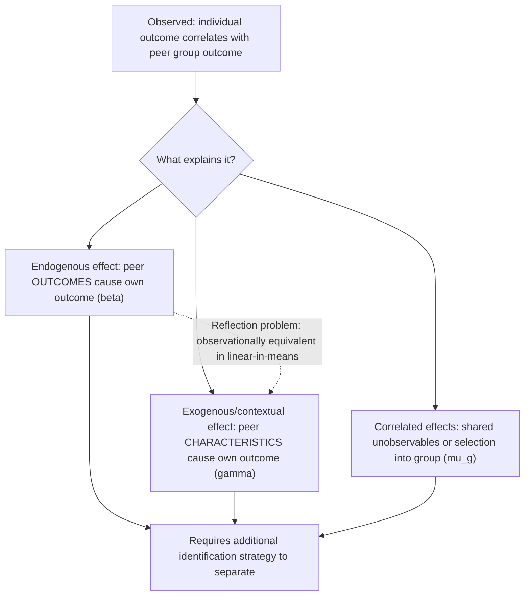

## Peer Effects and Social Interactions


### Overview

Peer effects and social interactions econometrics studies how an individual's outcomes or behaviors are influenced by the outcomes, behaviors, or characteristics of others in their reference group (peers, neighbors, classmates, colleagues). This field shares substantial mathematical structure with spatial econometrics (SAR/SEM models directly generalize to social-network settings by replacing a geographic weight matrix with a social/network connectivity matrix), but introduces a distinctive and severe identification problem — Manski's **reflection problem** — that has shaped much of the methodological literature in this area.

Applications include education (do a student's grades respond to classmates' grades?), health behaviors (obesity, smoking, and substance use "contagion" within social networks), labor economics (peer productivity effects in team settings), and criminology (neighborhood effects on delinquent behavior).

### Manski's Taxonomy of Social Effects

Manski (1993) formally distinguishes three conceptually distinct channels through which group membership can generate correlated outcomes among peers, a distinction critical because policy implications differ sharply across the three:

**Endogenous effects:** an individual's outcome depends on the *outcome* (behavior/achievement) of their peers directly — e.g., a student studies harder because their peers study harder. Endogenous effects imply a **social multiplier**: any exogenous shock to one member of the group propagates and amplifies through the group via mutual reinforcement.

**Exogenous (contextual) effects:** an individual's outcome depends on the *exogenous characteristics* of peers (not their outcomes) — e.g., a student's achievement depends on classmates' family income levels or parental education, independent of the classmates' own achievement.

**Correlated effects:** individuals in the same group behave similarly not because of any causal peer influence, but because they share similar unobserved environmental factors or were selected into the group based on similar unobserved characteristics — e.g., students in the same school perform similarly partly because families with similar values select into the same neighborhood/school, not because of true peer influence.

Empirically distinguishing endogenous and exogenous social effects from correlated effects is the central and often extremely difficult identification challenge in this literature — a positive statistical association among peers' outcomes is consistent with any combination of all three channels.

### The Linear-in-Means Model

The canonical empirical specification (the "linear-in-means" model) for individual $i$ in group $g$:

$$y_{ig} = \alpha + \beta \, \bar{y}_{-i,g} + \gamma \, \bar{\mathbf{x}}_{-i,g} + \mathbf{x}_{ig}^\top\boldsymbol{\delta} + \mu_g + \varepsilon_{ig}$$

where:

- $\bar{y}_{-i,g}$ is the mean outcome of all *other* members of group $g$ (excluding $i$) — capturing the endogenous effect via $\beta$,
- $\bar{\mathbf{x}}_{-i,g}$ is the mean of exogenous characteristics of $i$'s peers (excluding $i$) — capturing the exogenous/contextual effect via $\gamma$,
- $\mathbf{x}_{ig}$ are $i$'s own characteristics,
- $\mu_g$ is a group-level unobserved effect — capturing correlated effects.

This is structurally a **SAR-type model** where the social weight matrix $\mathbf{W}$ is a **group-membership (block) matrix**: $w_{ij} = 1/(n_g - 1)$ if $i$ and $j$ belong to the same group $g$ (excluding self), and 0 otherwise — the group mean $\bar{y}_{-i,g}$ is exactly $\sum_j w_{ij} y_j$ under this row-standardized block structure.

### Manski's Reflection Problem

The core identification failure: in the linear-in-means model, because every member of the group influences and is influenced by every other member simultaneously (a group's mean outcome is definitionally a function of everyone's outcome, including $i$'s own), the endogenous effect $\beta$ (peer *outcome* influences own outcome) becomes **observationally equivalent** to the exogenous effect $\gamma$ (peer *characteristics* influence own outcome) under standard linear-in-means specifications with group-invariant peer characteristics. Formally, solving the reduced form of the linear-in-means model for $\bar{y}_g$ (the full-group mean, including $i$) shows that $\bar y_g$ is a deterministic linear function of $\bar{\mathbf{x}}_g$ and $\bar\varepsilon_g$ — meaning that regressing individual outcomes on group means of $y$ and group means of $X$ **cannot separately identify $\beta$ from $\gamma$** using within-group variation alone, because the two variables are collinear at the group level in the simplest specification.

**Intuition:** if I observe that a person's outcome correlates with their peer group's average outcome, I cannot tell from this correlation alone whether that's because (a) the person is directly responding to peers' behavior (endogenous), or (b) the person and their peers are jointly responding to the same shared background characteristics (exogenous/contextual), because the group's average outcome and the group's average characteristics move together tautologically in the linear-in-means setup.



### Identification Strategies

**1. Structural Exclusion Restrictions (Non-overlapping Reference Groups):** if the reference group used for the endogenous effect (e.g., grade-level peers) differs from the reference group used for the exogenous effect (e.g., peers in a specific sub-classroom), the resulting cross-equation restrictions can break the collinearity that causes the reflection problem, since $\bar y$ and $\bar X$ are no longer computed over identical group definitions. This requires a specific and defensible institutional structure where distinct but overlapping reference groups genuinely exist.

**2. Network (Non-group) Structure — Bramoullé, Djebbari, and Fortin (2009):** rather than a single undifferentiated group (where everyone influences everyone equally), using an actual **social network structure** where individuals have distinct, only partially overlapping sets of friends/connections resolves the reflection problem under a key condition: **intransitivity** in the network (i.e., the existence of "friends of friends who are not my own friends") provides the necessary exclusion restriction. Formally, this uses friends'-friends' characteristics ($\mathbf{W}^2\mathbf{X}$) as valid instruments for friends' outcomes ($\mathbf{Wy}$), since a friend's friend's characteristics affect my outcome only indirectly (through my friend), not directly — the standard exclusion restriction logic of instrumental variables, here operationalized through network topology rather than an external instrument.

**3. Fixed Effects with Group-Invariant Confounders:** including group fixed effects ($\mu_g$) absorbs correlated effects that are constant within a group, addressing the correlated-effects channel specifically (though not, by itself, the reflection problem between $\beta$ and $\gamma$).

**4. Quasi-Random Assignment to Peer Groups:** when peer group assignment is plausibly random or quasi-random with respect to unobserved individual characteristics (e.g., random dormitory roommate assignment, random classroom assignment in some school systems), the correlated-effects (selection) channel is directly addressed by design, though the reflection problem between endogenous and exogenous effects can still remain unless combined with a network-based or exclusion-restriction identification strategy.

**5. Nonlinear or Discrete Peer Effect Models:** in some specifications (e.g., discrete choice models of peer effects, or nonlinear-in-means specifications), the reflection problem's exact collinearity does not hold with the same force, since the nonlinearity itself can break the linear dependence between $\bar y$ and $\bar X$ — though this identification route relies on functional-form assumptions rather than a design-based or network-based exclusion restriction, and is generally regarded as a weaker source of identification. [Inference: the strength of nonlinearity-based identification depends heavily on the specific functional form assumed and is more contested in the literature than network- or design-based approaches.]

### Endogenous Group Formation (Selection into Peer Groups)

A distinct but related threat to identification arises when individuals **self-select** into their peer groups based on unobserved characteristics correlated with the outcome of interest (e.g., academically motivated students may choose to befriend other academically motivated students). This is a specific instance of the correlated-effects problem but deserves separate attention because it can bias network-based IV strategies as well if the *network formation process itself* is endogenous to the outcome. Addressing this typically requires either:

- A **network formation model** estimated jointly with the peer effects model (structural approach), or
- **Quasi-random group assignment** (as above), which sidesteps the endogenous-formation problem by design rather than by statistical correction.

### Estimation Approaches

**Two-Stage Least Squares (2SLS) / IV:** using the network-based exclusion restriction (friends'-friends' characteristics instrumenting friends' outcomes), estimated analogously to spatial 2SLS (Kelejian-Prucha) but with a social network weight matrix in place of a geographic one.

**Maximum Likelihood:** analogous to spatial ML estimation of SAR models, applicable when the social network weight matrix $\mathbf{W}$ (or its group-based block-diagonal analogue) is treated as known and exogenous.

**Bayesian approaches:** used particularly in network-formation-plus-outcome joint models, where the network structure itself is treated as partially unobserved or measured with error.

### Distinguishing Feature from Standard Spatial Econometrics

While the linear-in-means and network peer-effects models are mathematically SAR-type models with a social (rather than geographic) $\mathbf{W}$, the **reflection problem is a much more severe and central identification concern in social interactions research** than in typical geographic spatial econometrics. This is because geographic weight matrices (contiguity, distance-based) are generally treated as exogenously and physically determined (a municipality's neighbors are fixed by geography, not chosen), whereas social network structures are frequently the *product of the same underlying choices and unobserved characteristics* that also drive the outcome of interest — making the correlated-effects and endogenous-network-formation problems substantially more pervasive threats in social interactions applications than in most geographic spatial applications. [Inference: this is a general characterization reflecting common methodological concerns in the literature; specific geographic applications can also involve endogenous boundary or weight-matrix formation, so the distinction is one of typical degree rather than an absolute categorical difference.]

### Worked Example (Conceptual)

A Special Topics research project examines whether university students' study habits are influenced by their peer group's study habits, using survey data on self-reported friendship networks and weekly study hours.

1. Construct a social network weight matrix $\mathbf{W}$ from reported friendship ties (asymmetric, since friendship nominations need not be reciprocated).
2. Estimate a naive linear-in-means model regressing individual study hours on average friend study hours and average friend characteristics; recognize that $\beta$ (endogenous peer effect) and $\gamma$ (exogenous contextual effect) are not separately identified from this specification alone due to the reflection problem.
3. Apply the Bramoullé-Djebbari-Fortin network-based IV strategy: use friends'-friends' (excluding direct friends) family background characteristics as instruments for friends' average study hours, exploiting intransitivity in the observed friendship network (many students have friends whose other friends are not the student's own direct friends).
4. Estimate via 2SLS; obtain a statistically significant $\hat\beta$, interpreted as evidence of a genuine endogenous peer effect (students' study hours respond to friends' study hours, not merely to shared background characteristics).
5. As a robustness check, include individual and network-cluster fixed effects to further address remaining correlated-effects concerns from unobserved shared environment.
6. Acknowledge as a limitation that friendship network formation itself is not modeled as endogenous in this reduced-form IV approach — if academically similar students preferentially befriend each other for unobserved reasons correlated with the instrument, the network-based exclusion restriction could itself be compromised.

### Practical Implementation Notes

**Python (illustrative structure, network peer-effects models):**

```python
import numpy as np
from linearmodels.iv import IV2SLS

# W: n x n row-standardized network adjacency (friends), W2: friends-of-friends matrix
Wy = W @ y            # endogenous regressor: average friend outcome
W2X = (W @ W) @ X     # instrument: friends-of-friends' characteristics

model = IV2SLS(
    dependent=y,
    exog=np.column_stack([np.ones(len(y)), X, W @ X]),  # own X, contextual WX
    endog=Wy,
    instruments=W2X
).fit(cov_type="robust")
print(model.summary)
```

**R (illustrative, using network/spatial IV machinery):**

```r
library(sphet)  # spatial/network 2SLS and GMM estimators

model <- spreg(
  y ~ x1 + x2,
  data = df,
  listw = listw_network,        # friendship-network-based weights list
  model = "lag",                 # SAR-type structure for endogenous peer effect
  het = TRUE                     # heteroskedasticity-robust GMM
)
summary(model)
```

**Key Points**

- Manski's taxonomy distinguishes endogenous effects (peer outcomes), exogenous/contextual effects (peer characteristics), and correlated effects (shared unobservables/selection) — three distinct mechanisms that produce the same observable correlation among peers' outcomes.
- The reflection problem shows that in a standard linear-in-means model with a single undifferentiated reference group, endogenous and exogenous social effects are not separately identified, because group-mean outcomes are a deterministic function of group-mean characteristics.
- Network-based identification (Bramoullé-Djebbari-Fortin) resolves the reflection problem by exploiting intransitivity in social network structure, using friends'-friends' characteristics as instruments for friends' outcomes.
- Endogenous group/network formation (self-selection into peer groups based on unobserved traits correlated with the outcome) is a related but distinct threat that can undermine even network-based IV strategies if the network itself is endogenous.
- The linear-in-means and network peer-effects models are mathematically SAR-type spatial models with a social rather than geographic weight matrix, but the reflection and endogenous-selection problems are typically far more severe in social interactions settings than in geographic applications.
- Quasi-random assignment to peer groups (when available) is one of the most credible design-based solutions to the correlated-effects/selection problem, though it does not automatically resolve the reflection problem on its own.

### Common Pitfalls

- Estimating a naive linear-in-means model and interpreting the coefficient on group-mean outcome as a clean "peer effect," without recognizing that it is not separately identified from contextual/exogenous effects under the reflection problem.
- Using network-based instruments (friends'-friends' characteristics) without considering whether the underlying friendship network itself was endogenously formed based on unobserved characteristics correlated with the outcome, which would invalidate the exclusion restriction.
- Failing to include group or network-cluster fixed effects to address correlated effects arising from shared, group-invariant unobserved environmental factors.
- Treating any statistically significant peer-outcome correlation as proof of a genuine behavioral/causal endogenous effect, when correlated effects (shared unobservables, homophilous self-selection) can produce an observationally similar pattern.
- Applying group-based (rather than individual-network-based) peer effect models when a genuine individual-level friendship network is available, thereby foregoing the more credible network-based identification strategy in favor of a specification still subject to the classic reflection problem.
- Assuming random assignment to a peer group (e.g., a randomly assigned dormitory) fully resolves all identification concerns, when the reflection problem between endogenous and exogenous effects can persist even under random group assignment unless a network (non-group) structure or additional exclusion restriction is also present.

**Related Topics**

- Spatial Lag and Spatial Error Models (shared SAR-type mathematical structure)
- Spatial Weight Matrices and Social Network Adjacency Matrices
- Instrumental Variables and the Exclusion Restriction
- Network Formation Models and Homophily
- Panel Data Fixed Effects (addressing correlated/group-invariant effects)
- Social Multiplier Effects and Policy Simulation
- Randomized Controlled Trials and Quasi-Experimental Design (as tools for peer-group assignment)