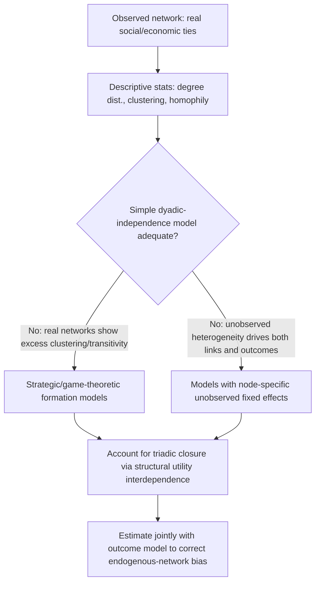

## Network Formation and Econometrics of Networks


### Overview

The econometrics of network formation studies how links (edges) between agents (nodes) in a network arise, modeling the network structure itself as the outcome of interest rather than as a fixed, exogenously given input (as it is treated in spatial and peer-effects econometrics discussed elsewhere in this chapter). This field addresses a foundational question left unresolved by models that take $\mathbf{W}$ or a friendship network as given: **why does the network look the way it does**, and what are the econometric consequences of treating a network as exogenous when it is, in fact, the product of agents' choices?

Applications include modeling trade and financial networks (why do certain countries or banks trade/lend to each other), social and friendship network formation (homophily, triadic closure), collaboration networks (co-authorship, R&D partnerships), and buyer-supplier networks in industrial organization.

### Why Network Formation Matters Econometrically

Treating an observed network as exogenous, when it is actually endogenously formed, threatens the validity of any subsequent model estimated using that network — including the peer-effects and spatial models discussed elsewhere in this chapter. If two agents form a link precisely *because* they share unobserved characteristics correlated with the outcome of interest (a phenomenon termed **homophily** when the shared characteristic is a trait/preference similarity), then any peer-effect or spatial-dependence coefficient estimated using that network conflates genuine influence with the fact that similar agents chose to become connected in the first place — this is a **specific and severe instance of the correlated-effects and endogenous-selection problems** discussed in relation to peer effects.

### Descriptive Network Statistics as a Starting Point

Before formal modeling, network formation research typically characterizes the observed network via standard graph-theoretic summary statistics:

- **Degree distribution:** the distribution of the number of connections (degree) per node across the network; many real-world social and economic networks exhibit **degree heterogeneity** — some nodes (hubs) have far more connections than a random-graph benchmark would predict.
- **Clustering coefficient:** the probability that two of a node's neighbors are themselves connected (a measure of "closed triads" or local cliquishness); real social networks typically show substantially higher clustering than a comparably-sized random (Erdős–Rényi) graph.
- **Density:** the proportion of all possible links that are actually realized in the network, $\frac{2|E|}{n(n-1)}$ for an undirected network with $n$ nodes and $|E|$ edges.
- **Homophily measures:** the tendency for links to form between nodes sharing observed characteristics (e.g., same ethnicity, same socioeconomic status, same geographic location) at a rate exceeding what random matching would produce.
- **Reciprocity** (for directed networks): the proportion of directed links $i \to j$ for which the reverse link $j \to i$ also exists.

These descriptive patterns — especially high clustering and strong homophily relative to random-graph benchmarks — motivate the specific functional forms used in formal network formation models, since a simple independent-link model (below) typically fails to reproduce them.

### Dyadic (Independent) Link Formation Models

The simplest formal approach models the probability of a link between each pair (dyad) $(i,j)$ independently, as a function of observed dyadic and node-level characteristics:

$$P(g_{ij} = 1) = F\left(\mathbf{x}_i^\top\boldsymbol{\beta} + \mathbf{x}_j^\top\boldsymbol{\beta} + \mathbf{z}_{ij}^\top\boldsymbol{\gamma}\right)$$

where $g_{ij} = 1$ indicates a link exists between $i$ and $j$, $F(\cdot)$ is typically a logistic or probit link function, $\mathbf{x}_i, \mathbf{x}_j$ are node-level characteristics of each party, and $\mathbf{z}_{ij}$ captures dyad-specific characteristics such as geographic distance or a similarity/homophily indicator between $i$ and $j$'s traits. This is estimable via standard logit/probit maximum likelihood treating each dyad as an independent observation.

**Fundamental limitation:** dyadic-independence models, by construction, cannot generate realistic **transitivity/clustering** (the tendency of a node's friends to also be friends with each other), because the model assumes the probability of link $(i,j)$ forming is statistically independent of whether $(i,k)$ and $(j,k)$ links exist — this independence assumption is precisely what real social networks violate, since triadic closure (befriending a friend's friend) is one of the most robust empirical regularities in social network data.



### Accounting for Unobserved Node Heterogeneity

A common refinement adds a node-specific unobserved fixed effect $a_i$ (and $a_j$) to the linking probability, capturing an individual's general "propensity to form links" that is not fully captured by observed characteristics — analogous to individual fixed effects in panel data, but applied to a cross-sectional dyadic dataset:

$$P(g_{ij} = 1) = F\left(a_i + a_j + \mathbf{x}_i^\top\boldsymbol{\beta} + \mathbf{x}_j^\top\boldsymbol{\beta} + \mathbf{z}_{ij}^\top\boldsymbol{\gamma}\right)$$

This addresses a specific concern: without node fixed effects, an unusually gregarious individual (high true linking propensity) will appear to have many links for reasons unrelated to homophily on observed $\mathbf{x}$, potentially biasing $\boldsymbol{\gamma}$. Estimating $a_i$ alongside $\boldsymbol{\beta}, \boldsymbol{\gamma}$ for every node introduces an **incidental parameters problem** (the number of $a_i$ parameters grows with $n$), requiring specialized estimators (e.g., conditional or joint maximum likelihood approaches developed specifically for these bipartite/dyadic fixed-effects settings) rather than naive direct MLE.

### Strategic (Game-Theoretic) Network Formation Models

To capture genuine interdependence in link formation — recognizing that whether $i$ and $j$ link may depend on *whether $i$ and $k$ are already linked* (triadic closure/transitivity) — strategic network formation models treat link formation as the outcome of a **network formation game**, where agents derive utility from their position in the network and links form (or persist) based on mutual consent and the overall configuration of ties, not merely pairwise-independent probabilities.

**Pairwise stability (Jackson-Wolinsky framework):** a network is considered a stable equilibrium outcome if:

1. No two unlinked agents would both benefit from forming a new link (no profitable link addition), and
2. No agent would benefit from unilaterally severing an existing link (no profitable link deletion).

Estimating such models econometrically is substantially more complex than dyadic-independence logit/probit, because:

- **Multiple equilibria** can arise from the same underlying structural parameters, complicating standard likelihood-based estimation (which requires the model to imply a unique, or at least well-defined, distribution over observed outcomes).
- The dependence across dyads (a link's formation probability depends on the broader network configuration, not just the dyad's own characteristics) breaks the tractable independence structure that makes standard logit/probit estimable via simple MLE.

**Estimation approaches for strategic models:**

- **Simulated Method of Moments (SMM):** simulate networks under candidate parameter values (via a specified equilibrium-selection rule when multiplicity arises) and match simulated network statistics (degree distribution, clustering coefficient, homophily measures) to their observed counterparts, choosing parameters that minimize the discrepancy.
- **Approximate/Bayesian methods (ARD — Aggregated Relational Data approaches, or Bayesian network formation models):** used particularly when full network data is unavailable or costly to collect, instead using survey-based proxies for network structure (e.g., "how many people do you know with characteristic X").
- **Exponential Random Graph Models (ERGMs):** a widely used statistical (rather than strictly economic/game-theoretic) framework in the broader social network analysis literature, modeling the probability of an entire observed network configuration as a function of network statistics (e.g., number of triangles, number of links, homophily-matching counts) via an exponential family form:


  $$P(\mathbf{G} = \mathbf{g}) = \frac{\exp\left(\boldsymbol{\theta}^\top \mathbf{s}(\mathbf{g})\right)}{\sum_{\mathbf{g}' \in \mathcal{G}} \exp\left(\boldsymbol{\theta}^\top \mathbf{s}(\mathbf{g}')\right)}$$

  where $\mathbf{s}(\mathbf{g})$ is a vector of network statistics computed on network configuration $\mathbf{g}$, and the sum in the denominator (over all possible network configurations $\mathcal{G}$) is generally computationally intractable for anything but small networks, requiring Markov Chain Monte Carlo (MCMC)-based simulation methods (e.g., MCMC-MLE) for estimation in practice.

### Correcting for Endogenous Networks in Downstream Models

When the primary research interest is a peer-effect or spatial-dependence parameter (as discussed elsewhere in this chapter) rather than the network formation process itself, but the network is suspected to be endogenously formed, several corrective strategies are used:

**1. Control function / two-step approaches:** first estimate a network formation model, obtain residuals or fitted linking propensities, and include these as additional controls in the downstream peer-effect regression, in a manner structurally analogous to a Heckman-type selection correction.

**2. Joint estimation:** estimate the network formation model and the outcome/peer-effect model simultaneously (structurally linked), allowing correlation between the unobserved determinants of link formation and the unobserved determinants of the outcome to be explicitly modeled rather than assumed away.

**3. Instruments for network structure:** exploit variables that plausibly affect network formation but do not directly affect the outcome except through the network (e.g., historical/geographic factors driving trade-network formation) as instruments in a two-stage procedure, applying standard IV exclusion-restriction logic to the network-formation stage itself.

**4. Exploiting quasi-random network shocks:** natural experiments or policy-induced exogenous changes to network structure (e.g., a natural disaster disrupting some but not all trade routes, or an administrative reassignment altering some but not all social ties) provide a design-based source of exogenous variation in network structure, sidestepping the need for a fully specified structural formation model.

### Networks as Right-Hand-Side Objects vs. Networks as Outcomes

It is useful to distinguish two related but distinct econometric tasks in this domain: (1) modeling the network **itself as the dependent variable** (the formation question addressed above), versus (2) using an **observed, potentially endogenous network as a regressor or weight matrix** in a downstream model (the peer-effects/spatial-econometrics use case discussed elsewhere in this chapter). Network formation econometrics is directly relevant to (2) because it identifies when and how the naive treatment of an observed network as exogenous in a downstream model is likely to produce biased estimates of the peer-effect or spatial-dependence parameters of ultimate interest.

### Worked Example (Conceptual)

A research project examines whether a co-authorship network among a university's faculty predicts research output, and is concerned that faculty may selectively co-author with others who share unobserved traits (e.g., similar work ethic or research quality) correlated with output — a case where the network itself may be endogenously formed with respect to the outcome of interest.

1. Construct descriptive network statistics on the observed co-authorship network: degree distribution (some faculty are highly connected "hub" collaborators), clustering coefficient (co-authors' co-authors are frequently also connected — high transitivity), and homophily by department and seniority.
2. Fit a dyadic-independence logit model of co-authorship link formation on observed characteristics (same department, similar seniority, overlapping research interests); note that predicted clustering from this model is substantially lower than the observed clustering coefficient, indicating the independence assumption is inadequate for this network.
3. Extend to a strategic/ERGM-based specification including a triangle (transitivity) term, estimated via MCMC-MLE, better replicating the observed clustering statistic.
4. To address the primary research question (does co-authorship *causally* affect output, or do productive people simply co-author with each other?), implement a control-function approach: use each faculty member's estimated node-level fixed effect (linking propensity) from the formation model as an additional control in the downstream regression of output on network centrality measures.
5. As an additional robustness check, exploit a quasi-random shock — a departmental reorganization that involuntarily changed some faculty's physical office proximity to colleagues (a plausible driver of co-authorship link formation with limited direct effect on individual research quality) — as an instrument for network centrality in the output regression.

### Practical Implementation Notes

**R (ergm package, for Exponential Random Graph Models):**

```r
library(ergm)
library(network)

net <- network(adjacency_matrix, directed = FALSE)
net %v% "department" <- department_vector
net %v% "seniority" <- seniority_vector

ergm_model <- ergm(
  net ~ edges +
        nodematch("department") +
        nodematch("seniority") +
        gwesp(0.5, fixed = TRUE)   # geometrically weighted edgewise shared partners: captures transitivity
)
summary(ergm_model)

gof_check <- gof(ergm_model)      # goodness-of-fit: compares simulated vs. observed network statistics
plot(gof_check)
```

**Python (illustrative, dyadic logit as a baseline; strategic/ERGM estimation typically relies on specialized packages such as R's ergm, statnet, or research-grade SMM/Bayesian implementations not yet as standardized in mainstream Python econometrics libraries):**

```python
import statsmodels.api as sm
import numpy as np

# Dyadic-independence logit: each row is a dyad (i,j)
X_dyad = np.column_stack([same_department, similarity_seniority, geographic_distance])
X_dyad = sm.add_constant(X_dyad)
dyadic_logit = sm.Logit(link_indicator, X_dyad).fit()
print(dyadic_logit.summary())
```

**Key Points**

- Network formation econometrics treats the network itself as an outcome to be explained, in contrast to spatial and peer-effects econometrics, which typically treat the network/weight matrix as a fixed, exogenous input.
- Real-world networks typically exhibit high clustering/transitivity and strong homophily relative to a random-graph benchmark, patterns that simple dyadic-independence logit/probit models cannot reproduce by construction.
- Strategic (game-theoretic) formation models, notably via the pairwise stability concept, explicitly capture link interdependence but introduce multiple-equilibria and estimation challenges typically addressed via Simulated Method of Moments or ERGM/MCMC-based approaches.
- Unobserved node-level heterogeneity (a general propensity to form links) can confound observed-characteristic-based homophily estimates unless explicitly modeled via node fixed effects, which introduces an incidental parameters problem requiring specialized estimators.
- When an observed network is used as a regressor or weight matrix in a downstream peer-effect or spatial model, endogenous network formation is a specific and often severe instance of the correlated-effects/selection problem, addressed via control-function, joint-estimation, instrumental-variable, or quasi-random-shock strategies.
- ERGMs are a widely used statistical framework for modeling entire network configurations, but their normalizing constant is generally intractable for anything but small networks, necessitating MCMC-based estimation.

### Common Pitfalls

- Fitting a dyadic-independence logit/probit model to network data and treating its coefficients as fully characterizing the link-formation process, without checking whether the model reproduces key observed network statistics such as the clustering coefficient (a standard goodness-of-fit failure for independence-based models).
- Using an observed network as a spatial/social weight matrix in a downstream peer-effects model without considering whether the network itself was endogenously formed with respect to the outcome of interest.
- Estimating strategic/game-theoretic network formation models without addressing the multiple-equilibria problem, implicitly assuming a unique equilibrium is realized without justification.
- Ignoring unobserved node-level heterogeneity in link-formation propensity, which can generate spurious apparent homophily on observed characteristics that are actually correlated with the omitted general linking propensity.
- Treating ERGM coefficient estimates causally as if they represented agents' true utility parameters from a strategic formation process, when ERGMs are fundamentally a statistical (descriptive/generative) framework for network configurations rather than a structural, utility-based economic model (this distinction is sometimes blurred in applied usage across disciplines).
- Assuming ERGM or strategic-model estimates generalize to networks of substantially different size or context than the one estimated, since network formation processes (and the practical feasibility of full MCMC-based estimation) are often sensitive to network scale.

**Related Topics**

- Peer Effects and Social Interactions (downstream use of networks, reflection problem)
- Spatial Weight Matrices (networks as a generalization of geographic weight structures)
- Exponential Random Graph Models and MCMC-MLE Estimation
- Simulated Method of Moments
- Heckman Selection and Control Function Approaches
- Incidental Parameters Problem in Fixed-Effects Models
- Instrumental Variables and Quasi-Experimental Design