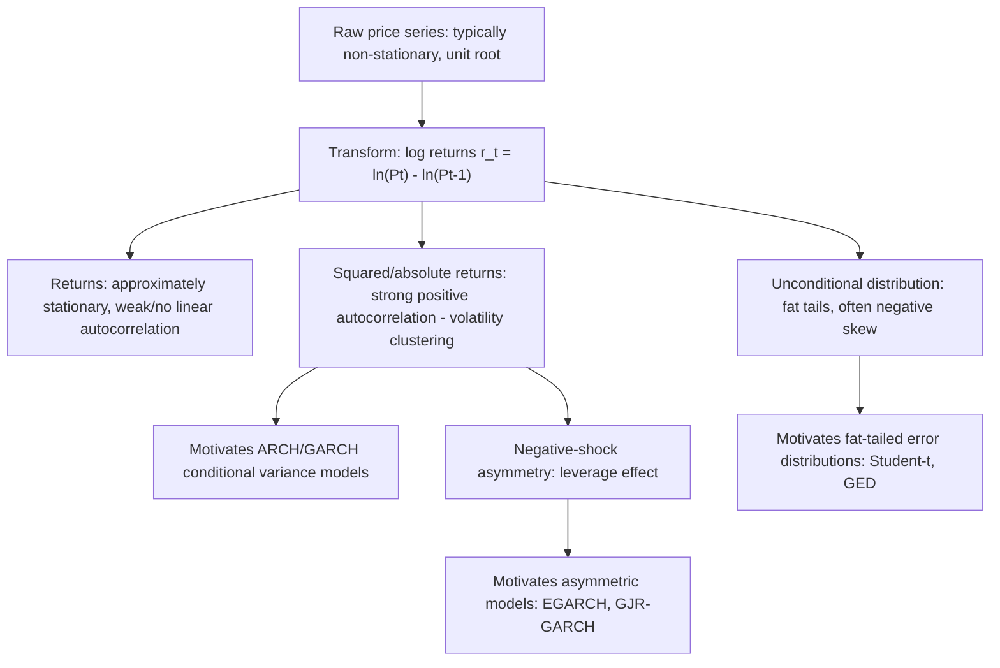

## Asset Return Characteristics


### Overview

Asset return characteristics refers to the well-documented set of statistical properties (stylized facts) that empirical financial returns consistently exhibit across asset classes, markets, and time periods, and which motivate much of the specialized modeling apparatus of financial econometrics (ARCH/GARCH volatility models, fat-tailed distributions, jump-diffusion processes). Understanding these characteristics is foundational because standard classical statistical assumptions — normality, constant variance, independence — are systematically violated by real financial return data, and the specific *way* they are violated has shaped the entire methodological toolkit of the field.

### Return Definitions

**Simple (arithmetic) return** over one period:

$$R_t = \frac{P_t - P_{t-1}}{P_{t-1}} = \frac{P_t}{P_{t-1}} - 1$$

**Log (continuously compounded) return:**

$$r_t = \ln(P_t) - \ln(P_{t-1}) = \ln\left(\frac{P_t}{P_{t-1}}\right)$$

Log returns are generally preferred in financial econometrics for several practical reasons: they are **time-additive** (the multi-period log return is simply the sum of single-period log returns, $r_{t,t+k} = \sum_{i=1}^{k} r_{t+i}$, whereas multi-period simple returns require multiplication of gross returns), they are approximately equal to simple returns for small return magnitudes ($\ln(1+R_t) \approx R_t$ when $R_t$ is small), and modeling returns on the log scale avoids the theoretical inconsistency of allowing simple returns below $-100\%$ (log returns can be any real number, consistent with the constraint that prices remain strictly positive).

### Stylized Fact 1: Fat Tails (Excess Kurtosis)

Empirical return distributions consistently exhibit **heavier tails** than the normal distribution — extreme positive and negative returns occur far more frequently than a Gaussian model would predict. This is measured via **excess kurtosis**:

$$\text{Excess Kurtosis} = \frac{E[(r_t - \mu)^4]}{\sigma^4} - 3$$

A normal distribution has kurtosis exactly 3 (excess kurtosis 0); empirical daily equity and currency returns typically show excess kurtosis substantially greater than 0 (commonly in the range of several units above the normal benchmark, though the precise magnitude varies considerably by asset, frequency, and sample period). This property is termed **leptokurtosis**.

**Consequence:** standard Value-at-Risk (VaR) or option-pricing calculations that assume normality will systematically **underestimate the probability of extreme losses** (and gains), motivating the use of fat-tailed distributions (Student's $t$, generalized error distribution, or extreme value theory-based approaches) in place of the normal distribution for risk modeling.

### Stylized Fact 2: Volatility Clustering

Large price changes (of either sign) tend to be followed by other large changes, and small changes tend to be followed by other small changes — volatility is not constant over time but exhibits **persistence and clustering**, visually apparent as alternating "calm" and "turbulent" periods in a plot of returns over time. Formally, while returns themselves show little to no linear autocorrelation, the **squared returns** (or absolute returns) exhibit substantial positive autocorrelation:

$$\text{Corr}(r_t, r_{t-k}) \approx 0 \quad \text{but} \quad \text{Corr}(r_t^2, r_{t-k}^2) > 0 \text{ for many lags } k$$

This is the central empirical motivation for **ARCH/GARCH-family models**, which explicitly model the conditional variance $\sigma_t^2$ as a function of past squared shocks and/or past variances, allowing volatility to evolve dynamically rather than remaining constant as classical linear regression assumes.


### Stylized Fact 3: Negative Skewness

Equity return distributions, in particular, tend to exhibit **negative skewness**:

$$\text{Skewness} = \frac{E[(r_t - \mu)^3]}{\sigma^3}$$

Negative skewness reflects that large negative returns (crashes) tend to be more extreme in magnitude than large positive returns, and/or occur somewhat more frequently in the far left tail than the far right tail. This asymmetry is commonly attributed in the literature to phenomena such as the **leverage effect** (discussed below) and behavioral/market-microstructure factors related to how panic selling propagates differently than exuberant buying. [Inference: the precise causal mechanisms underlying observed negative skewness remain a subject of ongoing research and are not fully settled; the empirical regularity of negative skewness in many equity return series is well documented, but attribution to any single mechanism is an interpretive claim rather than an established fact.]

### Stylized Fact 4: The Leverage Effect

Named for an early explanation involving corporate financial leverage, the leverage effect describes the empirical tendency for **volatility to increase more following negative return shocks than following positive shocks of the same magnitude** — i.e., a negative correlation between current returns and future volatility:

$$\text{Corr}(r_t, \sigma_{t+1}^2) < 0$$

**Original financial explanation:** a decline in a firm's equity value increases its debt-to-equity ratio (financial leverage), mechanically increasing the riskiness (volatility) of the remaining equity. An alternative and now widely discussed explanation is the **volatility feedback hypothesis**: anticipated increases in future volatility raise the required rate of return demanded by investors, which lowers the current price, generating the same negative return-volatility correlation without requiring a leverage-based mechanism. Empirical evidence on the relative importance of these two (non-mutually-exclusive) explanations is mixed. [Inference: this remains an area of active empirical debate in the literature, without full consensus on the relative contribution of each mechanism.]

This asymmetry motivates **asymmetric GARCH-family extensions** — EGARCH, GJR-GARCH (Glosten-Jagannathan-Runkle), and TGARCH — which explicitly allow negative and positive shocks to have differential effects on conditional variance, unlike the standard symmetric GARCH(1,1) specification.

### Stylized Fact 5: Near-Zero (but Weak) Autocorrelation in Returns

Raw returns themselves typically show very little linear autocorrelation at short horizons — broadly consistent with (though not proof of) the weak-form efficient market hypothesis, which posits that past price information cannot be used to predict future returns via simple linear extrapolation. However, small but statistically detectable autocorrelations do exist in some markets and frequencies (particularly at very high/intraday frequencies, where microstructure effects such as bid-ask bounce induce mechanical negative autocorrelation), and return autocorrelation should not be conflated with the **strong** autocorrelation found in squared/absolute returns (Stylized Fact 2), which reflects volatility dynamics rather than a violation of return-level unpredictability.

### Stylized Fact 6: Aggregational Gaussianity

As the return-measurement interval is lengthened (e.g., from daily to monthly to quarterly returns), the empirical distribution of returns tends to become progressively **closer to normal** — excess kurtosis diminishes at lower (longer-horizon) frequencies. This is loosely consistent with a Central Limit Theorem-type intuition (a longer-horizon return is effectively a sum of many shorter-horizon returns), though the *rate* at which normality is approached, and the extent to which it is fully achieved even at fairly long horizons, varies across assets and is itself an empirical question rather than a guaranteed outcome. [Inference: the specific horizon at which returns become "close enough" to normal for practical modeling purposes is asset- and context-dependent rather than governed by a single fixed rule.]

### Stylized Fact 7: Long Memory in Volatility

Volatility autocorrelations (in squared or absolute returns) tend to decay **more slowly** than the exponential decay implied by a standard covariance-stationary ARMA-type process, a phenomenon termed **long memory** or **long-range dependence** in volatility. This has motivated specialized long-memory volatility models such as **FIGARCH** (Fractionally Integrated GARCH) and realized-volatility-based long-memory models, in contrast to standard GARCH(1,1), which implies a specific (typically much faster) exponential rate of volatility-shock decay.

### Stylized Fact 8: Co-movement and Correlation Dynamics

Beyond univariate return properties, **cross-asset correlations** are themselves time-varying and tend to **increase during periods of market stress** (a phenomenon sometimes termed "correlation breakdown" or "contagion," though the latter term carries additional connotations in some literatures about the specific mechanism of cross-market transmission). This motivates multivariate volatility models (multivariate GARCH, Dynamic Conditional Correlation — DCC-GARCH) that allow the covariance/correlation structure across assets to evolve over time rather than remaining fixed, in contrast to a standard multivariate normal model with a constant covariance matrix.

### Stylized Fact 9: Non-Stationarity in Price Levels vs. Stationarity in Returns

Asset **price levels** typically follow a non-stationary process (commonly modeled as containing a unit root, i.e., $I(1)$ — see Unit Root Testing in time series econometrics), meaning shocks to the price level have a permanent effect and standard regression on price levels risks spurious regression problems. **Returns**, by contrast (as first differences of log prices), are typically treated as (weakly) stationary, which is precisely why financial econometric modeling is conducted on returns rather than price levels directly.



### Diagnostic Tools for Assessing These Characteristics

- **Jarque-Bera test:** joint test of normality based on sample skewness and kurtosis; a large statistic (and small p-value) rejects normality, consistent with Stylized Facts 1 and 3.
- **Ljung-Box test on returns and on squared returns:** tests for autocorrelation; typically non-significant (or weakly significant) on raw returns but strongly significant on squared returns, directly evidencing the volatility-clustering vs. return-unpredictability distinction.
- **ARCH-LM test (Engle's test):** formally tests for the presence of ARCH effects (conditional heteroskedasticity) in a return series, typically the standard pre-test before specifying a GARCH-family model.
- **QQ-plots against the normal distribution:** visually diagnose fat tails by showing systematic deviation of empirical quantiles from the theoretical normal quantiles, particularly in the extreme tails.
- **Rolling-window or realized volatility plots:** visually illustrate volatility clustering and time-varying volatility regimes directly.

### Worked Example (Conceptual)

An analysis of a daily equity index return series over several years:

1. Compute log returns $r_t = \ln(P_t/P_{t-1})$ from the raw price series.
2. Plot the return series: visually confirm volatility clustering (periods of large swings, e.g., around a financial crisis, interspersed with calmer periods).
3. Compute summary statistics: mean near zero, but excess kurtosis substantially above 0 (e.g., 5–8) and modest negative skewness (e.g., $-0.3$ to $-0.7$), consistent with Stylized Facts 1 and 3.
4. Run the Jarque-Bera test: reject normality decisively given the sample size typical of daily financial data.
5. Run the Ljung-Box test on raw returns (largely non-significant at short lags) and on squared returns (strongly significant across many lags) — confirming volatility clustering without linear return predictability.
6. Run Engle's ARCH-LM test on OLS/mean-model residuals: reject the null of no ARCH effects, motivating a GARCH(1,1) or asymmetric GARCH specification for subsequent volatility modeling.
7. Fit an EGARCH or GJR-GARCH model and confirm a statistically significant asymmetry parameter, consistent with the leverage effect (negative shocks increasing subsequent volatility more than equally-sized positive shocks).

### Practical Implementation Notes

**Python:**

```python
import numpy as np
import pandas as pd
from scipy import stats
from statsmodels.stats.diagnostic import acorr_ljungbox
from statsmodels.stats.stattools import jarque_bera

log_returns = np.log(prices / prices.shift(1)).dropna()

# Descriptive stats
print("Skewness:", stats.skew(log_returns))
print("Excess Kurtosis:", stats.kurtosis(log_returns))  # scipy returns excess kurtosis by default

# Jarque-Bera
jb_stat, jb_pvalue, skew, kurt = jarque_bera(log_returns)

# Ljung-Box on returns vs squared returns
lb_returns = acorr_ljungbox(log_returns, lags=[10], return_df=True)
lb_squared = acorr_ljungbox(log_returns**2, lags=[10], return_df=True)

# ARCH-LM test
from statsmodels.stats.diagnostic import het_arch
arch_stat, arch_pvalue, _, _ = het_arch(log_returns)
```

**R:**

```r
log_returns <- diff(log(prices))

library(moments)
skewness(log_returns)
kurtosis(log_returns) - 3  # excess kurtosis

library(tseries)
jarque.bera.test(log_returns)

Box.test(log_returns, lag = 10, type = "Ljung-Box")
Box.test(log_returns^2, lag = 10, type = "Ljung-Box")

library(FinTS)
ArchTest(log_returns, lags = 10)
```

**Key Points**

- Log returns are generally preferred over simple returns for financial econometric modeling due to time-additivity and consistency with strictly positive prices.
- Fat tails (excess kurtosis) mean extreme returns are far more common than a normal distribution predicts, motivating fat-tailed error distributions in risk and volatility modeling.
- Volatility clustering is evidenced by near-zero autocorrelation in raw returns but strong positive autocorrelation in squared/absolute returns — this distinction is the central empirical motivation for ARCH/GARCH models.
- The leverage effect (negative shocks raising future volatility more than positive shocks of equal size) motivates asymmetric volatility models (EGARCH, GJR-GARCH) over the symmetric GARCH(1,1) baseline.
- Long memory in volatility (slower-than-exponential autocorrelation decay) motivates specialized long-memory models (e.g., FIGARCH) beyond standard GARCH.
- Price levels are typically non-stationary (unit root); log returns are typically (weakly) stationary, which is why financial econometric models are built on returns rather than price levels.
- Cross-asset correlations are time-varying and tend to rise during market stress, motivating dynamic multivariate volatility models (DCC-GARCH) over static correlation assumptions.

### Common Pitfalls

- Modeling financial returns with a standard normal-distribution assumption without checking for fat tails, leading to systematic underestimation of extreme-event (tail) probabilities in risk calculations such as VaR.
- Conflating the near-absence of linear autocorrelation in raw returns with genuine statistical independence — squared/absolute returns typically show strong dependence (volatility clustering) even when raw returns do not.
- Applying standard OLS regression directly to non-stationary price levels rather than (stationary) returns, risking spurious regression results.
- Using a symmetric GARCH(1,1) model when the data exhibits a clear leverage effect, thereby failing to capture the differential impact of negative versus positive shocks on future volatility.
- Assuming returns become fully normal at any given lower-frequency (e.g., monthly) horizon without empirically checking; aggregational Gaussianity is a tendency, not a guarantee at any specific horizon.
- Treating a fixed (static) correlation matrix as adequate for portfolio risk management, when correlations are empirically known to shift substantially, and typically upward, during crisis periods.

**Related Topics**

- ARCH and GARCH Models (conditional heteroskedasticity)
- Asymmetric Volatility Models: EGARCH, GJR-GARCH, TGARCH
- Value-at-Risk and Extreme Value Theory in Risk Management
- Unit Root Testing and Stationarity in Time Series
- Multivariate GARCH and Dynamic Conditional Correlation (DCC) Models
- Realized Volatility and High-Frequency Financial Econometrics
- Jump-Diffusion and Stochastic Volatility Models