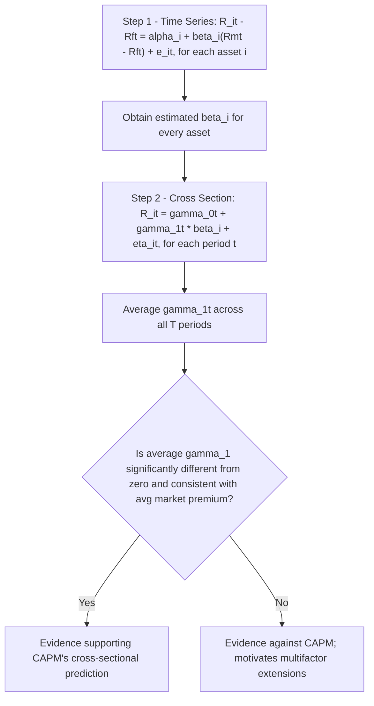

## The Capital Asset Pricing Model and Factor Models


### Overview

The Capital Asset Pricing Model (CAPM) and its factor-model extensions form the core econometric framework for explaining cross-sectional variation in expected asset returns — why some assets earn systematically higher average returns than others, in equilibrium, as compensation for bearing systematic (non-diversifiable) risk. CAPM provides the foundational single-factor benchmark; multifactor extensions (Fama-French three-factor, five-factor, momentum, and beyond) were developed largely in response to well-documented empirical anomalies that CAPM alone fails to explain.

### The CAPM: Theoretical Foundation

CAPM (Sharpe, 1964; Lintner, 1965) derives from mean-variance portfolio theory under the assumption that all investors hold some combination of the risk-free asset and the same optimally diversified market portfolio. The central prediction is that an asset's expected excess return is proportional to its **systematic risk**, measured by its covariance with the market portfolio, and that idiosyncratic (asset-specific, diversifiable) risk earns no risk premium since it can be eliminated through diversification.

**The Security Market Line (theoretical relationship):**

$$E[R_i] - R_f = \beta_i \left(E[R_m] - R_f\right)$$

where $R_i$ is the return on asset $i$, $R_f$ is the risk-free rate, $R_m$ is the return on the market portfolio, and:

$$\beta_i = \frac{\text{Cov}(R_i, R_m)}{\text{Var}(R_m)}$$

$\beta_i$ measures the sensitivity of asset $i$'s return to market-wide movements — an asset with $\beta_i = 1$ moves on average in lockstep with the market; $\beta_i > 1$ indicates amplified sensitivity ("aggressive" assets); $\beta_i < 1$ indicates dampened sensitivity ("defensive" assets).

### Empirical Estimation: The Time-Series Regression

$\beta_i$ is estimated empirically via the **market model** time-series regression for each asset $i$:

$$R_{it} - R_{ft} = \alpha_i + \beta_i (R_{mt} - R_{ft}) + \varepsilon_{it}$$

estimated by OLS using a time series of excess returns for asset $i$ and the market. Under CAPM, the theoretical prediction is that $\alpha_i = 0$ for every asset — any average excess return not explained by exposure to market risk (β) should be zero in equilibrium. A statistically significant non-zero $\hat\alpha_i$ ("Jensen's alpha") is interpreted either as genuine risk-adjusted outperformance/underperformance, evidence against CAPM as a complete pricing model, or as reflecting exposure to omitted risk factors not captured by the market factor alone — this last interpretation is precisely what motivates multifactor extensions.

### The Two-Pass Fama-MacBeth Procedure

Testing whether beta is genuinely priced in the cross-section (i.e., whether the CAPM's central prediction holds across many assets, not just for a single time series) requires a distinct econometric procedure, since the time-series regression above estimates $\beta_i$ for each asset separately but does not test the cross-sectional relationship between $\beta_i$ and average returns.

**First pass (time series):** for each asset $i$, estimate $\hat\beta_i$ via the time-series market-model regression above (typically using portfolio-level rather than individual-stock returns, to reduce beta estimation error — see Errors-in-Variables below).

**Second pass (cross-section):** for each time period $t$, run a cross-sectional regression of realized returns on the *previously estimated* betas across all assets:

$$R_{it} = \gamma_{0t} + \gamma_{1t}\hat\beta_i + \eta_{it}$$

repeated for every period $t$, then average the resulting $\hat\gamma_{1t}$ estimates across all $T$ periods:

$$\hat\gamma_1 = \frac{1}{T}\sum_{t=1}^{T}\hat\gamma_{1t}, \qquad \text{s.e.}(\hat\gamma_1) = \sqrt{\frac{1}{T^2}\sum_{t=1}^{T}(\hat\gamma_{1t} - \hat\gamma_1)^2}$$

Under CAPM, $\hat\gamma_1$ should be statistically indistinguishable from the average market excess return, and $\hat\gamma_0$ should be indistinguishable from zero (or from the risk-free rate, in some formulations). The Fama-MacBeth standard error formula has the notable practical advantage of being **robust to cross-sectional correlation in the residuals** at a given point in time (a general feature of asset returns, since many assets are jointly affected by common shocks), without requiring an explicit model of that correlation structure.



### Errors-in-Variables Problem

A well-known econometric complication in the Fama-MacBeth procedure: the second-pass regression uses $\hat\beta_i$ (an *estimated*, not true, quantity) as a right-hand-side regressor, introducing classical **errors-in-variables** bias, which attenuates (biases toward zero) the estimated cross-sectional risk-return relationship $\hat\gamma_1$. The standard mitigation is to **first form portfolios sorted by pre-estimated beta** (rather than using individual securities directly) before running the second-pass regression, since portfolio-level betas are estimated with substantially less measurement error than individual-stock betas (averaging reduces idiosyncratic estimation noise), at the cost of reduced cross-sectional variation and statistical power relative to using individual assets.

### Empirical Anomalies Motivating Multifactor Models

CAPM's single-factor prediction has been persistently challenged by a set of well-documented cross-sectional return patterns not explained by market beta alone:

- **Size effect:** smaller-capitalization firms have historically earned higher average returns than CAPM (given their beta) would predict.
- **Value effect:** firms with high book-to-market ratios ("value" stocks) have historically outperformed low book-to-market ("growth") stocks, beyond what beta explains.
- **Momentum effect:** stocks that have performed well over the past 3–12 months tend to continue outperforming over the subsequent few months, a pattern in direct tension with a purely risk-based, no-serial-predictability equilibrium framework (and more readily associated with behavioral explanations in parts of the literature, though risk-based explanations have also been proposed).
- **Profitability and investment effects:** firms with higher operating profitability, and firms with more conservative investment/asset-growth policies, have historically earned higher average returns than a CAPM/three-factor benchmark alone would predict.

These anomalies motivated the development of empirically-driven multifactor asset pricing models.

### The Fama-French Three-Factor Model

$$R_{it} - R_{ft} = \alpha_i + \beta_{i,MKT}(R_{mt}-R_{ft}) + \beta_{i,SMB}\cdot SMB_t + \beta_{i,HML}\cdot HML_t + \varepsilon_{it}$$

where:

- **SMB** ("Small Minus Big"): the return on a portfolio long small-cap stocks and short large-cap stocks, capturing the size effect.
- **HML** ("High Minus Low"): the return on a portfolio long high book-to-market (value) stocks and short low book-to-market (growth) stocks, capturing the value effect.

These factors are constructed as actual **traded, zero-net-investment portfolio returns** (not macroeconomic variables), following a specific double-sort methodology (e.g., independently sorting stocks into size terciles/quintiles and book-to-market terciles/quintiles, then forming the long-short portfolios), a construction approach now standard across most empirically-driven multifactor models in this tradition.

### The Fama-French Five-Factor Model

Extends the three-factor model to incorporate the profitability and investment anomalies:

$$R_{it} - R_{ft} = \alpha_i + \beta_{MKT}(R_{mt}-R_{ft}) + \beta_{SMB}\cdot SMB_t + \beta_{HML}\cdot HML_t + \beta_{RMW}\cdot RMW_t + \beta_{CMA}\cdot CMA_t + \varepsilon_{it}$$

- **RMW** ("Robust Minus Weak"): long high-operating-profitability firms, short low-profitability firms.
- **CMA** ("Conservative Minus Aggressive"): long firms with conservative (low) investment/asset growth, short firms with aggressive (high) investment/asset growth.

The five-factor model's authors report that, once profitability (RMW) and investment (CMA) factors are included, the value factor (HML) becomes largely redundant for explaining average returns in their sample — a specific empirical finding regarding factor redundancy in that framework, not a claim that value-related patterns are absent from returns generally. [Inference: whether HML remains redundant is sensitive to sample period and methodology, and has itself been a subject of subsequent debate and re-examination in later research.]

### The Carhart Four-Factor Model

Adds a momentum factor (**UMD**, "Up Minus Down," also denoted **MOM** or **WML**) to the original three-factor model, specifically to account for the momentum anomaly not captured by size, value, or market beta alone:

$$R_{it} - R_{ft} = \alpha_i + \beta_{MKT}(R_{mt}-R_{ft}) + \beta_{SMB}\cdot SMB_t + \beta_{HML}\cdot HML_t + \beta_{UMD}\cdot UMD_t + \varepsilon_{it}$$

### Arbitrage Pricing Theory (APT) as a Theoretical Foundation for Multifactor Models

Ross's Arbitrage Pricing Theory (1976) provides an alternative theoretical justification for multifactor return models, distinct from CAPM's mean-variance equilibrium derivation. APT posits that returns follow a linear factor structure:

$$R_i = E[R_i] + \sum_{k=1}^{K} \beta_{ik} F_k + \varepsilon_i$$

and derives, via a **no-arbitrage argument** (rather than full market equilibrium), that expected returns must be approximately linear in the factor loadings $\beta_{ik}$:

$$E[R_i] \approx R_f + \sum_{k=1}^{K} \beta_{ik}\lambda_k$$

where $\lambda_k$ is the risk premium associated with factor $k$. Unlike CAPM, APT does not specify *which* factors matter or *how many* there are — it provides only the general no-arbitrage pricing logic, leaving factor identification (whether via statistical methods like Principal Component Analysis on a large panel of returns, or via theoretically/empirically motivated macroeconomic or firm-characteristic-based factors, as in Fama-French) as a separate empirical question.

### Model Evaluation: The GRS Test

A joint statistical test of whether a factor model adequately prices a set of test assets (i.e., whether all the time-series intercepts $\alpha_i$ from the market-model-style regression are jointly zero across a set of $N$ test portfolios) is the **Gibbons-Ross-Shanken (GRS) test**:

$$GRS = \frac{T-N-K}{N}\left[1+\bar{f}^\top\hat{\Omega}^{-1}\bar{f}\right]^{-1}\hat{\boldsymbol{\alpha}}^\top\hat{\boldsymbol{\Sigma}}^{-1}\hat{\boldsymbol{\alpha}} \sim F_{N, T-N-K}$$

where $\hat{\boldsymbol{\alpha}}$ is the vector of estimated time-series intercepts across the $N$ test assets, $\hat{\boldsymbol{\Sigma}}$ is the residual covariance matrix, $\bar{f}$ and $\hat\Omega$ relate to the sample mean and covariance of the $K$ factors, and $T$ is the number of time periods. Rejecting the null (a large GRS statistic) indicates the factor model fails to fully explain the cross-section of average returns for the chosen test assets — a common outcome reported for CAPM against value/size-sorted test portfolios, motivating the multifactor extensions.

### Assumptions and Limitations

1. **CAPM's theoretical assumptions** (single-period mean-variance optimization, homogeneous expectations, unrestricted borrowing/lending at the risk-free rate, no taxes or transaction costs) are strong idealizations rarely fully satisfied in practice; empirical CAPM tests are therefore joint tests of the model *and* these auxiliary assumptions (the classic **joint hypothesis problem**, also central to market efficiency testing).
2. **The market portfolio is unobservable** in its theoretically complete form (encompassing all risky assets globally, including human capital, real estate, etc.); empirical tests substitute a proxy (typically a broad equity index), a limitation famously emphasized by **Roll's critique** (1977), which argues that CAPM is not strictly testable using any observable market proxy, since a different proxy can produce different (and even contradictory) conclusions about whether beta is priced.
3. **Multifactor models are largely empirically (rather than purely theoretically) motivated:** the specific factors included (size, value, profitability, investment, momentum) were identified through observed return patterns, raising the standard concern about **data snooping/mining** — the risk that factors "discovered" through extensive search of historical data may not represent genuine, persistent risk premia out-of-sample.
4. **Factor models do not, by themselves, establish causal risk-based explanations:** a statistically significant factor loading indicates the factor helps explain the *cross-section of average returns* in-sample; whether the underlying factor represents genuine priced systematic risk (rational asset pricing) versus a behavioral/mispricing phenomenon (which may or may not persist and may or may not be arbitraged away over time) remains a matter of ongoing debate for several of these factors, particularly momentum. [Inference: the risk-based versus behavioral interpretation of specific factors, especially momentum, is a genuinely contested area in the asset pricing literature rather than a settled matter.]

### Worked Example (Conceptual)

Testing whether the Fama-French three-factor model adequately prices a set of 25 size/book-to-market-sorted test portfolios:

1. For each of the 25 test portfolios, run the time-series regression of monthly excess returns on MKT, SMB, and HML; obtain $\hat\alpha_i$ and factor loadings for each portfolio.
2. Compute the GRS statistic testing $H_0: \alpha_1 = \alpha_2 = \dots = \alpha_{25} = 0$ jointly.
3. Suppose the GRS test rejects the null for CAPM alone (market factor only) but fails to reject (or rejects less strongly) for the three-factor model — interpreted as evidence that the size and value factors meaningfully improve the model's ability to price this particular set of test assets, consistent with the well-documented finding that CAPM alone struggles with size/value-sorted portfolios specifically (by construction, since these portfolios are sorted directly on the characteristics SMB and HML are designed to capture).
4. As a robustness check, extend to the five-factor model and re-run the GRS test; examine whether HML's loading becomes statistically less important once RMW and CMA are included, consistent with (though not proof of) the factor-redundancy finding reported in the original five-factor model literature.

### Practical Implementation Notes

**Python (statsmodels, using Fama-French factor data e.g. from Kenneth French's data library):**

```python
import statsmodels.api as sm
import pandas as pd

# excess_ret: portfolio excess return; factors: DataFrame with MKT, SMB, HML columns
X = sm.add_constant(factors[["MKT", "SMB", "HML"]])
ff3_model = sm.OLS(excess_ret, X).fit(cov_type="HAC", cov_kwds={"maxlags": 6})
print(ff3_model.params)   # alpha and factor loadings
print(ff3_model.pvalues)

# Fama-MacBeth two-pass (illustrative structure; often implemented via linearmodels)
from linearmodels.asset_pricing import LinearFactorModel
fm_model = LinearFactorModel(portfolios=test_portfolio_returns, factors=factors[["MKT","SMB","HML"]])
fm_results = fm_model.fit(cov_type="kernel")
print(fm_results)
```

**R (using Kenneth French factor data):**

```r
library(broom)

ff3_model <- lm(excess_return ~ MKT + SMB + HML, data = merged_df)
summary(ff3_model)  # alpha = intercept

# GRS test
library(GRS.test)
GRS.test(ret_matrix, factor_matrix)
```

**Key Points**

- CAPM predicts expected excess returns are proportional to market beta alone; the empirical market-model regression's intercept ($\alpha_i$, "Jensen's alpha") should be zero under CAPM, and significant deviations motivate multifactor extensions.
- The Fama-MacBeth two-pass procedure tests whether beta is priced cross-sectionally, but suffers from an errors-in-variables problem due to using estimated (not true) betas as regressors, typically mitigated by using beta-sorted portfolios rather than individual securities.
- The Fama-French three- and five-factor models add empirically-motivated factors (SMB, HML, RMW, CMA) constructed as traded long-short portfolio returns, developed in response to size, value, profitability, and investment anomalies unexplained by CAPM alone.
- Arbitrage Pricing Theory provides a no-arbitrage theoretical justification for linear factor pricing models generally, without specifying which or how many factors matter, unlike CAPM's fully specified single-factor equilibrium.
- Roll's critique highlights that CAPM is not strictly testable given the unobservability of the true, complete market portfolio, and different market proxies can yield different empirical conclusions.
- The GRS test provides a joint statistical test of whether all pricing-model intercepts across a set of test assets are simultaneously zero, the standard formal criterion for evaluating competing factor models.
- Multifactor models raise ongoing concerns about data snooping (since factors were often identified via searching historical return patterns) and about whether specific factors (especially momentum) reflect genuine priced risk versus behavioral mispricing.

### Common Pitfalls

- Running the Fama-MacBeth second-pass regression using individual-stock betas directly, without recognizing the errors-in-variables attenuation bias this introduces, rather than first forming beta-sorted portfolios.
- Interpreting a statistically significant factor loading (e.g., on SMB or HML) as definitive proof that the corresponding characteristic represents a genuine priced risk factor, when the risk-based versus behavioral/mispricing interpretation remains actively debated for several such factors.
- Treating a rejection of CAPM via the GRS test on size/value-sorted portfolios as a uniquely damning result, without recognizing that such test portfolios are constructed precisely along the dimensions (size, value) that CAPM's single market factor is not designed to capture — a degree of "the test is stacked against the null" in this specific common testing design.
- Overlooking Roll's critique and treating empirical CAPM tests as definitive tests of the true theoretical CAPM, rather than as joint tests of CAPM plus the chosen (necessarily incomplete) market portfolio proxy.
- Adding additional empirically-motivated factors indefinitely to improve in-sample fit (an implicit form of data snooping) without out-of-sample validation or a defensible theoretical/economic rationale for each additional factor.
- Failing to use heteroskedasticity- and autocorrelation-consistent (HAC) standard errors in time-series factor regressions, given that financial return residuals commonly exhibit volatility clustering (see Asset Return Characteristics) that can invalidate standard OLS inference.

**Related Topics**

- Asset Return Characteristics (fat tails, volatility clustering motivating robust inference in factor regressions)
- ARCH and GARCH Models (modeling the time-varying variance of factor-regression residuals)
- Efficient Market Hypothesis and the Joint Hypothesis Problem
- Principal Component Analysis (statistical factor extraction as an APT-consistent alternative to characteristic-based factors)
- Event Studies (using the market model as a benchmark for abnormal return estimation)
- Portfolio Optimization and Mean-Variance Analysis (CAPM's theoretical origin)
- Behavioral Finance and Limits to Arbitrage