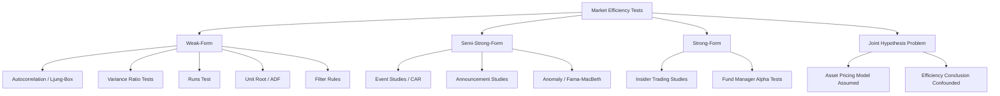

## Tests of Market Efficiency

### Overview

**Key Points**

- Market efficiency tests evaluate whether asset prices fully reflect available information, as formalized in the Efficient Market Hypothesis (EMH)
- Tests are categorized by information set: weak-form (past prices), semi-strong-form (public information), and strong-form (all information, including private)
- Econometric testing typically proceeds by testing joint hypotheses: market efficiency *and* a specific asset pricing model (the "joint hypothesis problem")

The EMH states that prices adjust rapidly to new information such that no investor can systematically earn risk-adjusted excess returns. Formally, under the EMH:

$$E[R_{t+1} \mid \Omega_t] = E[R_{t+1}]$$

where $\Omega_t$ is the information set available at time $t$. Deviations from this are tested through predictability of returns, reaction speed to announcements, and profitability of trading rules net of risk adjustment and transaction costs.

### Forms of Market Efficiency

#### Weak-Form Efficiency

Asserts that current prices fully incorporate all information contained in historical price and volume data. Under weak-form efficiency, technical analysis cannot generate abnormal returns.

#### Semi-Strong-Form Efficiency

Asserts that prices reflect all publicly available information, including financial statements, macroeconomic announcements, and analyst forecasts. Under this form, fundamental analysis based on public data cannot generate abnormal returns.

#### Strong-Form Efficiency

Asserts that prices reflect all information, public and private (insider). This form is rarely supported empirically, since insider trading studies generally document abnormal returns to informed traders.

### Weak-Form Tests

#### Autocorrelation Tests

Tests whether returns are serially correlated:

$$\rho_k = \frac{\text{Cov}(R_t, R_{t-k})}{\text{Var}(R_t)}$$

The sample autocorrelation is tested against zero using a $t$-statistic with standard error approximately $1/\sqrt{T}$ under the null of no autocorrelation.

**Ljung-Box Q-statistic** tests joint significance of autocorrelations up to lag $m$:

$$Q(m) = T(T+2)\sum_{k=1}^{m} \frac{\hat{\rho}_k^2}{T-k}$$

$Q(m)$ is asymptotically $\chi^2_m$ distributed under the null of no autocorrelation.

#### Variance Ratio Tests

Under the random walk hypothesis, the variance of $q$-period returns should equal $q$ times the variance of one-period returns. The **Lo-MacKinlay variance ratio**:

$$VR(q) = \frac{\text{Var}(R_t^{(q)})}{q \cdot \text{Var}(R_t)}$$

Under the null, $VR(q) = 1$. The standardized test statistic:

$$Z(q) = \frac{VR(q) - 1}{\sqrt{\phi(q)}} \sim N(0,1)$$

where $\phi(q)$ is the asymptotic variance (heteroskedasticity-robust versions exist, e.g., Lo-MacKinlay 1988). $VR(q) > 1$ suggests positive serial correlation (momentum); $VR(q) < 1$ suggests mean reversion.

#### Runs Test

A non-parametric test counting the number of "runs" (consecutive sequences of price increases or decreases). The expected number of runs under randomness:

$$E[R] = \frac{2n_1 n_2}{n_1+n_2} + 1$$

where $n_1, n_2$ are counts of positive/negative changes. Fewer runs than expected indicates trending; more runs indicates reversal patterns, both violating weak-form efficiency.

#### Unit Root Tests

Prices under the random walk hypothesis should contain a unit root. The **Augmented Dickey-Fuller (ADF)** test estimates:

$$\Delta P_t = \alpha + \beta P_{t-1} + \sum_{i=1}^{p} \gamma_i \Delta P_{t-i} + \varepsilon_t$$

Failure to reject $\beta = 0$ supports the unit-root/random-walk hypothesis; rejection implies mean reversion, inconsistent with weak-form efficiency in levels.

#### Filter Rules and Technical Trading Strategies

Filter rules (buy after an $x\%$ rise, sell after an $x\%$ fall) and moving-average crossover strategies are backtested; profitability net of transaction costs and risk adjustment is compared against buy-and-hold. Persistent abnormal risk-adjusted profits (typically assessed via a Sharpe ratio or CAPM alpha test) would violate weak-form efficiency. [Inference] Most academic studies post-1990s find filter-rule profits diminish or disappear once realistic transaction costs are included.

### Semi-Strong-Form Tests

#### Event Study Methodology

The dominant tool for semi-strong tests. Steps:

1. **Define event window** around announcement date $t=0$ (e.g., $[-10, +10]$ days)
2. **Estimate normal (expected) returns** using an estimation window prior to the event, typically via the market model:

$$R_{it} = \alpha_i + \beta_i R_{mt} + \varepsilon_{it}$$

3. **Compute abnormal returns**:

$$AR_{it} = R_{it} - (\hat{\alpha}_i + \hat{\beta}_i R_{mt})$$

4. **Aggregate cumulative abnormal returns (CAR)** across the event window:

$$CAR_i(t_1,t_2) = \sum_{t=t_1}^{t_2} AR_{it}$$

5. **Aggregate across firms** to get cumulative average abnormal return (CAAR), then test significance:

$$t\text{-stat} = \frac{\overline{CAR}}{\hat{\sigma}(\overline{CAR})/\sqrt{N}}$$

**Key Points**

- Under semi-strong efficiency, $AR_{it}$ should be statistically indistinguishable from zero after the event window closes (no drift)
- **Post-earnings announcement drift (PEAD)** is a well-documented anomaly: CARs continue trending in the direction of the earnings surprise for weeks after the announcement, which is a persistent challenge to semi-strong efficiency
- Alternative expected-return benchmarks include the Fama-French three-factor or five-factor model, and the CAPM

#### Announcement Studies

Applied to specific event types: earnings announcements, stock splits, M&A announcements, dividend changes, macroeconomic news releases (e.g., FOMC announcements), and index inclusion/exclusion. Semi-strong efficiency predicts an immediate, unbiased price adjustment with no subsequent drift.

#### Anomaly Tests

Cross-sectional return predictability from publicly available characteristics is tested via Fama-MacBeth regressions:

$$R_{it} = \gamma_{0t} + \gamma_{1t} X_{it} + \epsilon_{it}$$

run cross-sectionally each period $t$, with $\hat{\gamma}_1$ averaged over time and tested via a $t$-statistic using the time-series standard error of $\hat{\gamma}_{1t}$. Documented anomalies include size effect, value effect (book-to-market), momentum, and accruals anomaly — all representing potential semi-strong-form violations, though data-mining and multiple-testing concerns are relevant caveats. [Unverified] Whether a specific anomaly persists out-of-sample after publication is often disputed (the "factor zoo" critique).

### Strong-Form Tests

#### Insider Trading Studies

Examine returns to corporate insiders (officers, directors, large shareholders) using mandatory disclosure filings (e.g., SEC Form 4 in the US). Abnormal returns to insider purchases/sales are measured via event-study methodology applied around filing or transaction dates.

#### Mutual Fund and Analyst Performance Studies

Test whether professional money managers with access to superior research/information generate persistent risk-adjusted outperformance (alpha):

$$R_{pt} - R_{ft} = \alpha_p + \beta_p(R_{mt}-R_{ft}) + \varepsilon_{pt}$$

Persistent positive and statistically significant $\hat{\alpha}_p$ across many funds, net of fees, would violate strong-form (and arguably semi-strong-form) efficiency. Empirically, average actively managed fund alpha is close to zero or negative after fees; the [Inference] most consistent finding in this literature is that outperformance, where found, rarely persists across subsequent periods.

### The Joint Hypothesis Problem

**Key Points**

- Any test of market efficiency is simultaneously a test of the assumed equilibrium asset pricing model used to compute expected/normal returns
- A rejection of efficiency could instead reflect a misspecified risk model (e.g., wrong beta estimation, omitted risk factors)
- This is often called Fama's joint hypothesis problem, and it means market efficiency, strictly speaking, is not directly testable in isolation

This complicates interpretation: an anomaly might indicate (a) genuine mispricing, (b) an unmodeled risk premium, or (c) statistical artifact/data snooping.

### Statistical and Econometric Issues in Testing

#### Data Snooping and Multiple Testing

Extensive searches across many trading rules or factors inflate the probability of finding spurious "anomalies" by chance. **White's Reality Check** and the **False Discovery Rate (FDR)** correction are used to adjust inference for multiple comparisons.

#### Heteroskedasticity and Autocorrelation

Financial return series exhibit volatility clustering (ARCH/GARCH effects) and possible serial dependence in higher moments. Standard errors in efficiency tests are typically computed using **Newey-West HAC-robust** estimators:

$$\hat{V}_{NW} = \hat{\Gamma}_0 + \sum_{j=1}^{L}\left(1-\frac{j}{L+1}\right)(\hat{\Gamma}_j + \hat{\Gamma}_j')$$

#### Survivorship Bias

Studies using only currently-listed firms or funds overstate historical performance/efficiency conclusions since failed or delisted entities are excluded from the sample.

#### Small-Sample and Microstructure Effects

Bid-ask bounce, non-synchronous trading, and thin trading can induce spurious autocorrelation in observed returns unrelated to genuine predictability, biasing variance ratio and autocorrelation tests, particularly at high frequency.

### Illustrative Example: Variance Ratio Test in Practice

Given daily returns, to test the random walk hypothesis at $q=5$ (weekly aggregation):

1. Compute $\text{Var}(R_t)$ from daily returns and $\text{Var}(R_t^{(5)})$ from 5-day non-overlapping (or overlapping, for efficiency) returns
2. Compute $VR(5) = \text{Var}(R_t^{(5)}) / [5 \cdot \text{Var}(R_t)]$
3. If $VR(5) = 1.15$ with $Z(5) = 2.3$, this rejects the random walk null at the 5% level ($|Z| > 1.96$), suggesting positive autocorrelation (momentum) at the weekly horizon

**Output**: A $VR(q) > 1$ with significant $Z$-statistic implies weak-form inefficiency in the tested sample/period; robustness checks across multiple $q$ values and heteroskedasticity-robust variants (Lo-MacKinlay 1988) are standard practice before drawing conclusions.

### Diagram: Testing Framework Structure

### Conclusion

Tests of market efficiency span autocorrelation-based, variance-based, and event-based methodologies, each targeting a different information set (weak, semi-strong, strong). All such tests are conditional on an assumed equilibrium pricing model, making outright rejection of the EMH inherently ambiguous between genuine inefficiency and model misspecification. Robust inference requires HAC-consistent standard errors, correction for multiple testing, and awareness of microstructure and survivorship biases.

**Next Steps**

- Event study methodology (in depth): estimation window selection, cross-sectional correlation adjustments
- Fama-French multifactor models and factor-based risk adjustment
- GARCH and volatility clustering in financial time series
- Behavioral finance critiques of the EMH (limits to arbitrage, noise trader models)
- Market microstructure and high-frequency price discovery
- Long-horizon return predictability and the Fama-French/DeBondt-Thaler reversal literature