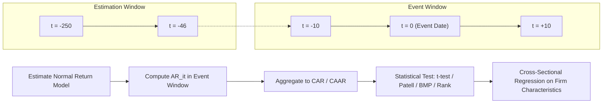

## Event Study Methodology

### Overview

**Key Points**

- Event study methodology measures the impact of a specific, dateable event on the value of a firm by estimating abnormal stock returns around the event
- Rooted in semi-strong-form market efficiency: if markets are efficient, the full valuation impact of an event should be reflected in prices quickly, with no subsequent drift
- Widely applied to earnings announcements, M&A, stock splits, dividend changes, regulatory actions, and macroeconomic announcements

The methodology, formalized by Fama, Fisher, Jensen, and Roll (1969) and standardized by MacKinlay (1997), isolates the component of a security's return attributable to firm-specific news by netting out the return predicted by a model of "normal" performance.

### Step 1: Event Definition and Event Window

The **event date** ($t=0$) is the date the information becomes public. The **event window** is the interval over which abnormal returns are measured, e.g., $[-1, +1]$ or $[-10, +10]$ trading days.

**Key Points**

- A wider window captures leakage/anticipation effects (pre-event) and delayed reaction/drift (post-event)
- A narrower window (e.g., $[-1,+1]$) reduces contamination from confounding events but may miss information leakage
- The **estimation window** (used to compute normal-return model parameters) precedes the event window and does not overlap with it, typically 120–250 trading days, e.g., $[-250, -46]$

### Step 2: Modeling Normal (Expected) Returns

#### Constant Mean Return Model

$$R_{it} = \mu_i + \varepsilon_{it}$$

Simplest specification: expected return equals the security's historical mean return over the estimation window. [Inference] Generally less accurate than market-based models since it ignores systematic risk exposure.

#### Market Model

The most commonly used benchmark:

$$R_{it} = \alpha_i + \beta_i R_{mt} + \varepsilon_{it}, \quad E[\varepsilon_{it}]=0, \ \text{Var}(\varepsilon_{it})=\sigma_{\varepsilon_i}^2$$

$\hat{\alpha}_i, \hat{\beta}_i$ are estimated via OLS over the estimation window, then used to compute predicted returns during the event window.

#### Multifactor Models

Fama-French three-factor:

$$R_{it} - R_{ft} = \alpha_i + \beta_i(R_{mt}-R_{ft}) + s_i SMB_t + h_i HML_t + \varepsilon_{it}$$

or the five-factor extension (adding profitability $RMW$ and investment $CMA$ factors). Multifactor models reduce residual variance further when the event sample is concentrated in particular size/value/momentum categories.

#### Matching/Characteristic-Based Models

Expected return computed from a portfolio of firms matched on size, book-to-market, and/or momentum, rather than a linear factor regression. Useful when factor loadings are unstable or the event affects factor exposures themselves.

### Step 3: Computing Abnormal Returns

$$AR_{it} = R_{it} - \widehat{E[R_{it} \mid X_t]}$$

For the market model:

$$AR_{it} = R_{it} - (\hat{\alpha}_i + \hat{\beta}_i R_{mt})$$

#### Cumulative Abnormal Return (CAR)

Aggregates abnormal returns for security $i$ over the event window $(t_1, t_2)$:

$$CAR_i(t_1,t_2) = \sum_{t=t_1}^{t_2} AR_{it}$$

#### Cumulative Average Abnormal Return (CAAR)

Averaged across the $N$ event firms:

$$\overline{CAR}(t_1,t_2) = \frac{1}{N}\sum_{i=1}^{N} CAR_i(t_1,t_2)$$

#### Buy-and-Hold Abnormal Return (BHAR)

An alternative to summing simple ARs, used especially for long-horizon studies:

$$BHAR_i = \prod_{t=1}^{T}(1+R_{it}) - \prod_{t=1}^{T}(1+E[R_{it}])$$

[Inference] BHARs better reflect actual investor experience over long horizons but compound estimation error and exhibit more severe skewness, complicating inference (see Barber-Lyon 1997; Lyon-Barber-Tsai 1999).

### Step 4: Statistical Testing

#### Cross-Sectional t-test

Under the null of no abnormal performance, $CAR_i \sim N(0, \sigma^2_{CAR_i})$. The aggregate test statistic:

$$t = \frac{\overline{CAR}(t_1,t_2)}{\hat{\sigma}(\overline{CAR})/\sqrt{N}} \sim N(0,1) \text{ (asymptotically)}$$

where $\hat{\sigma}(\overline{CAR})$ can be estimated from the cross-sectional standard deviation of individual $CAR_i$ (cross-sectional test) or from the time-series variance of estimation-window residuals scaled up to the event window (time-series/standard test, per MacKinlay 1997):

$$\text{Var}(CAR_i(t_1,t_2)) = L_2 \hat{\sigma}_{\varepsilon_i}^2$$

where $L_2 = t_2 - t_1 + 1$ is the event window length.

#### Patell (Standardized) Test

Standardizes each firm's abnormal return by its own estimation-window residual standard deviation (adjusted for forecast-error uncertainty) before aggregating, giving each event equal weight regardless of residual variance:

$$SAR_{it} = \frac{AR_{it}}{\hat{S}_{i}\sqrt{1 + \frac{1}{T} + \frac{(R_{mt}-\bar{R}_m)^2}{\sum(R_{mt}-\bar{R}_m)^2}}}$$

The Patell $Z$-statistic sums standardized residuals across events and tests against the standard normal.

#### Boehmer-Musumeci-Poulsen (BMP) Test

Extends Patell's test to be robust to **event-induced variance increases** (common around corporate announcements, where volatility spikes independent of the mean effect). Combines standardization with a cross-sectional variance estimator computed from the event-window (not estimation-window) standardized residuals, improving size properties under heteroskedasticity.

#### Non-Parametric Tests

- **Sign test**: compares the proportion of positive ARs to the 50% expected under the null
- **Rank test (Corrado 1989)**: ranks abnormal returns within each firm's time series (estimation + event window) and tests whether event-window ranks deviate from their expected value; robust to non-normality and outliers

**Key Points**

- Parametric tests assume approximate normality of returns; with small samples or skewed distributions, non-parametric tests provide more reliable inference
- Event-induced variance changes, if ignored, inflate Type I error rates (false rejections) under standard parametric tests — BMP or rank tests are preferred in such settings

### Step 5: Cross-Sectional Analysis

After computing firm-level $CAR_i$, a second-stage cross-sectional regression relates abnormal returns to firm/deal characteristics:

$$CAR_i = \gamma_0 + \gamma_1 X_{1i} + \gamma_2 X_{2i} + \dots + \eta_i$$

Common regressors: firm size, leverage, deal type (cash vs. stock in M&A), analyst coverage, pre-event momentum, and surprise magnitude (e.g., standardized unexpected earnings, SUE). Heteroskedasticity-robust standard errors are standard given cross-sectional dispersion in $CAR_i$.

### Illustrative Example

Suppose a study of 200 firms' earnings announcements uses the market model estimated over $[-250, -46]$, with an event window of $[-1, +1]$:

1. Estimate $\hat{\alpha}_i, \hat{\beta}_i$ for each firm via OLS on the estimation window
2. Compute $AR_{it}$ for $t = -1, 0, +1$ using realized $R_{mt}$
3. Sum to get $CAR_i(-1,+1)$ for each firm
4. Average across all 200 firms: $\overline{CAR}(-1,+1) = 1.8\%$
5. Compute Patell $Z = 4.7$ (highly significant)

**Output**: A statistically significant positive $\overline{CAR}$ around earnings announcements indicates the market reacts to earnings surprises; if a **post-announcement drift** is also found in $CAR_i(+2, +60)$ that continues in the same direction as the initial surprise, this is evidence against semi-strong-form efficiency (the well-documented PEAD anomaly).

### Common Pitfalls and Robustness Considerations

- **Event clustering**: When events cluster in calendar time (e.g., all firms announce earnings in the same week), cross-sectional independence of $AR_{it}$ is violated, understating standard errors. Solution: use a portfolio approach (form a calendar-time portfolio of event firms) or cluster-robust/GLS-adjusted variance estimators
- **Confounding events**: Other firm-specific news within the event window contaminates the estimated effect; requires screening event samples for overlapping announcements
- **Thin trading / non-synchronous trading**: Biases $\hat{\beta}_i$ in the market model, particularly for small or illiquid stocks; Dimson (1979) lead-lag beta adjustments or Scholes-Williams estimators can correct this
- **Long-horizon tests**: BHAR and calendar-time portfolio approaches face the "bad model problem" — small errors in the normal-return benchmark compound over long horizons, and skewness in returns undermines standard $t$-tests (see Kothari-Warner 2007; Fama 1998)
- **Choice of market index**: Value-weighted vs. equal-weighted index choice can materially affect estimated $\alpha_i, \beta_i$ and resulting $AR_{it}$

### Diagram: Event Study Timeline and Workflow

### Conclusion

Event study methodology remains the primary econometric tool for testing semi-strong-form market efficiency and quantifying the valuation impact of corporate and macroeconomic events. Its reliability depends critically on correct specification of the normal-return benchmark, appropriate handling of event-induced variance and cross-sectional dependence, and use of test statistics matched to the sample's distributional properties (parametric vs. non-parametric).

**Next Steps**

- Post-earnings announcement drift (PEAD) and its behavioral explanations
- Calendar-time portfolio approach (Jensen's alpha regressions) for long-horizon event studies
- Fama-French and Carhart multifactor models as normal-return benchmarks
- Cross-sectional regression diagnostics: heteroskedasticity, clustering, and endogeneity in deal characteristics
- Market microstructure effects on short-window event studies (bid-ask bounce, high-frequency event studies)