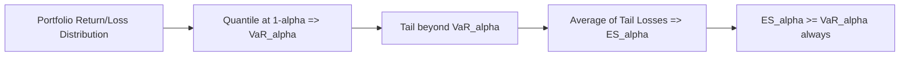

## Value at Risk and Expected Shortfall

### Overview

**Key Points**

- Value at Risk (VaR) and Expected Shortfall (ES) are the two dominant quantile-based measures of market risk used in risk management, regulatory capital calculation, and portfolio management
- VaR answers: "What is the maximum loss not exceeded with a given confidence level over a given horizon?"
- ES (also called Conditional VaR or CVaR) answers: "Given that losses exceed VaR, what is the expected loss?" — addressing VaR's insensitivity to tail severity
- Basel III/IV regulatory frameworks shifted from VaR to ES (specifically 97.5% ES) for market risk capital under the Fundamental Review of the Trading Book (FRTB)

### Value at Risk: Definition

For a portfolio with loss $L$ (positive values denote losses) over horizon $h$ at confidence level $1-\alpha$ (e.g., $\alpha = 0.05$ or $0.01$):

$$\text{VaR}_{\alpha} = \inf\{l \in \mathbb{R} : P(L > l) \leq \alpha\}$$

Equivalently, $\text{VaR}_\alpha$ is the $(1-\alpha)$-quantile of the loss distribution:

$$P(L \leq \text{VaR}_\alpha) = 1-\alpha$$

**Example**: A one-day 99% VaR of $1 million means there is a 1% probability that the portfolio loses more than $1 million over one trading day.

### Value at Risk: Estimation Methods

#### Parametric (Variance-Covariance) Method

Assumes portfolio returns are normally (or otherwise parametrically) distributed:

$$\text{VaR}_\alpha = -(\mu + z_\alpha \sigma)$$

where $z_\alpha$ is the $\alpha$-quantile of the standard normal (e.g., $z_{0.01} = -2.33$), and $\mu, \sigma$ are the estimated mean and standard deviation of portfolio returns. For a portfolio of assets, $\sigma$ is derived from the covariance matrix $\Sigma$ and position weights $w$:

$$\sigma_p = \sqrt{w' \Sigma w}$$

**Key Points**

- Computationally simple and fast, suitable for large portfolios with linear positions
- Assumes normality, which underestimates tail risk given the well-documented excess kurtosis (fat tails) in financial returns
- Poorly suited to portfolios with options or other non-linear payoffs

#### Historical Simulation

Non-parametric: uses the empirical distribution of historical portfolio returns (typically 250–500 days) without distributional assumptions. VaR is the appropriate empirical percentile of the historical P&L distribution.

**Key Points**

- Makes no distributional assumption; naturally captures fat tails and skewness present in the historical sample
- Fully dependent on the historical window: cannot anticipate risks not observed historically, and is slow to adapt after a volatility regime shift ("ghosting" effect where past extreme events remain in the window)
- Filtered Historical Simulation (FHS, Barone-Adesi et al. 1999) improves this by scaling historical returns by current conditional volatility from a GARCH model before resampling

#### Monte Carlo Simulation

Simulates a large number of scenarios ($10{,}000+$) for underlying risk factors using an assumed stochastic process (e.g., correlated GBM, or a fitted GARCH/copula model), revalues the portfolio under each scenario, and takes the empirical quantile of the simulated P&L distribution.

**Key Points**

- Most flexible: handles non-linear payoffs (options), fat tails, and complex dependence structures (via copulas)
- Computationally intensive, and results are sensitive to the choice of underlying risk-factor model (model risk)

#### Conditional Volatility (GARCH-Based) VaR

Combines a time-varying volatility model with a parametric or empirical innovation distribution:

$$R_t = \mu + \sigma_t z_t, \quad \sigma_t^2 = \omega + \alpha \varepsilon_{t-1}^2 + \beta \sigma_{t-1}^2$$

$$\text{VaR}_\alpha = -(\mu + \sigma_t \cdot q_\alpha(z))$$

where $q_\alpha(z)$ is the $\alpha$-quantile of the standardized innovation distribution (normal, Student-$t$, or empirical via FHS). This captures **volatility clustering**, producing VaR estimates that adapt to current market conditions rather than relying on unconditional historical volatility.

#### Extreme Value Theory (EVT)

Models the tail of the loss distribution directly using the **Peaks-Over-Threshold (POT)** method. Exceedances over a high threshold $u$ are modeled with the **Generalized Pareto Distribution (GPD)**:

$$G_{\xi,\beta}(y) = \begin{cases} 1-\left(1+\xi y/\beta\right)^{-1/\xi} & \xi \neq 0 \\ 1-e^{-y/\beta} & \xi = 0 \end{cases}$$

VaR is then extrapolated from the fitted tail parameters $(\xi, \beta)$, providing more reliable estimates for extreme quantiles (e.g., 99.9%) than methods relying on the full-sample distribution. [Inference] EVT-based methods are particularly valued for stress-testing and extreme quantile estimation where historical data is sparse in the relevant tail region.

### Expected Shortfall: Definition

Also known as Conditional VaR (CVaR) or Tail VaR. Defined as the expected loss conditional on exceeding VaR:

$$\text{ES}_\alpha = E[L \mid L > \text{VaR}_\alpha]$$

Equivalently, expressed as the average of VaR over all confidence levels below $\alpha$:

$$\text{ES}_\alpha = \frac{1}{\alpha}\int_0^\alpha \text{VaR}_u \, du$$

For a continuous loss distribution:

$$\text{ES}_\alpha = \frac{1}{\alpha} E[L \cdot \mathbb{1}\{L > \text{VaR}_\alpha\}]$$

**Example**: If 1% VaR is $1 million, ES at the 1% level is the *average* loss across the worst 1% of outcomes (e.g., $1.4 million), incorporating tail severity that VaR itself ignores.

### VaR vs. ES: Coherence and Regulatory Motivation

#### Coherent Risk Measures

A risk measure $\rho$ is **coherent** (Artzner et al. 1999) if it satisfies:

1. **Monotonicity**: $L_1 \leq L_2 \Rightarrow \rho(L_1) \leq \rho(L_2)$
2. **Sub-additivity**: $\rho(L_1+L_2) \leq \rho(L_1)+\rho(L_2)$ (diversification should not increase risk)
3. **Positive homogeneity**: $\rho(\lambda L) = \lambda \rho(L)$ for $\lambda > 0$
4. **Translation invariance**: $\rho(L+c) = \rho(L)+c$

**Key Points**

- VaR violates sub-additivity in general (except under elliptical distributions like the normal), meaning VaR can indicate that diversification *increases* risk — a theoretically undesirable property
- ES is a coherent risk measure under all conditions, satisfying sub-additivity
- This theoretical weakness, combined with VaR's failure to capture tail severity beyond the threshold, motivated the shift toward ES in the Basel FRTB framework (97.5% ES for internal models approach, replacing 99% VaR)

### Backtesting VaR and ES

#### Kupiec's Proportion of Failures (POF) Test

Tests whether the observed violation rate matches the expected rate $\alpha$. Given $T$ observations and $x$ violations (exceedances), the likelihood ratio statistic:

$$LR_{POF} = -2\ln\left[\frac{(1-\alpha)^{T-x}\alpha^x}{(1-\hat{p})^{T-x}\hat{p}^x}\right] \sim \chi^2_1$$

where $\hat{p} = x/T$. Tests unconditional coverage only (correct violation frequency, not clustering).

#### Christoffersen's Conditional Coverage Test

Extends Kupiec's test to also check for **independence of violations** (i.e., whether violations cluster together, indicating the model fails to adapt to volatility regimes). Combines a test of unconditional coverage with a Markov-chain-based independence test:

$$LR_{CC} = LR_{POF} + LR_{ind} \sim \chi^2_2$$

#### Backtesting Expected Shortfall

More challenging than VaR backtesting because ES is not "elicitable" on its own (Gneiting 2011) — meaning there's no simple scoring function comparable to VaR's hit-based test. Common approaches:

- **Acerbi-Szekely test**: compares realized tail losses to model-implied ES using a test statistic based on the ratio of the two, with critical values obtained via simulation/bootstrapping
- **Joint VaR-ES backtesting**: since ES is jointly elicitable with VaR (Fissler-Ziegler 2016), regulatory practice (Basel FRTB) backtests VaR directly and monitors ES-implied loss magnitudes separately

### Portfolio-Level Considerations

#### Component and Marginal VaR

For risk attribution across a multi-asset portfolio:

$$\text{Marginal VaR}_i = \frac{\partial \text{VaR}_p}{\partial w_i}, \quad \text{Component VaR}_i = w_i \cdot \text{Marginal VaR}_i$$

Component VaRs sum exactly to total portfolio VaR under the parametric (delta-normal) approach, enabling risk decomposition across positions or business units.

#### Time Scaling

The "square-root-of-time" rule scales a 1-day VaR to an $h$-day horizon:

$$\text{VaR}_h = \text{VaR}_1 \cdot \sqrt{h}$$

This holds exactly only under i.i.d. normal returns with zero autocorrelation. [Unverified] In practice, with volatility clustering and mean reversion present in most return series, this scaling is an approximation whose accuracy degrades as $h$ increases; regulators generally require this to be justified empirically rather than assumed.

### Illustrative Example: Parametric VaR and ES for a Normal Distribution

Given a portfolio with daily $\mu = 0$, $\sigma = 2\%$, and value $10 million, at $\alpha = 0.05$ ($z_{0.05} = -1.645$):

$$\text{VaR}_{0.05} = -(\mu + z_{0.05}\sigma) \times \$10M = 1.645 \times 0.02 \times \$10M = \$329{,}000$$

Under normality, ES has a closed form:

$$\text{ES}_\alpha = \sigma \cdot \frac{\phi(z_\alpha)}{\alpha}$$

where $\phi$ is the standard normal PDF. At $\alpha=0.05$: $\phi(-1.645) \approx 0.103$, so:

$$\text{ES}_{0.05} = 0.02 \times \frac{0.103}{0.05} \times \$10M \approx \$412{,}000$$

**Output**: ES ($412,000) exceeds VaR ($329,000), reflecting the average severity of losses in the worst 5% tail rather than just the threshold — this gap widens further under fat-tailed (e.g., Student-$t$) distributional assumptions.

### Diagram: VaR and ES on the Loss Distribution

### Common Pitfalls and Model Risk

- **Non-linear payoffs**: Delta-normal VaR poorly approximates risk for portfolios with significant optionality (gamma risk); Monte Carlo or full revaluation historical simulation is preferred
- **Fat tails and skewness**: Assuming normality underestimates VaR/ES at extreme confidence levels (e.g., 99.9%); Student-$t$, skewed-$t$, or EVT-based approaches better capture tail risk
- **Procyclicality**: VaR-based risk limits can amplify market stress (deleveraging in downturns as VaR estimates spike), a systemic concern highlighted after the 2008 financial crisis
- **Liquidity horizon mismatch**: FRTB addresses this via differentiated liquidity horizons per risk factor class rather than a single time-scaling assumption
- **Backtesting power**: With only 250 trading days per year, backtests for high-confidence VaR (99%) have very few expected violations (~2.5/year), giving low statistical power to detect model misspecification

### Conclusion

VaR remains the most widely used and communicated risk metric due to its simplicity and interpretability, but its lack of sub-additivity and blindness to tail severity beyond the threshold are well-recognized theoretical weaknesses. Expected Shortfall addresses both concerns as a coherent risk measure and has become the regulatory standard under Basel III/FRTB, though it introduces additional estimation and backtesting complexity. Robust risk management in practice typically reports both metrics alongside stress testing and scenario analysis rather than relying on a single quantile-based measure.

**Next Steps**

- GARCH and stochastic volatility models for conditional risk estimation
- Extreme Value Theory (EVT) and Peaks-Over-Threshold modeling in depth
- Copula-based dependence modeling for multivariate portfolio VaR/ES
- Basel FRTB Internal Models Approach (IMA) and Standardized Approach (SA) requirements
- Stress testing and scenario analysis as complements to VaR/ES
- Coherent and spectral risk measures beyond ES (e.g., distortion risk measures)