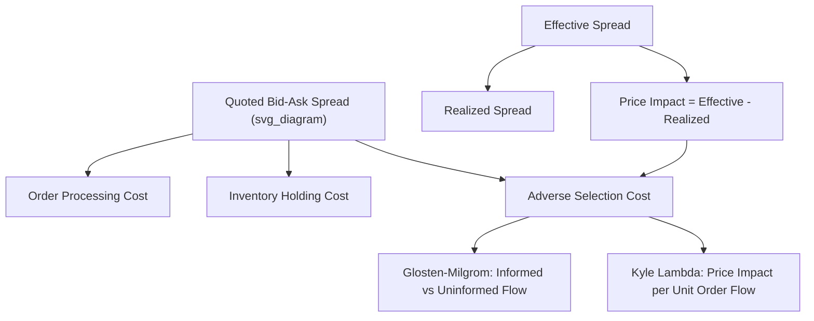

## Market Microstructure and High-Frequency Data

### Overview

**Key Points**

- Market microstructure studies how the specific trading mechanisms, rules, and information asymmetries of a market affect price formation, liquidity, and transaction costs
- High-frequency data (tick-by-tick trades and quotes) introduces distinct econometric challenges: irregular time spacing, discreteness, market microstructure noise, and extremely high volume
- Core themes include the bid-ask spread decomposition, price discovery, liquidity measurement, and realized volatility estimation under microstructure noise

### Foundations of Market Microstructure

#### The Bid-Ask Spread

The quoted spread is $S_t = A_t - B_t$ (ask minus bid). The spread compensates liquidity providers (market makers/dealers) for three components:

1. **Order processing costs**: fixed costs of executing trades
2. **Inventory holding costs**: compensation for the risk of holding non-optimal inventory positions (Ho-Stoll 1981, Garman 1976)
3. **Adverse selection costs**: compensation for trading against better-informed counterparties (Copeland-Galai 1983, Glosten-Milgrom 1985, Kyle 1985)

#### Glosten-Milgrom Model

Models sequential trading where a market maker faces a mix of informed and uninformed (liquidity) traders, and sets bid/ask prices as conditional expectations:

$$A_t = E[V \mid \text{buy order}], \quad B_t = E[V \mid \text{sell order}]$$

where $V$ is the asset's true value. The resulting bid-ask spread arises purely from **adverse selection**, even with risk-neutral, competitive market makers, since a trade itself reveals information about $V$.

#### Kyle (1985) Model

Models a single informed trader trading strategically against noise traders, with a market maker setting a linear pricing rule:

$$P_t = P_{t-1} + \lambda(Q_t)$$

where $Q_t$ is aggregate order flow and $\lambda$ (**Kyle's lambda**) measures price impact per unit of order flow — a standard measure of market liquidity/depth. Higher $\lambda$ implies lower liquidity (larger price impact per trade).

#### Roll's Implied Spread Model

Estimates the effective bid-ask spread from the serial covariance of observed price changes, without needing quote data:

$$\text{Cov}(\Delta P_t, \Delta P_{t-1}) = -\frac{s^2}{4}$$

$$s = 2\sqrt{-\text{Cov}(\Delta P_t, \Delta P_{t-1})}$$

Assumes trades bounce randomly between bid and ask ("bid-ask bounce"), inducing negative first-order serial correlation in observed transaction price changes — a pure microstructure artifact unrelated to fundamental value changes. Requires $\text{Cov}(\Delta P_t, \Delta P_{t-1}) < 0$ to be defined; frequently violated in practice, motivating extensions.

### Trade Classification Algorithms

Since many datasets lack explicit buy/sell flags, trades must be classified as liquidity-demanding buys or sells:

#### Lee-Ready Algorithm (1991)

1. **Quote test**: classify trade as a buy if price is above the midquote, sell if below
2. **Tick test** (used when trade is at the midquote): classify as a buy if the price is higher than the previous trade (uptick), sell if lower (downtick)

#### Effective Spread and Realized Spread

$$\text{Effective Spread}_t = 2 \times D_t \times (P_t - M_t)$$

where $D_t = +1$ for buys, $-1$ for sells, and $M_t$ is the midquote at execution. The **realized spread** measures the market maker's profit net of adverse selection by comparing execution price to the midquote some interval $\Delta$ later:

$$\text{Realized Spread}_t = 2 \times D_t \times (P_t - M_{t+\Delta})$$

The difference between effective and realized spread is the **price impact**, attributable to adverse selection.

### Price Discovery Measures

#### Information Share (Hasbrouck 1995)

When a security trades on multiple venues, decomposes the variance of the common efficient price innovation across venues using a vector error correction model (VECM) on the cointegrated price series, attributing a percentage of price discovery to each venue.

#### Component Share / ILS (Gonzalo-Granger 1995; Booth et al. 2002)

An alternative decomposition based on the permanent-transitory components of the VECM, addressing some order-dependence issues present in Hasbrouck's original information share (which is sensitive to the Cholesky ordering used).

### Order Flow and Liquidity Measures

**Key Points**

- **Depth**: quantity available at the best bid/ask (or across the order book)
- **Resiliency**: speed at which liquidity replenishes after a large trade depletes the order book
- **Amihud illiquidity ratio**: a widely-used low-frequency proxy for price impact:

$$\text{ILLIQ}_i = \frac{1}{D}\sum_{d=1}^{D} \frac{|R_{id}|}{VOLD_{id}}$$

averaging the ratio of absolute daily return to daily dollar volume; higher values indicate lower liquidity (larger price moves per dollar traded)

#### Limit Order Book (LOB) Dynamics

Modern equity/futures markets operate as electronic limit order books. Key modeling approaches:

- **Zero-intelligence models**: order arrivals modeled as Poisson processes with simple behavioral rules, used to derive stylized facts of order book shape
- **Queueing-theoretic models**: model the LOB as a multi-class queueing system to study execution probability and time-to-fill for limit orders at each price level

### Econometrics of High-Frequency Data

#### Market Microstructure Noise

Observed transaction prices $P_t^*$ deviate from the latent efficient price $P_t$:

$$P_t^* = P_t + u_t$$

where $u_t$ is microstructure noise (bid-ask bounce, discreteness, asynchronous trading). This noise induces spurious autocorrelation and biases naive volatility estimators, especially as sampling frequency increases.

#### Realized Volatility (RV)

The sum of squared high-frequency returns over an interval (e.g., a trading day), converging to integrated variance as sampling frequency increases, absent microstructure noise:

$$RV_t = \sum_{i=1}^{n} r_{t,i}^2 \xrightarrow{p} \int_{t-1}^{t} \sigma_s^2 \, ds$$

**Key Points**

- In the presence of microstructure noise, $RV_t$ is biased upward at very high sampling frequencies — the classic "volatility signature plot" shows $RV$ rising sharply as sampling interval shrinks toward zero
- This creates a bias-variance tradeoff: sparser sampling (e.g., 5-minute returns) reduces noise-induced bias but discards information, motivating noise-robust estimators

#### Two-Scale and Multi-Scale Realized Volatility

Zhang, Mykland, and Aït-Sahalia (2005) **Two-Scales Realized Volatility (TSRV)** combines estimators at two different sampling frequencies (a "slow" and "fast" time scale) to construct a bias-corrected, consistent estimator of integrated variance:

$$\widehat{TSRV} = \overline{RV}^{(K)} - \frac{\bar{n}}{n}RV^{(all)}$$

where $\overline{RV}^{(K)}$ averages RV estimates from $K$ subsampled grids. Multi-scale realized volatility (MSRV) extends this using multiple sampling scales for improved efficiency.

#### Realized Kernels

Barndorff-Nielsen, Hansen, Lunde, and Shephard (2008) propose kernel-weighted estimators analogous to HAC covariance estimators in time series, explicitly correcting for noise-induced autocorrelation:

$$RK = \sum_{h=-H}^{H} k\left(\frac{h}{H+1}\right)\hat{\gamma}_h$$

where $\hat{\gamma}_h$ are realized autocovariances and $k(\cdot)$ is a kernel weighting function (e.g., Parzen kernel), chosen to guarantee a positive semi-definite, consistent estimator.

#### Realized Bipower Variation

Decomposes quadratic variation into continuous and jump components. Bipower variation (Barndorff-Nielsen and Shephard 2004) is robust to jumps:

$$BV_t = \frac{\pi}{2}\sum_{i=2}^{n}|r_{t,i}||r_{t,i-1}| \xrightarrow{p} \int_{t-1}^{t}\sigma_s^2\,ds$$

The difference $RV_t - BV_t$ estimates the **jump variation**, enabling separate modeling of continuous diffusive volatility versus discrete price jumps — important for both risk management and options pricing calibration.

#### Irregular Spacing and Point Process Models

Trade and quote arrivals occur at irregular random times, motivating specialized time series models:

- **ACD (Autoregressive Conditional Duration) model** (Engle-Russell 1998): models the time between trades as a multiplicative error process, analogous to GARCH for durations:

$$\psi_i = \omega + \alpha x_{i-1} + \beta \psi_{i-1}, \quad x_i = \psi_i \varepsilon_i$$

where $x_i$ is the $i$-th trade duration and $\psi_i$ its conditional expectation.

- **Hawkes Processes**: self-exciting point processes where each event (trade, order) increases the short-term intensity of subsequent events, capturing clustering in order flow:

$$\lambda(t) = \mu + \sum_{t_i < t} \phi(t - t_i)$$

where $\phi$ is a decaying excitation kernel (often exponential). [Inference] Hawkes processes have become a standard tool in the high-frequency trading literature for modeling order flow clustering, price impact, and flash-crash-type feedback dynamics.

### Illustrative Example: Roll Spread Estimation

Given daily transaction price changes with sample first-order autocovariance $\widehat{\text{Cov}}(\Delta P_t, \Delta P_{t-1}) = -0.0004$:

$$s = 2\sqrt{-(-0.0004)} = 2\sqrt{0.0004} = 2(0.02) = 0.04$$

**Output**: The implied effective bid-ask spread is $0.04 (4 cents) per share, estimated purely from the negative serial covariance in observed price changes — no quote data required.

### Diagram: Sources of the Bid-Ask Spread and Price Impact Decomposition

### Common Pitfalls and Data Issues

- **Bid-ask bounce** induces spurious negative autocorrelation in transaction-level returns unrelated to fundamental volatility; ignoring this inflates naive realized volatility at ultra-high frequencies
- **Asynchronous trading (non-synchronicity)**: multi-asset high-frequency covariance/correlation estimates are biased toward zero (the Epps effect) when assets trade at different times; refresh-time sampling or covariance-specific estimators (e.g., Hayashi-Yoshida) address this
- **Data cleaning**: raw tick data requires substantial preprocessing (removing erroneous quotes/trades, handling exchange codes, aligning trade and quote timestamps) before analysis — procedures documented in Barndorff-Nielsen et al. (2009) are a standard reference
- **Venue fragmentation**: modern equity markets trade across dozens of venues (lit exchanges, dark pools), complicating consolidated price discovery and liquidity measurement
- **Survivorship and selection in HFT datasets**: proprietary high-frequency order-level data is often restricted to specific venues/participants, limiting generalizability of empirical findings

### Conclusion

Market microstructure theory explains how trading mechanisms and information asymmetry generate the bid-ask spread and price impact observed in transaction data, while high-frequency econometrics provides the tools to extract consistent volatility and covariance estimates from noisy, irregularly-spaced tick data. The two fields are deeply interconnected: understanding microstructure noise is a prerequisite for correctly applying realized volatility and price discovery techniques to modern financial datasets.

**Next Steps**

- GARCH/stochastic volatility models with high-frequency-informed volatility measures (HAR-RV model)
- Jump-diffusion models and jump detection tests (Barndorff-Nielsen–Shephard jump test)
- Algorithmic and high-frequency trading strategies and their market impact
- Limit order book simulation and agent-based microstructure models
- Cross-venue price discovery and dark pool trading effects on price efficiency
- Hawkes process estimation methods (MLE, EM algorithm) for order flow modeling