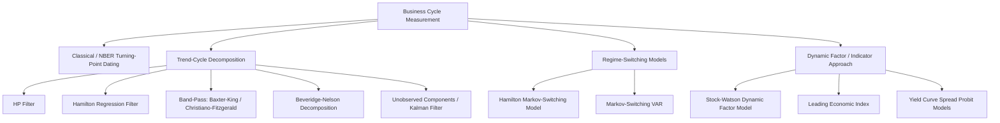

## Business Cycle Measurement and Analysis

### Overview

**Key Points**

- Business cycle analysis studies the recurrent, non-periodic fluctuations in aggregate economic activity around long-run trend growth
- Two dominant traditions: the **classical (Burns-Mitchell/NBER)** approach based on turning-point dating, and the **modern statistical/filtering** approach that decomposes series into trend and cyclical components
- Core econometric tools include detrending/filtering methods, regime-switching models, and coincident/leading indicator construction

### Defining the Business Cycle

The classical Burns and Mitchell (1946) definition characterizes business cycles as recurring sequences of expansion, followed by recession, contraction, and revival across broad economic activity — not a single series, but a co-movement across output, employment, income, and sales. Cycles are:

- **Recurrent** but **not periodic** (no fixed length)
- Characterized by **comovement** across many macroeconomic series (the basis of dynamic factor models)
- Asymmetric: contractions are typically shorter and steeper than expansions

### NBER Business Cycle Dating

The NBER Business Cycle Dating Committee determines US recession start (peak) and end (trough) dates using judgmental analysis of multiple coincident indicators rather than a mechanical rule (notably, not the "two consecutive quarters of negative GDP growth" heuristic commonly cited in media). Key indicators monitored include:

- Real personal income less transfers
- Nonfarm payroll employment
- Real personal consumption expenditures
- Industrial production
- Wholesale-retail sales (adjusted for price changes)
- Household employment survey data

**Key Points**

- The NBER approach identifies both **peaks** (start of recession) and **troughs** (start of expansion), defining a full cycle as peak-to-peak or trough-to-trough
- Dating is announced with a substantial lag (often 6–18 months after the actual turning point) since it requires confirming the persistence of the movement, not just detecting an initial decline

### Trend-Cycle Decomposition

Since business cycles are conventionally understood as deviations from a long-run trend, decomposing a series $y_t$ into a trend $\tau_t$ and cyclical component $c_t$ is central to quantitative analysis:

$$y_t = \tau_t + c_t \quad (\text{additive}) \quad \text{or} \quad y_t = \tau_t \cdot c_t \quad (\text{multiplicative, in logs additive})$$

#### Hodrick-Prescott (HP) Filter

Minimizes a penalized sum of squares trading off trend fit against trend smoothness:

$$\min_{\{\tau_t\}} \sum_{t=1}^{T}(y_t - \tau_t)^2 + \lambda \sum_{t=2}^{T-1}\left[(\tau_{t+1}-\tau_t)-(\tau_t - \tau_{t-1})\right]^2$$

The smoothing parameter $\lambda$ controls trend flexibility (standard convention: $\lambda=1600$ for quarterly data, $\lambda=100$ for annual, $\lambda=14400$ for monthly, per Ravn-Uhlig 2002 scaling recommendations).

**Key Points**

- Widely used due to simplicity, but subject to well-documented criticisms (Hamilton 2018): spurious cyclicality can be introduced even in random walk data, and the filter suffers from **end-of-sample bias** since the two-sided filter must be truncated at the boundaries, distorting the most recent (and often most policy-relevant) observations
- Requires re-estimation of the entire trend when new data arrives, causing historical cyclical estimates to shift ("end-point problem")

#### Hamilton (2018) Regression Filter

Proposed as an alternative to HP, regresses $y_{t+h}$ on lags of $y_t$ ($h=8$ quarters ahead, 4 lags, as a common convention) and treats the residual as the cyclical component:

$$y_{t+h} = \beta_0 + \beta_1 y_t + \beta_2 y_{t-1} + \beta_3 y_{t-2} + \beta_4 y_{t-3} + \nu_{t+h}$$

$$\hat{c}_t = y_{t+h} - \hat{y}_{t+h}$$

**Key Points**

- Avoids the look-ahead/two-sided filtering problem of HP, since it uses only information available at $t$ combined with realized future outcome, and has a clear statistical (linear projection) interpretation
- [Inference] Increasingly used in policy and academic macro research since 2018 as a robustness check alongside or replacing the HP filter, though it is not universally adopted

#### Baxter-King and Christiano-Fitzgerald Band-Pass Filters

Isolate cyclical fluctuations within a specified frequency band (e.g., 6–32 quarters, corresponding to conventional business cycle duration) by applying an approximate ideal band-pass filter to the spectral representation of the series. Baxter-King (1999) uses a fixed symmetric moving-average approximation (losing observations at both ends of the sample); Christiano-Fitzgerald (2003) provides an asymmetric, full-sample version usable near the endpoints.

#### Beveridge-Nelson Decomposition

Based on an ARIMA representation of $y_t$, decomposes the series into a **permanent (random walk with drift) component** and a **transitory (stationary) component** using the long-run forecast function:

$$\tau_t = \lim_{h\to\infty}\left(\hat{y}_{t+h|t} - h\mu\right) + y_t, \quad c_t = y_t - \tau_t$$

Unlike HP/band-pass filters, this decomposition is model-based (derived directly from the estimated ARIMA process) and consistent with the assumption that shocks to output have both permanent and transitory effects.

#### Unobserved Components (UC) Models

Specifies trend and cycle as separate stochastic processes within a state-space framework, estimated via the Kalman filter:

$$y_t = \tau_t + c_t, \quad \tau_t = \tau_{t-1} + \mu_{t-1} + \eta_t, \quad \mu_t = \mu_{t-1}+\xi_t$$

$$c_t = \phi_1 c_{t-1} + \phi_2 c_{t-2} + \varepsilon_t$$

where $\tau_t$ follows a local linear trend and $c_t$ follows a stationary AR(2) process (commonly restricted to have complex roots, generating cyclical dynamics). This is the **Clark (1987) / Harvey (1985)** model class, estimated by maximum likelihood via the Kalman filter, which also naturally provides real-time filtered (one-sided) and smoothed (full-sample) estimates.

### Markov-Switching Models

Hamilton's (1989) regime-switching model treats the business cycle as driven by a discrete, unobserved state $S_t \in \{0,1\}$ (expansion/recession) following a first-order Markov chain:

$$\Delta y_t = \mu_{S_t} + \phi \Delta y_{t-1} + \varepsilon_t, \quad \varepsilon_t \sim N(0,\sigma^2)$$

$$P(S_t = j \mid S_{t-1}=i) = p_{ij}$$

Estimated via the **Hamilton filter** (a recursive algorithm computing filtered/smoothed regime probabilities) combined with maximum likelihood via the EM algorithm or direct numerical optimization.

**Key Points**

- Naturally captures the **asymmetry** between expansions and recessions (different means $\mu_0 \neq \mu_1$, and typically different persistence $p_{00} \neq p_{11}$)
- Smoothed regime probabilities $P(S_t=1 \mid y_1,\dots,y_T)$ provide a probabilistic, model-based analogue to NBER recession dating
- Multivariate extensions (Markov-switching VAR/dynamic factor models) allow joint regime classification across multiple coincident series, closely mirroring the Burns-Mitchell comovement concept

### Dynamic Factor Models and Coincident/Leading Indicators

#### Stock-Watson Dynamic Factor Model

Formalizes the Burns-Mitchell notion that business cycles reflect comovement across many series by extracting a common latent factor $f_t$ from $N$ macroeconomic series:

$$x_{it} = \lambda_i f_t + e_{it}, \quad f_t = \phi_1 f_{t-1} + \dots + \phi_p f_{t-p} + u_t$$

The estimated common factor $f_t$ serves as a coincident index of economic activity (the basis for the Chicago Fed National Activity Index and the Conference Board Coincident Economic Index).

#### Leading Economic Index (LEI)

Constructed from series that historically turn before the business cycle (e.g., yield curve spread, building permits, new orders, average weekly initial unemployment claims, stock prices), aggregated (often via a dynamic factor model or a weighted composite) to forecast upcoming turning points. [Inference] Leading indicator performance is subject to the standard warning that historical lead times are not constant across cycles, and false positive signals occur.

#### Yield Curve as a Recession Predictor

The term spread (10-year minus 3-month or 2-year Treasury yield) is one of the most studied univariate recession predictors, typically estimated via a probit model:

$$P(\text{Recession}_{t+h}=1) = \Phi(\beta_0 + \beta_1 \text{Spread}_t)$$

An inverted yield curve (negative spread) has historically preceded most postwar US recessions with a lead time of roughly 6–18 months, though [Unverified] the lead time and reliability of this relationship in any specific historical episode remains debated among researchers, with some evidence of changing predictive power in recent decades.

### Illustrative Example: HP Filter vs. Hamilton Filter Cyclical Estimates

Given quarterly log real GDP, applying the HP filter with $\lambda=1600$ yields a smooth trend and cyclical deviations $c_t^{HP}$. Applying the Hamilton regression filter with $h=8$, 4 lags, yields cyclical deviations $c_t^{Ham}$ as regression residuals.

**Output**: Empirically, $c_t^{HP}$ tends to show smoother, more persistent cyclical swings, while $c_t^{Ham}$ is typically noisier but does not suffer the spurious end-of-sample distortion that HP exhibits — a key diagnostic when comparing the two near the end of a sample during a suspected turning point.

### Diagram: Business Cycle Measurement Approaches

### Common Pitfalls and Methodological Debates

- **HP filter end-point bias**: real-time (one-sided) HP-filtered cyclical estimates near the sample end differ substantially from later, revised (two-sided, full-sample) estimates — a critical concern for real-time policy analysis
- **Spurious cycles**: Hamilton (2018) demonstrates that HP filtering a pure random walk can generate cyclical patterns resembling a business cycle purely as a filtering artifact, unrelated to any genuine cyclical process in the data-generating mechanism
- **Choice of smoothing parameter $\lambda$**: no universally agreed value; results can be sensitive to this choice, particularly for cross-country comparisons using different data frequencies
- **Real-time data revisions**: many macro series (especially GDP) are substantially revised after initial release; business cycle dating and indicator construction using "vintage" real-time data can differ materially from analysis using final revised data (the real-time data literature, e.g., Croushore-Stark 2001)
- **Regime-switching model estimation instability**: Markov-switching models can be sensitive to the number of assumed regimes and initial parameter values in numerical optimization, and regime probabilities near the end of the sample are less reliable (analogous to the end-point problem in filtering)

### Conclusion

Business cycle measurement spans a spectrum from purely judgmental, comovement-based dating (NBER) to fully model-based statistical decompositions (HP, Beveridge-Nelson, unobserved components) and explicit regime-switching frameworks (Hamilton Markov-switching models). Each method embodies different assumptions about the nature of the trend-cycle split and carries distinct real-time reliability tradeoffs, making method triangulation (comparing filter-based, regime-switching, and factor-based signals) standard practice in applied macroeconometric analysis.

**Next Steps**

- Dynamic factor models and principal-components-based "nowcasting" (e.g., the New York Fed Staff Nowcast)
- Markov-switching VAR models and multivariate regime classification
- Real-time data analysis and data revision econometrics (ALFRED/real-time datasets)
- Structural VAR identification of business cycle shocks (supply vs. demand decompositions)
- Recession prediction models: probit/logit with macro-financial predictors, machine learning approaches
- International business cycle comovement and synchronization measures