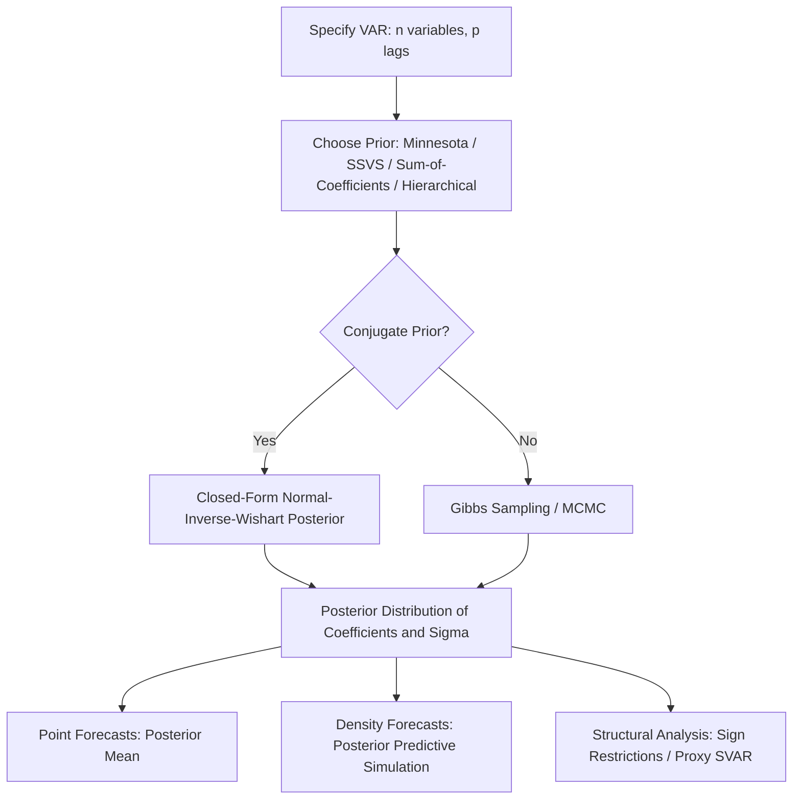

## Bayesian VAR Models

### Overview

**Key Points**

- Bayesian VARs (BVARs) address the overparameterization problem of classical VARs by imposing prior distributions on coefficients, shrinking estimates toward parsimonious benchmarks
- Widely used for macroeconomic forecasting and structural analysis, especially with large numbers of variables or lags relative to sample size
- Estimation combines a prior with the data likelihood via Bayes' rule to produce a posterior distribution over parameters, rather than a single point estimate

### The Overparameterization Problem in Classical VARs

A VAR($p$) with $n$ variables has $n^2p$ autoregressive coefficients plus $n$ intercepts:

$$y_t = c + A_1 y_{t-1} + A_2 y_{t-2} + \dots + A_p y_{t-p} + \varepsilon_t$$

With even modest $n$ and $p$ (e.g., $n=10$, $p=4$), the parameter count (400+) can approach or exceed typical macroeconomic sample sizes (quarterly data spanning 40–60 years yields only 160–240 observations), leading to imprecise OLS estimates, in-sample overfitting, and poor out-of-sample forecast performance.

**Key Points**

- Bayesian shrinkage trades off some estimation bias for a substantial reduction in variance, typically improving out-of-sample forecast accuracy (a bias-variance tradeoff formalized via priors rather than ad hoc variable/lag selection)
- This motivated Litterman's (1986) original development of BVARs at the Federal Reserve Bank of Minneapolis specifically for macroeconomic forecasting

### The Minnesota (Litterman) Prior

The classic and most widely used BVAR prior. Built on the empirical observation that many macroeconomic series are well-approximated by a **random walk**, so coefficients are shrunk toward:

$$A_1 = I, \quad A_2 = A_3 = \dots = A_p = 0$$

(i.e., each variable's own first lag has prior mean 1, all other coefficients have prior mean 0). The prior variance on each coefficient $a_{ij}^{(l)}$ (effect of variable $j$'s lag $l$ on variable $i$) is specified as:

$$\text{Var}(a_{ij}^{(l)}) = \begin{cases} \left(\dfrac{\lambda_1}{l^{\lambda_3}}\right)^2 & i=j \\[6pt] \left(\dfrac{\lambda_1 \lambda_2 \sigma_i}{l^{\lambda_3}\sigma_j}\right)^2 & i \neq j \end{cases}$$

**Key Points**

- $\lambda_1$ (overall tightness): controls the general degree of shrinkage toward the random-walk prior; smaller values imply tighter shrinkage
- $\lambda_2$ (cross-variable tightness): shrinks coefficients on *other* variables' lags more aggressively than the variable's own lags (typically $\lambda_2 < 1$)
- $\lambda_3$ (lag decay): higher-order lags are shrunk more heavily, reflecting the prior belief that more distant lags matter less
- $\sigma_i/\sigma_j$ terms rescale for differing variable units/variances
- The original Minnesota prior treats the error covariance matrix $\Sigma$ as fixed/diagonal (estimated univariately), simplifying estimation to variable-by-variable regressions; modern implementations typically relax this assumption

### Natural Conjugate and Independent Normal-Wishart Priors

#### Normal-Inverse-Wishart (Conjugate) Prior

Specifies a joint prior over the coefficient matrix $A$ and error covariance $\Sigma$:

$$\Sigma \sim IW(S_0, \nu_0), \quad \text{vec}(A) \mid \Sigma \sim N(\text{vec}(A_0), \Sigma \otimes \Omega_0)$$

Because this prior is **conjugate** to the VAR likelihood (multivariate normal), the posterior has a closed-form Normal-Inverse-Wishart distribution, permitting direct (non-simulation-based) posterior computation and forecasting. This is the standard implementation of the Minnesota prior in most modern software (allowing $\Sigma$ to be estimated jointly rather than fixed).

#### Independent Normal-Wishart Prior

Specifies independent priors on $A$ and $\Sigma$ (rather than the conjugate cross-restriction), offering more prior flexibility (e.g., allowing different shrinkage across equations) at the cost of losing the closed-form posterior — requiring **Gibbs sampling** (alternating draws from the conditional posteriors of $A \mid \Sigma, \text{data}$ and $\Sigma \mid A, \text{data}$) to approximate the joint posterior.

### Alternative and Extended Priors

#### Sum-of-Coefficients (Doan-Litterman-Sims) Prior

Imposes the prior belief that the sum of coefficients on each variable's own lags equals one and cross-variable lag sums equal zero, reflecting a prior toward variables sharing a common stochastic trend — useful for imposing cointegration-consistent beliefs without formally testing/imposing cointegrating rank.

#### Dummy-Initial-Observation (Single-Unit-Root) Prior

Introduced by Sims (1993), shrinks toward the belief that the system as a whole may contain a single common stochastic trend, addressing over-shrinkage toward zero-mean stationarity implicit in some Minnesota prior specifications.

#### Stochastic Search Variable Selection (SSVS) Prior

George, Sun, and Ni (2008): places a mixture-of-normals "spike-and-slab" prior on each coefficient, allowing the data to determine (via posterior inclusion probabilities) whether each coefficient should be shrunk heavily toward zero ("spike") or estimated more freely ("slab") — a Bayesian analogue to variable selection/sparsity methods (e.g., LASSO) applied within the VAR framework.

#### Hierarchical/Optimal Shrinkage (Giannone-Lenza-Primiceri, 2015)

Treats the Minnesota hyperparameters ($\lambda_1, \lambda_2, \lambda_3$) themselves as random variables with their own hyperpriors, estimated jointly with the model via maximizing the marginal likelihood, removing the need for ad hoc hyperparameter calibration or cross-validation.

### Large BVARs

**Key Points**

- Banbura, Giannone, and Reichlin (2010) demonstrated that BVARs with Minnesota-type shrinkage can be extended to include dozens or even 100+ variables ("large BVARs"), with shrinkage intensity ($\lambda_1$) tuned so forecast performance is comparable to small, carefully-selected VARs
- This addresses the classical VAR's tradeoff between including more information (more variables) and losing degrees of freedom, since appropriately tuned shrinkage allows the parameter count to scale without a proportional loss in forecast precision
- Large BVARs are now standard tools at central banks for medium-term forecasting incorporating broad macro-financial information sets, similar in spirit to (but distinct in the from) dynamic factor model "nowcasting" approaches

### Posterior Computation and Estimation

#### Closed-Form Posterior (Conjugate Case)

Under the Normal-Inverse-Wishart prior, the posterior mean of the coefficient matrix is a precision-weighted (shrinkage) average of the OLS estimate and the prior mean:

$$\hat{A}_{\text{posterior}} = (\Omega_0^{-1} + X'X)^{-1}(\Omega_0^{-1}A_0 + X'X\hat{A}_{OLS})$$

As the prior precision $\Omega_0^{-1} \to 0$ (diffuse prior), this converges to the OLS estimate; as $\Omega_0^{-1} \to \infty$ (dogmatic prior), the posterior collapses to the prior mean $A_0$.

#### Gibbs Sampling (Non-Conjugate Priors)

For priors without closed-form posteriors (independent Normal-Wishart, SSVS, time-varying parameter extensions), Markov Chain Monte Carlo (MCMC), typically Gibbs sampling, draws iteratively from:

1. $A \mid \Sigma, y \sim$ (multivariate normal conditional posterior)
2. $\Sigma \mid A, y \sim$ (inverse-Wishart conditional posterior)

repeated for many iterations (with an initial "burn-in" discarded) to approximate the joint posterior via the empirical distribution of retained draws.

### Structural Bayesian VARs

Structural identification (recovering economically interpretable shocks from reduced-form residuals $\varepsilon_t = B^{-1}u_t$) can be incorporated within the Bayesian framework:

- **Sign restrictions** (Uhlig 2005, Rubio-Ramirez et al. 2010): rather than a single point-identified structural matrix, draws of $B$ satisfying theoretically motivated sign patterns on impulse responses are retained, generating a *distribution* of admissible structural models rather than a unique identification
- **Bayesian estimation of proxy/external-instrument SVARs**: combines external instruments for identification with Bayesian priors on the reduced-form VAR coefficients

### Forecasting with BVARs

**Key Points**

- Point forecasts are typically the posterior mean of the predictive distribution, and forecast uncertainty is naturally quantified via the full posterior predictive distribution (not just parameter uncertainty, but also residual uncertainty), enabling coherent probabilistic (density) forecasts
- The predictive density for $h$-step-ahead forecasts integrates over both parameter uncertainty (posterior distribution of $A, \Sigma$) and future shock uncertainty, typically approximated via simulation (drawing parameters from the posterior, then simulating forward paths)
- BVAR forecast performance is commonly benchmarked against classical VARs, univariate AR/random-walk models, and dynamic factor models using out-of-sample metrics (RMSFE, log predictive score)

### Illustrative Example: Minnesota Prior Shrinkage

Consider a bivariate VAR(2) for GDP growth and inflation. Under OLS, the coefficient on inflation's second lag in the GDP growth equation might be estimated imprecisely, e.g., $\hat{a} = 0.35$ with a large standard error due to limited sample size. Under a Minnesota prior with $\lambda_1 = 0.2$ (moderately tight), $\lambda_2 = 0.5$ (cross-variable shrinkage), $\lambda_3=1$:

- The prior mean for this cross-variable, lag-2 coefficient is 0 (own-lag-1 coefficients alone have prior mean 1)
- The posterior estimate shrinks toward zero, e.g., $\hat{a}_{\text{posterior}} \approx 0.08$, reflecting the prior's dominant weight given the small sample and the coefficient's status as a cross-variable, higher-lag term (both of which receive tighter shrinkage under the Minnesota specification)

**Output**: The resulting BVAR typically produces smoother, more stable impulse responses and improved out-of-sample forecasts relative to the unrestricted OLS VAR, at the cost of some estimation bias, particularly beneficial when $n$ and $p$ are large relative to the sample size.

### Diagram: BVAR Estimation Workflow

### Common Pitfalls and Practical Considerations

- **Hyperparameter selection**: overall tightness $\lambda_1$ materially affects forecast performance; grid search via out-of-sample cross-validation or marginal-likelihood maximization (Giannone-Lenza-Primiceri approach) is preferred over arbitrary calibration
- **Prior misspecification**: an inappropriate random-walk-centered prior may be poorly suited to series that are strongly mean-reverting or exhibit structural breaks; robustness checks across alternative priors are standard practice
- **Structural break sensitivity**: standard (constant-parameter) BVARs do not accommodate time-varying relationships; time-varying-parameter BVARs (TVP-BVAR, Primiceri 2005) with stochastic volatility address this at increased computational cost
- **MCMC convergence diagnostics**: for non-conjugate priors requiring Gibbs sampling, insufficient burn-in or poor mixing can produce unreliable posterior approximations; standard diagnostics (trace plots, Geweke test, effective sample size) should be checked
- **Density forecast calibration**: even well-shrunk BVARs can produce miscalibrated predictive densities (e.g., overconfident intervals) if the assumed error distribution (typically Gaussian) is misspecified relative to fat-tailed actual macro/financial shocks

### Conclusion

Bayesian VARs resolve the classical VAR's curse of dimensionality by formally incorporating prior beliefs — most commonly the Minnesota prior's random-walk-centered shrinkage — into estimation, yielding more stable coefficient estimates and improved forecast accuracy, particularly in medium-to-large systems. Their fully probabilistic framework naturally supports density forecasting and provides a coherent basis for combining prior economic knowledge with sample information, making BVARs a standard tool in central bank and applied macroeconometric forecasting practice.

**Next Steps**

- Time-varying-parameter BVARs with stochastic volatility (Primiceri 2005)
- Large BVARs and factor-augmented VAR (FAVAR) models for high-dimensional macro forecasting
- Sign-restriction and proxy SVAR identification within Bayesian frameworks
- Marginal likelihood computation and Bayesian model comparison across VAR specifications
- Mixed-frequency BVARs (MIDAS/mixed-frequency VAR) for nowcasting applications
- Global VAR (GVAR) models for cross-country macroeconomic spillover analysis