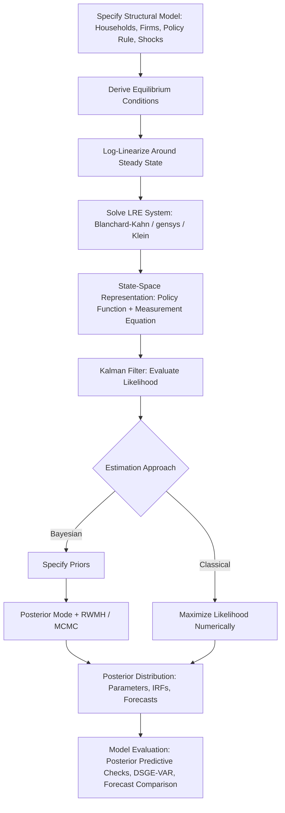

## Dynamic Stochastic General Equilibrium Model Estimation

### Overview

**Key Points**

- DSGE models are structural macroeconomic models built from microeconomic foundations (optimizing households, firms, and policy rules) subject to rational expectations and stochastic shocks
- Estimation typically proceeds by (1) solving the model's equilibrium conditions via linearization, (2) casting the linearized solution as a state-space system, and (3) estimating parameters via maximum likelihood or Bayesian methods using the Kalman filter
- Bayesian estimation (Smets-Wouters 2003, 2007 being the canonical reference models) is the dominant approach in current central bank and academic practice due to its ability to incorporate prior information and handle model misspecification pragmatically

### Model Structure and Micro-Foundations

A typical DSGE model specifies optimization problems for representative (or heterogeneous) agents:

#### Household Problem

$$\max_{\{C_t, N_t\}} E_0 \sum_{t=0}^{\infty} \beta^t \left[\frac{C_t^{1-\sigma}}{1-\sigma} - \frac{N_t^{1+\varphi}}{1+\varphi}\right]$$

subject to a budget constraint, yielding first-order conditions (Euler equation, labor supply condition) that become structural equations of the log-linearized model.

#### Firm Problem and Nominal Rigidities

New Keynesian DSGE models incorporate **Calvo (1983) price-setting**: each period, a firm can reset its price with probability $1-\theta$, generating a forward-looking **New Keynesian Phillips Curve**:

$$\pi_t = \beta E_t[\pi_{t+1}] + \kappa \hat{y}_t^{gap} + u_t$$

where $\kappa$ is a function of the Calvo parameter $\theta$ and other structural parameters.

#### Monetary Policy Rule

Typically a **Taylor-type rule**:

$$\hat{i}_t = \rho_i \hat{i}_{t-1} + (1-\rho_i)\left[\phi_\pi \pi_t + \phi_y \hat{y}_t^{gap}\right] + \varepsilon_t^i$$

#### Exogenous Shock Processes

Structural shocks (technology, preference, monetary policy, markup, etc.) typically follow AR(1) processes:

$$\log A_t = \rho_a \log A_{t-1} + \varepsilon_t^a, \quad \varepsilon_t^a \sim N(0,\sigma_a^2)$$

### Model Solution: Linearization

The full set of equilibrium conditions (Euler equations, market clearing, policy rule, shock processes) forms a system of non-linear rational expectations difference equations. Since this system generally has no closed-form solution, it is **log-linearized** around the deterministic steady state, yielding a linear rational expectations (LRE) system:

$$A E_t[x_{t+1}] = B x_t + C \varepsilon_t$$

where $x_t$ stacks all endogenous variables (in log-deviations from steady state).

#### Solution Methods

- **Blanchard-Kahn (1980) method**: solves the LRE system via eigenvalue decomposition, requiring the number of unstable eigenvalues to equal the number of forward-looking (jump) variables for a unique, stable (determinate) solution
- **Sims' gensys algorithm** (Sims 2002): a generalized QZ-decomposition-based solution method widely implemented in software (Dynare, gensys.m), handling more general LRE system specifications
- **Klein's (2000) method**: an alternative QZ-based solution algorithm, commonly used as the solution engine in packages like Dynare

The resulting solution is a linear **policy function**:

$$x_t = P x_{t-1} + Q \varepsilon_t$$

expressing all endogenous variables as linear functions of the lagged state and current shocks.

**Key Points**

- Higher-order (2nd/3rd order) perturbation methods or global solution methods (projection, value function iteration) are used when linearization is inadequate — e.g., models with binding constraints (zero lower bound), significant precautionary saving motives, or large shocks where non-linearities matter materially
- [Inference] First-order (linear) approximation remains the standard default for estimation due to the tractability it affords for the Kalman filter likelihood evaluation; higher-order approximations require particle filtering, substantially increasing computational cost

### State-Space Representation

The linearized solution $x_t = Px_{t-1} + Q\varepsilon_t$ forms the **state equation**. Since not all model variables are directly observed, a **measurement equation** maps model variables (often demeaned/detrended) to observed data series:

$$Y_t = Z x_t + D + \omega_t$$

where $Y_t$ is the vector of observables (e.g., output growth, inflation, interest rates), $Z$ selects/transforms relevant state variables, and $\omega_t$ is optional measurement error.

### Likelihood Evaluation via the Kalman Filter

Given the linear Gaussian state-space form, the **Kalman filter** recursively computes the one-step-ahead prediction error and its variance, from which the (Gaussian) log-likelihood is evaluated:

$$\log L(\theta) = -\frac{1}{2}\sum_{t=1}^{T}\left[\log|F_t| + v_t' F_t^{-1} v_t + n\log(2\pi)\right]$$

where $v_t$ is the prediction error and $F_t$ its variance, both functions of the deep structural parameters $\theta$ through the solution matrices $P, Q, Z$.

### Bayesian Estimation

#### Prior Specification

Structural parameters $\theta$ (e.g., $\beta, \sigma, \varphi, \theta$ Calvo, $\phi_\pi, \phi_y$, shock persistence and variance parameters) are assigned priors reflecting economic plausibility and calibration/micro-evidence, e.g.:

- $\beta$ (discount factor): tightly centered near 0.99 (Beta distribution) reflecting standard calibration to steady-state real interest rates
- $\theta$ (Calvo price stickiness): Beta distribution centered around 0.65–0.75, informed by micro-price-setting evidence
- Persistence parameters $\rho$: Beta distribution bounded in $(0,1)$
- Standard deviations $\sigma$: Inverse-Gamma distribution (ensuring positivity)

#### Posterior Computation

The posterior kernel combines the likelihood and prior:

$$p(\theta \mid Y) \propto L(\theta \mid Y) \cdot p(\theta)$$

Since the posterior has no closed form, it is approximated via MCMC, typically the **Random Walk Metropolis-Hastings (RWMH)** algorithm:

1. Find the posterior mode via numerical optimization (e.g., quasi-Newton methods) as a starting point
2. Compute the Hessian at the mode to construct a proposal covariance matrix
3. Run a Metropolis-Hastings chain (typically hundreds of thousands of draws across multiple chains) to approximate the posterior distribution
4. Assess convergence via multiple-chain diagnostics (Brooks-Gelman-Rubin statistics)

**Key Points**

- Bayesian estimation is favored over classical MLE in DSGE contexts because informative priors help identify parameters that are weakly identified by the likelihood alone (a common issue in DSGE models, per Canova-Sala 2009), and because priors can encode calibration/micro-evidence not otherwise reflected in aggregate time series
- Software implementations (Dynare being the standard, MATLAB/Julia/Python-based) automate the full linearization-to-posterior-simulation pipeline
- Marginal likelihoods (computed via the Modified Harmonic Mean estimator or Laplace approximation) enable formal Bayesian model comparison across competing DSGE specifications

### Classical (Maximum Likelihood) Estimation

Directly maximizes $\log L(\theta)$ via numerical optimization. Less common in practice than Bayesian estimation because:

- **Weak identification**: many DSGE structural parameters are poorly identified by the likelihood alone, causing MLE to be unstable or produce implausible estimates at boundary values
- **Model misspecification**: DSGE models are deliberately stylized approximations; MLE, lacking priors to regularize estimates, can produce parameter estimates that compensate for misspecification in economically implausible ways
- [Inference] MLE remains used primarily for smaller, more tightly specified models, or as a component of simulated method of moments/indirect inference approaches rather than full-system likelihood estimation

### Identification Issues

**Key Points**

- **Parameter identification** in DSGE models can fail even when the model is theoretically well-posed, due to observational equivalence between different parameter combinations generating similar likelihood surfaces (Canova-Sala 2009; Iskrev 2010)
- Diagnostic tools include analyzing the rank of the Jacobian of the mapping from structural parameters to the reduced-form solution (local identification, Iskrev's method), and examining the shape/flatness of the likelihood or posterior surface
- Weak identification does not necessarily prevent Bayesian estimation from producing a well-defined posterior (since the prior contributes information), but it does mean posterior estimates for weakly identified parameters largely reflect the prior rather than genuine information extracted from the data — an important caveat when interpreting posterior estimates

### Model Evaluation

#### Posterior Predictive Checks

Simulating data from the estimated posterior and comparing model-implied moments (variances, autocorrelations, cross-correlations) to those in actual data assesses whether the model captures key empirical business cycle features.

#### DSGE-VAR Comparison

Del Negro and Schorfheide (2004) propose combining a DSGE model with a VAR by using the DSGE model's implied moments as a prior for an unrestricted VAR (a "DSGE-VAR"), controlled by a hyperparameter governing how tightly the VAR is shrunk toward DSGE-implied dynamics — providing a formal way to assess and correct for DSGE misspecification while retaining some structural interpretation.

#### Forecast Comparison

DSGE model forecasts are commonly benchmarked against BVARs, dynamic factor models, and naive time-series models using out-of-sample RMSFE and log predictive scores; [Inference] medium-scale DSGE models (e.g., Smets-Wouters style) have historically shown competitive, though not uniformly superior, forecasting performance relative to well-specified BVARs.

### Illustrative Example: New Keynesian Phillips Curve Estimation

Consider estimating the slope parameter $\kappa$ in a simple three-equation New Keynesian model via Bayesian methods, with a Beta prior on the underlying Calvo parameter $\theta \sim \text{Beta}(0.66, 0.05)$ (mean 0.66, reflecting average price duration of about 3 quarters). After running RWMH with 250,000 draws (burning the first 50%):

- Posterior mean $\hat{\theta} = 0.71$ with 90% credible interval $[0.63, 0.79]$
- The implied slope $\hat{\kappa}$ is correspondingly small (flatter Phillips curve), consistent with much of the post-2000 empirical New Keynesian literature

**Output**: The relatively tight posterior interval, close to but shifted from the prior mean, indicates the likelihood *does* update the prior meaningfully in this instance — a useful check against the concern that Bayesian DSGE results merely reproduce prior assumptions.

### Diagram: DSGE Estimation Pipeline

### Common Pitfalls and Practical Considerations

- **Stochastic singularity**: the number of observed data series must not exceed the number of structural shocks in the model, or the likelihood becomes degenerate; measurement error or additional shocks are added to match observable dimension
- **Determinacy/indeterminacy**: if the Blanchard-Kahn conditions are violated (wrong number of unstable eigenvalues) at a given parameter draw, no unique stable solution exists; estimation routines must handle or exclude such regions of the parameter space
- **Detrending observables**: DSGE models are typically stationary around a balanced growth path, requiring careful detrending (one-sided HP filter, first differencing, or explicit trend specification) of observed data series to match model concepts — inconsistent detrending across observables and the model is a common source of estimation bias
- **MCMC convergence**: poor mixing, multimodal posteriors, or an inadequate number of draws can produce unreliable posterior inference; multiple independent chains with convergence diagnostics are standard practice, not optional
- **Prior sensitivity**: results for weakly identified parameters can be highly sensitive to prior choice; prior predictive analysis and sensitivity checks (re-estimating under alternative priors) are recommended diagnostic practice

### Conclusion

DSGE model estimation integrates structural macroeconomic theory with formal time-series econometrics: the model's equilibrium conditions are linearized and cast into state-space form, and Bayesian methods combining priors with the Kalman-filter-evaluated likelihood are used to estimate deep structural parameters, generate posterior-based impulse responses, and produce probabilistic forecasts. The framework's chief advantage — structural interpretability of shocks and policy counterfactuals — comes with well-documented identification and misspecification challenges that require careful diagnostic practice.

**Next Steps**

- Medium-scale DSGE models: Smets-Wouters (2007) architecture in detail
- Particle filtering for non-linear/non-Gaussian DSGE estimation (higher-order approximations)
- Zero-lower-bound and occasionally-binding-constraint solution methods (OccBin, piecewise-linear methods)
- DSGE-VAR and other hybrid structural/reduced-form model comparison frameworks
- Identification analysis: Iskrev's rank condition and posterior/prior overlap diagnostics
- Heterogeneous-agent New Keynesian (HANK) model estimation challenges