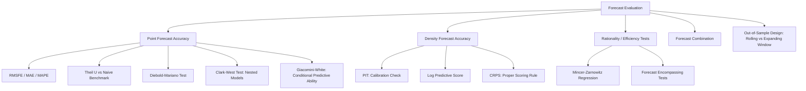

## Forecast Evaluation Criteria

### Overview

**Key Points**

- Forecast evaluation criteria provide the statistical framework for assessing forecast accuracy, comparing competing models, and testing whether forecasts are unbiased and efficient
- Distinguishes point forecast evaluation (loss-function-based accuracy measures) from density/probabilistic forecast evaluation (calibration and sharpness)
- Core econometric tools include accuracy metrics (RMSFE, MAE), formal comparison tests (Diebold-Mariano, Clark-West), and forecast rationality/encompassing tests

### Point Forecast Accuracy Measures

#### Scale-Dependent Measures

**Mean Squared Forecast Error (MSFE)** and its root:

$$MSFE = \frac{1}{H}\sum_{h=1}^{H}(y_{t+h} - \hat{y}_{t+h|t})^2, \quad RMSFE = \sqrt{MSFE}$$

**Mean Absolute Error (MAE)**:

$$MAE = \frac{1}{H}\sum_{h=1}^{H}|y_{t+h}-\hat{y}_{t+h|t}|$$

**Key Points**

- RMSFE penalizes large errors more heavily (quadratic loss), making it sensitive to outlier forecast errors
- MAE is more robust to outliers (linear loss) and is the theoretically appropriate loss-minimizing accuracy measure when the forecaster's true loss function is absolute-error-based rather than squared-error-based
- Both are scale-dependent, meaning they cannot be meaningfully compared across series measured in different units (e.g., comparing GDP growth RMSFE to unemployment rate RMSFE)

#### Scale-Independent (Percentage) Measures

**Mean Absolute Percentage Error (MAPE)**:

$$MAPE = \frac{1}{H}\sum_{h=1}^{H}\left|\frac{y_{t+h}-\hat{y}_{t+h|t}}{y_{t+h}}\right| \times 100$$

**Key Points**

- Enables comparison across series of differing scale/units
- Undefined or explosive when $y_{t+h}$ is at or near zero (a significant limitation for series like interest rate changes or output gaps), and asymmetric in its penalization of over- vs. under-forecasts

#### Relative Accuracy Measures

**Theil's U statistic** compares a model's RMSFE to that of a naive (typically random-walk) benchmark:

$$U = \frac{RMSFE_{\text{model}}}{RMSFE_{\text{naive}}}$$

$U < 1$ indicates the model outperforms the naive benchmark; $U=1$ indicates equivalent performance; $U>1$ indicates the model underperforms a naive forecast.

**Key Points**

- A central benchmarking practice in forecast evaluation: any proposed model should be assessed relative to simple naive benchmarks (random walk, unconditional mean, AR(1)) since a sophisticated model that fails to beat a naive forecast has limited practical value
- Related decomposition (Theil's inequality coefficients) splits forecast error variance into bias, variance, and covariance proportions, diagnosing *why* a model underperforms

### Statistical Tests of Predictive Accuracy

#### Diebold-Mariano (DM) Test

Tests the null hypothesis of **equal predictive accuracy** between two competing forecasts, based on the loss differential:

$$d_t = L(e_{1t}) - L(e_{2t})$$

where $L(\cdot)$ is a loss function (e.g., squared or absolute error) and $e_{it}$ is the forecast error of model $i$. The DM test statistic:

$$DM = \frac{\bar{d}}{\sqrt{\widehat{\text{Var}}(\bar{d})/T}} \xrightarrow{d} N(0,1)$$

where $\widehat{\text{Var}}(\bar{d})$ is a HAC-robust (Newey-West) long-run variance estimator, accounting for the serial correlation in $d_t$ induced by overlapping multi-step-ahead forecast errors.

**Key Points**

- Applicable to both nested and non-nested models, though the test's asymptotic theory was originally derived assuming non-nested model comparisons
- The **Harvey-Leybourne-Newbold (HLN) correction** adjusts the DM statistic for small-sample bias, recommended in applied work with modest forecast evaluation sample sizes

#### Clark-West Test

Addresses a key limitation of the standard DM test when comparing **nested models** (e.g., a restricted AR model vs. an unrestricted model with additional predictors) — under the null that the additional predictors have no explanatory power, the larger model's estimated MSFE is biased upward due to noise from estimating unnecessary parameters, causing the standard DM test to be undersized (too conservative). Clark and West (2007) propose an adjusted statistic:

$$\hat{f}_t = e_{1t}^2 - \left[e_{2t}^2 - (\hat{y}_{1t}-\hat{y}_{2t})^2\right]$$

tested via a standard $t$-test on $\bar{\hat{f}}$, correcting for the parameter estimation noise inherent in nested model comparisons.

#### Giacomini-White (GW) Test

Extends DM-type testing to evaluate **conditional predictive ability**, explicitly accounting for the possibility that forecasting models are re-estimated over a rolling or expanding window (parameter estimation uncertainty is part of the null hypothesis being tested, rather than assumed away), and allows testing whether predictive ability varies conditionally on other variables (e.g., is Model A better specifically during high-volatility periods).

### Forecast Rationality and Efficiency Tests

#### Mincer-Zarnowitz Regression

Tests forecast unbiasedness and efficiency by regressing realized values on the forecast:

$$y_{t+h} = \alpha + \beta \hat{y}_{t+h|t} + u_t$$

Under forecast rationality (unbiasedness), the joint hypothesis $\alpha=0, \beta=1$ should hold, tested via a standard Wald/F-test.

**Key Points**

- Rejection of $\alpha=0$ indicates systematic bias (forecasts consistently too high or too low)
- Rejection of $\beta=1$ indicates the forecast is not appropriately scaled to actual variation (e.g., forecasts are too smooth/muted relative to realized outcomes, a common finding for survey-based forecasts)
- Extended versions include additional information available at the time of forecast (e.g., lagged forecast errors) to test the stronger condition of full information efficiency — rationality requires the forecast error be uncorrelated with any information available at the time the forecast was made

#### Forecast Encompassing Tests

Tests whether one forecast contains all the useful information in a competing forecast, i.e., whether a combination of the two forecasts significantly improves on either forecast alone:

$$y_{t+h} = \lambda \hat{y}_{1,t+h|t} + (1-\lambda)\hat{y}_{2,t+h|t} + \varepsilon_t$$

If $\lambda=1$ cannot be rejected, forecast 1 "encompasses" forecast 2 (forecast 2 adds no incremental information). The **Harvey-Leybourne-Newbold encompassing test** provides a small-sample-robust version of this test based on the regression of the loss differential on the difference between forecasts.

### Density and Probabilistic Forecast Evaluation

#### Probability Integral Transform (PIT)

For density forecasts, the PIT evaluates the cumulative predictive distribution at the realized outcome:

$$z_t = F_t(y_t)$$

Under correct calibration, $z_t$ should be distributed uniform $(0,1)$ i.i.d. across the forecast sample. Departures are diagnosed via histograms of $z_t$ (testing uniformity, e.g., via a Kolmogorov-Smirnov or chi-squared test) and via testing serial independence of $z_t$ (autocorrelation of the PIT sequence indicates the density forecasts fail to fully capture time-varying uncertainty).

#### Log Predictive Score

Evaluates the predictive density's log-likelihood at the realized outcome:

$$LPS_t = \log f_t(y_t)$$

averaged across the evaluation sample. Higher (less negative) average log scores indicate better density forecast performance; this is the standard metric for comparing Bayesian/probabilistic forecasting models (e.g., BVAR vs. DSGE density forecast comparison).

#### Continuous Ranked Probability Score (CRPS)

A proper scoring rule that generalizes MAE to the full predictive distribution:

$$CRPS(F_t, y_t) = \int_{-\infty}^{\infty}\left[F_t(x) - \mathbb{1}\{x \geq y_t\}\right]^2 dx$$

**Key Points**

- CRPS reduces to MAE when the forecast is a point mass (degenerate distribution), providing continuity with point-forecast evaluation
- Considered a **proper scoring rule**, meaning a forecaster cannot improve their expected score by reporting anything other than their true predictive distribution — an important theoretical property not shared by all evaluation metrics

### Forecast Combination

**Key Points**

- The empirical "forecast combination puzzle" (Bates-Granger 1969; Stock-Watson 2004) is the robust finding that simple equal-weighted averages of multiple forecasts frequently outperform both individual constituent forecasts and more sophisticated optimally-weighted combination schemes out-of-sample
- Optimal combination weights (minimizing combined MSFE) can be estimated via regression, but their instability due to estimation error in small samples is the standard explanation offered for the puzzle's persistence
- [Inference] This finding has motivated widespread practical reliance on simple-average forecast combinations (e.g., across professional forecaster surveys, central bank staff and market-based forecasts) despite the theoretical availability of more sophisticated weighting schemes

### Out-of-Sample Evaluation Design

#### Rolling vs. Expanding Windows

- **Rolling window**: re-estimates the model on a fixed-length window that moves forward through the sample, discarding the oldest observation each period — better suited to capturing structural change/parameter instability
- **Expanding window**: re-estimates using all available data up to each forecast origin, growing the estimation sample over time — more efficient (uses all available data) but slower to adapt to structural breaks

#### Data Snooping and the West (1996) Framework

When forecast evaluation involves estimated parameters (as in virtually all applied forecast comparisons), standard test statistics must account for the additional variance contributed by parameter estimation uncertainty; West (1996) provides the general asymptotic theory extending earlier results (which assumed known parameters) to the empirically relevant case of estimated model parameters feeding into the forecast comparison.

### Illustrative Example: Diebold-Mariano Test Application

Comparing a BVAR forecast and a random-walk benchmark for quarterly inflation, 40 out-of-sample forecast periods, squared-error loss:

$$\bar{d} = \overline{e_{RW,t}^2 - e_{BVAR,t}^2} = 0.15, \quad \widehat{\text{Var}}(\bar{d})/T = (0.06)^2$$

$$DM = \frac{0.15}{0.06} = 2.5$$

**Output**: With $|DM| = 2.5 > 1.96$, the null of equal predictive accuracy is rejected at the 5% level; since $\bar{d} > 0$, the BVAR forecast has significantly lower squared forecast error than the random-walk benchmark over this evaluation sample.

### Diagram: Forecast Evaluation Framework

### Common Pitfalls and Practical Considerations

- **Nested model comparisons using standard DM**: applying the unadjusted DM test to nested models under-rejects the null due to parameter estimation noise in the larger model; Clark-West correction should be used instead
- **Overlapping multi-step forecast errors**: at horizons $h>1$, forecast errors are serially correlated by construction (MA($h-1$) structure), requiring HAC-robust variance estimation in any test statistic — using simple (non-robust) standard errors overstates significance
- **Small evaluation samples**: forecast evaluation windows in macroeconomics are often short (a few business cycles at most), giving low power to distinguish competing models; results can be highly sensitive to the specific evaluation period chosen (e.g., including or excluding a recession)
- **Data snooping across many models**: testing many candidate forecasting models against a benchmark and reporting only the best performer inflates the effective Type I error rate; White's Reality Check or Hansen's Superior Predictive Ability (SPA) test correct inference for such search procedures
- **Real-time vs. final-revised data**: forecast evaluation using final-revised data can overstate true real-time forecasting performance, since real-time forecasters did not have access to subsequently revised data

### Conclusion

Forecast evaluation combines simple descriptive accuracy measures (RMSFE, MAE, Theil's U) with formal statistical tests (Diebold-Mariano, Clark-West, Giacomini-White) for comparing competing models, and rationality/encompassing tests for assessing whether a forecast efficiently uses all available information. As practitioners increasingly report full predictive distributions rather than point forecasts, calibration-based measures (PIT, log predictive score, CRPS) have become standard complements to point-forecast accuracy metrics, with careful attention to parameter estimation uncertainty and multiple-testing concerns required for valid inference throughout.

**Next Steps**

- Forecast combination methods: equal-weighting, Bayesian model averaging, and the combination puzzle
- Real-time data and vintage-based forecast evaluation (ALFRED datasets)
- Density forecast calibration in DSGE and BVAR model comparison
- White's Reality Check and Hansen's SPA test for data-snooping-robust model selection
- Nowcasting evaluation methods for mixed-frequency and high-dimensional data
- Machine learning forecast evaluation: cross-validation adaptations for time series