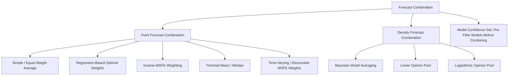

## Combining and Averaging Forecasts

### Overview

**Key Points**

- Forecast combination pools multiple individual forecasts into a single composite forecast, typically outperforming any single constituent model in out-of-sample accuracy
- Motivated by the idea that different models capture different, partially non-overlapping aspects of the data-generating process, and combination diversifies away model-specific error
- The empirical "forecast combination puzzle" — that simple equal-weight averages often beat sophisticated optimal-weighting schemes — is one of the most robust findings in applied forecasting

### Theoretical Foundation

#### Bates-Granger (1969) Framework

The foundational result: given two unbiased forecasts $\hat{y}_{1t}$ and $\hat{y}_{2t}$ with error variances $\sigma_1^2, \sigma_2^2$ and error correlation $\rho$, the variance-minimizing linear combination:

$$\hat{y}_{ct} = w\hat{y}_{1t} + (1-w)\hat{y}_{2t}$$

has optimal weight:

$$w^* = \frac{\sigma_2^2 - \rho\sigma_1\sigma_2}{\sigma_1^2+\sigma_2^2-2\rho\sigma_1\sigma_2}$$

**Key Points**

- If forecast errors are imperfectly correlated ($\rho<1$), the combined forecast has strictly lower variance than either individual forecast (a direct application of portfolio diversification logic to forecasting)
- The combination's variance-reduction benefit is largest when errors are uncorrelated or negatively correlated, and smallest (vanishing) when $\rho \to 1$

### Combination Weighting Schemes

#### Simple Average

$$\hat{y}_{ct} = \frac{1}{N}\sum_{i=1}^{N} \hat{y}_{it}$$

**Key Points**

- Requires no estimation of weights, hence no estimation error in the weighting scheme itself
- Despite (or because of) its simplicity, empirically difficult to beat consistently out-of-sample — this is the core empirical regularity behind the "forecast combination puzzle" (Stock-Watson 2004; Genre et al. 2013 using Survey of Professional Forecasters data)

#### Optimal (Regression-Based) Weights

Estimate weights by regressing the realized outcome on the set of individual forecasts:

$$y_t = w_0 + \sum_{i=1}^{N} w_i \hat{y}_{it} + \varepsilon_t$$

with weights estimated via OLS (or restricted OLS imposing $\sum w_i = 1$, $w_0=0$ under the constraint that combination weights should sum to one for unbiasedness given unbiased constituent forecasts).

**Key Points**

- In finite samples, estimation error in the weights themselves is often large enough to offset the theoretical variance-reduction benefit of "optimal" weighting, especially with many correlated forecasts (near-multicollinearity among constituent forecasts) — the leading explanation for why simple averages often dominate in practice
- Constrained versions (non-negativity constraints $w_i \geq 0$, or constraining weights to sum to one) can improve out-of-sample stability relative to unconstrained OLS weighting

#### Inverse-MSFE Weighting

Weights each forecast inversely proportional to its historical out-of-sample forecast error variance:

$$w_i = \frac{1/MSFE_i}{\sum_{j=1}^{N} 1/MSFE_j}$$

A simpler, more robust alternative to full regression-based optimal weighting, requiring only historical accuracy tracking (not a joint regression), while still adapting weights to relative past performance.

#### Trimmed and Median Combinations

- **Trimmed mean**: discards the highest and lowest forecasts before averaging, reducing sensitivity to outlier/poorly performing individual forecasts
- **Median combination**: uses the cross-sectional median forecast rather than the mean, providing robustness against extreme individual forecasts (particularly relevant when combining large panels of forecasters, e.g., professional forecaster surveys)

### Bayesian Model Averaging (BMA)

Rather than combining point forecasts directly, BMA combines full predictive densities across a set of $K$ candidate models, weighted by posterior model probabilities:

$$p(y_{t+h}\mid \text{data}) = \sum_{k=1}^{K} p(y_{t+h}\mid M_k, \text{data}) \cdot P(M_k \mid \text{data})$$

where the posterior model probability is proportional to the model's marginal likelihood times its prior probability:

$$P(M_k \mid \text{data}) \propto p(\text{data}\mid M_k) \cdot P(M_k)$$

**Key Points**

- BMA formally accounts for model uncertainty within a coherent Bayesian framework, in contrast to frequentist combination methods that treat model selection/weighting as separate from parameter uncertainty within each model
- Marginal likelihood computation (e.g., via the Laplace approximation, bridge sampling, or the Modified Harmonic Mean estimator) can be computationally demanding for complex models (e.g., DSGE or large VAR model averaging), motivating simpler approximations like BIC-based weights
- BIC-based approximate BMA weights: $w_k \propto \exp(-\tfrac{1}{2}\Delta BIC_k)$, avoiding full marginal likelihood computation

### Dynamic and Time-Varying Combination Weights

#### Time-Varying Weights via Discounted MSFE

Weights are updated recursively giving more weight to recent forecast performance, discounting older observations:

$$MSFE_{i,t} = \delta \cdot MSFE_{i,t-1} + (1-\delta)e_{i,t}^2$$

where $\delta \in (0,1)$ is a discount factor (closer to 1 implies slower-adapting weights). This allows the combination to adapt to time variation in which model performs best (e.g., during recessions vs. expansions).

#### Regime-Switching and Model Confidence Combination

Weights can be made explicitly state-dependent, e.g., via a Markov-switching framework where different models receive higher weight in different macroeconomic regimes, or based on the **Model Confidence Set (MCS)** procedure (Hansen, Lunde, Nason 2011), which statistically identifies the subset of models whose predictive accuracy is not significantly worse than the best-performing model, and combines only within that surviving set.

### Density Forecast Combination

#### Linear Opinion Pool

Combines individual predictive densities via a weighted linear mixture:

$$f_c(y) = \sum_{i=1}^{N} w_i f_i(y)$$

**Key Points**

- The linear pool is generally **overdispersed relative to any single constituent density** when the individual point forecasts disagree, since it captures both within-model uncertainty and across-model disagreement — often a desirable property reflecting genuine forecaster disagreement as a component of total uncertainty
- Weights can be optimized to maximize the average log predictive score (log-score combination) over a training/evaluation sample, analogous to optimal weighting for point forecasts

#### Logarithmic Opinion Pool

An alternative to the linear pool using a geometric (multiplicative) combination:

$$f_c(y) \propto \prod_{i=1}^{N} f_i(y)^{w_i}$$

Tends to produce a combined density that is *less* dispersed than the linear pool, since it reinforces agreement across models rather than simply averaging their spread — appropriate when models are seen as providing complementary partial information about a shared truth rather than genuinely divergent views.

### Forecast Encompassing as a Pre-Combination Test

Before combining, forecast encompassing tests (see Harvey-Leybourne-Newbold test) can establish whether one forecast already subsumes the information in another; if forecast 1 fully encompasses forecast 2, combination offers no benefit over using forecast 1 alone. In practice, formal encompassing rejections are common even when combination still improves accuracy, since encompassing tests have relatively low power and combination benefits can arise from variance reduction even without literal informational encompassing failure.

### Illustrative Example: Combining Two GDP Growth Forecasts

Two forecasts of quarterly GDP growth: a BVAR forecast ($\sigma_1^2 = 0.25$) and a DSGE forecast ($\sigma_2^2 = 0.36$), with forecast error correlation $\rho = 0.3$.

$$w^* = \frac{0.36 - 0.3\sqrt{0.25}\sqrt{0.36}}{0.25+0.36-2(0.3)\sqrt{0.25}\sqrt{0.36}} = \frac{0.36-0.09}{0.61-0.18} = \frac{0.27}{0.43} \approx 0.63$$

**Output**: The optimal combination places approximately 63% weight on the BVAR forecast and 37% on the DSGE forecast, reflecting the BVAR's lower individual error variance; the combined forecast's variance, $\text{Var}(\hat{y}_c) \approx 0.19$, is lower than either individual forecast's variance (0.25 and 0.36 respectively) — illustrating the diversification benefit even with positively correlated errors.

### Diagram: Forecast Combination Approaches

### Common Pitfalls and Practical Considerations

- **Overfitting combination weights**: estimating regression-based optimal weights on a short evaluation sample introduces estimation error that can exceed the theoretical benefit of optimal (vs. equal) weighting — this is the leading explanation for the combination puzzle, not a rejection of the underlying diversification theory
- **Multicollinearity among forecasts**: when constituent forecasts are highly correlated (common when models share similar underlying data/methodology), regression-based weight estimation becomes unstable; simple averaging or shrinkage-based weighting is more robust in this setting
- **Ignoring correlation structure**: naive equal-weighting is theoretically suboptimal when forecast errors are strongly correlated across a subset of models (e.g., several models all derived from similar VAR specifications) — clustering similar models before combining, or using shrinkage-based correlation-aware weights, can help
- **Density combination overdispersion**: linear opinion pools can become excessively wide (overdispersed) when combining many models with substantial disagreement, potentially producing miscalibrated (too-wide) prediction intervals if not validated against actual coverage rates (PIT diagnostics)
- **Survivorship in forecaster panels**: combining forecasts from panels of professional forecasters (e.g., Survey of Professional Forecasters) can be affected by changing panel composition over time, complicating consistent historical weight estimation

### Conclusion

Forecast combination consistently improves out-of-sample accuracy relative to individual constituent models by diversifying model-specific error, with the robust empirical finding that simple equal-weighted averages are difficult to outperform once weight estimation error is accounted for. Bayesian Model Averaging and density combination methods (linear/logarithmic opinion pools) extend the combination principle to full predictive distributions, providing a coherent framework for incorporating both within-model and across-model uncertainty in probabilistic forecasting.

**Next Steps**

- Bayesian Model Averaging computational methods: marginal likelihood approximation techniques
- Model Confidence Set procedure (Hansen-Lunde-Nason) for model selection prior to combination
- Density forecast calibration and the linear vs. logarithmic opinion pool dispersion tradeoff
- Time-varying combination weights via Markov-switching and discounted MSFE schemes
- Survey of Professional Forecasters and other forecaster panel data applications
- Machine learning ensemble methods (stacking, boosting) as generalizations of forecast combination