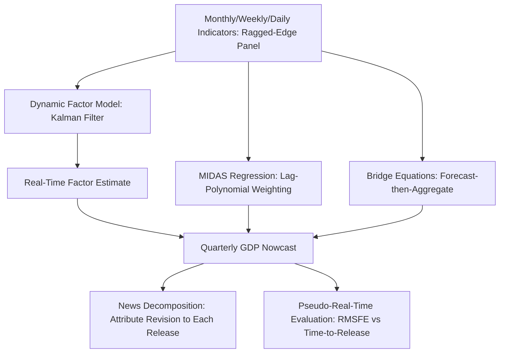

## Nowcasting Methods

### Overview

**Key Points**

- Nowcasting produces early estimates of the current or very recent state of the economy (e.g., current-quarter GDP growth) before official statistics are released, exploiting the differing publication lags and frequencies of available indicators
- The core econometric challenge is a **mixed-frequency, unbalanced panel (ragged-edge) problem**: high-frequency indicators (monthly, weekly, daily) must be combined with a low-frequency target (typically quarterly GDP), and different series are released on different days each month, creating a "jagged" data availability pattern
- Dominant methodological families are dynamic factor models (DFM) estimated via the Kalman filter, and MIDAS (Mixed Data Sampling) regressions

### The Ragged-Edge Problem

At any given point within a quarter, some monthly indicators (e.g., employment) may already have two or three monthly releases available, while others (e.g., some survey or trade data) may only have one, and others not yet released at all. This creates a dataset where the most recent rows are systematically incomplete ("ragged edge"), with the degree of raggedness itself informative about how "early" in the nowcasting window the estimate is being made.

**Key Points**

- Traditional balanced-panel time series methods (standard VAR, standard factor models) cannot directly handle this pattern without discarding recently released but incomplete data
- Nowcasting models must be explicitly designed to update sequentially as new data arrives asynchronously throughout the quarter, revising the current-quarter estimate with each new release

### Dynamic Factor Model (DFM) Approach

#### Model Specification

Following Giannone, Reichlin, and Small (2008) and Doz, Giannone, and Reichlin (2011, 2012), a large panel of $N$ monthly indicators $x_{it}$ is modeled as driven by a small number of common latent factors $f_t$:

$$x_{it} = \lambda_i' f_t + e_{it}$$

$$f_t = A_1 f_{t-1} + \dots + A_p f_{t-p} + u_t, \quad u_t \sim N(0, Q)$$

where $e_{it}$ follows an idiosyncratic AR process, and the target variable (e.g., quarterly GDP growth) is linked to the same underlying monthly factor structure via an aggregation/measurement equation.

#### Mixed-Frequency Aggregation

Since GDP is observed quarterly but the factor is estimated at monthly frequency, a standard approach treats quarterly GDP growth as a (approximately log-linear) function of the *unobserved monthly* GDP growth rate, aggregated according to a fixed weighting scheme (e.g., the Mariano-Murasawa 1-2-3-2-1 weighting approximation for growth rates), which is embedded directly into the state-space measurement equation.

#### State-Space Representation and the Kalman Filter

The full mixed-frequency, ragged-edge system is cast in **state-space form**, with missing (not-yet-released) observations handled naturally by the Kalman filter, which simply skips the update step for missing observations at a given date without requiring the panel to be balanced:

$$x_t = \Lambda f_t + e_t, \quad f_t = A(L) f_{t-1} + u_t$$

The Kalman filter and smoother provide:

1. **Filtered/updated factor estimates** as each new data release arrives
2. **A nowcast of GDP** as the model-implied projection of the (partially unobserved) quarterly aggregate, updated in real time
3. A natural decomposition of forecast revisions into contributions from each individual data release (the "news" decomposition, below)

**Key Points**

- Because the factor model is estimated via the Kalman filter/EM algorithm (Doz-Giannone-Reichlin two-step and quasi-maximum-likelihood estimators), it scales to large panels (50–100+ monthly indicators) without the estimation difficulties a fully-specified large VAR would face
- The nowcast updates continuously and asynchronously — a genuinely new nowcast can be produced after every single new data release, not just once per quarter or month

### News Decomposition

A defining and highly used feature of DFM nowcasting frameworks (Banbura-Modugno 2014) is the ability to decompose the *change* in the GDP nowcast between two dates into contributions attributable to each specific data release ("news") that arrived in between:

$$\text{Nowcast Revision} = \sum_{i} (\text{weight}_i) \times (\text{actual}_i - \text{expected}_i)$$

where $\text{expected}_i$ is the value the model would have predicted for indicator $i$ prior to its release, and the weight reflects that indicator's factor loading and the Kalman gain at the time of release.

**Key Points**

- This decomposition is central to central bank nowcasting communication (e.g., the New York Fed Staff Nowcast, the Atlanta Fed's GDPNow uses a related but distinct bridge-equation approach, the Cleveland Fed and ECB nowcasting models) — it allows analysts to explain *why* the nowcast moved, attributing the revision to specific released indicators (e.g., "the upward revision reflects stronger-than-expected retail sales data")
- Provides a rigorous, model-consistent way to communicate real-time forecast updates to policymakers and the public, rather than an ad hoc narrative

### MIDAS (Mixed Data Sampling) Regression

An alternative to the DFM approach, proposed by Ghysels, Santa-Clara, and Valkanov (2004, 2007), directly regresses the low-frequency target on lags/leads of a high-frequency regressor without first aggregating it to the same frequency:

$$y_t^Q = \beta_0 + \beta_1 B(L^{1/m};\theta) x_t^M + \varepsilon_t$$

where $m$ is the frequency ratio (e.g., $m=3$ for quarterly-monthly), and $B(L^{1/m};\theta)$ is a parsimonious lag-polynomial weighting function (commonly the **Almon polynomial** or **exponential Almon** specification) parameterized by a small number of hyperparameters $\theta$, avoiding the proliferation of parameters that unrestricted mixed-frequency regression would require.

**Key Points**

- MIDAS is more parsimonious and easier to estimate than a full DFM for single-indicator or few-indicator nowcasting applications, but does not scale as naturally to large panels of indicators (each additional regressor requires its own lag polynomial)
- **U-MIDAS** (unrestricted MIDAS, Foroni-Marcellino-Schumacher 2015) drops the polynomial weighting restriction when the frequency mismatch is small (e.g., quarterly-monthly, $m=3$), instead including each high-frequency lag as an unrestricted regressor, which performs comparably to restricted MIDAS at low $m$
- **MIDAS with many predictors** (MIDAS combined with factor extraction, or partial least squares) extends the framework to larger indicator sets while retaining the direct mixed-frequency regression structure

### Bridge Equations

A simpler, older approach: monthly indicators are first forecast forward (using univariate ARIMA or similar) to fill in missing end-of-quarter observations, then aggregated to quarterly frequency, and finally regressed on quarterly GDP via a simple linear "bridge" equation:

$$y_t^Q = \beta_0 + \beta_1 \bar{x}_t^Q + \varepsilon_t$$

where $\bar{x}_t^Q$ is the (partially forecast, partially actual) quarterly-aggregated indicator. [Inference] Bridge equations remain in practical use (e.g., as a component of the Atlanta Fed's GDPNow methodology, which aggregates bridge-equation-based forecasts of GDP subcomponents) due to their transparency and ease of interpretation, despite being less statistically sophisticated than DFM or MIDAS approaches.

### Machine Learning and Alternative Data in Nowcasting

**Key Points**

- Recent nowcasting research incorporates non-traditional, high-frequency "alternative data" sources: credit card transaction data, satellite imagery, Google search trends, mobility data, and social media sentiment, particularly valuable during rapidly evolving conditions (e.g., the COVID-19 pandemic) where traditional monthly indicators lagged too far behind real-time developments
- Machine learning methods (LASSO/elastic net for variable selection among very large alternative-data panels, random forests, and neural network approaches) have been applied to nowcasting, generally as a complement to rather than wholesale replacement of factor-model approaches, given the latter's transparency and interpretability advantages for policy communication
- [Unverified] Whether ML-based nowcasting methods deliver systematically superior accuracy over well-specified DFM/MIDAS benchmarks remains an active area of research, with results appearing to depend heavily on the specific application, forecast horizon, and evaluation period studied

### Evaluation of Nowcasting Models

Nowcasting model accuracy is evaluated using the same general point/density forecast evaluation tools discussed elsewhere (RMSFE, Diebold-Mariano tests, log predictive scores), but with an important real-time dimension:

- **Pseudo-real-time evaluation**: re-creating the exact ragged-edge data availability pattern that would have existed historically at each nowcast date, using real-time (as-first-released, not later-revised) vintages of each indicator
- **Nowcast accuracy improvement over the quarter**: a standard diagnostic tracks RMSFE as a function of how many days/weeks into the quarter (or how many data releases) have occurred, documenting the expected pattern that nowcast accuracy improves monotonically as more information arrives

### Illustrative Example: Nowcast Revision from a News Release

Suppose the DFM-based GDP growth nowcast stands at 2.1% (annualized) before a monthly employment report is released. The model's own real-time prediction for that employment report was +150,000 jobs; the actual released figure is +220,000 (a positive surprise of +70,000).

Given the employment indicator's estimated factor loading and Kalman gain, this surprise contributes a nowcast revision:

$$\Delta \hat{y}_t^{GDP} = \text{weight}_{\text{emp}} \times 70{,}000 = 0.15 \text{ pp (illustrative)}$$

**Output**: The updated GDP nowcast moves from 2.1% to 2.25%, with the news decomposition attributing the entire +0.15 percentage point revision specifically to the stronger-than-expected employment report — a transparent, model-based account of the update rather than a qualitative narrative.

### Diagram: Nowcasting Data Flow and Model Architecture

### Common Pitfalls and Practical Considerations

- **Real-time vintage data requirements**: proper nowcasting model evaluation requires real-time vintage datasets (capturing what was actually known/published at each historical date, before subsequent revisions) — using final-revised data for backtesting overstates achievable real-time accuracy
- **Factor number selection**: too few factors in a DFM omits relevant common variation; too many risks overfitting and unstable real-time estimates; information criteria (Bai-Ng) adapted for approximate factor models guide this choice, though [Inference] practitioners often also rely on out-of-sample nowcast performance to validate the chosen factor number
- **Indicator selection and panel composition changes**: adding or removing indicators from a large DFM panel changes the estimated factor space, complicating consistent historical nowcast comparisons; panel composition should generally be held fixed within an evaluation exercise
- **Structural breaks (e.g., COVID-19 shock)**: extreme outlier observations during crisis periods can distort factor loadings and idiosyncratic variance estimates for models estimated over a window including the outlier; robust estimation methods (outlier-adjustment, time-varying idiosyncratic variances) are used to address this
- **Overreliance on a single indicator's "news"**: a nowcast revision attributed heavily to one volatile indicator can create a false sense of precision; presenting the full news decomposition alongside historical revision volatility is standard practice to contextualize a given update

### Conclusion

Nowcasting methods bridge the gap between the low frequency and substantial publication lag of headline macroeconomic aggregates (like GDP) and the higher-frequency, more timely indicators available throughout a quarter. Dynamic factor models estimated via the Kalman filter provide the dominant, most scalable framework, offering both real-time updating and an interpretable news decomposition, while MIDAS regressions and bridge equations remain valuable, more parsimonious alternatives, particularly for smaller indicator sets or applications prioritizing model transparency.

**Next Steps**

- Dynamic factor model estimation details: EM algorithm and quasi-maximum-likelihood approaches (Doz-Giannone-Reichlin)
- MIDAS regression variants: exponential Almon, U-MIDAS, and MIDAS with machine learning variable selection
- Real-time data vintages and the ALFRED/real-time database infrastructure
- Central bank nowcasting model architectures (NY Fed Staff Nowcast, Atlanta Fed GDPNow, ECB nowcasting)
- Alternative/big data sources in macroeconomic nowcasting (credit card, mobility, satellite data)
- Factor number selection and structural break robustness in large approximate factor models