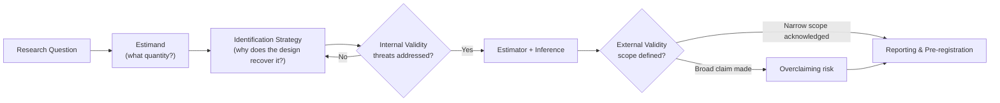
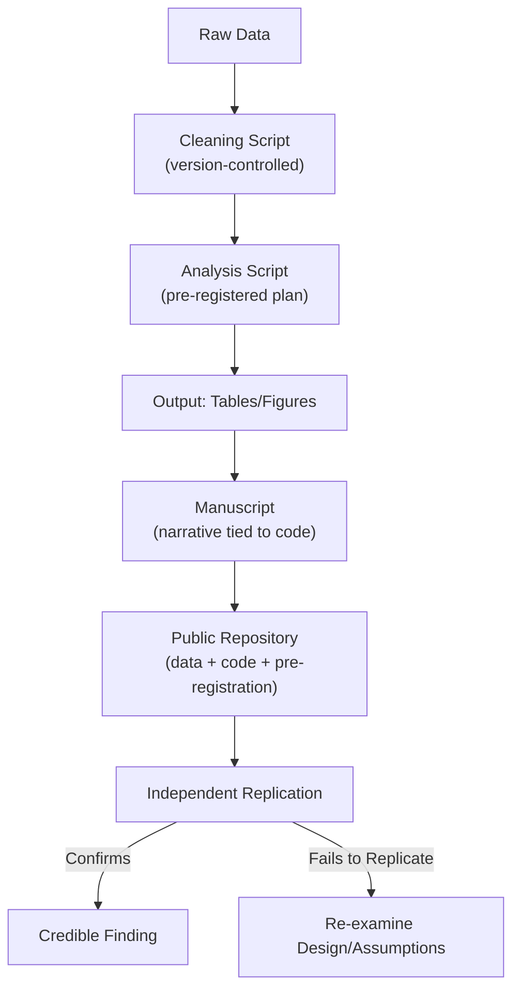

## Designing Credible Empirical Research

### Overview

Credible empirical research produces conclusions that would survive replication, scrutiny by adversarial reviewers, and confrontation with new data. Credibility is not a single property but an accumulation of design choices made *before* data collection: a well-specified research question, a design that isolates the causal or descriptive quantity of interest, pre-specified analysis choices, and transparent reporting that allows others to evaluate and reproduce the work. This chapter treats credibility as an engineering problem — a set of design decisions, each with known failure modes, that can be audited systematically.

### The Credibility Crisis: Motivation

**Key Points**

- The "replication crisis," most visibly documented in psychology (Open Science Collaboration, 2015, found roughly 36–39% of studies replicated) and later in economics (Camerer et al., 2016, 2018), revealed that a substantial share of published empirical findings do not hold up under direct replication.
- Contributing mechanisms include publication bias (statistically significant results are more publishable), $p$-hacking (searching over specifications until $p < 0.05$), HARKing (Hypothesizing After Results are Known), and underpowered designs that inflate both false positive rates and effect-size exaggeration (the "winner's curse").
- [Inference] The magnitude of the crisis varies substantially by subfield; the appropriate response (pre-registration, larger samples, replication funding) is still debated among methodologists, and this section presents this as the consensus motivation rather than an uncontested empirical claim.

### Anatomy of a Credible Research Design

A complete design specifies five components *before* any data are examined:

1. **Research question** — precise enough that two independent researchers would agree on what would count as an answer.
2. **Estimand** — the exact quantity being estimated (e.g., the Average Treatment Effect on the Treated, a conditional correlation, a population proportion), stated independently of the estimator that will recover it.
3. **Identification strategy** — the argument for why the data-generating process permits recovery of the estimand (random assignment, a natural experiment, an instrument, a discontinuity, etc.).
4. **Estimator and inference procedure** — the specific statistical method and how uncertainty will be quantified.
5. **Falsification/validation plan** — pre-specified checks (placebo tests, robustness checks, power analysis) that could, in principle, contradict the hypothesis.

A useful discipline is to separate the **estimand** from the **estimate**: Lundberg, Johnson, and Stewart (2021, *American Sociological Review*) argue that much confusion in applied work stems from never writing the estimand down explicitly, so the same regression coefficient is silently reinterpreted as a causal effect, a predictive quantity, or a descriptive association depending on the discussion section.

### Estimands: What Are You Actually Estimating?

**Key Points**

- Common estimand families: Average Treatment Effect (ATE), Average Treatment Effect on the Treated (ATT), Local Average Treatment Effect (LATE), Conditional Average Treatment Effect (CATE), and purely descriptive/predictive estimands (a population mean, a forecast).
- Different estimators recover different estimands under different assumptions; using an estimator without first fixing the estimand risks a mismatch known as an **internal validity–estimand gap**.

$$\text{ATE} = E[Y_i(1) - Y_i(0)]$$

where $Y_i(1)$ and $Y_i(0)$ are the potential outcomes for unit $i$ under treatment and control respectively (the Neyman–Rubin potential outcomes framework). Because a unit is never observed in both states simultaneously, this is the **Fundamental Problem of Causal Inference**, and every identification strategy is a distinct argument for approximating this counterfactual.

**Example**

A study asks "does a conditional cash transfer program increase school enrollment?" This is not yet an estimand. It becomes one only once specified further, e.g.: "the ATT of program eligibility on enrollment probability among households below the poverty line in Region X in the year following rollout." That specificity forces the analyst to confront which comparison group, which population, and which time horizon are actually being used.

### Internal vs. External Validity

**Key Points**

- **Internal validity**: the degree to which the design correctly identifies the causal effect (or descriptive quantity) *within the sample studied*. Threats: confounding, selection, measurement error, reverse causality, simultaneity.
- **External validity**: the degree to which findings generalize to other populations, settings, or time periods. Threats: non-representative samples, context-dependent mechanisms, Hawthorne/experimenter effects, general-equilibrium effects that vanish at scale.
- These two properties trade off in practice: highly controlled lab or field experiments often maximize internal validity at the cost of external validity, while large observational datasets may offer broader coverage but weaker identification.
- [Inference] There is no universal rule for weighting internal against external validity; the appropriate balance is a judgment call that depends on the policy or theoretical question motivating the study.

### Threats to Internal Validity: A Taxonomy

1. **Confounding** — an omitted variable affects both treatment and outcome. Formally, in a regression $Y_i = \beta X_i + \gamma Z_i + \varepsilon_i$, omitting $Z_i$ when $\text{Cov}(X_i, Z_i) \neq 0$ biases $\hat{\beta}$ by $\gamma \cdot \dfrac{\text{Cov}(X_i, Z_i)}{\text{Var}(X_i)}$ (omitted variable bias formula).
2. **Selection bias** — units select into treatment or into the sample based on factors correlated with the outcome (e.g., survivorship bias, self-selection into programs).
3. **Reverse causality / simultaneity** — $Y$ causes $X$ as well as, or instead of, $X$ causing $Y$ (e.g., does police presence reduce crime, or does crime attract police presence?).
4. **Measurement error** — classical (random) measurement error in a regressor biases coefficients toward zero (attenuation bias); measurement error in the outcome inflates standard errors but does not bias point estimates under classical assumptions; non-classical error can bias in either direction.
5. **Post-treatment bias / bad controls** — conditioning on a variable that is itself an outcome of treatment blocks part of the causal pathway or opens a collider path.
6. **Attrition/differential dropout** — units leave the sample non-randomly, correlated with treatment and outcome.

### Identification Strategies

**Key Points** — the standard toolkit, roughly ordered from strongest to weakest identifying assumptions:

- **Randomized Controlled Trials (RCTs)**: random assignment ensures $\{Y_i(1), Y_i(0)\} \perp X_i$ by construction, so simple difference-in-means is unbiased for the ATE. Threats remain: non-compliance, attrition, spillovers (SUTVA violations), Hawthorne effects.
- **Instrumental Variables (IV)**: requires an instrument $Z$ that affects $X$ (relevance), affects $Y$ only through $X$ (exclusion restriction), and is as-good-as-randomly assigned (independence). Recovers the LATE for compliers under monotonicity (Imbens & Angrist, 1994).
- **Regression Discontinuity (RD)**: exploits a known threshold rule for treatment assignment; identifies the LATE at the cutoff under continuity of potential outcomes.
- **Difference-in-Differences (DiD)**: compares changes over time between treated and untreated groups; identification requires the parallel trends assumption. Recent econometric work (Goodman-Bacon, 2021; Callaway & Sant'Anna, 2021; Sun & Abraham, 2021) shows classical two-way fixed effects DiD can be badly biased under staggered treatment timing and heterogeneous treatment effects.
- **Matching / Propensity Score methods**: assume selection on observables (conditional ignorability); cannot address unobserved confounding.
- **Synthetic Control**: constructs a weighted combination of untreated units to approximate a counterfactual for a single treated unit (Abadie, Diamond & Hainmueller, 2010); useful for comparative case studies with one treated unit and a long pre-period.
- **Structural / model-based identification**: imposes an economic or behavioral model to identify parameters not identifiable from reduced-form variation alone; identification is conditional on model correctness. [Inference] The credibility of structural estimates is more contested than design-based methods because it depends on auxiliary modeling assumptions that are harder to test directly.

**Example**

To estimate the effect of a minimum-wage increase on employment, a DiD design compares employment changes in a state that raised its minimum wage against a neighboring state that did not (Card & Krueger, 1994). The identifying assumption — parallel trends absent the policy — is inherently untestable in the post-period and is typically supported only indirectly via pre-trend checks.

### Statistical Power and Sample Size

**Key Points**

- Power ($1 - \beta$) is the probability of correctly rejecting a false null hypothesis. Underpowered studies not only miss true effects but, conditional on reaching significance, systematically overestimate effect sizes (Type M/"magnitude" error) and can even get the sign wrong (Type S error) — Gelman & Carlin (2014).
- For a two-sample mean comparison, the required sample size per group is approximately:

$$n = \frac{2\sigma^2 (z_{1-\alpha/2} + z_{1-\beta})^2}{\delta^2}$$

where $\sigma^2$ is the outcome variance, $\delta$ is the minimum detectable effect, $z_{1-\alpha/2}$ and $z_{1-\beta}$ are standard normal quantiles for the chosen significance level and power.

- Power analysis should be conducted *ex ante*, using the smallest effect size that would be theoretically or practically meaningful, not the effect size the researcher hopes to find.
- Clustered designs (e.g., randomization at the village or classroom level) require inflating the sample-size formula by the **design effect**, $1 + (m-1)\rho$, where $m$ is the average cluster size and $\rho$ is the intraclass correlation coefficient; ignoring clustering understates variance and overstates power.

### Pre-Registration and Registered Reports

**Key Points**

- **Pre-registration**: publicly time-stamping the hypotheses, design, sample size, and primary analysis plan before data collection (or before unblinding), via registries such as OSF, AEA RCT Registry, or ClinicalTrials.gov.
- **Registered Reports**: a publication format (adopted by journals including *Nature Human Behaviour* and several economics field journals) in which peer review occurs on the design and analysis plan *before* results are known, and publication is guaranteed conditional on adherence to the plan regardless of outcome — directly addressing publication bias.
- Pre-registration distinguishes **confirmatory** analyses (pre-specified, hypothesis-testing, valid frequentist inference) from **exploratory** analyses (data-driven, hypothesis-generating, useful for future pre-registration but not for claiming discovery at face value).
- [Inference] Pre-registration reduces but does not eliminate researcher degrees of freedom, since discretion remains in how a pre-registered plan is interpreted and applied to real data; deviations should be disclosed and justified, not silently absorbed.

### Multiple Comparisons and the Garden of Forking Paths

**Key Points**

- Testing many hypotheses, subgroups, or specifications inflates the family-wise error rate: with $m$ independent tests at level $\alpha$, $P(\text{at least one false positive}) = 1-(1-\alpha)^m$.
- Corrections: **Bonferroni** ($\alpha/m$ per test, conservative), **Holm-Bonferroni** (step-down, less conservative), **Benjamini-Hochberg** (controls the False Discovery Rate rather than the family-wise error rate, more appropriate when many tests are expected to be true discoveries).
- Gelman & Loken (2014) describe the **"garden of forking paths"**: even a single planned test can amount to multiple comparisons in effect, because had the data looked different, the researcher would have made different (also defensible) analytic choices. This is distinct from deliberate $p$-hacking — it can occur even with fully honest researchers — and is addressed by pre-registration and by conducting specification-curve / multiverse analyses.

**Example**

A specification-curve analysis (Simonsohn, Simmons & Nelson, 2020) reports the estimated effect across *all* theoretically defensible combinations of control variables, outcome codings, and sample restrictions, displaying the full distribution of estimates rather than a single cherry-picked specification.

### Robustness and Sensitivity Analysis

- **Robustness checks**: re-estimating the main specification under alternative reasonable choices (different control sets, functional forms, sample restrictions, clustering levels) to assess whether the qualitative conclusion is fragile.
- **Placebo/falsification tests**: applying the design to an outcome or period where no effect should exist by theory; a "significant" placebo result signals a violation of identifying assumptions.
- **Sensitivity analysis for unobserved confounding**: formal bounds such as Oster's (2019) coefficient-stability bound, or Rosenbaum bounds, quantify how strong an unobserved confounder would need to be to overturn the result — more rigorous than ad hoc robustness tables because it converts "maybe there's a confounder" into a falsifiable magnitude.
- **Bootstrap and permutation inference**: useful when asymptotic approximations are suspect (small samples, clustered/serially correlated data) — see the companion topic on resampling methods for full treatment.

### Reproducibility and Computational Transparency

**Key Points**

- **Reproducibility** (same data, same code, same results) is a *necessary but not sufficient* condition for credibility; a perfectly reproducible analysis can still be based on a flawed design (an internally invalid but reproducible result is still wrong).
- **Replicability** (new data or new researchers, same conclusion) is the stronger and more relevant standard for scientific credibility.
- Practical infrastructure: version-controlled analysis code (git), literate programming (R Markdown, Jupyter, Quarto) that ties narrative to executable code, containerization (Docker) to fix the computational environment, and public data/code repositories (Dataverse, OSF, journal data-and-code archives such as the AEA's).
- The **"one estimate, one file" / "master do-file" convention** in applied econometrics: a single script that runs end-to-end from raw data to final tables/figures, so no manual intervention step can silently alter results.

### Measurement Validity

- **Construct validity**: does the measured variable actually capture the theoretical construct of interest (e.g., does a survey item on "trust" measure generalized trust or something narrower)?
- **Reliability**: consistency of measurement across time (test-retest), items (internal consistency, e.g., Cronbach's $\alpha$), or raters (inter-rater reliability, e.g., Cohen's $\kappa$).
- **Measurement invariance**: whether a construct is measured equivalently across groups being compared (critical in cross-country or cross-cultural comparative work); violations can manufacture spurious group differences.

### Reporting Standards and Communication

**Key Points**

- Report effect sizes and confidence/credible intervals, not only $p$-values or significance stars — a statistically significant but practically negligible effect is a common source of overclaiming.
- Report *all* pre-registered outcomes and specifications, including null results, to counter publication bias and selective reporting.
- Distinguish explicitly, in the write-up, between confirmatory and exploratory findings.
- State the estimand, the identifying assumptions, and the scope of external validity claims in plain language accessible to a non-specialist reader — a design can be technically correct yet communicated in a way that invites the reader to overgeneralize.
- Standardized reporting checklists (e.g., CONSORT for RCTs, TRIPOD for prediction models, PRISMA for systematic reviews) exist precisely to prevent selective or incomplete reporting.

### Common Pitfalls Checklist

| Pitfall | Symptom | Mitigation |
| --- | --- | --- |
| $p$-hacking | Many unreported specifications tried | Pre-registration; report specification curve |
| HARKing | Hypothesis suspiciously matches the result | Pre-registration timestamp |
| Bad controls | Controlling for a post-treatment mediator | Draw a DAG before regressing |
| Underpowered design | Wide confidence intervals, "trending" results | Ex ante power analysis |
| Multiple comparisons | Many subgroups/outcomes tested | FDR correction; pre-specify primary outcome |
| Non-representative sample | Convenience sample generalized broadly | Explicit external validity scoping |
| Irreproducible pipeline | Manual Excel steps between data and results | Master script; version control |

### Worked Example: Designing a Study End-to-End

**Research question**: Does access to microfinance loans increase small business revenue among informal-sector entrepreneurs in a mid-sized city?

1. **Estimand**: ATT of loan access on 12-month log revenue among applicants who pass initial screening.
2. **Identification strategy**: Lottery-based oversubscription — the microfinance institution has more applicants than loan capacity, so eligible applicants are randomized to receive offers now vs. later (a randomized encouragement/waitlist design), converting a selection problem into an RCT.
3. **Power analysis**: Using pilot revenue variance, compute the minimum sample size to detect a 10% revenue increase at 80% power, $\alpha = 0.05$, adjusting for expected take-up (compliance) rate via the LATE inflation factor $1/(\text{compliance rate})^2$.
4. **Pre-registration**: Register the primary outcome (log revenue at 12 months), the estimator (2SLS with offer as instrument for take-up), and secondary outcomes (profit, employment) before disbursing loans.
5. **Falsification plan**: Placebo check on pre-treatment revenue (should show no significant difference between offer and waitlist groups); balance table on observables.
6. **Reporting**: Publish full pre-registration, de-identified data, and analysis code; report the LATE with confidence intervals and explicitly scope external validity to similarly screened informal-sector applicants in comparable urban labor markets.

**Conclusion**

Credibility in empirical research is achieved by front-loading intellectual honesty into the design phase — fixing the estimand, the identification strategy, and the analysis plan before the data can influence them — and by making every subsequent step auditable through pre-registration, robustness analysis, and open code/data. No single technique (randomization, pre-registration, or replication) is sufficient alone; credibility emerges from the conjunction of a defensible identification strategy, adequate statistical power, transparent reporting of the full analytic process, and honest communication of the scope within which conclusions hold.

**Related Topics**

- Causal inference frameworks (potential outcomes vs. DAGs/structural causal models)
- Difference-in-differences with staggered treatment timing (Callaway–Sant'Anna, Sun–Abraham estimators)
- Instrumental variables: weak-instrument diagnostics and the LATE interpretation
- Regression discontinuity design: bandwidth selection and manipulation testing (McCrary test)
- Multiple hypothesis testing corrections (Bonferroni, Holm, Benjamini-Hochberg)
- Bootstrap and permutation-based inference
- Meta-analysis and systematic review methodology
- Open science infrastructure: OSF, pre-registration templates, Registered Reports
- Structural estimation and model-based identification
- Survey measurement validity and cross-cultural measurement invariance