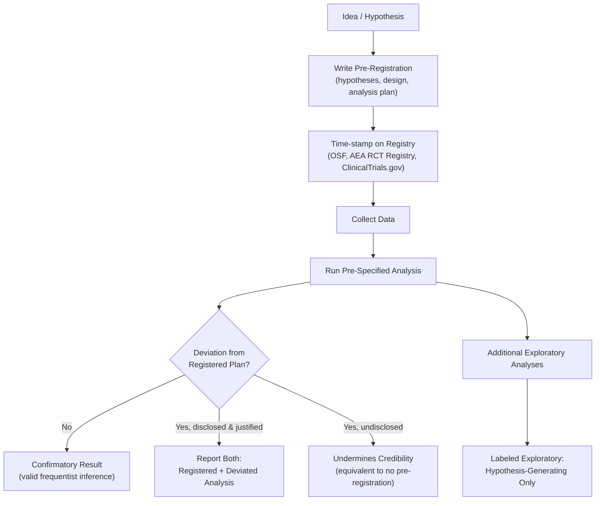

## Pre-registration and Pre-analysis Plans

### Overview

Pre-registration is the practice of publicly time-stamping a study's hypotheses, design, and analysis plan before data are collected or examined. A pre-analysis plan (PAP) is the more detailed technical document — often filed alongside or as part of a registration — that specifies the exact estimators, variable constructions, and decision rules to be applied. Together they are the primary institutional mechanism for converting the *promise* of a research design into a *verifiable commitment*, directly targeting the researcher-degrees-of-freedom problem described in the previous topic.

### What Problem Pre-registration Solves

**Key Points**

- Without a pre-registration, a reader cannot distinguish a **confirmatory** test (one hypothesis, specified in advance, tested once) from an **exploratory** one (the best result found after trying many reasonable alternatives) — both can be reported identically as "we regressed $Y$ on $X$ and found $p < 0.05$."
- This is the "garden of forking paths" (Gelman & Loken, 2014): with enough flexibility in coding outcomes, choosing controls, defining samples, and selecting subgroups, a false null hypothesis can almost always be made to look statistically significant, even without any single dishonest step.
- Pre-registration does not change the honesty of the researcher; it changes what a *reader* can verify. It converts unfalsifiable claims of confirmatory testing into checkable ones.
- [Inference] The evidentiary value of pre-registration is conditional on registries and journals actually checking submitted results against the registered plan; without that enforcement, pre-registration functions mainly as a reputational and self-discipline device rather than a hard guarantee.

### Anatomy of a Pre-registration Document

A complete pre-registration typically specifies:

1. **Hypotheses** — directional where possible (e.g., "the program increases enrollment," not merely "the program affects enrollment"), stated in terms of the estimand.
2. **Design** — sampling frame, treatment/control definitions, randomization or identification procedure, timing.
3. **Sample size and power** — target $n$, the power analysis and assumptions behind it, and stopping rules (see below).
4. **Outcome variables** — precise construction (e.g., "log of monthly revenue in local currency, winsorized at the 1st/99th percentile"), distinguishing **primary** from **secondary** outcomes.
5. **Covariates and subgroups** — which controls will be included, and which heterogeneity/subgroup analyses are planned (these are otherwise a major source of undisclosed multiple comparisons).
6. **Statistical model** — the exact specification (e.g., "OLS with robust standard errors clustered at the village level," or "2SLS with X as instrument for Y").
7. **Inference procedure** — significance level, one- vs. two-sided tests, multiple-testing correction procedure if applicable.
8. **Exclusion/attrition rules** — how missing data, non-compliance, and outliers will be handled, fixed in advance rather than decided post hoc.

### Confirmatory vs. Exploratory Analysis

**Key Points**

- **Confirmatory analysis**: matches a pre-registered hypothesis and analysis plan exactly. Frequentist inference (p-values, confidence intervals) retains its nominal interpretation only for confirmatory analyses.
- **Exploratory analysis**: anything not specified in advance — including secondary outcomes examined after seeing the primary result, subgroups suggested by the data, or alternative specifications tried after the main one. Exploratory findings are hypothesis-*generating*, not hypothesis-*confirming*, and should be reported as such regardless of how compelling they look.
- A single paper can and often should contain both, provided each result is explicitly labeled and the exploratory findings are framed as candidates for a *future* pre-registered confirmatory test — this is how legitimate cumulative science proceeds rather than a reason to avoid exploration.

### Registries and Formats

**Key Points**

- **OSF (Open Science Framework) Registrations**: general-purpose, discipline-agnostic, supports embargoed/private registrations that become public later; widely used in psychology and social sciences.
- **AEA RCT Registry**: field-specific registry for economics randomized controlled trials, run by the American Economic Association; increasingly required or strongly encouraged by economics journals as a condition of publication for experimental papers.
- **ClinicalTrials.gov / WHO ICTRP**: mandatory registries for clinical trials in many jurisdictions (in the U.S., the FDA Amendments Act of 2007 requires registration for many trial types prior to enrollment); non-registration or failure to report results can carry legal and funding consequences.
- **EGAP (Evidence in Governance and Politics)**: registry oriented toward political science and development field experiments, with a design-registration template widely adopted in that literature.
- **Registered Reports**: a stronger journal-level mechanism (distinct from a self-filed registration) in which the introduction, hypotheses, and analysis plan undergo peer review *before* data collection; the journal commits to publishing the eventual paper regardless of the result, provided the registered protocol is followed — this is the format most directly designed to eliminate publication bias, since acceptance no longer depends on the outcome.

### Pre-registration vs. Pre-analysis Plan: A Distinction

- **Pre-registration** is often a relatively brief, structured entry (hypotheses, design, primary outcome, sample size) filed on a registry, sometimes using a fixed template (e.g., OSF's "Standard Pre-Data Collection Registration" template).
- A **Pre-Analysis Plan (PAP)** is typically a longer, more technical document that goes further: it may include exact regression equations, variable-construction code, mock/simulated output tables, and detailed handling rules for edge cases (attrition, non-compliance, top-coding).
- [Inference] In practice the two terms are used inconsistently across disciplines — economics tends to favor the term "pre-analysis plan" for the detailed document, while psychology more often uses "pre-registration" to cover the same level of detail — so the underlying content matters more than the label used.

### Amendments and Deviations

**Key Points**

- Pre-registrations are not immutable contracts; unforeseen circumstances (data quality issues, unanticipated attrition patterns, a variable that turns out to be miscoded) legitimately require deviation.
- The credibility-preserving practice is **disclosed deviation**: report the pre-registered analysis *and* the deviated analysis side by side, explain the reason for the change, and let the reader judge whether the deviation was justified or convenient.
- Most registries support **amendments**, which are themselves time-stamped, so the sequence of original plan → amendment → final analysis remains auditable.
- A common and important distinction: registering *before* treatment assignment/randomization (strongest form) versus registering after treatment but before outcome data are collected or unblinded (weaker, but still rules out outcome-driven specification search) versus registering after data are already in hand (provides essentially no confirmatory value and should be labeled as exploratory, not pre-registered).

### Interim Analyses and Stopping Rules

**Key Points**

- In sequential designs (e.g., clinical trials, or online experiments monitored in real time), stopping data collection early upon seeing a significant result — "optional stopping" — inflates the false-positive rate above the nominal $\alpha$, because it grants the researcher a hidden multiple-testing opportunity across looks at the data.
- Formal solutions include **group sequential designs** with pre-specified interim analysis points and adjusted significance thresholds (e.g., O'Brien-Fleming or Pocock boundaries), and **alpha-spending functions** that allocate the total error budget across multiple looks.
- A pre-registration should state, in advance, whether interim looks will occur, how many, and what stopping rule (if any) governs early termination — silence on this point is itself a red flag for undisclosed optional stopping.

### Pre-Registration for Observational and Secondary Data Studies

**Key Points**

- Pre-registration is most naturally suited to prospective experimental work, but it is increasingly applied to observational studies using data not yet collected by the researcher (e.g., "we will use the next wave of a panel survey once released") and even to secondary analyses of *existing* datasets the researcher has not yet examined.
- For datasets the researcher has already accessed in some form, the credible move is a **pre-registration with a data-access statement**: explicitly disclosing what parts of the data (if any) were viewed prior to registration, since partial familiarity with the data can itself leak information that shapes hypothesis choice.
- **Registered analysis on existing, unexamined data** is a distinct and useful category: the design and full outcome variables already exist, but the specific analytic plan is locked in before the researcher opens the outcome variables, isolating specification-search from data-snooping even when the underlying dataset predates the registration.

### Costs, Limitations, and Critiques

**Key Points**

- Pre-registration imposes real costs: it requires anticipating decision points in advance, which is harder for genuinely exploratory or descriptive research where the value lies precisely in discovering unanticipated patterns.
- Overly rigid adherence can produce perverse incentives — a researcher who discovers a genuine but unregistered finding may suppress or mislabel it to appear "confirmatory," which is worse than transparent exploratory reporting.
- Registrations are frequently vague enough (e.g., unspecified control variables, ambiguous outcome definitions) to leave meaningful researcher discretion; audits of registered-and-published study pairs have found many analyses depart from the registered plan without full disclosure. [Unverified: exact rates of undisclosed deviation vary substantially by field and by the specific audit study cited, and this figure should be sourced to a specific paper before being quoted numerically.]
- [Inference] Pre-registration is best understood as raising the cost of undisclosed specification search rather than eliminating researcher discretion entirely; it is a necessary component of a credible research pipeline but not a substitute for adequate sample size, sound identification, and transparent full reporting.

### Worked Example: A Minimal Pre-Analysis Plan

**Study**: Effect of a text-message reminder on vaccination uptake.

- **Primary hypothesis**: Households receiving the reminder have higher vaccination uptake within 30 days than the control group (one-sided, since theory predicts a non-negative effect).
- **Design**: Individual-level randomization, 1:1 allocation, stratified by clinic catchment area.
- **Primary outcome**: Binary indicator of vaccination within 30 days, verified via clinic records (not self-report).
- **Sample size**: $n = 2{,}400$ per arm, powered to detect a 5-percentage-point increase from a 40% baseline at 80% power, $\alpha = 0.05$ (two-sided for reporting, though the hypothesis is directional).
- **Model**: $Y_i = \alpha + \beta \cdot \text{Reminder}_i + \gamma \cdot \text{Clinic}_i + \varepsilon_i$, linear probability model with robust standard errors; logistic regression reported as a robustness check.
- **Secondary outcomes** (listed and labeled as secondary, with a note that no multiple-testing correction is applied to the single primary outcome but Benjamini-Hochberg will be applied across the secondary set): time-to-vaccination, uptake of a second required dose.
- **Attrition rule**: Households that cannot be matched to clinic records are coded as "vaccination unknown" and excluded from the primary analysis, with a bounding exercise (assuming all unknowns are unvaccinated, then all vaccinated) reported as a robustness check.
- **Amendment log**: any changes to this plan after randomization will be appended below with a timestamp and rationale, and the original plan preserved unedited.

**Conclusion**

Pre-registration and pre-analysis plans convert the distinction between confirmatory and exploratory research from an unverifiable claim into a checkable fact, directly addressing $p$-hacking, HARKing, and the garden of forking paths. Their value depends on specificity (a vague registration provides little protection), on honest and disclosed handling of deviations, and on registries and journals that actually verify submitted work against the registered plan. They are a necessary complement to — not a replacement for — sound identification strategy and adequate statistical power.

**Related Topics**

- Registered Reports as a journal-level publication format
- Multiple hypothesis testing corrections (Bonferroni, Holm, Benjamini-Hochberg)
- Statistical power analysis and minimum detectable effect sizes
- Specification-curve and multiverse analysis
- Sequential testing, alpha-spending functions, and group sequential designs
- Data transparency and code-sharing infrastructure (Dataverse, OSF, journal replication archives)
- The distinction between exploratory data analysis and confirmatory hypothesis testing
- Publication bias and the file-drawer problem