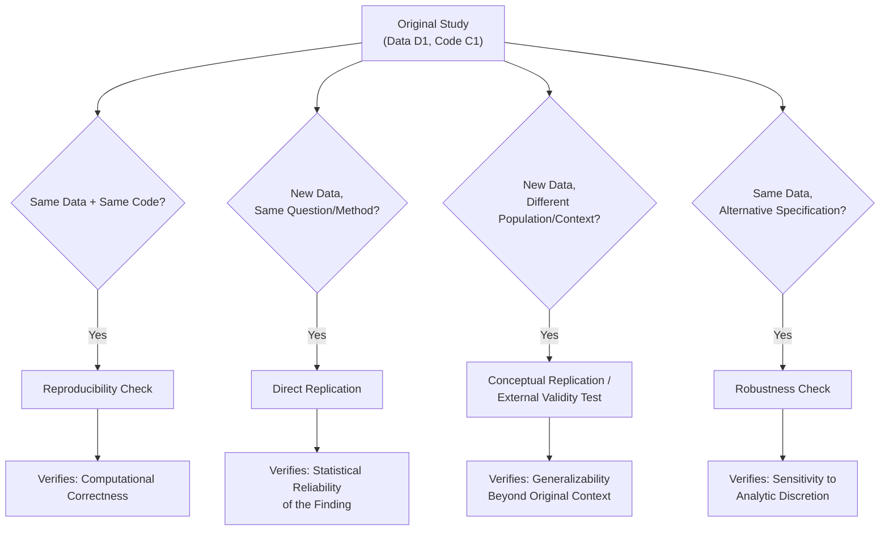

## Replication and Robustness Checks

### Overview

Replication and robustness checks are the two principal mechanisms by which an empirical claim earns credibility *after* the initial analysis is complete. Robustness checks test whether a finding survives reasonable alternative analytic choices applied to the *same* data. Replication tests whether a finding recurs when the study, or a comparable one, is repeated — with new data, a new sample, or by an independent team. They answer different questions and neither substitutes for the other.

### Terminology: A Precise Taxonomy

**Key Points**

- **Reproducibility** (also "computational reproducibility"): re-running the *original* code on the *original* data produces the *original* results. Purely a check on data-processing and coding correctness; a fully reproducible result can still be substantively wrong.
- **Replicability**: obtaining consistent results using *new data* collected to answer the *same* research question, ideally with a similar (but not necessarily identical) method. This is the standard usually meant by "does the finding hold up."
- **Robustness**: obtaining a qualitatively similar result under *different but defensible* analytic choices applied to the *same* data (different controls, functional forms, samples, estimators).
- **Generalizability / external validity replication**: obtaining consistent results in a *different population or context*, testing the scope of the original claim rather than its correctness. [Inference] These terms are used inconsistently across fields — some disciplines use "replication" to mean what is defined above as "reproducibility" — so any claim of "successful replication" should be checked against which of these four operations was actually performed.

### Direct vs. Conceptual Replication

- **Direct (exact) replication**: repeats the original procedure as closely as possible — same instrument, same population type, same protocol — to test whether the original result was a statistical fluke, an artifact of a specific sample, or a genuine effect.
- **Conceptual replication**: tests the same underlying hypothesis using a different operationalization, measure, or population, trading precision of comparison for evidence about generalizability. A successful conceptual replication is stronger evidence for a theory but weaker evidence about the specific original estimate; a failed conceptual replication is ambiguous between "the theory is false" and "the new operationalization doesn't capture the same construct."
- [Inference] Which type of replication is more valuable is context-dependent: direct replications are more diagnostic for detecting false positives and $p$-hacking; conceptual replications are more diagnostic for theory validity, and the two should generally be treated as complements rather than substitutes.

### Large-Scale Replication Projects: What They Found

**Key Points**

- **Open Science Collaboration (2015)**, *Science*: attempted direct replication of 100 studies from three psychology journals; roughly 36% achieved statistically significant results in the same direction in the replication, versus 97% in the original studies, and mean effect sizes in replications were about half those originally reported.
- **Camerer et al. (2016)**, *Science* (economics lab experiments) and **Camerer et al. (2018)**, *Nature Human Behaviour* (social science experiments published in *Nature*/*Science*): replicated roughly 60% and 62% of studies respectively (successful replication defined by the original effect falling within the replication's confidence interval and being in the same direction), somewhat higher rates than the psychology result but still indicating substantial non-replication.
- **Many Labs projects** (Klein et al., 2014, 2018): multi-site direct replications of the same set of classic findings across dozens of labs, allowing decomposition of variation into "true" effect heterogeneity versus sampling noise versus site-specific moderators.
- [Inference] The specific replication rates above are frequently cited benchmarks but depend heavily on the "success" criterion used (statistical significance in the same direction vs. effect size within a confidence interval vs. meta-analytic pooling); different criteria applied to the same replication data can yield different headline rates.

### Robustness Checks: Standard Categories

1. **Alternative functional forms** — linear vs. log-linear vs. polynomial specifications; parametric vs. semi-/non-parametric estimators.
2. **Alternative control sets** — adding/removing plausible confounders; a result that flips sign or loses significance when a theoretically minor control is added/removed warrants scrutiny (see Oster's bound below).
3. **Alternative samples** — excluding outliers, restricting to subpopulations, varying the estimation window (especially in time-series/panel settings).
4. **Alternative standard error / clustering choices** — clustering at different levels (individual vs. group vs. higher aggregate), wild cluster bootstrap for small numbers of clusters, Conley spatial standard errors for geographically correlated data.
5. **Alternative outcome/treatment measurement** — different codings, winsorization thresholds, or proxies for the same underlying construct.
6. **Placebo tests** — applying the identical procedure to an outcome, period, or population where no effect should exist under the maintained identifying assumption; a "significant" placebo result is evidence against the design, not for it.
7. **Falsification tests specific to the identification strategy**:
   - RD: testing for a discontinuity in *pre-determined* covariates at the cutoff, and McCrary/Cattaneo-Jansson-Ma density tests for manipulation of the running variable.
   - DiD: pre-trend tests (event-study coefficients on pre-treatment leads should be statistically indistinguishable from zero).
   - IV: overidentification tests (Hansen J / Sargan) when multiple instruments are available, though these test joint validity, not each instrument individually.

### Formal Sensitivity Analysis for Omitted Variable Bias

Rather than an ad hoc table of robustness checks, formal bounding methods quantify how much *unobserved* confounding would be required to overturn a result.

**Oster's (2019) coefficient-stability bound**: uses the movement in the coefficient of interest and the movement in $R^2$ as controls are added, to infer how much further movement an unobservable confounder (as strong, on average, as the observed controls) could produce. The bound is summarized by $\delta$, the relative degree of selection on unobservables (versus observables) that would be required to fully explain away the estimated effect:

$$\delta = \frac{\tilde{\beta}(\tilde{R} - R_{max})}{R_{max}(\dot\beta - \tilde\beta)} \cdot \frac{\dot{R} - \tilde{R}}{\tilde{R} - \dot{R}}$$

*(the exact algebraic form varies by presentation; the operational quantity reported is a $\delta$ or a "bias-adjusted" coefficient bound; researchers typically report the value of $\delta$ at which the effect would be nullified, and argue for or against its plausibility.)*

**Rosenbaum bounds**: used with matching estimators, quantify how strong an unobserved covariate's association with treatment assignment would need to be (parameterized by $\Gamma$) to change the qualitative conclusion of a test, without requiring an assumption about the confounder's relationship with the outcome.

[Inference] These formal sensitivity bounds are more rigorous than a simple qualitative robustness table because they convert "there might be a confounder" into a specific, falsifiable magnitude, but they still require an auxiliary assumption (e.g., that unobservables are "no more related to treatment than observables" in Oster's method) that is itself not directly testable.

### Specification Curve / Multiverse Analysis

**Key Points**

- Rather than reporting one preferred specification with a handful of robustness checks in an appendix, a **specification curve analysis** (Simonsohn, Simmons & Nelson, 2020) or **multiverse analysis** (Steegen et al., 2016) enumerates *all* theoretically defensible combinations of analytic decisions (control sets, outcome codings, sample restrictions, estimators) and reports the full distribution of resulting estimates.
- This directly visualizes how much the conclusion depends on discretionary choices, and permutation-based inference across the specification curve can test whether the *median* or *proportion-significant* result across the whole curve is distinguishable from a null distribution generated under random reassignment of treatment.
- [Inference] The main practical limitation is defining the universe of "theoretically defensible" specifications in a way that is itself not cherry-picked — the specification curve exercise pushes the researcher-degrees-of-freedom problem back one level, to the choice of which specifications belong in the curve.

### Replication Package Standards

**Key Points**

- Journal and funder requirements increasingly mandate a **replication package**: raw or de-identified data (or a clear statement of why data cannot be shared, e.g. confidentiality), a complete analysis script that runs end-to-end from data to final tables/figures, a README documenting variable construction, and software/package version information.
- The **American Economic Association's data and code availability policy** requires authors of accepted papers to submit a replication package archived at the AEA's repository, subject to a pre-publication verification check by AEA staff — a rare example of institutional, third-party reproducibility verification rather than self-certification.
- **Computational environment capture**: containerization (Docker), environment lock files (`renv` for R, `requirements.txt`/`poetry.lock`/`conda environment.yml` for Python), and pinned package versions guard against "it worked on my machine" failures caused by software updates changing default behavior (e.g., a changed default standard-error estimator between package versions).
- A minimal reproducibility checklist:
  1. Does a single command reproduce every table and figure in the paper from raw data?
  2. Is random seed fixed for any simulation, bootstrap, or randomization inference step?
  3. Are all data transformations (merges, drops, recodes) documented and scripted rather than done manually?
  4. Is software/package version information recorded?
  5. Can an independent user with no prior context run the package successfully?

### Interpreting a Failed Replication

**Key Points**

A failure to replicate is genuinely ambiguous and should not be automatically read as evidence the original finding was false. Possible explanations, roughly ordered from "original finding likely spurious" to "original finding likely real":

1. The original result was a Type I error / false positive (especially plausible if underpowered or if $p$ was near 0.05).
2. The original effect size was inflated by the winner's curse (Type M error) even if the qualitative direction is real, so the replication — being unbiased — finds a genuinely smaller effect.
3. The replication itself is underpowered to detect a true but modest effect.
4. Genuine effect heterogeneity: the effect is real but context-dependent, and the replication's population, timing, or implementation differs in a way that matters substantively (a "hidden moderator").
5. The replication has its own methodological flaws (poor implementation fidelity, different measurement).

- Bayesian and meta-analytic approaches that pool the original and replication estimates (rather than treating replication as a binary pass/fail) are increasingly preferred for this reason — they quantify the *updated* best estimate and its uncertainty rather than issuing a verdict.

### Worked Example

A paper claims a training program increases small-firm productivity by 15% ($p = 0.03$, $n = 180$).

- **Robustness checks to run**: re-estimate excluding firms in the top/bottom 1% of the productivity distribution; add industry fixed effects; cluster standard errors at the firm-cohort level instead of the individual level; report a placebo test using a pre-program productivity measure as the "outcome" (should show no effect).
- **Formal sensitivity check**: report Oster's $\delta$ — if achieving a null effect would require unobservables to be, say, 5 times as predictive of treatment as the full set of observed controls, that supports robustness; if $\delta$ is close to 1, the result is fragile to plausible unobserved confounding.
- **Replication assessment**: given $n=180$ and a marginal $p$-value, an ex ante power calculation would likely show this study was underpowered to reliably detect a 15% effect, flagging it as a strong candidate for a Type M error — a direct replication with a larger pre-registered sample size is the appropriate next step before treating 15% as a reliable point estimate.

**Conclusion**

Robustness checks and replication answer complementary questions — whether a result is sensitive to defensible analytic discretion applied to the same data, versus whether it recurs under new data or new conditions — and large-scale replication projects across psychology and economics have shown that a substantial share of published findings fail one or both tests. Formal sensitivity bounds (Oster, Rosenbaum) and specification-curve analyses provide more rigorous alternatives to ad hoc robustness tables, while standardized replication packages and third-party verification (as practiced by the AEA) convert reproducibility from an aspiration into an enforced institutional norm.

**Related Topics**

- Formal sensitivity analysis (Oster bounds, Rosenbaum bounds) for unobserved confounding
- Specification-curve and multiverse analysis methodology
- Meta-analysis: fixed-effects vs. random-effects pooling of original and replication estimates
- Statistical power, Type M/S errors, and the winner's curse
- Registered Reports and pre-registration as complementary credibility mechanisms
- Computational reproducibility infrastructure (Docker, environment lock files, master scripts)
- Randomization inference and permutation-based testing
- Meta-science and the study of publication bias