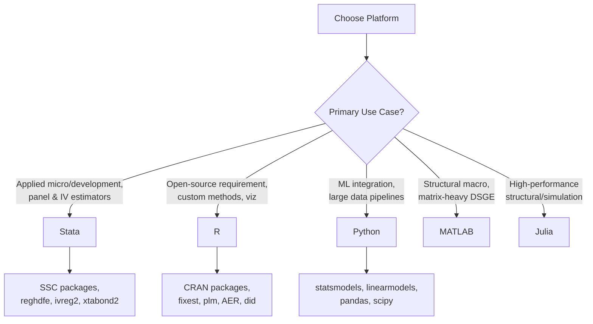

## Statistical Software for Econometrics


### Overview

Choice of statistical software affects not only convenience but reproducibility, the availability of correctly implemented estimators, and the ease of auditing an analysis. This topic surveys the major platforms used in applied econometrics — R, Stata, Python, and MATLAB/Julia for more specialized numerical work — along with the package ecosystems, workflow conventions, and reproducibility infrastructure that accompany each.

### Comparative Landscape

**Key Points**

- **Stata**: the dominant proprietary platform in applied microeconometrics and development economics; a mature, consistent command syntax, extremely well-documented estimator implementations, and a large user-contributed package ecosystem (SSC — Statistical Software Components archive) that includes cutting-edge estimators often available in Stata before other platforms.
- **R**: the dominant open-source platform in applied statistics, biostatistics, and increasingly economics; free, script-based, enormous package ecosystem (CRAN), strong integration with reproducible-research tooling (R Markdown/Quarto, `renv`), but syntax and API conventions vary more across packages than Stata's uniform command structure.
- **Python**: increasingly used for econometrics, especially where the workflow also involves machine learning, large-scale data engineering, or web-based deployment (via `statsmodels`, `linearmodels`, `scikit-learn`); ecosystem is less specialized for classical econometric inference than R or Stata but has closed much of the gap, particularly for panel/IV methods via `linearmodels`.
- **MATLAB**: common in structural/quantitative macroeconomics and finance, where matrix-heavy numerical routines (dynamic programming, DSGE solution methods) are central; proprietary and less common for applied micro/reduced-form work.
- **Julia**: a newer, high-performance option gaining traction in structural estimation and computationally intensive simulation work (e.g., via `Econometrics.jl`, `FixedEffectModels.jl`), valued for combining Python/R-like syntax with near-C execution speed; ecosystem is smaller and less battle-tested than the above three. [Inference] Julia's econometrics ecosystem, while capable, has fewer peer-reviewed-package validations and a smaller community than Stata/R, so cross-checking novel estimator implementations against a more established platform is prudent.
- **SAS**: historically significant in some government, health economics, and actuarial contexts; less common in current academic applied econometrics outside those niches.



### Stata: Core Workflow

**Key Points**

- Fundamental unit of work is the **do-file** (`.do`) — a script of Stata commands run top-to-bottom, conventionally organized as a **master do-file** that calls sub-scripts for data cleaning, analysis, and table/figure output in sequence, enforcing the "one script, raw data to final output" reproducibility standard.
- Core estimation commands: `regress` (OLS), `xtreg` (panel fixed/random effects), `ivregress`/`ivreg2` (IV/2SLS), `logit`/`probit` (binary outcomes), `reghdfe` (high-dimensional fixed effects, essential for modern DiD/panel work with many fixed-effect groups).
- Widely used user-contributed commands (installed via `ssc install`): `reghdfe` (fast absorption of high-dimensional fixed effects), `ivreg2` (extended IV diagnostics including weak-instrument and overidentification tests), `xtabond2` (dynamic panel GMM, Arellano-Bond/Blundell-Bond), `estout`/`esttab` (publication-quality regression tables), `winsor2` (winsorizing/trimming), `did_multiplegt` and `csdid` (modern staggered-adoption DiD estimators addressing Goodman-Bacon bias).
- Standard error/clustering syntax: `regress y x, vce(cluster groupvar)`; multi-way clustering via `reghdfe y x, vce(cluster group1 group2)` or `ivreg2` equivalents.

**Example**

```stata
* Master do-file structure
do "01_clean_data.do"
do "02_construct_variables.do"
do "03_main_analysis.do"
do "04_tables_figures.do"

* Example DiD specification with high-dimensional FE
reghdfe outcome treatment##post, absorb(unit_id year) vce(cluster unit_id)
```

### R: Core Workflow

**Key Points**

- Fundamental unit is the **R script** or, for literate/reproducible reporting, an **R Markdown / Quarto document** (`.Rmd`/`.qmd`) that interleaves narrative text with executable code chunks and renders directly to PDF/HTML/Word — a strong match for the "tie narrative to code" reproducibility principle.
- Core econometrics packages: `fixest` (fast high-dimensional fixed-effects estimation, increasingly the standard for panel/DiD work due to speed and integrated multi-way clustering), `plm` (panel data models, established alternative), `AER` (applied econometrics companion package, IV via `ivreg`), `sandwich` (robust/clustered covariance matrix estimators usable across model types), `lmtest` (hypothesis testing utilities), `did` (Callaway-Sant'Anna staggered DiD estimator), `rdrobust` (regression discontinuity, bandwidth selection and robust bias-corrected inference), `synth`/`Synth` (synthetic control), `broom` (tidying model output into data frames for further processing/tables).
- Table/output packages: `modelsummary`, `stargazer`, `texreg` for publication-quality regression tables in LaTeX/HTML/Markdown.
- Environment/reproducibility: `renv` for per-project package version locking (analogous to Python's virtual environments), `here` for robust relative file paths independent of working directory.

**Example**

```r
library(fixest)

# High-dimensional fixed-effects DiD with clustered SEs
model <- feols(outcome ~ treatment * post | unit_id + year,
                cluster = ~unit_id, data = df)
summary(model)

# Modern staggered-adoption estimator
library(did)
att_gt_result <- att_gt(yname = "outcome", tname = "year",
                         idname = "unit_id", gname = "first_treat_year",
                         data = df)
```

### Python: Core Workflow

**Key Points**

- Core data manipulation via `pandas`; core econometric estimation via `statsmodels` (OLS, GLM, time series — ARIMA/VAR, robust covariance estimators) and `linearmodels` (panel data — fixed/random effects, IV/2SLS/GMM, and increasingly high-dimensional fixed-effects absorption comparable to `reghdfe`/`fixest`).
- `scipy.stats` and `numpy` provide underlying numerical/statistical primitives; `scikit-learn` is common for prediction-oriented tasks (regularization, cross-validation, causal-ML methods like double/debiased machine learning) but is not designed around classical inferential econometrics (standard errors, hypothesis tests) in the same way as `statsmodels`.
- Reproducibility infrastructure: Jupyter notebooks for exploratory/literate work (with the caveat that out-of-order cell execution is a common source of *irreproducibility* if not disciplined — "restart and run all" before finalizing is a standard check), virtual environments (`venv`, `conda`) and lock files (`requirements.txt`, `poetry.lock`, `environment.yml`) for dependency pinning, and `papermill`/`nbconvert` for parameterized, scriptable notebook execution that restores some of the "single reproducible pipeline" discipline notebooks otherwise lack.
- [Inference] For a researcher whose primary need is classical inferential econometrics with mature, well-validated standard-error and clustering implementations, R (`fixest`) or Stata (`reghdfe`) currently have a broader and more battle-tested range of specialized estimators than Python's ecosystem, though the gap has narrowed substantially and continues to narrow.

**Example**

```python
import pandas as pd
from linearmodels.panel import PanelOLS

df = df.set_index(['unit_id', 'year'])
model = PanelOLS.from_formula(
    'outcome ~ treatment*post + EntityEffects + TimeEffects',
    data=df
)
result = model.fit(cov_type='clustered', cluster_entity=True)
print(result.summary)
```

### Estimator Availability Across Platforms (Selected)

| Method | Stata | R | Python |
| --- | --- | --- | --- |
| OLS with robust/clustered SE | `regress, vce(cluster)` | `fixest::feols`, `sandwich` | `statsmodels` (`cov_type='cluster'`) |
| High-dim fixed effects | `reghdfe` | `fixest::feols` | `linearmodels.PanelOLS` |
| IV/2SLS | `ivregress`, `ivreg2` | `AER::ivreg`, `fixest::feols` (` | ` syntax) |
| Staggered DiD (Callaway-Sant'Anna) | `csdid` | `did` package | `csdid2` / `differences` (less mature) |
| Regression discontinuity | `rdrobust` (Stata port) | `rdrobust` | `rdrobust` (Python port) |
| Dynamic panel GMM (Arellano-Bond) | `xtabond2` | `plm::pgmm` | limited native support |
| Synthetic control | `synth` | `Synth`, `tidysynth` | `pysyncon` |

[Inference] Package availability and maturity change frequently as the open-source ecosystem evolves; for any specific estimator, checking the package's current documentation and recent citation/validation history is more reliable than relying on a static comparison table.

### Reproducibility Tooling by Platform

**Key Points**

- **Version control**: `git` integrates cleanly with all three platforms for tracking code changes; binary data files are typically excluded from git and instead referenced via a data-access statement or tracked with `git-lfs` / `DVC` (Data Version Control) for large files.
- **Environment capture**: Stata has less standardized dependency-locking tooling (package versions are typically just documented in a README, since SSC packages are less prone to breaking-change updates than CRAN/PyPI); R's `renv` and Python's virtual environments + lock files provide stronger automated reproducibility guarantees against dependency drift.
- **Containerization**: Docker images bundling a fixed OS, software version, and package set provide the strongest reproducibility guarantee across all platforms, at the cost of setup complexity; increasingly requested by top journals' replication policies for computationally intensive submissions.
- **Literate programming**: R Markdown/Quarto and Jupyter notebooks both tie prose directly to executable code and output, reducing the risk of a manuscript describing an analysis that no longer matches the actual code; Stata's equivalent is **Stata Markdown** (`markstat`/`webdoc`) or simply well-commented do-files paired with `esttab`/`estout` output, which is less integrated but standard practice.

### Choosing a Platform: Practical Considerations

- **Field norms**: development/labor/public economics still skews Stata-heavy in many top journals' replication packages; applied statistics, epidemiology, and increasingly newer economics subfields skew R; data-science-adjacent and machine-learning-integrated empirical work skews Python.
- **Cost**: Stata and MATLAB are proprietary with licensing costs (institutional licenses often available); R, Python, and Julia are free and open-source, which also aids replication by removing a software-access barrier for independent replicators without institutional licenses.
- **Collaboration**: matching collaborators' and target-journal replication archive conventions reduces friction; several top economics journals now accept and, in some cases, prefer open-source (R/Python) replication packages specifically because reviewers/verifiers do not need a Stata license to check them.
- [Inference] No single platform is objectively "best" for econometrics; the appropriate choice depends on subfield norms, collaborator constraints, licensing access, and whether the broader project requires integration with machine-learning or large-scale data-engineering tooling outside classical econometrics.

**Conclusion**

Stata, R, and Python each provide mature, well-validated implementations of the standard econometric toolkit, differing mainly in licensing model, syntax philosophy, and ecosystem breadth outside core inferential statistics. Modern high-dimensional fixed-effects and staggered-DiD estimators (`reghdfe`/`fixest`/`linearmodels`, `csdid`/`did`) are now available across all three, narrowing what were previously significant platform-specific gaps. Reproducibility depends less on which platform is chosen than on disciplined practice within it: a single end-to-end script, documented package versions, and literate-programming integration of narrative and code.

**Related Topics**

- Reproducible research infrastructure (Docker, `renv`, environment lock files, master scripts)
- High-dimensional fixed-effects estimation and computational methods for large panels
- Modern staggered difference-in-differences estimators (Callaway-Sant'Anna, Sun-Abraham)
- Version control workflows for empirical research (git, DVC)
- Literate programming for research reporting (R Markdown/Quarto, Jupyter)
- Publication-quality regression table generation
- Open-source vs. proprietary software licensing considerations in academic research