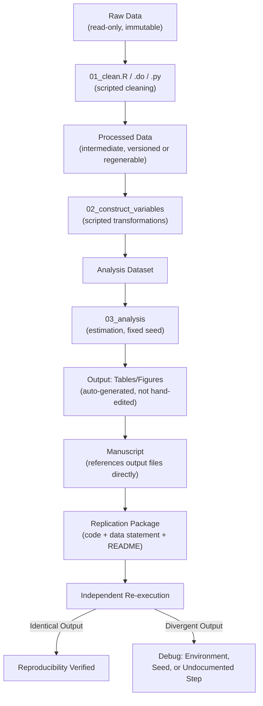

## Reproducible Data Workflows


### Overview

A reproducible data workflow is the end-to-end pipeline — from raw data acquisition through cleaning, transformation, analysis, and output generation — organized so that any step can be re-executed by an independent party and yield identical results. This topic covers the architectural principles, directory conventions, and tooling that make a workflow auditable, distinguishing reproducibility (same inputs and code yield same outputs) from the correctness of the underlying research design, which is a separate concern treated elsewhere in this chapter.

### Why Workflow Structure Matters Independently of Statistical Validity

**Key Points**

- A statistically impeccable identification strategy can still produce an unreliable published result if the *computational* pipeline connecting raw data to reported tables contains manual, undocumented, or unversioned steps (e.g., hand-editing a spreadsheet, copy-pasting values into a manuscript, running analysis steps out of order in an interactive session).
- Errors of this kind are common and consequential: the widely publicized Reinhart-Rogoff (2010) episode, in which a coding/spreadsheet error and questionable exclusion choices were only uncovered years later via an independent replication attempt (Herndon, Ash & Pollin, 2013), illustrates how workflow opacity can allow an error to persist in influential policy-relevant research for years.
- [Inference] The general lesson from such episodes — that workflow transparency and mandatory replication packages reduce this risk — is broadly accepted among methodologists, though the *frequency* of consequential undetected errors in the wider literature is inherently hard to estimate, since by definition most go undetected.

### Core Principles

1. **Single source of truth for raw data**: raw data files are treated as read-only and never manually edited; all transformations are scripted.
2. **Linear, scripted pipeline**: every step from raw data to final table/figure is executed by code, in a fixed, documented order, ideally callable by a single master script.
3. **Separation of concerns**: distinct scripts (or modules) for data cleaning, variable construction, estimation, and output/table generation, rather than one monolithic script mixing all stages.
4. **Deterministic outputs**: any randomness (bootstrap resampling, permutation inference, simulation) uses an explicitly set random seed, documented in the script.
5. **Version control of code** (and, where feasible, of small processed data artifacts), enabling a complete audit trail of changes.
6. **Documentation of provenance**: a README or codebook records data sources, access dates, variable definitions, and any manual judgment calls (e.g., how a coding ambiguity was resolved).



### Directory Structure Conventions

**Key Points**

- A widely adopted convention (echoed in tools like Cookiecutter Data Science, and standard in economics/social-science replication packages) separates:
  - `data/raw/` — original, unmodified source files (or a script to fetch them, if too large to store).
  - `data/processed/` (or `data/intermediate/`) — outputs of the cleaning stage, regenerable from `raw/` by running the cleaning scripts.
  - `code/` (or `scripts/`) — all analysis code, often numbered (`01_clean.R`, `02_construct.R`, `03_analyze.R`) to encode execution order.
  - `output/` — tables, figures, and any generated artifacts, treated as disposable/regenerable rather than hand-edited.
  - `docs/` — README, codebook, and any pre-registration or protocol documents.
- A **master script** (`run_all.R`, `master.do`, `Makefile`, or a workflow-manager DAG — see below) executes every stage in the correct order with a single command, serving as the authoritative, unambiguous description of the pipeline.

**Example**



```
project/
├── data/
│   ├── raw/                  # read-only, original files
│   └── processed/            # regenerable intermediate outputs
├── code/
│   ├── 01_clean_data.R
│   ├── 02_construct_vars.R
│   ├── 03_main_analysis.R
│   └── 04_make_tables.R
├── output/
│   ├── tables/
│   └── figures/
├── docs/
│   ├── README.md
│   └── codebook.md
└── run_all.R                 # master script, calls 01-04 in order
```

### Workflow Management Tools

**Key Points**

- **Make / Makefiles**: a long-standing build-automation tool (originally for compiling software) repurposed for data pipelines; defines dependency rules so that only outputs whose *inputs have changed* are re-executed, avoiding unnecessary re-computation of expensive steps.
- **Snakemake** and **Nextflow**: workflow-management systems (originating in bioinformatics) that generalize the Makefile idea with more expressive dependency specification, parallel execution, and cluster/cloud scheduling — increasingly used for computationally intensive econometric simulation or large-scale data pipelines.
- **`targets`** (R) and **`Luigi`/`Prefect`/`Snakemake`** (Python): modern pipeline-orchestration packages that track which steps' outputs are stale relative to their inputs and re-run only what's necessary, while maintaining a reproducible dependency graph.
- [Inference] For small-to-moderate academic projects, a simple numbered master script is often sufficient and more transparent to a non-specialist replicator than a full workflow-manager DAG; the additional machinery of tools like Snakemake or `targets` pays off primarily when pipelines are large, computationally expensive, or need incremental re-execution during active development.

### Data Provenance and Documentation

**Key Points**

- A **codebook** documents every variable in the final analysis dataset: its name, source, construction formula (if derived), units, and any recoding/cleaning rules applied (e.g., how missing values were coded, how outliers were treated).
- A **data-access statement** records where raw data originated, the access date (critical for web-scraped or frequently updated administrative data, which can change after the fact), and any usage restrictions or embargoes.
- For confidential or restricted-access data (common in administrative/government microdata), the replication package should include a synthetic or de-identified version where possible, plus clear instructions for how a qualified researcher could obtain access to the restricted data to verify results — since "cannot share data" is not equivalent to "cannot be verified."

### Handling Randomness and Non-Determinism

**Key Points**

- Any procedure involving randomness — bootstrap resampling, permutation/randomization inference, simulation-based power analysis, stochastic optimization — must set an explicit random seed (`set.seed()` in R, `np.random.seed()`/`random_state=` in Python, `set seed` in Stata) and document it, or results will differ across re-executions even with identical code.
- Parallel execution can introduce non-determinism even with a fixed seed if the random-number stream is not explicitly managed across parallel workers (a common, easy-to-miss source of "irreproducible despite a fixed seed" bugs); dedicated parallel-safe RNG streams (e.g., R's `future` package with `future.seed=`) address this.
- Floating-point non-associativity means that even fully deterministic numerical code can produce tiny (typically immaterial) differences across different hardware, BLAS/LAPACK linear-algebra library versions, or operating systems; this is a known limitation of "bit-for-bit" reproducibility claims and is why reproducibility checks typically test for results matching to a specified numerical tolerance rather than exact equality.

### Version Control for Data Workflows

**Key Points**

- `git` tracks code changes effectively but is not designed for large binary data files; committing large datasets bloats repository size and history.
- **Git-LFS** (Large File Storage) and **DVC** (Data Version Control) extend git-like versioning to large data files by storing lightweight pointers in git while the actual data lives in separate storage (cloud buckets, dedicated servers), keeping the code repository lean while still versioning data lineage.
- Commit messages and branching conventions applied to analysis code (e.g., a branch per robustness-check exploration, merged only once finalized) provide the same audit-trail benefit for research code that they provide in software engineering — a complete history of *which* analytic decision was made *when*, useful both for the researcher's own memory and for external scrutiny of whether choices were made before or after seeing results.

### Environment and Dependency Management

**Key Points**

- Software updates can silently change default behavior between versions (e.g., a package changing its default standard-error small-sample correction), so pinning exact package/software versions is necessary for genuine long-term reproducibility, not merely a convenience.
- **R**: `renv` creates a project-local library with locked package versions, recorded in a lockfile (`renv.lock`) that can recreate the exact environment on another machine.
- **Python**: virtual environments (`venv`, `conda`) combined with a lockfile (`requirements.txt` with pinned versions, `poetry.lock`, or `environment.yml`) serve the same function.
- **Containerization (Docker)**: captures not just package versions but the entire OS-level environment (system libraries, compiler versions), providing the strongest reproducibility guarantee; a `Dockerfile` in the replication package allows an independent party to rebuild the *exact* computational environment used originally, at the cost of additional setup complexity and file size.
- [Inference] The appropriate level of environment-capture rigor (simple version pinning vs. full containerization) scales with the computational sensitivity of the results; for most standard econometric analyses (regressions, standard estimators), version-locked package management is generally sufficient, while containerization becomes more valuable for numerically sensitive simulations or machine-learning pipelines with many interacting dependencies.

### Automated Testing for Data Pipelines

**Key Points**

- Borrowing from software engineering, **unit tests** on data-cleaning functions (e.g., asserting that a merge produces the expected number of rows, that no negative values appear in an age variable, that key identifiers are unique) catch silent data-corruption bugs before they propagate into final results.
- **Assertion checks** embedded directly in cleaning scripts (e.g., `assert(all(df$age >= 0))` in R, or `assert (df['age'] >= 0).all()` in Python) act as automated sanity checks that halt the pipeline if an unexpected data state occurs, rather than silently producing wrong downstream output.
- **Continuous integration (CI)** — automatically re-running the full pipeline (e.g., via GitHub Actions) whenever code changes are pushed — is a software-engineering practice increasingly adapted to research pipelines to catch regressions introduced by later edits.

### Worked Example: A Minimal Reproducible Pipeline

```r
# run_all.R — master script
source("code/01_clean_data.R")       # raw/ -> processed/
source("code/02_construct_vars.R")   # processed/ -> analysis_data.rds
source("code/03_main_analysis.R")    # analysis_data.rds -> model objects
source("code/04_make_tables.R")      # model objects -> output/tables/

# Inside 03_main_analysis.R:
set.seed(20240115)  # documented seed for bootstrap SEs
library(fixest)
model <- feols(y ~ x | firm_id + year, cluster = ~firm_id, data = analysis_data)
saveRDS(model, "output/model_main.rds")

# README.md excerpt:
# Data source: Administrative firm-level records, accessed 2024-01-10, restricted access.
# To reproduce: run `source("run_all.R")` from project root with renv::restore() first.
# Random seed 20240115 used for all bootstrap procedures; changing it alters SE point estimates by <0.1%.
```

**Conclusion**

A reproducible data workflow treats the path from raw data to published result as a fully scripted, versioned, and documented pipeline rather than a sequence of manual, memory-dependent steps. Directory conventions that separate raw from processed data, a single master script or workflow-manager DAG, explicit handling of randomness, and locked software environments together ensure that an independent party — or the original researcher, months later — can regenerate every reported number exactly. This computational discipline is necessary but not sufficient for credibility: a perfectly reproducible pipeline can still encode a flawed identification strategy, which is why reproducibility (this topic) and research design validity (covered elsewhere in this chapter) must both be satisfied.

**Related Topics**

- Reproducibility vs. replicability vs. robustness (terminological distinctions)
- Version control (git) and large-file data versioning (Git-LFS, DVC)
- Workflow management tools (Make, Snakemake, `targets`, Luigi/Prefect)
- Environment and dependency management (`renv`, Docker, lockfiles)
- Replication package standards and journal data-availability policies (e.g., AEA)
- Automated testing and continuous integration for research code
- Literate programming for tying narrative to executable analysis