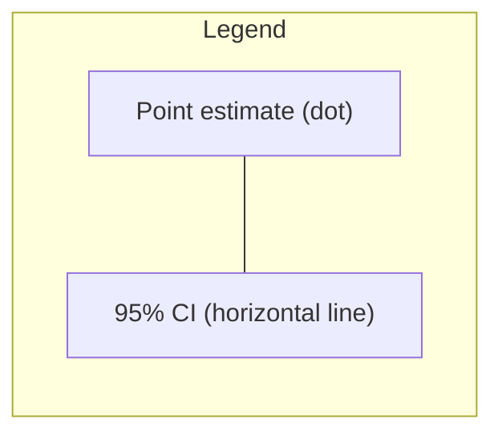
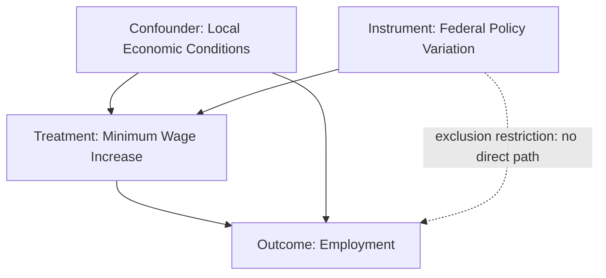

## Communicating Quantitative Results

### Overview

Communicating quantitative results is the process of translating statistical and econometric findings into forms that are accurate, interpretable, and actionable for a target audience — whether that audience is technical (fellow researchers, referees) or non-technical (policymakers, managers, the public). Poor communication of correct analysis can be as damaging as flawed analysis communicated well, since decisions are made on the basis of what is understood, not on what was computed. This topic covers principles of effective statistical communication, common pitfalls, visualization design, tabular reporting, uncertainty communication, and audience-appropriate framing.

### Why Communication Is Part of Research Design

Communication is not a cosmetic final step; it is integral to the validity of an empirical claim reaching its intended use. Key reasons this belongs in research design rather than "writing style":

- **Reproducibility depends on clarity**: If a result cannot be understood precisely (what was estimated, on what sample, with what specification), it cannot be reproduced or audited.
- **Misinterpretation risk**: Ambiguous language around p-values, confidence intervals, and causal claims is one of the largest sources of public and even academic misunderstanding of statistics.
- **Decision consequences**: In economics and policy contexts, miscommunicated uncertainty (e.g., presenting a point estimate without an interval) can lead to overconfident decisions.

### Core Principles

**Key Points**

- **Precision over vagueness**: State exactly what was estimated (parameter, population, time period) rather than vague generalizations.
- **Uncertainty is not optional**: Every quantitative claim should be accompanied by some measure of uncertainty (standard error, confidence interval, credible interval, or explicit caveat).
- **Match complexity to audience**: A referee report can carry heavy notation; a policy brief should carry almost none.
- **Distinguish statistical from practical/economic significance**: A statistically significant coefficient may be economically negligible, and this must be stated explicitly.
- **Causal language discipline**: Use "associated with," "correlated with," or "predicts" for non-causal estimates; reserve "causes," "increases," or "leads to" for designs that support causal identification (RCTs, valid instruments, credible quasi-experimental designs).
- **Transparency about limitations**: Data limitations, identification assumptions, and robustness (or lack thereof) should be stated near the headline result, not buried in an appendix.

### The Audience-Purpose-Format Framework

A useful mental model for choosing communication strategy:

1. **Audience**: Who is reading/listening? (Technical peers, executives, policymakers, general public)
2. **Purpose**: What decision or understanding should this enable? (Publish/replicate, allocate budget, change policy, inform public discourse)
3. **Format**: What medium fits? (Academic paper, technical report, slide deck, dashboard, press release, one-page memo)

| Audience | Typical Purpose | Appropriate Format | Notation Level |
| --- | --- | --- | --- |
| Academic peers/referees | Validate methodology | Full paper with tables, proofs, robustness checks | High (full equations) |
| Policymakers | Inform a decision | Executive summary + 1-2 key visuals | Low (plain language, minimal math) |
| Executives/managers | Approve action | Slide deck, dashboard, KPI summary | Low-Medium |
| General public/media | Build awareness | Infographic, narrative with analogy | Very low |
| Internal technical team | Implementation/replication | Code + technical appendix + full output | High |

### Reporting Statistical Results: Standards and Conventions

#### Point Estimates and Uncertainty

The minimum acceptable reporting unit for a quantitative claim is:

$$\hat{\beta} \pm \text{measure of uncertainty}$$

In practice this means reporting **coefficient, standard error (or confidence interval), and sample size** together, not the coefficient alone.

**Example**

Weak: "Education increases wages."

Better: "In our sample ($n=4{,}500$), an additional year of schooling is associated with a $7.2\%$ increase in hourly wages (95% CI: $5.8\%$ to $8.6\%$; robust SE clustered by state), controlling for experience, region, and industry."

#### Confidence Intervals vs. P-values

Both convey uncertainty, but they answer different questions and are frequently misreported:

- A p-value answers: "If the null hypothesis were true, how likely would data this extreme (or more extreme) be?" It is **not** the probability the null hypothesis is true, and it is **not** the probability the finding is a fluke in a fully general sense.
- A confidence interval answers: "Across repeated sampling, what range of values would contain the true parameter in $X\%$ of samples?" It does **not** mean there is a $95\%$ probability the true value lies in this particular interval (a common misstatement, especially in frequentist frameworks — Bayesian credible intervals do support that interpretation).

[Inference] Practitioners increasingly favor leading with confidence/credible intervals over bare p-values because intervals communicate both magnitude and precision simultaneously, whereas a p-value collapses both into a single threshold decision.

#### Effect Sizes and Practical Significance

Always pair a coefficient with information that lets the reader judge economic or practical magnitude:

- Standardized effect sizes (Cohen's $d$, partial $R^2$)
- Comparisons to a meaningful benchmark (e.g., "equivalent to a 3-month reduction in unemployment duration")
- Percentage change relative to the outcome's mean or standard deviation

$$d = \frac{\bar{X}_1 - \bar{X}_2}{s_{\text{pooled}}}$$

### Tables: Best Practices

Regression tables are the primary quantitative communication tool in econometrics. Conventions:

- Report coefficients with standard errors in parentheses directly below (or confidence intervals in brackets).
- Use consistent significance stars with a clearly stated legend ($^{*}p<0.10$, $^{**}p<0.05$, $^{***}p<0.01$), but do not rely on stars alone — pair with magnitude discussion in text.
- Include $N$, $R^2$ (or pseudo-$R^2$), and relevant diagnostic statistics (F-stat, over-identification test stats) at the bottom.
- Label variables in plain language, not raw variable names (e.g., "Years of Education," not `educ_yrs`).
- Present multiple specifications side-by-side (columns) to show robustness, with a clear note on what changes between columns.

**Example** (illustrative regression table layout)

|  | (1) OLS | (2) + Controls | (3) + Fixed Effects |
| --- | --- | --- | --- |
| Years of Education | 0.072*** (0.008) | 0.061*** (0.007) | 0.058*** (0.009) |
| Experience | — | 0.021*** (0.003) | 0.019*** (0.003) |
| Region FE | No | No | Yes |
| Observations | 4,500 | 4,500 | 4,500 |
| $R^2$ | 0.18 | 0.31 | 0.34 |

*Note: Robust standard errors in parentheses. ***p<0.01, **p<0.05, *p<0.10.*

### Data Visualization Principles

#### Choosing the Right Chart

| Data Relationship | Recommended Visualization | Avoid |
| --- | --- | --- |
| Distribution of a single variable | Histogram, density plot, box plot | Pie chart |
| Comparison across categories | Bar chart | 3D bar chart |
| Trend over time | Line chart | Bar chart with too many bars |
| Relationship between two continuous variables | Scatter plot (with fitted line) | Dual-axis line chart (distorts comparison) |
| Uncertainty around an estimate | Error bars, confidence bands, coefficient plot | Bare point estimates with no interval shown |
| Part-to-whole | Stacked bar, treemap | Pie chart with >5 categories |

#### Visualizing Uncertainty: Coefficient Plots

A coefficient plot (also called a "forest plot" in meta-analysis contexts) displays point estimates with confidence intervals across multiple specifications or subgroups, allowing rapid visual comparison of magnitude, sign, and precision.

<svg xmlns="http://www.w3.org/2000/svg" viewBox="0 0 640 260" font-family="Helvetica, Arial, sans-serif">
<text x="200" y="20" font-size="14" font-weight="bold">Coefficient Plot: Effect on Log Wages (svg_diagram)</text>
<line x1="320" y1="40" x2="320" y2="220" stroke="#999" stroke-dasharray="4,3" />
<text x="316" y="235" font-size="11" fill="#666">0</text>
<line x1="80" y1="70" x2="470" y2="70" stroke="black" />
<line x1="80" y1="68" x2="80" y2="72" stroke="black" />
<line x1="470" y1="68" x2="470" y2="72" stroke="black" />
<circle cx="290" cy="70" r="5" fill="#2b6cb0" />
<text x="10" y="74" font-size="12">Model 1</text>
<line x1="100" y1="120" x2="430" y2="120" stroke="black" />
<line x1="100" y1="118" x2="100" y2="122" stroke="black" />
<line x1="430" y1="118" x2="430" y2="122" stroke="black" />
<circle cx="260" cy="120" r="5" fill="#2b6cb0" />
<text x="10" y="124" font-size="12">Model 2</text>
<line x1="150" y1="170" x2="380" y2="170" stroke="black" />
<line x1="150" y1="168" x2="150" y2="172" stroke="black" />
<line x1="380" y1="168" x2="380" y2="172" stroke="black" />
<circle cx="255" cy="170" r="5" fill="#2b6cb0" />
<text x="10" y="174" font-size="12">Model 3</text>

<text x="330" y="30" font-size="11" fill="#666">Zero effect</text>

<text x="230" y="250" font-size="11" fill="#666">Estimate with 95% CI; interval crossing 0 → not significant at 5%</text>

</svg>

#### Common Visualization Pitfalls

- **Truncated y-axes**: Starting a bar chart's y-axis above zero exaggerates differences. Acceptable for line charts showing rate-of-change when clearly labeled, but risky for bar charts where length implies magnitude.
- **Dual y-axes**: Overlaying two series with independent, arbitrarily scaled axes can create spurious visual correlation.
- **Overplotting**: Large $n$ scatter plots without transparency (alpha blending) or binning (hexbin, 2D density) obscure the true data density.
- **Cherry-picked axis ranges**: Zooming into a narrow range to visually inflate a trend.
- **3D effects and unnecessary chart junk**: Reduce data-ink ratio (Tufte's principle) and distort perceived proportions.
- **Color misuse**: Using color scales that are not perceptually uniform (e.g., rainbow/jet colormaps) for continuous data misrepresents magnitude gradients; also consider colorblind-accessible palettes.

### Diagrammatic Communication of Method (Not Just Results)

For empirical strategy, especially causal designs, a diagram of the identification logic aids non-technical audiences.

### Communicating Causal vs. Correlational Findings

This is one of the highest-stakes distinctions in applied econometrics communication.

**Key Points**

- Never use causal verbs ("reduces," "boosts," "drives") for results from purely observational, non-identified models.
- When identification strategy is credible (RCT, RDD, valid IV, well-supported DiD with parallel trends), causal language can be used but should be accompanied by a brief statement of the identifying assumption.
- Use hedged language proportional to the strength of design: "suggestive evidence," "consistent with a causal interpretation," "robust to X but not Y" are appropriate intermediate phrasings for quasi-experimental designs with residual concerns.

**Example**

Observational: "Firms with higher R&D spending are associated with $12\%$ higher subsequent revenue growth (correlation, not necessarily causal, given potential reverse causality and unobserved firm quality)."

Quasi-experimental (RDD at eligibility threshold): "Firms just above the R&D tax credit eligibility threshold show a $4.3$ percentage point higher revenue growth rate than firms just below (RDD estimate, local to the threshold; assumes no manipulation of the running variable, which we test via a McCrary density test)."

### Translating Statistics for Non-Technical Audiences

Techniques for lay communication without sacrificing accuracy:

- **Analogies and benchmarks**: "A 10% increase in this risk is roughly equivalent to..." grounded in something familiar.
- **Natural frequencies instead of percentages**: "3 out of 100 patients" is generally better understood than "3% probability," especially for risk communication (well-documented in the risk-communication literature).
- **Avoid jargon substitution traps**: Replacing "heteroskedasticity-robust standard errors" with "we adjusted for a statistical issue" without specifying what issue can be more misleading than using the technical term with a footnote.
- **Visual-first, then narrative**: Lead with a simple chart, then explain, rather than leading with a wall of text and numbers.
- **State the "so what"**: Every quantitative result aimed at a non-technical audience should end with an explicit implication statement.

### Common Miscommunication Pitfalls (Reference List)

- **P-hacking narrative distortion**: Reporting only significant results from a larger set of tested specifications (multiple comparisons problem) without disclosure.
- **Significance-as-importance conflation**: Treating $p<0.05$ as synonymous with "large" or "important" effect.
- **Absence of evidence vs. evidence of absence**: A non-significant result does not prove "no effect"; it may reflect low statistical power.
- **Overprecision**: Reporting coefficients to unwarranted decimal places (e.g., "3.14159%") implies false precision relative to the standard error.
- **Silent extrapolation**: Presenting a model's prediction far outside the range of the training data's covariates without flagging it.
- **Simpson's paradox omission**: Aggregated results reversing when disaggregated by subgroup, unmentioned.
- **Selective baseline/scale choice**: Choosing an index base year or axis scale that flatters the desired narrative.

### Structuring a Results Section (Academic/Technical Report Format)

A standard, well-communicated results section generally follows this order:

1. **Summary statistics** — establish sample characteristics before inferential claims.
2. **Main specification and headline result** — the primary estimate, with uncertainty, stated plainly in one sentence before the table.
3. **Table of full regression output** — with clearly labeled columns representing robustness progression.
4. **Interpretation paragraph** — magnitude in economic terms, not just statistical terms.
5. **Robustness checks** — alternative specifications, subsample analyses, placebo tests.
6. **Threats to identification / limitations** — stated explicitly, not hidden.
7. **Visual summary** — a coefficient plot or key trend chart reinforcing the headline number.

### Executive/Policy Summary Format

For non-academic stakeholders, a condensed structure works better:

1. **Headline finding** (one sentence, plain language, with the practical magnitude)
2. **Why it matters** (link to the decision at hand)
3. **How confident we are** (in plain terms: "this finding is based on a large, representative sample and holds up under several checks" vs. "this is a preliminary finding that should be treated cautiously")
4. **One supporting visual**
5. **Caveats in one or two sentences**
6. **Recommended action or next step**

### Reproducible Communication: Linking Results to Code

Best practice in modern econometrics communication ties every reported number to its generating code and data version, so a reader/referee can trace claims back to source computation. Typical elements:

- Version-controlled analysis scripts (see companion topics on reproducibility, version control)
- Automated table/figure generation (e.g., R's `modelsummary`/`stargazer`, Python's `stargazer`/`statsmodels` summary export, or LaTeX integration via `booktabs`) so manually retyped numbers — a common source of transcription error — are eliminated
- A README or data appendix mapping each table/figure in the report to the script and dataset version that produced it

[Unverified] Specific tool version compatibility (e.g., exact `modelsummary` or `stargazer` API syntax) should be checked against current package documentation, as these libraries update APIs periodically.

### Worked Example: From Raw Output to Communicated Result

**Raw model output** (hypothetical OLS, log wage on education and controls):

`coef educ = 0.0721, se = 0.0082, t = 8.79, p < 0.001, n = 4500, R² = 0.31`

**Step 1 — Sanity check magnitude**: A one-unit increase in an OLS-on-log-outcome coefficient of $0.0721$ implies an approximate $7.21\%$ change in wages per additional year of education (using $[\exp(\hat{\beta}) - 1] \times 100$ for more precision at larger coefficients, though the linear approximation is standard for small coefficients).

**Step 2 — Construct the interval**: $95\%$ CI $\approx 0.0721 \pm 1.96 \times 0.0082 = [0.056, 0.088]$.

**Step 3 — Communicate**:

"Each additional year of schooling is associated with wages that are approximately $7.2\%$ higher on average (95% CI: $5.6\%$ to $8.8\%$), holding experience, region, and industry constant. This estimate is based on cross-sectional survey data and reflects association rather than a causal effect, since unobserved ability or family background could jointly influence both schooling and wages."

### Related Topics

- Data visualization theory (Tufte's principles, grammar of graphics)
- Confidence intervals and hypothesis testing fundamentals
- Causal inference frameworks (potential outcomes, DAGs, identification strategies)
- Reproducible research workflows and version control
- Writing effective abstracts and executive summaries
- Pre-registration and reporting standards (e.g., AEA RCT registry conventions)
- Risk communication and numeracy in public health/policy contexts
- Multiple hypothesis testing and the replication crisis
- Software tools for automated reporting (R Markdown, Quarto, Jupyter, LaTeX table generation)
- Ethics in statistical communication and avoiding misleading visualizations