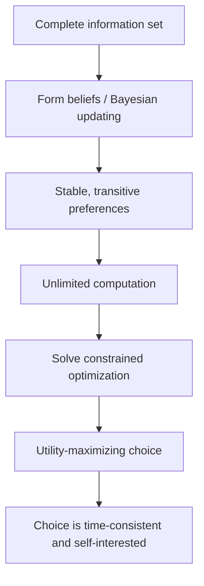

## The Homo Economicus Model and Its Assumptions

### Overview

Homo economicus ("economic man") is the idealized decision-maker at the center of neoclassical economic theory: an agent who processes all available information, holds stable and well-ordered preferences, and selects the action that maximizes their own utility subject to constraints (budget, time, information). Behavioral economics developed largely as a critique of, and corrective to, this model — so understanding its formal structure and assumptions is a prerequisite for understanding what behavioral economics revises.

### Historical Origins

- The term emerged in the late 19th century, used somewhat pejoratively by critics of classical political economy (notably in commentary responding to John Stuart Mill's methodology).
- Mill himself did not use the Latin phrase, but his 1836 essay *On the Definition of Political Economy* effectively proposed the method: economics studies "man" solely as a being who desires wealth and can compare the efficacy of means to that end, deliberately abstracting away other motives for analytical tractability.
- The model was formalized mathematically by the marginalist school (Jevons, Menger, Walras) in the 1870s, who recast economic behavior as constrained optimization problems solvable with calculus.
- Vilfredo Pareto and later the ordinalist revolution (Hicks, Allen, Samuelson in the 1930s–40s) stripped the model of psychological content entirely, redefining rationality as consistency of choice (revealed preference) rather than introspectable mental states. [Inference: this shift is widely credited with these figures, though the precise contribution of each to ordinalism is debated among historians of economic thought.]

### Core Assumptions

**1. Rationality (Consistent Preferences)**

Preferences over outcomes satisfy:

- *Completeness*: for any two bundles $A$ and $B$, the agent can state $A \succ B$, $B \succ A$, or $A \sim B$.
- *Transitivity*: if $A \succ B$ and $B \succ C$, then $A \succ C$.
- *Continuity* (for utility representation): small changes in bundles produce small changes in preference ranking.

These axioms guarantee a well-behaved utility function $u(\cdot)$ exists representing the preference ordering (a consequence of the Debreu representation theorem).

**2. Self-Interest**

The agent maximizes their own utility, typically defined over their own consumption, wealth, or leisure — not the welfare of others (though the formal model permits altruism to be built in via arguments in the utility function; the *canonical* version excludes it).

**3. Utility Maximization Subject to Constraints**

Formally, the agent solves:

$$\max_{x} \ u(x) \quad \text{subject to} \quad p \cdot x \leq m$$

where $x$ is a bundle of goods, $p$ is the price vector, and $m$ is income/budget.

**4. Perfect (or Rational) Information Processing**

The agent has access to all relevant information, or correctly forms probabilistic beliefs (rational expectations) and updates them via Bayes' rule when new information arrives.

**5. Unlimited Computational Capacity**

The agent can solve arbitrarily complex optimization problems instantaneously and without cost — no bounds on memory, attention, or processing time.

**6. Stable, Exogenous Preferences**

Preferences do not change based on context, framing, mood, or the decision-making process itself; they are given prior to the analysis and unaffected by how a choice is presented.

**7. Time-Consistent Discounting**

Intertemporal choices are typically modeled with exponential discounting:

$$U_t = \sum_{i=0}^{\infty} \delta^i \, u(c_{t+i})$$

where $\delta \in (0,1)$ is a constant discount factor, ensuring preferences over future trade-offs don't reverse as time passes (dynamic consistency).

### Diagram: Structure of the Homo Economicus Decision Process

### Why the Model Was Built This Way

**Key Points**

- The assumptions are not claims that real people literally compute utility functions — they are simplifying devices intended to make the theory mathematically tractable and to generate falsifiable predictions.
- Milton Friedman's "as-if" methodology (1953, *The Methodology of Positive Economics*) defended this: a model's assumptions need not be realistic if its predictions are accurate, analogous to a billiards player playing "as if" they know physics.
- The revealed preference approach (Samuelson, 1938) sidesteps the need to assume anything about internal psychology at all — rationality is *defined* as consistency between observed choices, making the model empirically operational rather than introspective.

### Formal Rational Choice Example

**Example**

A consumer has income $m = \$100$, and chooses between goods $x$ (price $p_x = \$5$) and $y$ (price $p_y = \$10$), with utility $u(x,y) = x^{0.5}y^{0.5}$ (Cobb-Douglas).

Maximizing subject to $5x + 10y \leq 100$ using Lagrangian optimization yields the standard Cobb-Douglas result: the consumer spends equal budget shares on each good, giving $x = 10$, $y = 5$. This is a **well-established, closed-form result** for Cobb-Douglas utility — not an inference.

The homo economicus model predicts this allocation holds regardless of how the $100 was earned, what mood the consumer is in, or how the prices are framed (e.g., as a "discount" versus a "surcharge") — an implication behavioral economics directly challenges (see mental accounting and framing effects below).

### Points of Behavioral Critique (Preview)

| Homo Economicus Assumption | Behavioral Economics Challenge |
| --- | --- |
| Stable, exogenous preferences | Preference reversals, framing effects (Tversky & Kahneman) |
| Unlimited computation | Bounded rationality (Simon), heuristics and biases |
| Exponential (time-consistent) discounting | Hyperbolic discounting, present bias |
| Self-interest only | Fairness preferences, reciprocity, altruism (ultimatum game results) |
| Expected utility under risk | Prospect theory: loss aversion, probability weighting |
| Bayesian belief updating | Base-rate neglect, representativeness heuristic |

[Inference: the "preview" framing above reflects how most behavioral economics textbooks structure the homo economicus chapter as a set-up for subsequent chapters; the specific pairing of critiques to assumptions is a standard pedagogical device rather than a single canonical taxonomy from one source.]

### Defenses and Continued Use

- **Aggregation argument**: even if individuals deviate from rationality, market-level behavior may still approximate homo economicus predictions if errors are random and cancel out, or if irrational agents are competed out by rational ones (arbitrage/evolutionary arguments). [Inference: the strength of this aggregation defense is contested and depends on whether deviations are systematic (as behavioral economics documents) rather than random — systematic biases do not cancel in aggregate.]
- **Tractability**: the model remains the workhorse for general equilibrium theory, game theory, and policy analysis (e.g., welfare economics) because it yields clean, testable predictions that alternative models often cannot match in generality.
- **Benchmark role**: even within behavioral economics, homo economicus functions as the normative baseline against which deviations are measured and labeled as "anomalies" or "biases."

### Illustration: Rational Agent vs. Bounded/Behavioral Agent (svg_diagram)

<svg xmlns="http://www.w3.org/2000/svg" viewBox="0 0 640 300">
<text x="320" y="24" text-anchor="middle" font-size="16" font-weight="bold" fill="#222">Homo Economicus vs. Behavioral Agent (svg_diagram)</text>
<rect x="20" y="50" width="270" height="220" rx="10" fill="#eef4ff" stroke="#3b5bdb" stroke-width="1.5" />
<text x="155" y="75" text-anchor="middle" font-size="13" font-weight="bold" fill="#1c3d8f">Homo Economicus</text>
<text x="35" y="105" font-size="12" fill="#222">• Complete information</text>
<text x="35" y="130" font-size="12" fill="#222">• Unlimited computation</text>
<text x="35" y="155" font-size="12" fill="#222">• Transitive, stable prefs</text>
<text x="35" y="180" font-size="12" fill="#222">• Exponential discounting</text>
<text x="35" y="205" font-size="12" fill="#222">• Pure self-interest</text>
<text x="35" y="230" font-size="12" fill="#222">• Optimal choice, always</text>
<rect x="350" y="50" width="270" height="220" rx="10" fill="#fff4e6" stroke="#e8590c" stroke-width="1.5" />
<text x="485" y="75" text-anchor="middle" font-size="13" font-weight="bold" fill="#a13c00">Behavioral Agent</text>
<text x="365" y="105" font-size="12" fill="#222">• Bounded, partial info</text>
<text x="365" y="130" font-size="12" fill="#222">• Heuristics under limits</text>
<text x="365" y="155" font-size="12" fill="#222">• Context-dependent prefs</text>
<text x="365" y="180" font-size="12" fill="#222">• Hyperbolic discounting</text>
<text x="365" y="205" font-size="12" fill="#222">• Fairness, reciprocity</text>
<text x="365" y="230" font-size="12" fill="#222">• Satisficing, not optimizing</text>
<line x1="290" y1="160" x2="350" y2="160" stroke="#555" stroke-width="2" marker-end="url(#arrow)" />
</svg>

### Common Misconceptions

- **Misconception**: homo economicus claims people are selfish and greedy in a moral sense. **Correction**: the model is agnostic about the *content* of utility — it can include altruism, warm-glow giving, or concern for others if those enter the utility function; the canonical textbook version simply omits them for simplicity, which is a modeling choice, not a claim about human nature.
- **Misconception**: rational choice theory requires agents to consciously perform calculus. **Correction**: under the "as-if" defense, the model only requires that behavior be *predictable as if* such optimization occurred, regardless of underlying cognitive process.

### Conclusion

The homo economicus model provides the formal, axiomatic benchmark of rational choice that underpins neoclassical microeconomics: complete and transitive preferences, self-interested utility maximization, perfect information processing, and time-consistent discounting, all combined in a constrained optimization framework. Its value lies in analytical tractability and clear falsifiability, not descriptive realism. Behavioral economics does not reject the model outright but uses it as the reference point from which systematic, replicable deviations (bounded rationality, bounded willpower, bounded self-interest) are identified and formally modeled.

**Related Topics**

- Bounded Rationality (Herbert Simon) and Satisficing
- Expected Utility Theory vs. Prospect Theory
- Revealed Preference Theory and Its Limits
- The "As-If" Methodology in Positive Economics
- Time-Inconsistent Preferences and Hyperbolic Discounting
- Behavioral Game Theory (Ultimatum Game, Dictator Game)
- Dual-Process Theory (System 1 / System 2) as a Psychological Foundation for Deviations from Rational Choice