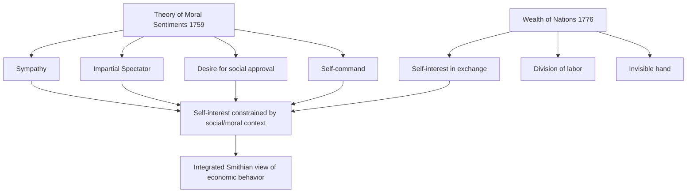

## Adam Smith and the Psychological Roots of Classical Economics

### Overview

Adam Smith (1723–1790) is conventionally treated as the founder of classical economics via *An Inquiry into the Nature and Causes of the Wealth of Nations* (1776), which grounds economic behavior in self-interest and the division of labor. However, Smith's earlier and, in his own view, foundational work, *The Theory of Moral Sentiments* (1759, revised through six editions until 1790), presents a rich psychological account of human motivation built on sympathy, social approval, and self-command. Behavioral economists and historians of economic thought treat the tension and complementarity between these two texts — sometimes called "Das Adam Smith Problem" — as an early precursor to the behavioral critique of narrow rational self-interest.

### Historical Context

- Smith held the Chair of Moral Philosophy at the University of Glasgow (1752–1764), where his coursework covered natural theology, ethics, jurisprudence, and political economy as an integrated whole — economics was not yet a separate discipline.
- He was closely associated with the Scottish Enlightenment, alongside David Hume, whose empiricist psychology (particularly on the passions and moral sentiments) directly influenced Smith's framework.
- *The Theory of Moral Sentiments* predates *Wealth of Nations* by 17 years and Smith continued revising it throughout his life, including after *Wealth of Nations* was published — indicating he saw the two as compatible parts of a single intellectual project rather than a shift in worldview. [Inference: this continued-revision fact is well documented, but the *inference* that Smith saw no contradiction between the works is the standard resolution scholars give to "Das Adam Smith Problem," not a directly stated claim by Smith himself.]

### "Das Adam Smith Problem"

**Key Points**

- Coined by 19th-century German scholars who perceived a contradiction: *Moral Sentiments* portrays humans as driven by sympathy and concern for others' approval, while *Wealth of Nations* portrays humans as driven by self-interest in market exchange.
- The now-dominant resolution among historians of economic thought is that there is no real contradiction: Smith held that self-interest operates within a socially and morally constituted framework — sympathy and the desire for approval (the "impartial spectator") constrain and shape how self-interest is pursued, rather than being replaced by it in market contexts.
- This resolution is directly relevant to behavioral economics, which similarly argues that "self-interest" in real economic behavior is embedded in social preferences (fairness, reciprocity, norms) rather than the narrow, asocial self-interest of the homo economicus model.

### Core Psychological Concepts in The Theory of Moral Sentiments

**1. Sympathy**

For Smith, sympathy is not simple compassion but the imaginative capacity to place oneself in another's situation and share, by an act of imagination, in their feelings. Moral judgments arise from whether an observer's sympathetic, imagined feelings align with the feelings actually expressed by the person being observed.

**2. The Impartial Spectator**

A hypothetical, idealized observer whose imagined judgment individuals use to self-regulate behavior — an internalized standard of propriety that functions similarly to what modern psychology might call an internalized social-monitoring mechanism. [Inference: the parallel to specific modern psychological constructs (e.g., theory of mind, internalized norms) is a scholarly interpretive connection, not a claim made by Smith using that terminology.]

**3. Desire for Mutual Sympathy / Social Approval**

Individuals are motivated not only by material outcomes but by a deep desire to have their sentiments echoed and approved of by others — a proto-behavioral-economics recognition that utility is socially constructed, not purely material.

**4. Self-Command**

The capacity to moderate immediate passions in light of what the impartial spectator would judge appropriate — an early treatment of what modern behavioral economics frames as self-control problems and willpower.

### Diagram: Smith's Dual Framework

### The Self-Interest Passage and Its Common Misreading

**Example**

The frequently quoted line from *Wealth of Nations*:

> "It is not from the benevolence of the butcher, the brewer, or the baker that we expect our dinner, but from their regard to their own interest."

is often cited in isolation as evidence Smith viewed humans as purely self-interested. Read in context with *Moral Sentiments*, the claim is narrower: in the specific context of market exchange among strangers, self-interest is a sufficient and reliable coordinating mechanism — it does not require that self-interest is the *only* human motive, or that it operates without moral constraint in other domains (family, friendship, civic life). Note: per copyright constraints, the passage above is limited to a short, commonly cited excerpt.

### Psychological Roots as Precursor to Behavioral Economics

| Smithian Concept | Behavioral Economics Parallel |
| --- | --- |
| Sympathy / desire for mutual sympathy | Social preferences, other-regarding utility (Fehr & Schmidt inequity aversion) |
| Impartial spectator | Internalized social norms, self-signaling models |
| Self-command | Self-control, present bias, dual-self models (Thaler & Shefrin) |
| Loss of self-command under passion | Hot-cold empathy gaps (Loewenstein), visceral influences on choice |
| Approval-seeking behavior | Status-seeking, conspicuous consumption, social comparison utility |

[Inference: while these parallels are widely drawn in the behavioral economics literature and history-of-thought scholarship, the specific one-to-one mapping in this table is a pedagogical synthesis rather than a fixed, universally agreed taxonomy.]

### Smith on Errors in Judgment: An Early Behavioral Observation

Smith noted specific systematic patterns in human judgment that anticipate later heuristics-and-biases research:

- **Overconfidence in one's own abilities and luck**: in *Wealth of Nations*, Smith observed that most people overrate their own chances of success (e.g., in risky ventures or lotteries) relative to the actual odds — an early anticipation of what behavioral economics now formalizes as overconfidence bias and probability-weighting distortions documented in prospect theory.
- **The tendency to admire wealth and greatness independent of virtue**: in *Moral Sentiments*, Smith argued people systematically sympathize more with the rich and powerful than warranted by their actual merit, which he called a "corruption" of moral sentiments — a precursor to status-based utility and reference-dependent social comparison.

### Illustration: Two Pillars of Smith's Thought (svg_diagram)

<svg xmlns="http://www.w3.org/2000/svg" viewBox="0 0 640 260">
<text x="320" y="24" text-anchor="middle" font-size="16" font-weight="bold" fill="#222">Smith's Two Pillars (svg_diagram)</text>
<rect x="30" y="50" width="250" height="170" rx="10" fill="#f0f7ee" stroke="#2f9e44" stroke-width="1.5" />
<text x="155" y="75" text-anchor="middle" font-size="13" font-weight="bold" fill="#1c6b2c">Moral Sentiments (1759)</text>
<text x="45" y="105" font-size="12" fill="#222">Sympathy</text>
<text x="45" y="128" font-size="12" fill="#222">Impartial spectator</text>
<text x="45" y="151" font-size="12" fill="#222">Social approval</text>
<text x="45" y="174" font-size="12" fill="#222">Self-command</text>
<rect x="360" y="50" width="250" height="170" rx="10" fill="#eef4ff" stroke="#3b5bdb" stroke-width="1.5" />
<text x="485" y="75" text-anchor="middle" font-size="13" font-weight="bold" fill="#1c3d8f">Wealth of Nations (1776)</text>
<text x="375" y="105" font-size="12" fill="#222">Self-interest</text>
<text x="375" y="128" font-size="12" fill="#222">Division of labor</text>
<text x="375" y="151" font-size="12" fill="#222">Market coordination</text>
<text x="375" y="174" font-size="12" fill="#222">Invisible hand</text>
<line x1="280" y1="135" x2="360" y2="135" stroke="#555" stroke-width="2" marker-end="url(#arrow2)" />
<line x1="360" y1="145" x2="280" y2="145" stroke="#555" stroke-width="2" marker-end="url(#arrow2)" />
<text x="320" y="240" text-anchor="middle" font-size="11" fill="#555">Mutually reinforcing, not contradictory</text>
</svg>

### Why This Matters for the Foundations of Behavioral Economics

**Key Points**

- Behavioral economics is sometimes framed as a radical departure from classical economics, but its intellectual roots can be traced back to the fact that the *founder* of classical economics himself had a rich, socially embedded, and psychologically nuanced theory of motivation.
- The narrowing of "economic man" to pure, asocial self-interest happened gradually over the following century, especially through the marginalist and formalist turns (see the Homo Economicus Model), not because Smith himself advocated for that narrow view.
- Modern behavioral economists (e.g., Vernon Smith, George Akerlof, Robert Shiller) have explicitly invoked *The Theory of Moral Sentiments* as intellectual precedent for incorporating fairness, reciprocity, and social preferences into formal economic models. [Inference: this invocation is documented in various academic writings and Nobel lectures by these economists, though the exact framing and emphasis varies by author and should be verified against the specific primary source if precise attribution is needed.]

### Conclusion

Adam Smith's full body of work — read as an integrated whole spanning *The Theory of Moral Sentiments* and *The Wealth of Nations* — presents a far more psychologically rich account of economic behavior than the narrow self-interest model later attributed to classical economics. Concepts like sympathy, the impartial spectator, and self-command anticipate central behavioral economics themes: social preferences, internalized norms, and self-control. Understanding these psychological roots reframes behavioral economics not as a rejection of classical economics' founder, but as a partial return to and formalization of concerns Smith himself already held.

**Related Topics**

- Das Adam Smith Problem: Historical Debate and Resolution
- David Hume's Theory of the Passions and Its Influence on Smith
- The Impartial Spectator as a Precursor to Modern Self-Signaling Models
- Social Preferences and Inequity Aversion (Fehr & Schmidt Model)
- The Marginalist Revolution and the Narrowing of Economic Man
- Vernon Smith's Reinterpretation of Adam Smith for Experimental Economics
- Dual-Self Models of Self-Control (Thaler & Shefrin)