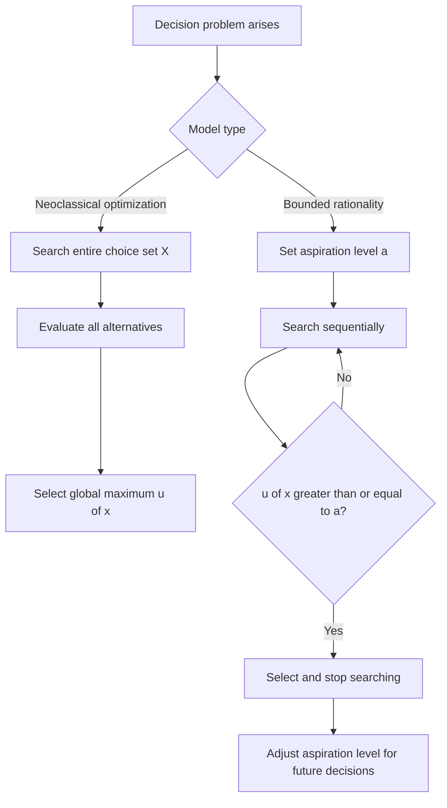

## Herbert Simon and the Concept of Bounded Rationality

### Overview

Herbert A. Simon (1916–2001) is widely regarded as the intellectual founder of the bounded rationality research program, which directly challenges the unlimited-computation and perfect-information assumptions of the homo economicus model. Simon argued that real decision-makers operate under constraints on knowledge, cognitive capacity, and time, and therefore cannot optimize in the neoclassical sense — they instead adopt simplified procedures to reach decisions that are "good enough." His work spans economics, psychology, computer science, and organizational theory, and earned him the 1978 Nobel Memorial Prize in Economic Sciences "for his pioneering research into the decision-making process within economic organizations."

### Biographical and Disciplinary Context

- Simon was trained in political science at the University of Chicago, and his early empirical work on decision-making in organizations (culminating in *Administrative Behavior*, 1947) was conducted well outside mainstream economics departments.
- He held a joint career spanning Carnegie Mellon University's departments of psychology, computer science, and business, reflecting his conviction that decision theory required an interdisciplinary synthesis rather than confinement to formal economic modeling.
- Simon was also a pioneer of artificial intelligence and cognitive science (co-developer of the Logic Theorist and General Problem Solver programs with Allen Newell), and his AI work directly informed his economic theory: both treat decision-making as information processing under resource constraints.

### Core Concept: Bounded Rationality

**Key Points**

- Bounded rationality describes decision-making as rational *within limits* — agents intend to act rationally but are constrained by three key limitations: incomplete and imperfect information, finite cognitive processing capacity, and finite time to decide.
- Simon distinguished **procedural rationality** (whether a decision results from an appropriate deliberative process, given the agent's constraints) from **substantive rationality** (whether a decision is objectively optimal given the "true" state of the world) — the neoclassical model concerns itself only with the latter, while Simon argued the former is what actually describes human behavior.
- Rather than optimizing, bounded rational agents use **satisficing**: selecting the first option that meets or exceeds an internally set aspiration level, rather than exhaustively searching for the single best option among all alternatives.

### Satisficing: Formal Characterization

Where the classical optimization problem is:

$$x^* = \arg\max_{x \in X} \ u(x)$$

Simon's satisficing model instead defines an aspiration level $a$, and search terminates at the first $x \in X$ such that:

$$u(x) \geq a$$

The aspiration level $a$ is itself dynamic: it adjusts based on the ease or difficulty of finding satisfactory alternatives (rising when good options are found easily, falling when the search proves difficult) — an early formalization of adaptive, feedback-driven goal-setting that behavioral economics and organizational behavior research later built upon extensively.

### Diagram: Optimization vs. Satisficing

### The Three Boundaries on Rationality

**1. Limits of Knowledge**

Decision-makers rarely have complete knowledge of all alternatives, their consequences, or the relevant probability distributions — in contrast to the perfect-information assumption of homo economicus.

**2. Limits of Computational Capacity**

Even with full information, the human mind has finite working memory and processing speed, making exhaustive evaluation of complex choice sets (e.g., combinatorially large option spaces) practically infeasible within available time.

**3. Limits of Time**

Real decisions typically must be made under deadlines, which further restricts the depth of search and evaluation that is feasible, regardless of computational capacity.

### Bounded Rationality in Organizations

**Example**

In *Administrative Behavior*, Simon analyzed how organizations mitigate the limits of individual bounded rationality through structural mechanisms:

- **Division of decision-making labor**: complex decisions are decomposed into narrower sub-decisions assigned to specialized roles, reducing the cognitive burden on any single decision-maker.
- **Standard operating procedures (SOPs)**: routines that encode prior organizational learning, allowing decisions to be made via rule-following rather than fresh optimization each time.
- **Authority and communication channels**: hierarchical structures that route information and decisions to where bounded-rational capacity is sufficient to handle them.

This organizational-level analysis positioned bounded rationality not merely as an individual cognitive limitation but as a constraint that shapes the design of institutions themselves. [Inference: while Simon's organizational analysis is well documented in *Administrative Behavior*, the framing of this as a distinctly "institutional design" implication is an interpretive extension commonly drawn by later organizational economists (e.g., Oliver Williamson) rather than a verbatim claim in Simon's original text.]

### Relationship to Later Behavioral Economics

| Simon's Concept | Later Development |
| --- | --- |
| Bounded rationality | Kahneman & Tversky's heuristics and biases program (1970s onward) |
| Satisficing | Aspiration-level models in behavioral game theory and organizational decision-making |
| Procedural vs. substantive rationality | Ecological rationality (Gigerenzer) — heuristics as adaptive, not merely "biased" |
| Bounded rationality as information-processing constraint | Rational inattention models (Sims) formalizing limited attention with information-theoretic costs |
| Administrative decision-making under constraints | Transaction cost economics (Williamson), building bounded rationality into firm theory |

[Inference: the mapping in this table reflects a widely taught intellectual lineage in behavioral economics courses; the degree of direct influence versus independent parallel development varies by scholar and is a matter of ongoing historical debate among economists.]

### Distinguishing Simon's Bounded Rationality from Kahneman-Tversky Heuristics-and-Biases

**Key Points**

- Simon's program emphasizes that deviations from neoclassical rationality are the *rational* response to genuine cognitive and environmental constraints — the agent is not "irrational," but rather rational relative to their actual (bounded) resources.
- The later Kahneman-Tversky tradition, while building on Simon's foundational insight, more often frames deviations as systematic *errors* or *biases* relative to a normative benchmark (e.g., Bayes' rule, expected utility theory), which is a subtly different emphasis.
- Gerd Gigerenzer's "ecological rationality" program explicitly positions itself as a return to Simon's original framing, arguing that heuristics (e.g., "take-the-best") are often *well-adapted* to real-world environments rather than simply biased shortcuts — a debate still active within behavioral economics and judgment-and-decision-making research. [Inference: characterizing this as an "active debate" reflects the state of the literature as commonly summarized in survey articles; specific current positions of individual researchers should be verified against recent publications if precision is required.]

### Illustration: Simon's Three Boundaries (svg_diagram)

<svg xmlns="http://www.w3.org/2000/svg" viewBox="0 0 640 280">
<text x="320" y="24" text-anchor="middle" font-size="16" font-weight="bold" fill="#222">Three Boundaries on Rationality (svg_diagram)</text>
<circle cx="180" cy="150" r="90" fill="#eef4ff" stroke="#3b5bdb" stroke-width="1.5" opacity="0.85" />
<circle cx="320" cy="90" r="90" fill="#fff4e6" stroke="#e8590c" stroke-width="1.5" opacity="0.7" />
<circle cx="460" cy="150" r="90" fill="#f0f7ee" stroke="#2f9e44" stroke-width="1.5" opacity="0.7" />

<text x="140" y="180" font-size="12" fill="`#1c3d8f`" font-weight="bold">Limits of</text>

<text x="140" y="196" font-size="12" fill="`#1c3d8f`" font-weight="bold">Knowledge</text>

<text x="290" y="70" font-size="12" fill="`#a13c00`" font-weight="bold">Limits of</text>

<text x="278" y="86" font-size="12" fill="`#a13c00`" font-weight="bold">Computation</text>

<text x="430" y="180" font-size="12" fill="`#1c6b2c`" font-weight="bold">Limits of</text>

<text x="440" y="196" font-size="12" fill="`#1c6b2c`" font-weight="bold">Time</text>

<text x="300" y="255" text-anchor="middle" font-size="13" font-weight="bold" fill="#222">Bounded Rationality</text>

</svg>

### Legacy and Contemporary Relevance

**Key Points**

- Bounded rationality is now the foundational premise underlying nearly all of modern behavioral economics — it is the conceptual license that permits departing from the homo economicus optimization framework while still constructing rigorous, formal models of decision-making.
- Nobel laureates directly building on Simon's foundation include Daniel Kahneman (2002), Richard Thaler (2017), and — in a related but distinct vein — the broader rational-inattention and information-processing-cost literature developed by Christopher Sims (2011) and others.
- Simon's own Nobel citation explicitly recognized his work on organizational decision-making under bounded rationality, making him arguably the first Nobel laureate whose prize directly credited a challenge to the classical rational-actor model — predating the more widely publicized "behavioral economics" Nobel prizes by decades.

### Conclusion

Herbert Simon's concept of bounded rationality reoriented the study of economic decision-making away from idealized optimization and toward a descriptively grounded account of how real agents — constrained by limited knowledge, finite computational capacity, and scarce time — actually make choices. His introduction of satisficing as an alternative to maximizing, and his procedural-versus-substantive rationality distinction, laid the direct conceptual groundwork for the heuristics-and-biases tradition, ecological rationality, and the broader behavioral economics research program that followed.

**Related Topics**

- Satisficing vs. Maximizing: Behavioral and Empirical Evidence
- Heuristics and Biases: The Kahneman-Tversky Research Program
- Ecological Rationality and the Adaptive Toolbox (Gigerenzer)
- Rational Inattention Models (Sims) and Information Processing Costs
- Transaction Cost Economics and the Theory of the Firm (Williamson)
- Administrative Behavior and Organizational Decision-Making Structures
- Aspiration-Level Theory in Behavioral Game Theory