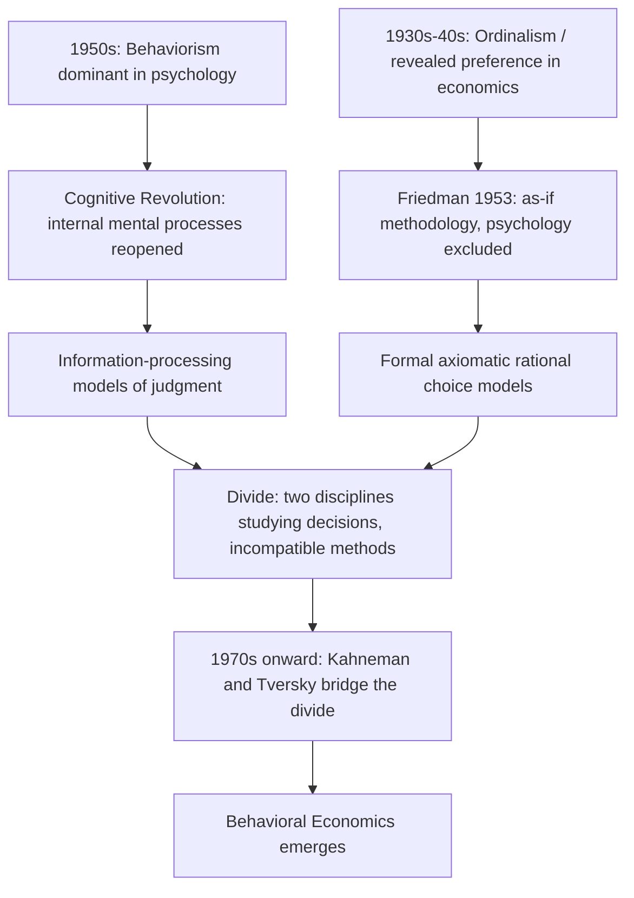

## The Cognitive Revolution and the Psychology-Economics Divide

### Overview

The Cognitive Revolution (roughly 1950s–1970s) was the paradigm shift in psychology away from behaviorism — which restricted scientific psychology to observable stimulus-response relationships — toward the study of internal mental processes: memory, perception, attention, reasoning, and judgment, modeled increasingly through information-processing and computational metaphors. This revolution occurred largely in parallel with, and mostly independent from, mainstream economics, which was simultaneously undergoing its own formalist turn toward axiomatic rational choice theory. The resulting **psychology-economics divide** — two disciplines both studying human decision-making but using incompatible methods, vocabularies, and standards of evidence — is the historical backdrop against which behavioral economics later emerged as a deliberate bridge-building project.

### The Cognitive Revolution in Psychology

**Key Points**

- Behaviorism (dominant roughly 1920s–1950s, associated with John B. Watson and B.F. Skinner) held that only observable behavior, not unobservable mental states, was a legitimate object of scientific psychology — treating the mind as a "black box."
- The Cognitive Revolution reopened the black box, driven by convergent developments: Noam Chomsky's 1959 critique of Skinner's *Verbal Behavior* (arguing language acquisition could not be explained by stimulus-response conditioning alone), the rise of computer science and information theory (offering a new vocabulary — encoding, storage, retrieval — for mental processes), and cognitive psychology pioneers such as George Miller, Ulric Neisser, and Jerome Bruner.
- George Miller's 1956 paper "The Magical Number Seven, Plus or Minus Two" became a foundational cognitive-revolution text, empirically demonstrating hard limits on human short-term memory capacity — an early, quantified demonstration of *bounded* cognitive processing that resonates directly with Herbert Simon's contemporaneous bounded rationality program in economics.
- Ulric Neisser's 1967 textbook *Cognitive Psychology* is often cited as the moment the field acquired its modern name and identity as a distinct subdiscipline.

### The Parallel, Divergent Path of Economics

**Key Points**

- While psychology was reopening the study of internal mental processes, economics was moving in the opposite methodological direction: toward the **ordinalist and revealed-preference program** (Hicks, Allen, Samuelson, 1930s–40s), which deliberately *excluded* psychological content from economic theory, redefining rationality as consistency of observed choices rather than any claim about internal reasoning.
- This was reinforced by Milton Friedman's 1953 "as-if" methodology, which explicitly argued that the psychological realism of assumptions was irrelevant to a model's scientific validity as long as its predictions were accurate.
- The result was a mid-20th-century economics discipline that was, by design, agnostic to — and largely uninterested in — the empirical findings of a psychology field that was simultaneously producing an explosion of new evidence about how humans actually process information, form judgments, and make decisions under uncertainty.

### Diagram: Two Disciplines Diverging, Then Reconverging

### Why the Divide Persisted for Decades

**1. Differing Standards of Evidence**

Economics increasingly valued formal, axiomatic derivation and mathematical tractability; cognitive psychology valued controlled experimental demonstration of specific effects — the two fields' publication norms and methodological training diverged sharply, making cross-disciplinary communication difficult even when researchers were interested.

**2. Differing Units of Analysis**

Economics traditionally focused on market-level or aggregate outcomes, where individual psychological quirks might plausibly wash out through aggregation or competition; cognitive psychology focused on individual-level mechanisms, with less concern for whether findings "mattered" at a market scale.

**3. Institutional Separation**

Psychology and economics developed as separate academic departments with separate journals, conferences, and graduate training pipelines, reducing the organic cross-pollination that might otherwise have occurred as both fields matured in the same decades. [Inference: this institutional-separation explanation is a standard historical account given in behavioral economics textbooks and retrospectives, though the precise causal weight of institutional versus methodological factors is difficult to disentangle and is not a matter of settled quantitative record.]

### Herbert Simon as an Early Bridge Figure

Simon occupies a unique position in this history: trained outside mainstream economics, working across psychology, computer science, and administrative theory, he was formulating bounded rationality (see prior item) in the 1940s–1950s — concurrently with, and partly informed by, the same information-processing turn that was producing the Cognitive Revolution in psychology proper. His work is often retrospectively identified as the first serious attempt to import cognitive-psychological realism into formal economic theory, decades before Kahneman and Tversky's work achieved wider uptake within economics itself. [Inference: while Simon's chronological priority and interdisciplinary position are well documented, the specific framing of him as "the first" bridge figure is a common historiographical characterization rather than an uncontested, precisely defined claim — other candidates (e.g., certain institutionalist economists) are occasionally proposed by historians of thought.]

### Kahneman and Tversky: Closing the Divide

**Example**

Daniel Kahneman and Amos Tversky, both trained as cognitive/mathematical psychologists (not economists), began publishing systematic, experimentally documented departures from expected utility theory in the early 1970s, culminating in their landmark 1979 paper "Prospect Theory: An Analysis of Decision under Risk" (published in *Econometrica*, a top economics journal — a deliberate and significant choice signaling their intent to engage economics on its own methodological terrain, using formal modeling rather than purely descriptive psychology).

This represents the key turning point: rather than economics belatedly importing loose psychological ideas, Kahneman and Tversky built a *formal, axiomatized alternative model* (prospect theory) that could be directly compared to expected utility theory using the same mathematical apparatus economists already used — making their cognitive-psychology findings legible and usable within economic theory for the first time at scale.

### Table: The Psychology-Economics Divide, Summarized

| Dimension | Mid-20th-Century Economics | Cognitive Psychology (post-Revolution) |
| --- | --- | --- |
| View of the mind | Black box / irrelevant (revealed preference) | Central object of study (information processing) |
| Primary method | Axiomatic modeling, formal proofs | Controlled experiments |
| Standard of validity | Predictive accuracy of aggregate outcomes ("as-if") | Internal, mechanistic accuracy of process |
| Treatment of error/bias | Assumed to cancel out in aggregate | Documented as systematic and replicable |
| Key figures | Samuelson, Hicks, Friedman | Miller, Neisser, Bruner, Chomsky |
| Bridging figures | Herbert Simon (bounded rationality) | Kahneman & Tversky (prospect theory) |

### Illustration: Convergence Toward Behavioral Economics (svg_diagram)

<svg xmlns="http://www.w3.org/2000/svg" viewBox="0 0 640 280">
<text x="320" y="24" text-anchor="middle" font-size="16" font-weight="bold" fill="#222">Convergence of Two Traditions (svg_diagram)</text>
<rect x="20" y="50" width="260" height="90" rx="10" fill="#eef4ff" stroke="#3b5bdb" stroke-width="1.5" />
<text x="150" y="75" text-anchor="middle" font-size="12" font-weight="bold" fill="#1c3d8f">Cognitive Psychology</text>
<text x="35" y="100" font-size="11" fill="#222">Information processing</text>
<text x="35" y="120" font-size="11" fill="#222">Memory, judgment, perception</text>
<rect x="360" y="50" width="260" height="90" rx="10" fill="#fff4e6" stroke="#e8590c" stroke-width="1.5" />
<text x="490" y="75" text-anchor="middle" font-size="12" font-weight="bold" fill="#a13c00">Neoclassical Economics</text>
<text x="375" y="100" font-size="11" fill="#222">Axiomatic rational choice</text>
<text x="375" y="120" font-size="11" fill="#222">Revealed preference</text>
<line x1="150" y1="140" x2="280" y2="200" stroke="#555" stroke-width="2" />
<line x1="490" y1="140" x2="360" y2="200" stroke="#555" stroke-width="2" />
<rect x="200" y="200" width="240" height="60" rx="10" fill="#f0f7ee" stroke="#2f9e44" stroke-width="1.5" />
<text x="320" y="235" text-anchor="middle" font-size="13" font-weight="bold" fill="#1c6b2c">Behavioral Economics</text>
</svg>

### Legacy: Establishing a Formal Sub-Discipline

**Key Points**

- The eventual, formal reconciliation of the divide was marked institutionally by Daniel Kahneman's 2002 Nobel Memorial Prize in Economic Sciences ("for having integrated insights from psychological research into economic science") — notable both because Kahneman was a psychologist by training and because the prize explicitly credited the *integration* of the two fields as a scientific achievement in its own right.
- The divide's resolution did not eliminate methodological tension: contemporary debates over the proper balance between formal modeling (favored by the economics tradition) and rich experimental documentation of specific effects (favored by the psychology tradition) continue to shape how behavioral economics research is conducted and evaluated. [Inference: describing this tension as "continuing" reflects the general character of ongoing methodological discussion in the field as of general knowledge; the specific current state of this debate should be checked against recent literature for precision.]
- The divide is now typically taught as essential historical context precisely because it explains *why* behavioral economics needed to exist as a distinct hybrid field, rather than simply being absorbed as an uncontroversial extension of either parent discipline.

### Conclusion

The Cognitive Revolution and the parallel formalist turn in economics produced two disciplines that, for several decades, studied human decision-making using fundamentally incompatible methods and assumptions — psychology increasingly focused on internal, information-processing mechanisms and their systematic limitations, while economics increasingly excluded psychological realism in favor of axiomatic, aggregate-level modeling. This divide set the stage for behavioral economics, which emerged specifically as a project to formally reintegrate cognitive-psychological findings into economic theory, first tentatively through Herbert Simon and then decisively through Kahneman and Tversky's prospect theory.

**Related Topics**

- Behaviorism vs. Cognitivism: Key Debates and Figures
- George Miller's "Magical Number Seven" and Working Memory Limits
- Prospect Theory: An Analysis of Decision under Risk (Kahneman & Tversky, 1979)
- The Institutionalization of Behavioral Economics as a Subfield
- Daniel Kahneman's Nobel Prize and Its Significance
- Information-Processing Models of Judgment and Decision-Making
- Interdisciplinary Methodology: Reconciling Formal Modeling and Experimentalism