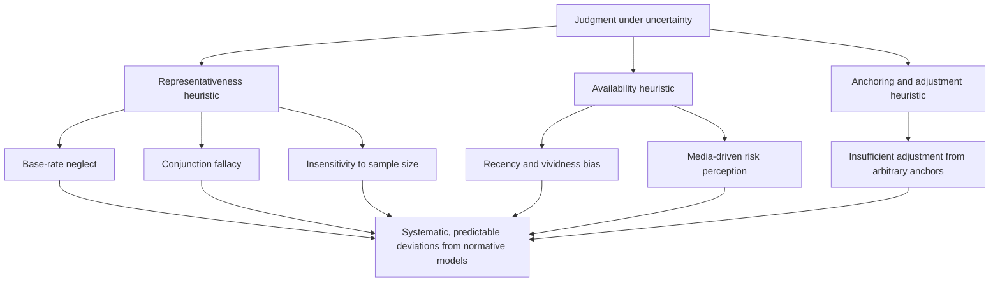

## Kahneman and Tversky and the Heuristics and Biases Program

### Overview

Daniel Kahneman and Amos Tversky's collaboration, beginning in the late 1960s and spanning roughly three decades until Tversky's death in 1996, produced the **heuristics and biases program**: a systematic, experimentally grounded research agenda documenting how human judgment under uncertainty relies on a small set of mental shortcuts (heuristics) that are generally efficient but produce predictable, systematic errors (biases) relative to normative statistical and logical standards. This program, alongside their later prospect theory, is the single most direct intellectual foundation of modern behavioral economics, and directly resolved the psychology-economics divide described in the prior item by producing findings formal enough for economists to incorporate into their own modeling tradition.

### Historical Development

- Kahneman and Tversky met at the Hebrew University of Jerusalem in 1969 and began a close research partnership characterized by extensive joint authorship and shared credit — an unusually deep collaboration that both later described as central to the work's success.
- Their earliest joint papers (early 1970s) focused on intuitive statistical judgment, documenting that even trained statisticians frequently violate basic statistical principles when reasoning intuitively rather than formally — a foundational demonstration that expertise alone does not eliminate systematic biases.
- The program's foundational synthesis appeared in their 1974 *Science* paper, "Judgment under Uncertainty: Heuristics and Biases," which catalogued the representativeness, availability, and anchoring-and-adjustment heuristics in a single, widely cited framework.
- Kahneman was awarded the 2002 Nobel Memorial Prize in Economic Sciences (Tversky, deceased in 1996, was ineligible under Nobel rules, which do not award prizes posthumously) "for having integrated insights from psychological research into economic science, especially concerning human judgment and decision-making under uncertainty."

### The Three Foundational Heuristics

**1. Representativeness Heuristic**

Judging the probability that an object or event belongs to a category based on how similar it is to a prototype of that category, while neglecting relevant statistical information such as base rates and sample size.

**Example**

In the well-known "Linda problem," participants were given a description of a young woman ("Linda") strongly evocative of a feminist activist, then asked to rank the probability of various statements, including "Linda is a bank teller" versus "Linda is a bank teller and is active in the feminist movement." A majority of participants rated the conjunction (bank teller *and* feminist) as more probable than the single condition (bank teller alone) — violating the basic conjunction rule of probability, since $P(A \cap B) \leq P(A)$ must always hold. This is termed the **conjunction fallacy**, and is explained by representativeness: the conjunction *felt* more representative of the description, even though it is logically less probable.

**2. Availability Heuristic**

Judging the frequency or probability of an event based on how easily instances of it come to mind, rather than on actual statistical frequency — meaning judgments are systematically biased by factors like recency, vividness, and media coverage rather than true base rates.

**3. Anchoring and Adjustment Heuristic**

Estimates of an unknown quantity are formed by starting from an initial "anchor" value (which may be entirely arbitrary or irrelevant) and adjusting from it — adjustments are typically insufficient, so final estimates remain biased toward the initial anchor.

**Example**

In a classic demonstration, participants spun a rigged wheel of fortune landing on either 10 or 65, then were asked to estimate the percentage of African countries in the United Nations. Participants who saw the number 65 gave systematically higher estimates than those who saw 10 — despite the wheel's output being obviously random and irrelevant to the actual question.

### Diagram: The Heuristics and Biases Framework

### Additional Key Biases Documented Under the Program

| Bias | Description |
| --- | --- |
| Base-rate neglect | Underweighting prior statistical probabilities in favor of specific case information |
| Insensitivity to sample size | Failing to account for the fact that smaller samples produce more variable results |
| Gambler's fallacy | Believing that independent random events are influenced by prior outcomes (e.g., expecting a "correction" after a run of similar results) |
| Illusion of validity | Excessive confidence in judgments based on the internal coherence of information, regardless of its actual predictive validity |
| Hindsight bias | The tendency, after an outcome is known, to overestimate how predictable that outcome was beforehand |
| Overconfidence | Systematic overestimation of the accuracy of one's own judgments and predictions |
| Framing effects | Preferences shift depending on whether logically equivalent outcomes are described in terms of gains or losses |

### The Two-System Framework (Later Formalization)

Kahneman later formalized the psychological architecture underlying heuristics and biases using a dual-process framework, popularized in his 2011 book *Thinking, Fast and Slow*:

- **System 1**: fast, automatic, intuitive, effortless, and associative — the source of heuristic judgments.
- **System 2**: slow, deliberate, effortful, and rule-based — capable of correcting System 1 outputs, but limited by bounded cognitive resources (directly connecting back to Herbert Simon's bounded rationality) and often not engaged unless explicitly triggered. [Note: this dual-process framing is a later synthesis by Kahneman, building on earlier dual-process theories in cognitive psychology (e.g., work by Keith Stanovich and others), rather than a component of the original 1970s heuristics-and-biases papers themselves.]

### Methodological Approach

**Key Points**

- The program's core method was the controlled experiment: presenting participants with carefully constructed judgment problems (often with formally correct, calculable answers) and comparing actual responses to the normatively correct answer derived from probability theory, statistics, or logic.
- This methodology directly mirrors experimental cognitive psychology (per the prior item's discussion of the psychology-economics divide) rather than economics' traditional reliance on revealed preference from market or survey data — a deliberate methodological import.
- A recurring critique, raised prominently by Gerd Gigerenzer, is that many "biases" are artifacts of testing intuitive judgment against inappropriate normative benchmarks, or of unrepresentative problem framing (e.g., presenting probabilities rather than natural frequencies) — Gigerenzer's ecological rationality program argues that many heuristics perform well, or even better than formal statistical methods, in real-world environments with appropriate information formats. This remains an active methodological debate within judgment-and-decision-making research. [Inference: the characterization of this debate as "active" and its general contours are well documented in the literature, but the current balance of expert opinion should be verified against recent surveys if precision on present-day consensus is required.]

### Illustration: System 1 vs. System 2 (svg_diagram)

<svg xmlns="http://www.w3.org/2000/svg" viewBox="0 0 640 260">
<text x="320" y="24" text-anchor="middle" font-size="16" font-weight="bold" fill="#222">Dual-Process Judgment (svg_diagram)</text>
<rect x="30" y="50" width="260" height="160" rx="10" fill="#fff4e6" stroke="#e8590c" stroke-width="1.5" />
<text x="160" y="75" text-anchor="middle" font-size="13" font-weight="bold" fill="#a13c00">System 1</text>
<text x="45" y="100" font-size="11" fill="#222">Fast, automatic</text>
<text x="45" y="120" font-size="11" fill="#222">Intuitive, associative</text>
<text x="45" y="140" font-size="11" fill="#222">Low effort</text>
<text x="45" y="160" font-size="11" fill="#222">Source of heuristics</text>
<text x="45" y="180" font-size="11" fill="#222">Prone to systematic bias</text>
<rect x="350" y="50" width="260" height="160" rx="10" fill="#eef4ff" stroke="#3b5bdb" stroke-width="1.5" />
<text x="480" y="75" text-anchor="middle" font-size="13" font-weight="bold" fill="#1c3d8f">System 2</text>
<text x="365" y="100" font-size="11" fill="#222">Slow, deliberate</text>
<text x="365" y="120" font-size="11" fill="#222">Rule-based, logical</text>
<text x="365" y="140" font-size="11" fill="#222">High effort</text>
<text x="365" y="160" font-size="11" fill="#222">Can override System 1</text>
<text x="365" y="180" font-size="11" fill="#222">Bounded by cognitive resources</text>
<line x1="290" y1="130" x2="350" y2="130" stroke="#555" stroke-width="2" marker-end="url(#arrow3)" />
</svg>

### Impact on Economics: From Anomaly Catalog to Formal Theory

**Key Points**

- The heuristics and biases program initially functioned primarily as a catalog of documented judgment anomalies, drawn from psychology and largely descriptive in nature — its direct economic modeling implications were developed subsequently, most significantly through prospect theory (1979), which formalized systematic biases in decision-making *under risk* specifically (distinct from, though related to, the broader judgment-under-uncertainty heuristics catalogued here).
- The program's economic significance lies in demonstrating that judgment errors are not random noise that cancels out in aggregate (as the classical "aggregation defense" of homo economicus assumes) but are **systematic and directionally predictable** — meaning they can bias market outcomes, policy effectiveness, and individual welfare in consistent, modelable ways rather than washing out.
- This systematic-bias framing became the central justification for behavioral economics as a distinct field: if biases were random, classical economics' aggregation arguments would remain largely intact; because they are systematic, formal economic models require revision to account for them.

### Conclusion

Kahneman and Tversky's heuristics and biases program established, through rigorous controlled experimentation, that human judgment under uncertainty relies on a small set of cognitive heuristics — representativeness, availability, and anchoring-and-adjustment — that produce systematic, predictable, and non-self-canceling deviations from normative statistical reasoning. This body of work directly supplied behavioral economics with its empirical foundation and its central methodological innovation: testing intuitive judgment against precisely specified normative benchmarks, then building formal models (most importantly prospect theory) that incorporate the documented biases into economic decision theory.

**Related Topics**

- Prospect Theory: An Analysis of Decision under Risk (1979)
- The Conjunction Fallacy and the Linda Problem
- Anchoring Effects in Pricing and Negotiation
- Gerd Gigerenzer and the Ecological Rationality Critique
- Dual-Process Theory: System 1 and System 2 Thinking
- Availability Cascades and Media-Driven Risk Perception
- Overconfidence and Miscalibration in Expert Judgment