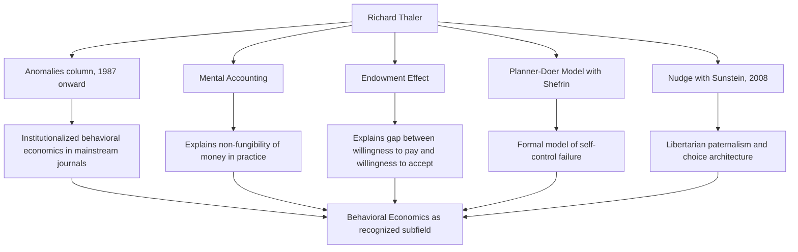

## Richard Thaler and the Founding of Modern Behavioral Economics

### Overview

Richard H. Thaler (b. 1945) is widely credited as the economist most responsible for institutionalizing behavioral economics as a formal subfield within economics itself, distinct from the largely psychology-originated heuristics-and-biases and prospect-theory work of Kahneman and Tversky. Where Kahneman and Tversky supplied the empirical and formal-theoretical foundations from psychology, Thaler — trained as an economist — systematically identified, catalogued, and modeled anomalies in *economic* behavior specifically (consumer choice, saving, labor supply, market pricing) that classical theory could not explain, and built the institutional infrastructure (journals, conferences, professional networks) that turned behavioral economics into a recognized subdiscipline. He was awarded the 2017 Nobel Memorial Prize in Economic Sciences "for his contributions to behavioural economics."

### Early Career and the "Anomalies" Column

**Key Points**

- Thaler's foundational contribution began with a personal notebook, started in the late 1970s while he was a young economist, in which he recorded observed instances of economic behavior that violated standard rational-choice predictions — a project later described as the direct precursor to his systematic anomalies research.
- Thaler formalized this work into the "Anomalies" column, published regularly in the *Journal of Economic Perspectives* starting in 1987, which presented short, accessible write-ups of specific documented deviations from rational choice theory (e.g., the endowment effect, mental accounting, preference reversals) directly to a professional economics audience — a deliberate strategy to make behavioral findings legible and citable within mainstream economics journals rather than confined to psychology outlets.
- This column format is historically significant: it normalized behavioral anomalies as a legitimate, ongoing subject of economic inquiry rather than isolated curiosities, building a cumulative body of work that economists could reference and build upon.

### Key Theoretical Contributions

**1. Mental Accounting**

Thaler's theory that individuals do not treat money as perfectly fungible (as classical theory assumes) but instead mentally partition money into separate, non-interchangeable "accounts" (e.g., a vacation fund, a mortgage payment, "found money" from a bonus), leading to systematically different spending and saving behavior depending on which mental account funds are assigned to, even when the money is objectively identical.

**Example**

A classical rational agent should be indifferent between spending $50 of "regular salary" versus $50 won unexpectedly in a lottery — both are simply $50 of wealth. Mental accounting predicts, and experimental/survey evidence documents, that people are systematically more willing to spend unexpected "windfall" money on frivolous purchases than an equivalent amount of regular income, because the two are mentally categorized into different accounts with different implicit spending rules.

**2. The Endowment Effect**

The empirical finding that individuals assign greater value to objects merely because they own them, compared to the value they would assign to the identical object if they did not own it — violating the Coase theorem's prediction that, absent transaction costs, initial allocation of property rights should not affect final, efficient outcomes.

**3. Preference Reversals and Time Inconsistency**

Building on earlier psychological work on intertemporal choice, Thaler contributed to formalizing why individuals often prefer smaller-sooner rewards over larger-later rewards when the choice is immediate, while preferring larger-later rewards when both options are far in the future — a pattern inconsistent with the exponential discounting assumed in the classical homo economicus model, and better captured by hyperbolic discounting.

**4. The Dual-Self / Planner-Doer Model**

Developed with Hersh Shefrin (1981), this model formalizes self-control problems by representing a single individual as containing two competing internal agents: a forward-looking, patient "planner" and a myopic, impulsive "doer" — providing a tractable economic framework for modeling phenomena like procrastination, undersaving, and impulsive consumption that pure exponential-discounting models cannot generate.

### Diagram: Thaler's Core Contributions

### Institutional Founding Role

**Key Points**

- Thaler was a founding figure in establishing behavioral economics as an organized academic community, including involvement in launching the Russell Sage Foundation's Behavioral Economics program (which funded early empirical and theoretical work in the field starting in the late 1980s) and later co-founding, with others, the National Bureau of Economic Research's behavioral economics working group.
- His long collaboration with legal scholar Cass Sunstein produced *Nudge: Improving Decisions About Health, Wealth, and Happiness* (2008), which translated behavioral economics findings into a policy framework — **libertarian paternalism** — arguing that "choice architecture" (the way options are presented) can be designed to help people make better decisions for themselves without restricting their freedom of choice. [Inference: the term "libertarian paternalism" is directly attributable to Thaler and Sunstein's own writing; the broader characterization of *Nudge*'s overall impact on public policy practice is well documented but its precise scope and effectiveness remain subjects of ongoing academic and policy debate.]
- Thaler served as president of the American Economic Association (2015) — a marker of behavioral economics' full acceptance into mainstream economics by the mid-2010s, a stark contrast to the discipline's marginal status when Thaler began his anomalies research in the late 1970s.

### Illustration: From Anomaly to Institutionalized Subfield (svg_diagram)

<svg xmlns="http://www.w3.org/2000/svg" viewBox="0 0 640 240">
<text x="320" y="24" text-anchor="middle" font-size="16" font-weight="bold" fill="#222">Institutionalization Timeline (svg_diagram)</text>
<line x1="60" y1="130" x2="580" y2="130" stroke="#888" stroke-width="2" />
<circle cx="100" cy="130" r="6" fill="#3b5bdb" />
<text x="100" y="155" text-anchor="middle" font-size="11" fill="#222">Late 1970s</text>
<text x="100" y="170" text-anchor="middle" font-size="10" fill="#555">Personal anomalies notebook</text>
<circle cx="250" cy="130" r="6" fill="#3b5bdb" />
<text x="250" y="155" text-anchor="middle" font-size="11" fill="#222">1987</text>
<text x="250" y="170" text-anchor="middle" font-size="10" fill="#555">Anomalies column launched (JEP)</text>
<circle cx="400" cy="130" r="6" fill="#3b5bdb" />
<text x="400" y="155" text-anchor="middle" font-size="11" fill="#222">2008</text>
<text x="400" y="170" text-anchor="middle" font-size="10" fill="#555">Nudge published</text>
<circle cx="530" cy="130" r="6" fill="#3b5bdb" />
<text x="530" y="155" text-anchor="middle" font-size="11" fill="#222">2017</text>
<text x="530" y="170" text-anchor="middle" font-size="10" fill="#555">Nobel Memorial Prize</text>
</svg>

### Thaler's Position Relative to Kahneman and Tversky

| Dimension | Kahneman & Tversky | Thaler |
| --- | --- | --- |
| Disciplinary training | Cognitive/mathematical psychology | Economics |
| Primary contribution | Empirical documentation and formal theory of judgment/choice biases (heuristics, prospect theory) | Application and extension of biases to specific economic domains (saving, pricing, labor supply) |
| Method | Controlled psychological experiments | Field anomalies, applied theory, and later field/lab experiments |
| Institutional role | Established the psychological/theoretical credibility of the biases | Built the economics-discipline infrastructure (journals, working groups, policy translation) |
| Nobel recognition | 2002 (Kahneman; Tversky deceased, ineligible) | 2017 |

### Conclusion

Richard Thaler's distinctive contribution to behavioral economics was less the discovery of entirely new psychological phenomena — much of the underlying psychology originated with Kahneman, Tversky, and earlier cognitive scientists — and more the systematic translation, extension, and institutionalization of these findings *within* economics: identifying economically consequential anomalies (mental accounting, the endowment effect, self-control failures), building formal economic models to represent them (the planner-doer model), and creating the durable institutional infrastructure (the Anomalies column, professional networks, and eventually policy frameworks like Nudge) that transformed behavioral economics from a scattered set of psychological curiosities into a recognized, Nobel-honored subfield of economics.

**Related Topics**

- Mental Accounting: Theory and Applications in Personal Finance
- The Endowment Effect and the Willingness-to-Pay/Willingness-to-Accept Gap
- The Planner-Doer Model and Formal Approaches to Self-Control
- Nudge Theory and Libertarian Paternalism
- Choice Architecture in Policy Design (e.g., Retirement Savings Defaults)
- Field Experiments in Behavioral Economics
- The Coase Theorem and Its Behavioral Critique