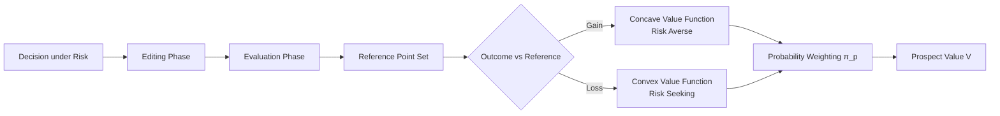
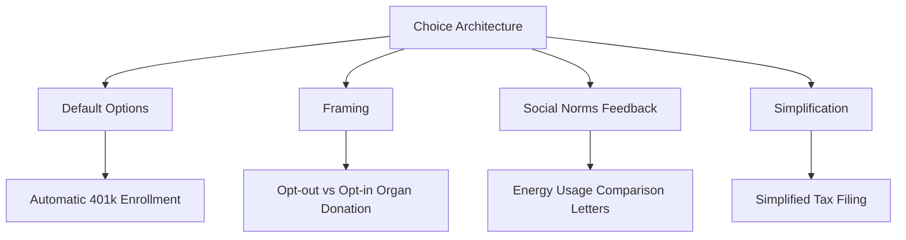
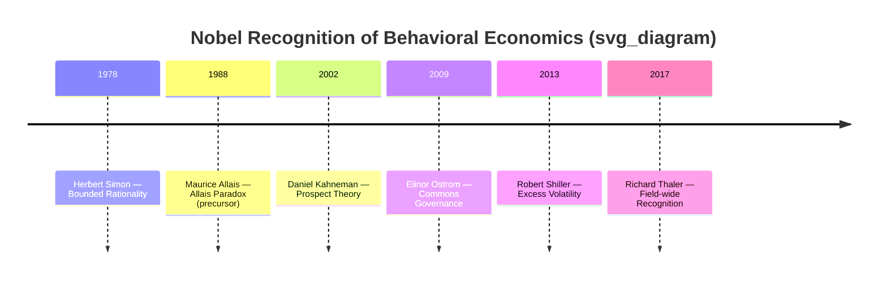

## Nobel Laureates and Landmark Contributions to the Field

### Overview

Behavioral economics has been recognized by the Nobel Memorial Prize in Economic Sciences on several occasions, reflecting the field's maturation from a fringe critique of neoclassical theory into a central paradigm in economics. This section documents the laureates most directly associated with behavioral economics, their landmark contributions, and the theoretical lineage connecting their work.

Four Nobel laureates are typically identified as foundational to the field: Herbert Simon (1978), Maurice Allais (1988, precursor), Daniel Kahneman (2002), and Richard Thaler (2017). Robert Shiller (2013) and Elinor Ostrom (2009) are also frequently included for adjacent contributions. Amos Tversky, Kahneman's principal collaborator, is a notable non-laureate, since the Nobel Prize is not awarded posthumously and Tversky died in 1996.

### Herbert A. Simon (1978)

**Key Points**

- Awarded "for his pioneering research into the decision-making process within economic organizations"
- Introduced the concept of **bounded rationality**: decision-makers operate under constraints of limited information, limited cognitive processing capacity, and limited time
- Introduced **satisficing** as an alternative to optimizing: agents select an option that meets an acceptable threshold rather than searching exhaustively for the optimal choice
- Work predates the formal establishment of behavioral economics as a subfield but supplies its foundational epistemological premise: humans are not perfect optimizers

**Landmark Contribution**

Simon's 1955 paper "A Behavioral Model of Rational Choice" formalized bounded rationality mathematically, arguing that classical rational-choice models assumed unrealistic computational capacities. This reframed the decision-maker from a utility-maximizing calculator to a resource-constrained problem-solver.

$$U_{satisficing}(x) = \begin{cases} \text{accept } x & \text{if } u(x) \geq \theta \\ \text{continue search} & \text{if } u(x) < \theta \end{cases}$$

where $\theta$ is an aspiration-level threshold, not a global maximum.

**Example**

A job seeker who accepts the first offer meeting a minimum salary and location threshold, rather than exhaustively comparing every available position, is satisficing rather than optimizing.

### Maurice Allais (1988) — Precursor Contribution

**Key Points**

- Awarded primarily for contributions to general equilibrium theory and efficient resource utilization, not behavioral economics specifically
- Best known within behavioral economics for the **Allais Paradox** (1953), which predates his Nobel award
- The paradox demonstrated systematic violations of the independence axiom of Expected Utility Theory (EUT)

**Landmark Contribution**

The Allais Paradox presents two pairs of gambles where consistent EUT-based preferences are empirically violated by most subjects. This became one of the earliest formal, replicable demonstrations that human choice under risk deviates predictably from normative rational-choice axioms — a result later absorbed and formalized by Kahneman and Tversky in Prospect Theory.

[Inference] Allais is best described as a precursor to behavioral economics rather than a behavioral economist himself; his Nobel citation does not reference behavioral decision theory directly.

### Daniel Kahneman (2002)

**Key Points**

- Awarded "for having integrated insights from psychological research into economic science, especially concerning human judgment and decision-making under uncertainty"
- Shared conceptually (though not formally, due to Tversky's 1996 death) with Amos Tversky
- Principal architect of **Prospect Theory** (1979), **heuristics and biases** research program, and the **dual-process framework** (System 1 / System 2) popularized in *Thinking, Fast and Slow* (2011)

**Landmark Contribution: Prospect Theory**

Prospect Theory (Kahneman & Tversky, 1979) replaced Expected Utility Theory as the dominant descriptive model of choice under risk. Its core components:

1. **Reference dependence** — outcomes are evaluated as gains or losses relative to a reference point, not as absolute states of wealth
2. **Loss aversion** — losses loom larger than equivalent gains, typically by a factor of roughly 2:1 to 2.5:1
3. **Diminishing sensitivity** — the value function is concave for gains and convex for losses (both exhibit diminishing marginal sensitivity to distance from the reference point)
4. **Probability weighting** — small probabilities are overweighted and moderate-to-large probabilities are underweighted, captured by a nonlinear weighting function $\pi(p)$

The value function is:

$$v(x) = \begin{cases} x^{\alpha} & \text{if } x \geq 0 \\ -\lambda(-x)^{\beta} & \text{if } x < 0 \end{cases}$$

where $\lambda > 1$ represents the loss-aversion coefficient (empirically estimated around 2.25 in the original study), and $\alpha, \beta \in (0,1)$ govern diminishing sensitivity.

**Example**

Most people reject a 50/50 gamble to win $150 or lose $100, despite its positive expected value ($EV = 0.5(150) + 0.5(-100) = 25$), because the subjective disutility of the potential $100 loss exceeds the subjective utility of the potential $150 gain.

**Landmark Contribution: Heuristics and Biases Program**

Kahneman and Tversky's earlier collaborative work (beginning with "Judgment under Uncertainty: Heuristics and Biases," *Science*, 1974) catalogued systematic cognitive shortcuts, including:

- **Availability heuristic** — probability judgments biased by ease of recall
- **Representativeness heuristic** — probability judgments biased by similarity to a prototype, producing errors such as the conjunction fallacy (the "Linda problem")
- **Anchoring and adjustment** — numeric estimates biased toward an initially presented (even arbitrary) anchor value

### Amos Tversky (Non-Laureate Collaborator)

**Key Points**

- Co-developer of Prospect Theory and the heuristics-and-biases program
- Died in 1996; the Nobel Prize is not awarded posthumously per Nobel Foundation statutes, so Tversky was ineligible in 2002
- Kahneman has publicly stated the prize was in substantial part a recognition of the joint body of work with Tversky

[Unverified] The precise internal deliberations of the Nobel Committee regarding Tversky's exclusion are not publicly documented in full; the exclusion is attributable to the posthumous-award rule as a matter of established Nobel Foundation policy.

### Robert J. Shiller (2013)

**Key Points**

- Shared the 2013 prize with Eugene Fama and Lars Peter Hansen "for their empirical analysis of asset prices"
- Awarded for work bridging behavioral finance and asset-pricing theory, notably demonstrating **excess volatility** in stock and housing markets relative to what efficient-market models predict
- Author of *Irrational Exuberance* (2000), which anticipated both the dot-com crash and, in its 2005 edition, the U.S. housing bubble

**Landmark Contribution**

Shiller's excess volatility tests (1981) showed that stock price movements are too large to be explained solely by rational updating on future dividend information, implying a role for sentiment, herd behavior, and speculative feedback loops — directly connecting behavioral psychology to asset-pricing anomalies.

### Elinor Ostrom (2009) — Adjacent Contribution

**Key Points**

- Shared the 2009 prize with Oliver Williamson "for her analysis of economic governance, especially the commons"
- Not a behavioral economist in the Kahneman/Thaler sense, but her empirical work challenged the standard rational-actor prediction (the "tragedy of the commons") by documenting real-world cooperative, norm-based governance of shared resources
- First and (as of the 2025 award cycle) still the only woman to receive the Economics Nobel

[Inference] Ostrom's inclusion in behavioral economics surveys is a matter of disciplinary convention rather than a direct methodological alignment with Kahneman-Tversky-style cognitive research; she is more precisely categorized under institutional economics and commons governance.

### Richard H. Thaler (2017)

**Key Points**

- Awarded "for his contributions to behavioral economics"
- Explicitly awarded for the field itself, unlike Kahneman's more circumscribed citation
- Developed **mental accounting**, formalized the **endowment effect**, co-developed **nudge theory**, and helped establish behavioral economics as an institutionally recognized subfield through founding roles in behavioral finance and the Center for Decision Research

**Landmark Contribution: Mental Accounting**

Thaler's mental accounting framework (1985, 1999) describes how individuals categorize, budget, and evaluate financial outcomes in separate psychological "accounts" rather than treating money as fully fungible, violating the fungibility assumption of standard economic theory.

**Example**

A household that maintains a low-interest savings account while carrying high-interest credit card debt is violating rational fungibility (it would be strictly better to use savings to pay down debt), but this behavior is explained by mental accounting: the savings account is mentally earmarked (e.g., "emergency fund") and treated as a separate, non-fungible category.

**Landmark Contribution: Nudge Theory**

Thaler and Cass Sunstein's *Nudge: Improving Decisions About Health, Wealth, and Happiness* (2008) formalized **libertarian paternalism** and choice architecture — the design of decision environments that steer behavior in predictable directions without restricting options or altering economic incentives.

**Landmark Contribution: Endowment Effect**

Thaler formalized (1980) and later empirically confirmed with Kahneman and Knetsch (1990, 1991) that individuals demand substantially more to give up an object they own than they would be willing to pay to acquire it, contradicting the Coase Theorem's assumption that initial allocation of property rights does not affect final allocation under low transaction costs.

$$WTA > WTP$$

where WTA is willingness-to-accept (to sell) and WTP is willingness-to-pay (to acquire), for the identical good.

### Timeline of Recognition

### Comparative Summary Table

| Laureate | Year | Core Contribution | Primary Mechanism Challenged |
| --- | --- | --- | --- |
| Herbert Simon | 1978 | Bounded rationality, satisficing | Perfect optimization |
| Maurice Allais | 1988 | Allais Paradox | Independence axiom (EUT) |
| Daniel Kahneman | 2002 | Prospect Theory, heuristics & biases | Expected Utility Theory |
| Elinor Ostrom | 2009 | Commons governance | Tragedy-of-the-commons prediction |
| Robert Shiller | 2013 | Excess volatility | Efficient Market Hypothesis |
| Richard Thaler | 2017 | Mental accounting, nudge theory, endowment effect | Fungibility, Coase Theorem |

### Conclusion

The Nobel recognitions trace a coherent intellectual arc: Simon established that rationality is bounded; Allais empirically cracked the axiomatic foundation of expected utility; Kahneman (with Tversky) supplied a replacement descriptive model and a catalogue of systematic biases; Shiller extended the critique into asset markets; and Thaler operationalized the accumulated findings into applied policy tools and formally institutionalized the field. Ostrom's inclusion reflects a broader challenge to rational-actor assumptions rather than direct methodological continuity with the Kahneman-Tversky-Thaler lineage.

**Related Topics**

- Prospect Theory: Value Function and Probability Weighting (deep-dive)
- Heuristics and Biases: Anchoring, Availability, Representativeness
- Bounded Rationality vs. Ecological Rationality (Gigerenzer's critique of Kahneman-Tversky)
- Mental Accounting and Household Finance
- Libertarian Paternalism and Choice Architecture in Public Policy
- Behavioral Game Theory and the Ultimatum Game
- The Efficient Market Hypothesis vs. Behavioral Finance
- Amos Tversky's Independent Contributions and the Nobel Posthumous-Award Rule