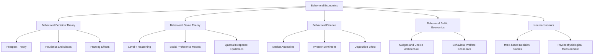

## Scope, Methods, and Boundaries of Behavioral Economics as a Discipline

### Definition and Disciplinary Positioning

Behavioral economics is the subfield of economics that studies how psychological, cognitive, emotional, social, and cultural factors affect the economic decisions of individuals and institutions, and the consequences of those factors for market prices, resource allocation, and welfare outcomes. It occupies a hybrid position: it retains the formal modeling apparatus and welfare orientation of neoclassical economics while importing empirical findings and theoretical constructs from psychology, particularly cognitive and social psychology.

The discipline is best understood as a **modification** rather than a wholesale rejection of the neoclassical research program. Standard economics models agents as rational, self-interested optimizers with stable preferences and unlimited computational capacity (the "rational choice" or "Homo economicus" model). Behavioral economics relaxes one or more of these assumptions while typically preserving the core methodological commitment to formal, testable models and equilibrium-style reasoning.

### The Three Canonical Departures from Standard Rationality

Behavioral economics is often organized around three broad categories of departure from the neoclassical benchmark:

**Bounded Rationality** — Agents face limits on their cognitive processing power, information, and time, and therefore rely on heuristics (mental shortcuts) rather than exhaustive optimization. This traces to Herbert Simon's concept of "satisficing," where agents seek outcomes that are good enough rather than optimal.

**Bounded Willpower** — Agents' choices are frequently inconsistent with their own long-term interests due to self-control problems, present bias, and time-inconsistent preferences. This manifests in phenomena such as procrastination, undersaving, and failure to follow through on stated intentions.

**Bounded Self-Interest** — Agents exhibit concern for fairness, reciprocity, and the welfare of others, deviating from the pure self-interest assumption. This underlies experimental findings on cooperation, altruistic punishment, and fairness-based rejections of unequal offers.

### Methodological Toolkit

Behavioral economics is distinguished as much by its methods as by its substantive claims. Its methodological toolkit includes:

- **Laboratory experiments**: Controlled, incentive-compatible experiments (often using monetary stakes) adapted from experimental economics, used to isolate specific psychological mechanisms under controlled conditions.
- **Field experiments**: Randomized controlled trials (RCTs) conducted in naturalistic settings (e.g., workplaces, markets, government programs) to test whether lab-derived effects generalize and to measure real-world magnitudes.
- **Natural experiments and quasi-experimental design**: Exploiting exogenous variation in observational data (policy changes, discontinuities, natural shocks) when randomization is infeasible.
- **Survey and vignette methods**: Eliciting stated preferences, beliefs, and hypothetical choices, often used in early theory development (e.g., Kahneman and Tversky's original prospect theory work).
- **Structural and reduced-form econometrics**: Estimating behavioral parameters (e.g., present-bias parameter $\beta$, loss-aversion coefficient $\lambda$) from field data using econometric models that nest behavioral and standard parameters.
- **Neuroeconomic methods**: fMRI, EEG, and psychophysiological measurement used to identify neural correlates of decision processes, forming the more contested "neuroeconomics" wing of the field.
- **Computational and agent-based modeling**: Simulating markets or populations composed of boundedly rational agents to study emergent, aggregate-level consequences.

A methodological hallmark of behavioral economics, distinguishing it from pure psychology, is its retention of **formal modeling**: departures from standard rationality are typically expressed as modifications to the utility function or decision-weighting function (e.g., prospect theory's value function, quasi-hyperbolic discounting), rather than as purely descriptive or narrative psychological accounts. This allows behavioral models to generate testable, quantitative predictions and to be embedded within larger equilibrium frameworks.

### Relationship to Standard (Neoclassical) Economics

| Dimension | Standard Economics | Behavioral Economics |
| --- | --- | --- |
| Preferences | Stable, complete, transitive | May be reference-dependent, context-sensitive, time-inconsistent |
| Belief formation | Bayesian, rational expectations | Subject to systematic biases (overconfidence, availability, base-rate neglect) |
| Decision process | Full optimization | Heuristic-based, bounded by cognitive constraints |
| Self-interest | Assumed exclusive | Augmented with fairness, reciprocity, social preferences |
| Primary validation | Revealed preference, internal consistency | Experimental falsification, out-of-sample prediction |
| Modeling style | Axiomatic, deductive | Axiomatic but empirically calibrated/adjusted |

Behavioral economics does not discard optimization-based modeling; it modifies the objects being optimized (e.g., a value function defined over gains and losses relative to a reference point, rather than over final wealth states). This is why prospect theory, hyperbolic discounting, and social-preference models (e.g., inequity aversion) are formal utility-style models compatible with standard comparative-statics analysis, even though they originate from psychological observation.

### Subfields and Boundaries Within Behavioral Economics

The discipline has differentiated into several semi-distinct research programs, each with its own methods emphasis:

**Behavioral Decision Theory** — Focuses on judgment under risk and uncertainty; core outputs include prospect theory, heuristics-and-biases research, and framing effects. Closest to cognitive psychology.

**Behavioral Game Theory** — Studies strategic interaction among boundedly rational or socially motivated agents; incorporates level-k reasoning, quantal response equilibrium, and social-preference models into game-theoretic frameworks.

**Behavioral Finance** — Applies behavioral insights to asset pricing, portfolio choice, and market anomalies (e.g., momentum, excess volatility, disposition effect); closely tied to testing market efficiency.

**Behavioral Public Economics / Libertarian Paternalism** — Applies behavioral findings to policy design, notably through "nudges" and choice architecture (Thaler and Sunstein), addressing questions of welfare when preferences may not be well-formed or consistent (i.e., how to conduct welfare analysis when the standard revealed-preference criterion is unreliable).

**Neuroeconomics** — The most methodologically contested subfield; uses neuroscientific data to inform or test economic models, but faces disciplinary boundary disputes over whether physiological data can or should inform economic theory versus merely economic psychology.

### Boundaries and Disputed Edges of the Discipline

Several boundary questions remain actively contested within the field:

- **Where behavioral economics ends and psychology begins**: Behavioral economics generally restricts itself to phenomena with clear implications for economic choice (consumption, saving, labor supply, investment, market prices), and insists on formal modeling and often incentive-compatible experiments, distinguishing it from psychology's broader descriptive and hypothetical-choice methods. [Inference: the precise boundary is a matter of ongoing disciplinary negotiation rather than a settled criterion.]
- **Whether "irrationality" is the correct framing**: Critics (and some behavioral economists themselves) argue that many so-called biases are context-appropriate heuristics that perform well in naturalistic environments (the "ecological rationality" critique associated with Gerd Gigerenzer), challenging the premise that deviations from expected-utility axioms constitute error.
- **Welfare economics under non-standard preferences**: If preferences are unstable, reference-dependent, or subject to influence by choice architecture, the standard welfare criterion (respecting revealed preferences) becomes ambiguous. This has generated the subfield of "behavioral welfare economics," which attempts to define welfare-relevant preferences separately from choice-inconsistent behavior.
- **External validity of laboratory findings**: A persistent methodological boundary dispute concerns whether effects documented in low-stakes, artificial laboratory settings (often with student subjects) generalize to high-stakes, real-world field settings — motivating the shift toward field experiments in the past two decades.
- **Replicability**: Like much of experimental social science, some canonical behavioral findings have faced replication challenges in the post-2010 "replication crisis," prompting more stringent standards around pre-registration, larger sample sizes, and multi-site replication. [Unverified: the replicability of any specific named effect should be checked against current meta-analytic evidence rather than assumed from original publication.]

### Illustrative Example: Same Phenomenon, Two Methodological Lenses

Consider the endowment effect (the tendency for individuals to value a good more highly once they own it).

- **Standard economics** would predict no significant gap between willingness-to-accept (WTA) to sell an owned good and willingness-to-pay (WTP) to acquire the same good, absent transaction costs or income effects, since the Coase theorem implies initial allocation should not affect final allocation when trade is costless.
- **Behavioral economics**, using controlled laboratory exchange experiments (e.g., the classic mug experiments by Kahneman, Knetsch, and Thaler), documents a persistent WTA/WTP gap, models it via loss aversion in prospect theory (losses relative to a reference point loom larger than equivalent gains), and further tests it with field experiments (e.g., trading behavior in real markets) to establish that the effect is not solely an artifact of unfamiliarity with laboratory tasks.

This example illustrates the discipline's characteristic method: identify a robust empirical anomaly relative to the standard model, propose a formal psychological mechanism, and test the mechanism's predictions across lab and field settings.

### Process Diagram: Behavioral Economics Research Cycle (svg_diagram)

<svg xmlns="http://www.w3.org/2000/svg" viewBox="0 0 900 340" font-family="Helvetica, Arial, sans-serif">
<text x="450" y="24" text-anchor="middle" font-size="16" font-weight="bold" fill="#222">Behavioral Economics Research Cycle (svg_diagram)</text>
<rect x="30" y="60" width="160" height="70" rx="8" fill="#e8f0fe" stroke="#3b5bdb" stroke-width="1.5" />
<text x="110" y="88" text-anchor="middle" font-size="12" fill="#1a2b6d">Observed anomaly</text>
<text x="110" y="105" text-anchor="middle" font-size="11" fill="#1a2b6d">(deviation from</text>
<text x="110" y="119" text-anchor="middle" font-size="11" fill="#1a2b6d">standard model)</text>
<rect x="240" y="60" width="160" height="70" rx="8" fill="#fef3e8" stroke="#e07b1f" stroke-width="1.5" />
<text x="320" y="88" text-anchor="middle" font-size="12" fill="#6d3a0f">Psychological</text>
<text x="320" y="105" text-anchor="middle" font-size="11" fill="#6d3a0f">mechanism</text>
<text x="320" y="119" text-anchor="middle" font-size="11" fill="#6d3a0f">proposed</text>
<rect x="450" y="60" width="160" height="70" rx="8" fill="#eafaf1" stroke="#1f9d55" stroke-width="1.5" />
<text x="530" y="88" text-anchor="middle" font-size="12" fill="#0f5c30">Formal model</text>
<text x="530" y="105" text-anchor="middle" font-size="11" fill="#0f5c30">(modified utility /</text>
<text x="530" y="119" text-anchor="middle" font-size="11" fill="#0f5c30">decision function)</text>
<rect x="660" y="60" width="200" height="70" rx="8" fill="#fbe8ee" stroke="#c22a5e" stroke-width="1.5" />
<text x="760" y="88" text-anchor="middle" font-size="12" fill="#7a1638">Lab experiment</text>
<text x="760" y="105" text-anchor="middle" font-size="11" fill="#7a1638">(controlled, incentive-</text>
<text x="760" y="119" text-anchor="middle" font-size="11" fill="#7a1638">compatible test)</text>
<rect x="660" y="200" width="200" height="70" rx="8" fill="#f3e8fb" stroke="#7e3ac2" stroke-width="1.5" />
<text x="760" y="228" text-anchor="middle" font-size="12" fill="#3f1a6d">Field experiment /</text>
<text x="760" y="245" text-anchor="middle" font-size="11" fill="#3f1a6d">natural data</text>
<text x="760" y="259" text-anchor="middle" font-size="11" fill="#3f1a6d">(external validity)</text>
<rect x="450" y="200" width="160" height="70" rx="8" fill="#eaf6fa" stroke="#1090b0" stroke-width="1.5" />
<text x="530" y="228" text-anchor="middle" font-size="12" fill="#0a4c5c">Policy / welfare</text>
<text x="530" y="245" text-anchor="middle" font-size="11" fill="#0a4c5c">application</text>
<text x="530" y="259" text-anchor="middle" font-size="11" fill="#0a4c5c">(nudges, design)</text>
<rect x="240" y="200" width="160" height="70" rx="8" fill="#fdeaea" stroke="#c0392b" stroke-width="1.5" />
<text x="320" y="228" text-anchor="middle" font-size="12" fill="#6d1a12">Replication &amp;</text>
<text x="320" y="245" text-anchor="middle" font-size="11" fill="#6d1a12">boundary testing</text>
<text x="320" y="259" text-anchor="middle" font-size="11" fill="#6d1a12">(robustness)</text>
<rect x="30" y="200" width="160" height="70" rx="8" fill="#f0f0f0" stroke="#555" stroke-width="1.5" />
<text x="110" y="228" text-anchor="middle" font-size="12" fill="#222">Refinement of</text>
<text x="110" y="245" text-anchor="middle" font-size="11" fill="#222">theory or scope</text>
<text x="110" y="259" text-anchor="middle" font-size="11" fill="#222">conditions</text>
<line x1="190" y1="95" x2="240" y2="95" stroke="#444" stroke-width="1.5" marker-end="url(#arrow)" />
<line x1="400" y1="95" x2="450" y2="95" stroke="#444" stroke-width="1.5" marker-end="url(#arrow)" />
<line x1="610" y1="95" x2="660" y2="95" stroke="#444" stroke-width="1.5" marker-end="url(#arrow)" />
<line x1="760" y1="130" x2="760" y2="200" stroke="#444" stroke-width="1.5" marker-end="url(#arrow)" />
<line x1="660" y1="235" x2="610" y2="235" stroke="#444" stroke-width="1.5" marker-end="url(#arrow)" />
<line x1="450" y1="235" x2="400" y2="235" stroke="#444" stroke-width="1.5" marker-end="url(#arrow)" />
<line x1="240" y1="235" x2="190" y2="235" stroke="#444" stroke-width="1.5" marker-end="url(#arrow)" />
<line x1="110" y1="200" x2="110" y2="130" stroke="#444" stroke-width="1.5" stroke-dasharray="4,3" marker-end="url(#arrow)" />
</svg>

### Conceptual Map of Subfields

### Key Points

- Behavioral economics modifies rather than replaces the neoclassical framework, relaxing assumptions about rationality, willpower, and self-interest while retaining formal modeling.
- Its methodological identity rests on combining psychological insight with economics' commitment to formal, testable, and quantitatively predictive models.
- The field spans a spectrum of methods from controlled lab experiments to large-scale field RCTs to structural econometric estimation.
- Disciplinary boundaries remain actively contested, particularly regarding the psychology/economics divide, the interpretation of "irrationality," welfare analysis under inconsistent preferences, and replicability.
- Subfields (decision theory, game theory, finance, public economics, neuroeconomics) apply the core behavioral toolkit to distinct domains with domain-specific methodological emphases.

**Related Topics**

- Herbert Simon and the origins of bounded rationality
- Kahneman and Tversky's heuristics-and-biases program
- Prospect theory: formal structure and value/weighting functions
- The rational choice model and its axiomatic foundations (expected utility theory)
- Ecological rationality and the ecological-validity critique of heuristics research
- Behavioral welfare economics and the definition of "true" preferences
- Replication crisis in experimental economics and psychology
- Field experiments and randomized controlled trials in economics
- Nudge theory and libertarian paternalism
- Neuroeconomics: methodological controversies and contributions