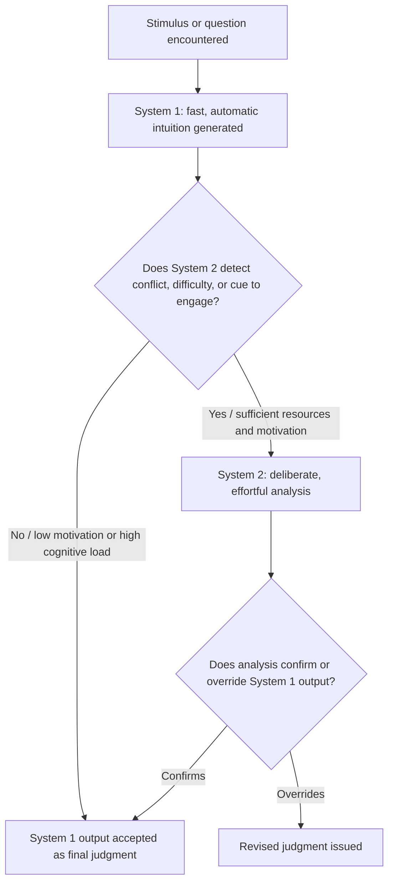

## System 1 and System 2 Thinking

### Definition and Origin

System 1 and System 2 thinking is a dual-process framework for describing human cognition, popularized by Daniel Kahneman (most extensively in *Thinking, Fast and Slow*, 2011), building on decades of prior dual-process research in cognitive and social psychology (including work by Keith Stanovich, Richard West, and Seymour Epstein). The framework distinguishes two modes of information processing that operate concurrently and interactively to produce judgments, beliefs, and choices.

**System 1** is fast, automatic, effortless, associative, and largely unconscious. It generates impressions, intuitions, and immediate reactions without deliberate control.

**System 2** is slow, effortful, deliberate, rule-based, and consciously controlled. It is engaged for tasks requiring concentration, calculation, or the deliberate application of learned rules.

These are best understood as characterizations of two functionally distinct *types of processing*, not as literally separate brain regions or anatomically discrete systems. [Inference: the "System 1 / System 2" terminology is explicitly presented by Kahneman as a heuristic simplification for expository purposes, describing characteristic processing styles rather than a claim about localized neural architecture.]

### Core Characteristics Compared

| Dimension | System 1 | System 2 |
| --- | --- | --- |
| Speed | Fast | Slow |
| Effort | Low / effortless | High / effortful |
| Control | Automatic, involuntary | Deliberate, voluntary |
| Awareness | Largely unconscious | Conscious |
| Processing style | Associative, pattern-based | Rule-based, sequential, analytical |
| Capacity | High (parallel, always running) | Limited (serial, easily depleted) |
| Susceptibility to bias | High (heuristic-driven errors) | Lower, but can be lazy or absent |
| Typical tasks | Recognizing faces, detecting hostility in a voice, simple arithmetic ($2+2$), driving on an empty road | Filling out a tax form, comparing two complex options, parking in a tight space, checking the validity of a logical argument |

### Mechanisms and Interaction Between the Systems

The two systems are not independent; they interact continuously, with System 1 generating rapid intuitive impressions and suggestions, and System 2 monitoring, endorsing, or overriding those suggestions.

**System 1 as the default generator of judgments**: In most everyday situations, System 1 produces an impression or intuitive answer automatically, and System 2, by default, adopts this impression with little or no modification. This default acceptance is central to why cognitive biases occur — System 2 does not routinely verify System 1's output unless prompted by conflict, surprise, or effortful engagement.

**System 2 as monitor and corrector**: System 2 is capable of overriding System 1's suggestions, but doing so requires cognitive resources, motivation, and time. Kahneman describes System 2 as inherently "lazy," tending to endorse System 1's output rather than expend the effort required for independent verification, especially under time pressure, cognitive load, or fatigue.

**Cognitive load and ego depletion**: When System 2 resources are consumed by a concurrent demanding task (a manipulation known as cognitive load), individuals become more likely to rely on System 1 outputs and exhibit stronger heuristic-driven biases, because System 2's capacity to monitor and override is diminished. Related research on "ego depletion" (Baumeister and colleagues) proposed that self-control and deliberate reasoning draw on a shared, limited resource that is depleted with use, although this specific depletion mechanism has faced significant replication challenges in subsequent research. [Unverified: the ego-depletion resource-model itself is contested in the replication literature and should not be treated as an established mechanism without checking current meta-analytic evidence.]

**Attribute substitution**: A key mechanism by which System 1 generates answers to difficult questions is attribute substitution — when faced with a hard question (e.g., "How happy are you with your life as a whole?"), System 1 substitutes an easier, related question (e.g., "What is my mood right now?") and answers that instead, often without the individual noticing the substitution occurred. This mechanism underlies many documented heuristics, including the affect heuristic and the representativeness heuristic.

### Formal Characterization: A Two-Stage Process Model

The interaction can be represented as a sequential monitoring process. Let $J_1$ denote the intuitive judgment generated by System 1, and let $J_2$ denote the final judgment issued by the individual. System 2's role can be modeled as a conditional override function:

$$J_2 =
\begin{cases}
J_1 & \text{if System 2 does not intervene (default)} \\
f(J_1, \text{deliberate reasoning}) & \text{if System 2 engages and overrides}
\end{cases}$$

Whether System 2 intervenes depends on factors including perceived task difficulty, motivation, cognitive resource availability, and the presence of cues signaling that the intuitive answer may be wrong (e.g., detected inconsistency, unusual stakes, explicit training in statistical reasoning). This framework explains both why heuristic biases are pervasive (System 2 intervention is the exception, not the rule) and why biases can sometimes be corrected (through training, incentives, or environmental redesign that prompts System 2 engagement).

### Practical Example: The Bat-and-Ball Problem

**Example**: A widely used illustration of the two systems is the bat-and-ball problem: *A bat and a ball together cost $1.10. The bat costs $1.00 more than the ball. How much does the ball cost?*

System 1 generates the fast, intuitive answer: $0.10. This answer is generated automatically because it maps onto the salient numbers in the question via a simple, associative computation ($1.10 - 1.00$), and it feels immediately and confidently correct.

The correct answer, however, requires System 2 engagement: if the ball costs $x$, the bat costs $x + 1.00$, so $x + (x + 1.00) = 1.10$, giving $2x = 0.10$, so $x = 0.05$. The ball costs $0.05.

This example is used across cognitive psychology and behavioral economics because a large proportion of respondents, including highly educated populations, give the intuitive but incorrect $0.10 answer, illustrating System 2's default tendency to endorse a fluent System 1 output rather than verify it through deliberate calculation, even when the necessary calculation is simple once undertaken. [Inference: the phenomenon is highly robust and widely replicated, but the exact proportion of respondents who err varies by sample and study, so no single "error rate" figure should be treated as universal.]

### Relationship to Heuristics and Biases

The dual-process framework provides the architectural explanation for the broader heuristics-and-biases research program: specific heuristics (representativeness, availability, anchoring-and-adjustment) are characterized as System 1 processes, and the systematic biases they produce arise precisely because System 2 fails to detect and correct the resulting errors under normal conditions. This links System 1/System 2 thinking directly to:

- **Anchoring and adjustment**: An initial (often arbitrary) number generated or presented is processed intuitively (System 1) and insufficiently adjusted even when System 2 is engaged.
- **Availability heuristic**: Ease of recall (a System 1 signal) substitutes for actual frequency or probability judgments.
- **Representativeness heuristic**: Similarity to a prototype (System 1 pattern-matching) substitutes for statistical base-rate reasoning (a System 2 task).
- **Framing effects**: Because System 1 responds to the surface presentation of a problem, logically equivalent problems framed differently (e.g., gains versus losses) can produce different intuitive reactions, which System 2 often fails to reconcile.

### Boundaries and Critiques of the Framework

Several methodological and conceptual boundary issues surround the dual-process framework:

- **Metaphorical status**: Kahneman explicitly frames System 1 and System 2 as useful fictions for exposition rather than literal neurological entities, cautioning against over-interpreting the systems as discrete brain modules. Critics have argued that the popular reception of the framework sometimes overstates its neurological or architectural precision beyond what the underlying research supports.
- **Dimensional versus dichotomous debate**: Some dual-process researchers (e.g., within the broader "Type 1/Type 2 processing" literature associated with Stanovich) argue that fast/automatic versus slow/deliberate processing may be better represented as a continuum or as multiple dissociable subprocesses rather than a strict binary.
- **Overlap with other dual-process theories**: Related but non-identical frameworks exist in psychology (e.g., Epstein's Cognitive-Experiential Self-Theory, Evans and Stanovich's Type 1/Type 2 processing), and terminology is not fully standardized across the literature; System 1/System 2 is the version most closely associated with behavioral economics due to Kahneman's role in the field.
- **Replication and generalizability concerns**: Certain specific findings historically attributed to System 1/System 2 dynamics (e.g., some ego-depletion studies, some priming effects) have faced replication difficulties, which does not invalidate the overall dual-process framework but does require caution in treating every originally reported effect as firmly established. [Unverified: specific effect sizes and replication status should be verified against current literature rather than assumed from original sources.]

### Diagram: System 1 / System 2 Decision Flow

### Visual: Processing Profile Comparison (svg_diagram)

<svg xmlns="http://www.w3.org/2000/svg" viewBox="0 0 700 300" font-family="Helvetica, Arial, sans-serif">
<text x="350" y="24" text-anchor="middle" font-size="16" font-weight="bold" fill="#222">System 1 vs. System 2 Processing Profile (svg_diagram)</text>
<rect x="50" y="55" width="270" height="210" rx="10" fill="#fef3e8" stroke="#e07b1f" stroke-width="1.5" />
<text x="185" y="80" text-anchor="middle" font-size="13" font-weight="bold" fill="#6d3a0f">System 1</text>
<text x="185" y="105" text-anchor="middle" font-size="11" fill="#6d3a0f">Fast</text>
<text x="185" y="125" text-anchor="middle" font-size="11" fill="#6d3a0f">Automatic</text>
<text x="185" y="145" text-anchor="middle" font-size="11" fill="#6d3a0f">Effortless</text>
<text x="185" y="165" text-anchor="middle" font-size="11" fill="#6d3a0f">Associative</text>
<text x="185" y="185" text-anchor="middle" font-size="11" fill="#6d3a0f">Parallel / always-on</text>
<text x="185" y="205" text-anchor="middle" font-size="11" fill="#6d3a0f">Prone to heuristic bias</text>
<text x="185" y="225" text-anchor="middle" font-size="11" fill="#6d3a0f">e.g., recognizing a face</text>
<text x="185" y="245" text-anchor="middle" font-size="11" fill="#6d3a0f">e.g., 2 + 2 = ?</text>
<rect x="380" y="55" width="270" height="210" rx="10" fill="#eafaf1" stroke="#1f9d55" stroke-width="1.5" />
<text x="515" y="80" text-anchor="middle" font-size="13" font-weight="bold" fill="#0f5c30">System 2</text>
<text x="515" y="105" text-anchor="middle" font-size="11" fill="#0f5c30">Slow</text>
<text x="515" y="125" text-anchor="middle" font-size="11" fill="#0f5c30">Deliberate</text>
<text x="515" y="145" text-anchor="middle" font-size="11" fill="#0f5c30">Effortful</text>
<text x="515" y="165" text-anchor="middle" font-size="11" fill="#0f5c30">Rule-based</text>
<text x="515" y="185" text-anchor="middle" font-size="11" fill="#0f5c30">Serial / resource-limited</text>
<text x="515" y="205" text-anchor="middle" font-size="11" fill="#0f5c30">Capable of correction</text>
<text x="515" y="225" text-anchor="middle" font-size="11" fill="#0f5c30">e.g., filling out a tax form</text>
<text x="515" y="245" text-anchor="middle" font-size="11" fill="#0f5c30">e.g., 17 x 24 = ?</text>
<line x1="320" y1="160" x2="380" y2="160" stroke="#444" stroke-width="2" stroke-dasharray="5,4" />
<text x="350" y="150" text-anchor="middle" font-size="10" fill="#444">monitors /</text>
<text x="350" y="180" text-anchor="middle" font-size="10" fill="#444">overrides</text>
</svg>

### Key Points

- System 1 is fast, automatic, and associative; System 2 is slow, deliberate, and rule-based; both operate continuously and interactively.
- System 2 defaults to endorsing System 1's intuitive output rather than routinely verifying it, which is the primary architectural explanation for the persistence of cognitive biases.
- Attribute substitution — answering an easier related question in place of a harder one — is a key System 1 mechanism underlying heuristics such as representativeness and availability.
- The bat-and-ball problem is a canonical illustration of System 1 generating a fluent but incorrect answer that System 2 fails to catch by default.
- The framework is explicitly metaphorical/expository rather than a literal claim about discrete neural systems, and some specific supporting findings (e.g., certain ego-depletion results) face replication concerns.
- The dual-process framework provides the cognitive-architecture foundation for the broader heuristics-and-biases research program in behavioral economics.

**Related Topics**

- Attribute substitution and the affect heuristic
- Representativeness and availability heuristics
- Anchoring and adjustment
- Cognitive load and ego depletion (and associated replication debates)
- Stanovich and West's Type 1/Type 2 processing framework
- Framing effects and prospect theory
- Base-rate neglect and conjunction fallacy
- Debiasing strategies and structured decision procedures for prompting System 2 engagement