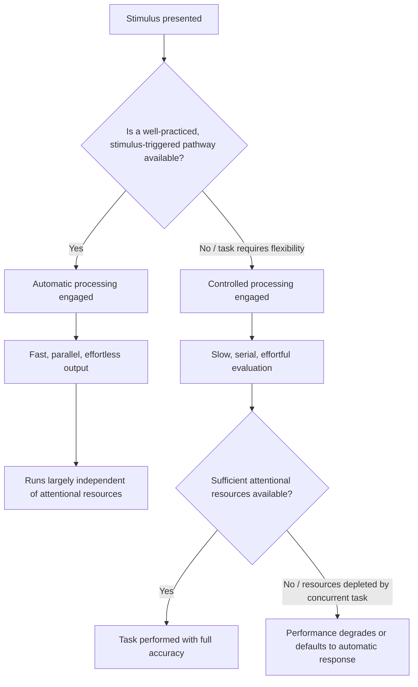

## Automatic versus Controlled Cognitive Processing

### Definition and Origin

The distinction between automatic and controlled cognitive processing is a foundational construct in cognitive psychology, formalized in the information-processing literature of the 1970s (notably by Schneider and Shiffrin, 1977) and subsequently adopted as a theoretical basis for dual-process models of judgment and decision-making, including the System 1/System 2 framework used extensively in behavioral economics. While closely related to System 1/System 2 thinking, this distinction predates and is broader than that specific framework: it characterizes two general *modes of cognitive operation* that apply across perception, attention, memory retrieval, and decision-making, rather than being specific to judgment heuristics alone.

**Automatic processing** is characterized as fast, parallel, effortless, and largely independent of an individual's conscious intentions or attentional capacity; once triggered by an appropriate stimulus, it runs to completion largely outside voluntary control.

**Controlled processing** is characterized as slow, serial, effortful, and dependent on attentional resources and conscious intention; it is flexible and can be applied to novel situations but is capacity-limited.

### Defining Criteria

Cognitive psychology typically identifies automatic processing using four converging criteria, and controlled processing as the pattern opposite these criteria:

| Criterion | Automatic Processing | Controlled Processing |
| --- | --- | --- |
| Awareness | Occurs without conscious awareness of the process itself | Occurs with conscious awareness of the process |
| Intentionality | Unintentional — triggered by a stimulus regardless of goals | Intentional — initiated and sustained by a goal |
| Controllability | Difficult or impossible to stop once initiated | Can be stopped, redirected, or modified at will |
| Efficiency / resource demand | Requires minimal or no attentional resources; can run alongside other tasks | Requires attentional resources; typically limited to one task at a time |

An important methodological caveat: these four criteria (awareness, intentionality, controllability, efficiency) do not always co-occur perfectly in a given cognitive process, which has led researchers to treat automaticity as a matter of degree along multiple dimensions rather than a strict all-or-nothing category. [Inference: this graded, multidimensional view of automaticity is now widely accepted in the cognitive psychology literature, though earlier formulations sometimes treated automatic and controlled processing as a cleaner dichotomy.]

### Mechanisms Underlying the Distinction

**Practice and proceduralization**: A central mechanism by which controlled processes become automatic is extensive practice. Skills that initially require full conscious attention (e.g., a novice driver operating a manual transmission) become proceduralized with repetition, eventually running with minimal conscious monitoring (an experienced driver shifting gears while conversing). This practice-driven shift from controlled to automatic processing is a well-established finding in skill-acquisition research.

**Parallel versus serial architecture**: Automatic processes are generally understood to operate in parallel — multiple automatic processes can run simultaneously without mutually interfering — whereas controlled processes are understood to operate largely serially, competing for a shared, limited attentional resource. This explains why individuals can perform an automatized task (e.g., walking) while simultaneously engaging a controlled task (e.g., solving a mental arithmetic problem), but struggle to perform two controlled tasks simultaneously without significant performance costs (dual-task interference).

**Stimulus-driven triggering**: Automatic processes are typically triggered directly by the presence of a stimulus, independent of the perceiver's current goals — a property demonstrated experimentally by tasks such as the Stroop task, described below.

**Resource allocation and cognitive load**: Controlled processing draws on a limited pool of attentional/executive resources; when this pool is taxed by a concurrent demanding task (cognitive load), performance on controlled tasks degrades, while automatic processing remains largely unaffected. This mechanism is directly relevant to behavioral economics, since decision-makers under time pressure, distraction, or high cognitive load are more likely to default to automatic (heuristic-driven) judgments rather than engage controlled, deliberative evaluation.

### Practical Example: The Stroop Task

**Example**: The Stroop task is the canonical experimental demonstration of the automatic/controlled distinction. Participants are shown color words (e.g., "RED," "BLUE," "GREEN") printed in colored ink, and asked to name the ink color while ignoring the word's meaning.

- In the *congruent* condition, the word and ink color match (e.g., the word "RED" printed in red ink); naming the ink color is fast and easy.
- In the *incongruent* condition, the word and ink color conflict (e.g., the word "RED" printed in blue ink); naming the ink color is measurably slower and more error-prone.

This slowdown occurs because reading the word is an automatic process — proficient readers cannot suppress word recognition even when instructed to ignore it — while naming the ink color is a controlled process requiring effortful suppression of the automatically activated (and conflicting) word-reading response. The Stroop effect demonstrates the controllability criterion directly: automatic processing (reading) proceeds even when it actively interferes with the participant's intended task and explicit instructions, illustrating that automaticity is not simply "fast" but specifically resistant to intentional suppression.

### Relationship to Dual-Process and Behavioral Economics Frameworks

The automatic/controlled distinction is the cognitive-psychology precursor to, and empirical foundation for, the System 1/System 2 terminology used in behavioral economics:

| Framework element | Automatic/Controlled (cognitive psychology) | System 1/System 2 (behavioral economics) |
| --- | --- | --- |
| Origin | Schneider and Shiffrin (1977); broader information-processing tradition | Kahneman, building on Stanovich and West's Type 1/Type 2 processing |
| Scope | General cognitive architecture (perception, attention, memory, skill) | Primarily judgment, probability estimation, and choice |
| Key experimental paradigm | Stroop task, visual search, dual-task studies | Heuristics-and-biases tasks (bat-and-ball, base-rate problems) |
| Relation | Provides the general mechanism | Applies the mechanism specifically to economic and probabilistic judgment |

Because System 1 is explicitly characterized by fast, effortless, associative operation, and System 2 by slow, effortful, resource-limited operation, System 1 can be understood as a judgment-specific instance of automatic processing, and System 2 as a judgment-specific instance of controlled processing. This grounding in a well-established, independently validated cognitive-psychology literature is part of why the dual-process framework has been considered a credible architecture for explaining the heuristics and biases documented in behavioral economics, rather than an ad hoc post-hoc labeling of observed choice patterns.

### Formal Characterization: Resource-Constrained Processing

Controlled processing can be modeled as drawing on a shared, finite attentional resource pool $R$, where each controlled task $i$ requires resource allocation $r_i$, subject to:

$$\sum_i r_i \leq R$$

Automatic processes are modeled as requiring negligible or zero draw on $R$ ($r_{\text{automatic}} \approx 0$), which is why they can run concurrently with controlled tasks without violating the resource constraint, while two simultaneous controlled tasks with $r_1 + r_2 > R$ produce measurable interference or performance decrements (dual-task cost). This formalization is a simplification used for expository and experimental-design purposes; it does not correspond to a single, precisely measured neural resource, and specific claims about resource magnitude should be treated as model constructs rather than directly observed physical quantities. [Inference: the "limited resource pool" framing is a useful and widely used theoretical model in attention research, but the precise nature of the underlying resource remains a subject of ongoing investigation rather than settled fact.]

### Boundaries and Critiques

- **Degree versus dichotomy**: As noted above, contemporary research increasingly treats automaticity as graded along multiple independent dimensions (awareness, intentionality, controllability, efficiency) rather than as a clean binary category, complicating simple automatic/controlled classifications for some cognitive processes.
- **Task-dependence**: Whether a given process operates automatically or under control can depend heavily on expertise, context, and practice history (e.g., reading is automatic for literate adults but effortful and controlled for beginning readers), meaning the classification is not a fixed property of a cognitive operation in isolation.
- **Applicability limits in behavioral economics**: While the automatic/controlled distinction motivates System 1/System 2 thinking, not every behavioral-economic anomaly maps cleanly onto this dichotomy; some documented biases (e.g., certain framing effects) may involve controlled processing operating on automatically-framed inputs, making the "which system produced this bias" attribution more complex than a simple either/or classification in some cases. [Inference: this is a live area of theoretical refinement within dual-process research rather than a fully settled question.]

### Diagram: Automatic vs. Controlled Processing Pathways

### Visual: Resource Allocation Under Automatic vs. Controlled Processing (svg_diagram)

<svg xmlns="http://www.w3.org/2000/svg" viewBox="0 0 700 300" font-family="Helvetica, Arial, sans-serif">
<text x="350" y="24" text-anchor="middle" font-size="16" font-weight="bold" fill="#222">Attentional Resource Allocation (svg_diagram)</text>

<text x="175" y="55" text-anchor="middle" font-size="13" font-weight="bold" fill="#222">Automatic Task + Controlled Task</text>

<rect x="60" y="70" width="230" height="40" rx="6" fill="`#fef3e8`" stroke="`#e07b1f`" stroke-width="1.5" />

<text x="175" y="95" text-anchor="middle" font-size="11" fill="`#6d3a0f`">Automatic: walking (r ~ 0)</text>

<rect x="60" y="120" width="230" height="40" rx="6" fill="`#eafaf1`" stroke="`#1f9d55`" stroke-width="1.5" />

<text x="175" y="145" text-anchor="middle" font-size="11" fill="`#0f5c30`">Controlled: mental arithmetic (r1)</text>

<rect x="60" y="180" width="230" height="18" rx="4" fill="`#dfe7f5`" stroke="`#3b5bdb`" stroke-width="1" />

<text x="175" y="193" text-anchor="middle" font-size="10" fill="`#1a2b6d`">Resource pool R: mostly available</text>

<text x="525" y="55" text-anchor="middle" font-size="13" font-weight="bold" fill="#222">Two Controlled Tasks</text>

<rect x="410" y="70" width="230" height="40" rx="6" fill="`#eafaf1`" stroke="`#1f9d55`" stroke-width="1.5" />

<text x="525" y="95" text-anchor="middle" font-size="11" fill="`#0f5c30`">Controlled: driving in traffic (r1)</text>

<rect x="410" y="120" width="230" height="40" rx="6" fill="`#fbe8ee`" stroke="`#c22a5e`" stroke-width="1.5" />

<text x="525" y="145" text-anchor="middle" font-size="11" fill="`#7a1638`">Controlled: texting (r2)</text>

<rect x="410" y="180" width="230" height="18" rx="4" fill="`#f6d9d9`" stroke="`#c0392b`" stroke-width="1" />

<text x="525" y="193" text-anchor="middle" font-size="10" fill="`#6d1a12`">r1 + r2 &gt; R: interference / performance cost</text>

<line x1="60" y1="230" x2="640" y2="230" stroke="#888" stroke-width="1" stroke-dasharray="4,3" />
<text x="350" y="252" text-anchor="middle" font-size="11" fill="#444">Automatic processes impose negligible resource cost;</text>
<text x="350" y="268" text-anchor="middle" font-size="11" fill="#444">concurrent controlled processes compete for a shared, limited pool.</text>
</svg>

### Key Points

- Automatic processing is fast, unintentional, difficult to control, and requires minimal attentional resources; controlled processing is slow, intentional, flexible, and resource-limited.
- Four criteria are typically used to define automaticity: lack of awareness, unintentionality, uncontrollability, and processing efficiency — though these do not always align perfectly, supporting a graded rather than strictly binary view.
- Practice and repetition are the primary mechanisms by which controlled processes become proceduralized into automatic ones.
- The Stroop task is the canonical experimental demonstration, showing that automatic word-reading interferes with the controlled task of color-naming even when participants are explicitly instructed to ignore the word.
- This distinction is the empirical and theoretical foundation underlying System 1 (automatic) and System 2 (controlled) in behavioral economics' dual-process framework.
- Controlled processing operates on a shared, limited attentional resource, explaining dual-task interference and the tendency to default to automatic/heuristic judgments under cognitive load.

**Related Topics**

- Schneider and Shiffrin's controlled/automatic processing theory
- The Stroop task and interference paradigms
- Skill acquisition and proceduralization
- Dual-task interference and attentional resource models
- Cognitive load effects on judgment and decision-making
- System 1 and System 2 thinking (behavioral-economics application)
- Executive function and working memory constraints
- Ego depletion and self-control resource models (and associated replication debates)