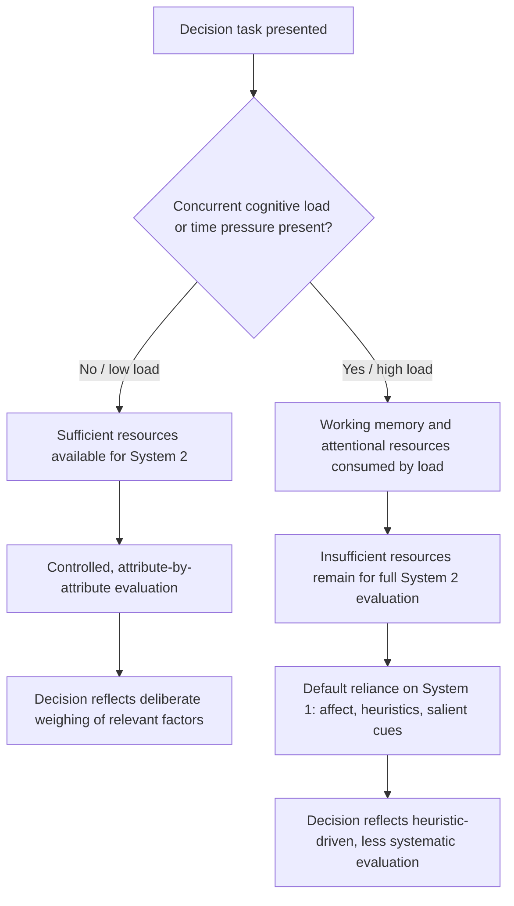

## Cognitive Load and the Quality of Decisions

### Definition and Theoretical Basis

Cognitive load refers to the total amount of mental effort and working-memory resources being used by an individual's cognitive system at a given time. In the context of dual-process models of thinking, cognitive load is a manipulable and measurable variable used to study how limitations on controlled, deliberate processing (System 2) affect the quality, consistency, and bias-susceptibility of judgments and decisions.

The theoretical basis rests on the assumption, discussed in the automatic/controlled processing literature, that controlled processing draws on a shared, finite pool of attentional and working-memory resources. When this pool is partially consumed by a concurrent demanding task (imposing "load"), fewer resources remain available for the controlled evaluation, verification, or override of intuitive (System 1) judgments in a separate, ostensibly unrelated decision task. Cognitive load is therefore used both as a naturally occurring condition (e.g., stress, distraction, time pressure, multitasking) and as a deliberate experimental manipulation (e.g., asking participants to memorize a digit string while making a decision) to test dual-process predictions.

### Mechanisms Linking Cognitive Load to Decision Quality

**Working memory competition**: Deliberate decision-making tasks (e.g., comparing multi-attribute options, performing probability calculations, applying learned decision rules) draw on working memory to hold information in mind and manipulate it. A concurrent load task that also occupies working memory directly reduces the resources available for the decision task, degrading performance on components that require controlled processing while leaving automatic components largely unaffected.

**Reduced System 2 monitoring capacity**: As established in the System 1/System 2 framework, System 2 does not automatically verify every System 1 output; it must be engaged, which requires available resources. Under cognitive load, the resources needed for this monitoring and override function are diminished, increasing reliance on System 1's fast, associative, and heuristic-driven outputs — including their characteristic biases.

**Ironic increase in reliance on affect and heuristics**: Under load, decision-makers become more likely to rely on the affect heuristic (using immediate emotional reactions as a proxy for evaluation) and other simplifying heuristics (representativeness, availability), because these operate largely automatically and require little working-memory involvement, whereas systematic, attribute-by-attribute comparison does not.

**Time pressure as a specific form of load**: Time pressure functions similarly to concurrent-task cognitive load by restricting the duration available for controlled deliberation, producing many of the same directional effects — increased reliance on heuristics, reduced attribute-by-attribute comparison, and greater susceptibility to framing and anchoring.

**Depletion versus concurrent-load distinction**: It is important to distinguish two related but conceptually different manipulations in this literature: *concurrent cognitive load* (a simultaneous secondary task competing for resources in real time, e.g., memorizing digits while deciding) and *prior depletion* (a preceding effortful self-control or attention task claimed to deplete a resource before the decision task begins, associated with "ego depletion" research). The concurrent-load paradigm has a more robust and widely replicated evidentiary base within the decision-making literature; the ego-depletion resource-model has faced substantial replication difficulties in recent years and should not be treated as equally well-established. [Unverified: the specific replication status of any given ego-depletion study should be checked against current meta-analyses rather than assumed.]

### Documented Effects of Cognitive Load on Decisions

| Decision domain | Effect of increased cognitive load |
| --- | --- |
| Choice consistency | Greater inconsistency; choices more likely to reverse across similar trials |
| Reliance on heuristics | Increased use of simplifying heuristics (affect, availability, representativeness) |
| Attribute weighting | Reduced systematic attribute-by-attribute comparison; greater reliance on a single salient attribute |
| Framing susceptibility | Increased susceptibility to gain/loss framing effects |
| Anchoring | Increased anchoring on initial or irrelevant numerical values |
| Self-control / impulsivity | Greater likelihood of choosing immediately gratifying options over delayed larger rewards |
| Stereotyping and social judgment | Increased reliance on stereotypes and category-based judgments in person perception |
| Deception detection and truth judgments | Increased default acceptance of statements as true (reduced critical evaluation) |

[Inference: the direction of these effects is well-supported across a substantial body of experimental work, but individual effect sizes vary considerably by task, population, and specific load manipulation, and should not be treated as fixed quantities.]

### Practical Example: Cognitive Load and Snack Choice

**Example**: A widely cited experimental paradigm (Shiv and Fedorikhin, 1999) asked participants to remember either a two-digit number (low load) or a seven-digit number (high load) while walking to another room, ostensibly as part of a memory study. En route, participants were offered a choice between two snacks: a healthier fruit salad or a more indulgent, palatable chocolate cake.

Participants under high cognitive load were significantly more likely to choose the chocolate cake — the more immediately affect-laden, gratifying option — than participants under low cognitive load, who were more likely to choose the fruit salad, reflecting more deliberate consideration of the healthiness attribute. This result illustrates the general mechanism directly: the high-load condition consumed working-memory resources that would otherwise support the controlled weighing of health considerations (a System 2 process), leaving the automatic, affect-driven preference for the more immediately appealing option (a System 1 process) relatively unimpeded and therefore dominant in the final choice.

### Formal Characterization

Building on the resource-constrained model of controlled processing, a decision task requiring controlled evaluation can be represented as needing resource allocation $r_{\text{decision}}$ from the total available pool $R$. When a concurrent load task consumes $r_{\text{load}}$, the resources available for the decision task are reduced to:

$$r_{\text{available}} = R - r_{\text{load}}$$

If $r_{\text{available}} < r_{\text{decision}}^{*}$ (the resource level required for full controlled evaluation), the decision-maker cannot complete the intended controlled process and instead defaults, in whole or in part, to the automatic (System 1) output for that judgment or choice. This formalization is a simplified, expository model rather than a precise, independently measured physiological quantity, and is intended to capture the qualitative logic of load effects rather than to support precise numerical prediction. [Inference: this resource-based formalization is a standard theoretical simplification used in the cognitive-load literature, not a literal measurement of a single neural quantity.]

### Applications in Behavioral Economics and Policy

- **Choice architecture and consumer protection**: Recognition that decisions made under naturally occurring high load (e.g., time-pressured retail environments, complex financial disclosures presented under deadline) are more heuristic-driven has informed policy arguments for simplifying disclosure formats and default options (linking to nudge and choice-architecture research).
- **Financial decision-making under stress**: Research on decision-making among individuals facing scarcity (e.g., financial hardship) has drawn on cognitive-load-style mechanisms to argue that scarcity itself imposes a form of persistent cognitive load, consuming "mental bandwidth" that would otherwise support careful, controlled financial decisions. [Inference: the "scarcity as bandwidth tax" hypothesis, associated with Mullainathan and Shafir, is an influential but debated extension of the cognitive-load framework to socioeconomic contexts, and specific quantitative claims from this literature should be treated with appropriate caution given ongoing debate about mechanism and magnitude.]
- **Marketing and retail design**: Retail environments deliberately or incidentally introducing time pressure, background distraction, or complex information display can be understood, within this framework, as environments likely to shift consumer choice toward more heuristic-driven, less deliberative purchasing decisions.
- **Negotiation and legal decision-making**: Research on plea bargaining and negotiation under time pressure or high caseload stress has applied cognitive-load reasoning to explain increased reliance on heuristic, less individualized decision-making by practitioners operating under high working-memory and time demands.

### Boundaries and Methodological Considerations

- **Dual-task methodology validity**: Concurrent-load paradigms assume that the load task and decision task draw on a shared resource pool; if the two tasks draw on largely independent cognitive subsystems, the expected interference may not occur, meaning not every "distraction" manipulation will produce the predicted heuristic shift.
- **Direction is not universal**: While cognitive load generally increases heuristic reliance, some research indicates that load can, in specific tasks, *reduce* certain other biases (e.g., some studies suggest load can reduce deliberate self-presentation biases in certain judgment tasks), indicating the overall relationship between load and decision quality is moderated by task structure rather than uniformly negative. [Inference: this moderation is documented in specific studies but is not as extensively replicated as the primary heuristic-increase finding, and should be treated as a qualified rather than universal pattern.]
- **Ecological validity**: Much of the founding evidence derives from laboratory dual-task paradigms with artificial load manipulations (digit-memorization); the magnitude and even the direction of effects in complex, high-stakes, real-world decisions (e.g., major financial or medical decisions) require separate field validation rather than direct extrapolation from lab findings.
- **Distinct from, but related to, ego depletion**: As noted, the concurrent cognitive-load paradigm should not be conflated with the more contested sequential-depletion (ego-depletion) paradigm; the two involve different experimental designs, and evidentiary strength differs between them.

### Diagram: Cognitive Load's Effect on the Decision Pathway

### Visual: Resource Budget Under Increasing Load (svg_diagram)

<svg xmlns="http://www.w3.org/2000/svg" viewBox="0 0 700 300" font-family="Helvetica, Arial, sans-serif">
<text x="350" y="24" text-anchor="middle" font-size="16" font-weight="bold" fill="#222">Resource Budget Under Increasing Cognitive Load (svg_diagram)</text>

<text x="130" y="55" text-anchor="middle" font-size="12" font-weight="bold" fill="#222">Low Load</text>

<rect x="60" y="65" width="140" height="30" fill="`#dfe7f5`" stroke="`#3b5bdb`" stroke-width="1" />

<text x="130" y="85" text-anchor="middle" font-size="10" fill="`#1a2b6d`">Load: 20%</text>

<rect x="60" y="100" width="140" height="30" fill="`#eafaf1`" stroke="`#1f9d55`" stroke-width="1" />

<text x="130" y="120" text-anchor="middle" font-size="10" fill="`#0f5c30`">System 2 available: 80%</text>

<text x="130" y="150" text-anchor="middle" font-size="10" fill="#444">Deliberate evaluation feasible</text>

<text x="360" y="55" text-anchor="middle" font-size="12" font-weight="bold" fill="#222">Moderate Load</text>

<rect x="290" y="65" width="140" height="55" fill="`#dfe7f5`" stroke="`#3b5bdb`" stroke-width="1" />

<text x="360" y="97" text-anchor="middle" font-size="10" fill="`#1a2b6d`">Load: 55%</text>

<rect x="290" y="120" width="140" height="10" fill="`#eafaf1`" stroke="`#1f9d55`" stroke-width="1" />

<text x="360" y="145" text-anchor="middle" font-size="10" fill="`#0f5c30`">System 2 available: 45%</text>

<text x="360" y="165" text-anchor="middle" font-size="10" fill="#444">Partial, selective evaluation</text>

<text x="590" y="55" text-anchor="middle" font-size="12" font-weight="bold" fill="#222">High Load</text>

<rect x="520" y="65" width="140" height="80" fill="`#dfe7f5`" stroke="`#3b5bdb`" stroke-width="1" />

<text x="590" y="110" text-anchor="middle" font-size="10" fill="`#1a2b6d`">Load: 85%</text>

<rect x="520" y="145" width="140" height="10" fill="`#fbe8ee`" stroke="`#c22a5e`" stroke-width="1" />

<text x="590" y="170" text-anchor="middle" font-size="10" fill="`#7a1638`">System 2 available: 15%</text>

<text x="590" y="190" text-anchor="middle" font-size="10" fill="#444">Default to heuristic (System 1) judgment</text>

<line x1="40" y1="220" x2="660" y2="220" stroke="#888" stroke-width="1" stroke-dasharray="4,3" />
<text x="350" y="242" text-anchor="middle" font-size="11" fill="#444">As load consumes a larger share of the shared resource pool, capacity remaining</text>
<text x="350" y="258" text-anchor="middle" font-size="11" fill="#444">for controlled evaluation of the decision task shrinks accordingly.</text>
</svg>

### Key Points

- Cognitive load — mental effort consumed by a concurrent task, time pressure, or stress — reduces the working-memory and attentional resources available for controlled (System 2) decision-making.
- Under high cognitive load, decision-makers rely more heavily on automatic, heuristic-driven (System 1) judgments, increasing susceptibility to framing, anchoring, affect-based choice, and reduced systematic attribute comparison.
- The Shiv and Fedorikhin snack-choice experiment is a canonical demonstration: high load increased selection of the more immediately gratifying (chocolate cake) option over the more deliberately evaluated (fruit salad) option.
- Cognitive load (a concurrent-task manipulation) should be distinguished from ego depletion (a prior-task resource-depletion claim), as the two paradigms differ in experimental design and in the current strength of their evidentiary support.
- Applications extend to consumer protection, choice architecture, scarcity and financial decision-making, and understanding decision quality in time-pressured professional contexts.
- Effects are directionally well-supported but task- and context-dependent; laboratory findings on artificial load manipulations require field validation before being extrapolated to complex, high-stakes real-world decisions.

**Related Topics**

- System 1 and System 2 thinking
- Automatic versus controlled cognitive processing
- Ego depletion and self-control resource models (and replication debates)
- Scarcity, mental bandwidth, and decision-making (Mullainathan and Shafir)
- Affect heuristic and emotion-based judgment
- Framing effects and anchoring under time pressure
- Choice architecture and nudge design under real-world decision constraints
- Working memory and executive function in judgment and decision-making