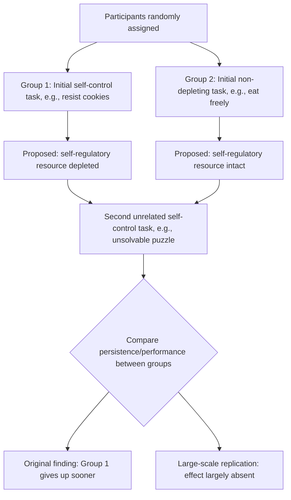

## Ego Depletion and Self-Regulatory Resources

### Definition and Origin

Ego depletion is a theoretical construct proposed by Roy Baumeister and colleagues in the mid-1990s, holding that self-control, willpower, and effortful self-regulation draw upon a common, limited psychological resource that becomes temporarily depleted with use, much as a muscle tires with exertion. According to the theory, after exerting self-control on one task, an individual has reduced capacity to exert self-control on a subsequent, unrelated task, because both tasks draw on the same finite resource pool. This became formalized as the **strength model of self-control**, which explicitly uses the muscle metaphor: self-control resembles a muscle that fatigues with repeated use but can also be strengthened through regular exercise over time.

Ego depletion is closely related to, but conceptually distinct from, concurrent cognitive load (discussed in relation to the quality of decisions). Cognitive load involves resource competition between two tasks performed *simultaneously*; ego depletion specifically proposes that an initial, prior act of self-control depletes a resource that is then unavailable for a *subsequent, sequential* task, even though the two tasks are performed one after another rather than concurrently.

### The Strength Model of Self-Control

The strength model rests on several core propositions:

1. **A single, domain-general resource**: Self-control across seemingly unrelated domains (resisting food temptation, suppressing emotional expression, persisting on a difficult puzzle, making complex decisions) is proposed to draw on the same underlying resource, rather than each domain having its own independent reserve.
2. **Depletion with use**: Exerting self-control in one task consumes this resource, leaving less available for subsequent self-control efforts within a limited time window.
3. **Recovery with rest**: The resource is proposed to replenish over time, particularly with rest or sleep, analogous to muscle recovery.
4. **Trainability**: Repeated exercise of self-control over the longer term (weeks or months) is proposed to increase the resource's overall capacity, analogous to strength training — distinct from the short-term depletion-and-recovery cycle.

Under this model, the sequential-task ego-depletion experimental paradigm typically involves two phases: an initial task designed to require self-control (e.g., resisting eating available cookies while hungry, suppressing a natural emotional response, making a series of effortful choices), followed by a second, ostensibly unrelated task also requiring self-control or persistence (e.g., persisting on an unsolvable puzzle, performing a Stroop task, resisting a subsequent temptation). The classic prediction is that performance or persistence on the second task will be reduced among participants who exerted self-control on the first task, relative to a control group that did not.

### The Classic Radish-and-Cookie Experiment

**Example**: The foundational ego-depletion study (Baumeister, Bratslavsky, Muraven, and Tice, 1998) placed hungry participants in a room with the smell of freshly baked chocolate chip cookies. Participants were randomly assigned either to eat the cookies and chocolates freely, or to eat only radishes while the tempting cookies remained visible and accessible but off-limits — requiring active self-control to resist.

Both groups were then given an ostensibly unrelated second task: persisting on an unsolvable geometric puzzle-tracing task. Participants who had exerted self-control by resisting the cookies (the radish-eating group) gave up on the unsolvable puzzle significantly faster than participants who had freely eaten the cookies, despite no direct connection between resisting a food temptation and geometric puzzle persistence. This result was interpreted as evidence that the initial act of self-control (resisting cookies) depleted a general self-regulatory resource, reducing persistence on the subsequent, unrelated self-control task.

### Proposed Mechanisms

Several mechanisms have been proposed within and around the strength model to explain how depletion might occur:

- **Glucose depletion hypothesis**: An early proposed physiological mechanism suggested that self-control efforts consume blood glucose, and that reduced glucose availability directly impairs subsequent self-control capacity, with some early studies reporting that glucose consumption between tasks could restore performance. This specific glucose-based mechanism has faced substantial empirical and theoretical challenges in later research, including concerns about the physiological plausibility of the proposed magnitude of glucose use for a purely mental task. [Unverified: the glucose-depletion mechanism specifically is now considered doubtful by a substantial portion of the field, and should not be presented as an established explanation without noting this controversy.]
- **Motivational and belief-based accounts**: Alternative explanations propose that apparent depletion effects reflect shifts in motivation or effort allocation rather than a literal resource being consumed — for instance, individuals may become less motivated to continue exerting effort on a second task if they perceive diminishing returns, or if they hold a personal belief that willpower is a limited resource (a documented moderator: individuals who believe willpower is *not* a strictly limited resource show smaller or absent depletion effects in some studies).
- **Opportunity-cost/attention-shifting accounts**: Some researchers have proposed that what looks like "depletion" reflects a shift in attention or preference toward more immediately rewarding or less effortful activities after an initial period of effortful engagement, rather than the literal exhaustion of a fixed-capacity resource.

### Boundaries, Controversy, and the Replication Crisis

Ego depletion is among the most prominent case studies in the broader replication crisis affecting experimental psychology and behavioral science, and this controversy is a required part of any accurate technical treatment of the construct:

- **Large-scale replication failures**: A pre-registered, multi-laboratory Registered Replication Report (Hagger et al., 2016), involving numerous independent laboratories using a standardized ego-depletion protocol, found no significant overall depletion effect, in contrast to the robust effects reported in the earlier literature.
- **Meta-analytic and publication-bias concerns**: Subsequent meta-analyses examining the broader ego-depletion literature have identified evidence consistent with substantial publication bias (a tendency for studies finding significant depletion effects to be published more readily than null results), and bias-corrected meta-analytic estimates of the overall effect size have been substantially smaller than, or in some analyses statistically indistinguishable from, zero.
- **Continuing debate**: Some researchers, including Baumeister himself, have contested aspects of the replication findings, arguing that specific replication protocols may not have adequately captured the conditions under which depletion effects are expected to occur, or that moderating variables (such as motivation and individual differences in lay beliefs about willpower) were not adequately controlled. The construct therefore remains actively and substantively contested within the field rather than either fully validated or fully discredited. [Unverified: the current overall scientific consensus on the existence, size, and boundary conditions of ego depletion should be treated as unsettled and checked against the most recent meta-analytic and replication literature rather than assumed from either the original studies or any single subsequent replication attempt.]

Given this status, any application of ego-depletion theory to explain real-world decision-making phenomena (financial self-control, dieting failure, decision fatigue) should be presented with appropriate epistemic caution rather than as an established causal mechanism.

### Relationship to Cognitive Load and Decision Fatigue

Ego depletion is frequently invoked, alongside concurrent cognitive load, to explain the broader phenomenon of **decision fatigue** — the observed tendency for decision quality or self-control to decline over a sequence of many decisions made across a day (e.g., in studies of parole board rulings or extended consumer decision sessions). It is important to note that "decision fatigue" as a descriptive, real-world pattern is a distinct claim from the specific "ego depletion via a limited resource" mechanism proposed to explain it; the descriptive pattern can, in principle, be real and well-documented even if the specific depletion-resource mechanism proposed to underlie it turns out not to be well-supported, since alternative mechanisms (accumulated motivational shifts, increasing preference for the status quo, fatigue-related attention lapses unrelated to any specific "self-control resource") could produce similar observable patterns. [Inference: this mechanism-versus-pattern distinction is important for accurately representing the state of the literature, since popular accounts often conflate the two.]

### Formal Characterization (as Originally Proposed)

The strength model can be represented, in its original formulation, as a depleting-and-recovering resource $E_t$ at time $t$:

$$E_{t+1} = E_t - c \cdot \mathbb{1}[\text{self-control exerted at } t] + \rho \cdot (E_{\max} - E_t)$$

where $c$ represents the resource cost of exerting self-control, $\rho$ represents a recovery rate toward a maximum capacity $E_{\max}$ (analogous to rest-based muscle recovery), and self-control performance on a subsequent task is proposed to be an increasing function of the resource level $E_t$ remaining at the time that task is undertaken. This formalization reflects the theory **as originally proposed**; given the substantial replication concerns described above, it should be understood as a historically influential theoretical model rather than as an empirically validated quantitative description of an actual psychological resource. [Unverified: no consensus quantitative form of this model has been validated against the current, more skeptical body of replication evidence.]

### Diagram: Ego-Depletion Experimental Paradigm

### Visual: Strength Model of Self-Control (svg_diagram)

<svg xmlns="http://www.w3.org/2000/svg" viewBox="0 0 700 300" font-family="Helvetica, Arial, sans-serif">
<text x="350" y="24" text-anchor="middle" font-size="16" font-weight="bold" fill="#222">Strength Model: Proposed Resource Trajectory (svg_diagram)</text>
<line x1="60" y1="240" x2="640" y2="240" stroke="#444" stroke-width="1.5" />
<line x1="60" y1="240" x2="60" y2="50" stroke="#444" stroke-width="1.5" />
<text x="30" y="150" text-anchor="middle" font-size="11" fill="#444" transform="rotate(-90 30 150)">Resource level</text>
<text x="350" y="270" text-anchor="middle" font-size="11" fill="#444">Time / task sequence</text>
<polyline points="60,80 200,80 200,190 350,190 350,150 500,150 500,210 640,180" fill="none" stroke="#c22a5e" stroke-width="2.5" />
<text x="130" y="70" text-anchor="middle" font-size="10" fill="#7a1638">Baseline</text>
<text x="275" y="205" text-anchor="middle" font-size="10" fill="#7a1638">Task 1: self-control exerted (depletion)</text>
<text x="425" y="140" text-anchor="middle" font-size="10" fill="#7a1638">Rest period (proposed recovery)</text>
<text x="570" y="225" text-anchor="middle" font-size="10" fill="#7a1638">Task 2: reduced capacity remaining</text>

<text x="350" y="295" text-anchor="middle" font-size="10" fill="#888">Note: this trajectory reflects the originally proposed model; large-scale replication has not confirmed it.</text>

</svg>

### Key Points

- Ego depletion proposes that self-control draws on a single, limited, muscle-like resource that is depleted by an initial act of self-regulation and reduces capacity for a subsequent, unrelated act of self-control.
- The classic radish-and-cookie experiment (Baumeister et al., 1998) is the founding demonstration, showing reduced puzzle persistence after resisting food temptation.
- Proposed mechanisms include a (now substantially disputed) glucose-depletion hypothesis, as well as motivational and belief-based alternative accounts.
- Ego depletion is a central case study in the psychological replication crisis: a large multi-lab Registered Replication Report found no significant overall effect, and meta-analyses suggest substantial publication bias in the earlier literature.
- The construct remains actively contested rather than settled, and should be distinguished from the more general, separately supported concept of decision fatigue, which may have alternative explanatory mechanisms.
- Ego depletion should be distinguished from concurrent cognitive load: depletion involves sequential resource consumption across tasks, while load involves simultaneous resource competition.

**Related Topics**

- Cognitive load and the quality of decisions
- Decision fatigue in professional and consumer contexts
- The replication crisis in psychology and behavioral science
- Lay theories of willpower as a moderator of self-control effects
- Glucose and physiological correlates of self-regulation (contested)
- System 1 and System 2 thinking
- Meta-analysis and publication bias detection methods
- Pre-registration and Registered Replication Reports as methodological reforms