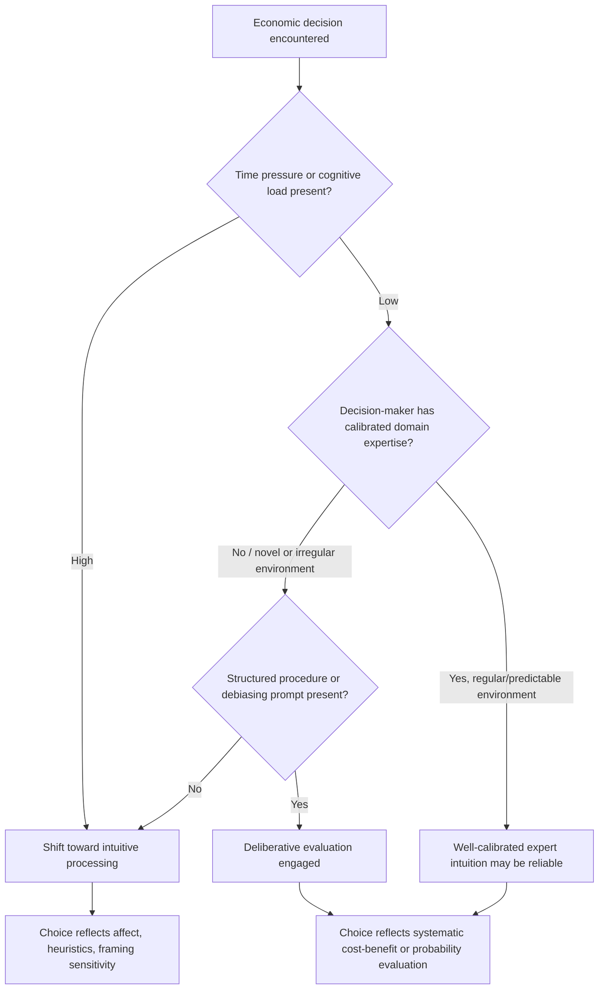

## Intuition versus Deliberation in Economic Choice

### Definition and Positioning Within Behavioral Economics

Intuition versus deliberation refers to the study of how economic choices — consumption decisions, investment decisions, negotiation behavior, and strategic interaction — are shaped differently depending on whether they arise from fast, automatic, affect-laden intuitive processing (System 1) or from slow, effortful, rule-based deliberative processing (System 2). While this distinction is grounded in the general dual-process architecture discussed elsewhere in this chapter, this topic specifically addresses how the intuitive/deliberative distinction plays out **in the domain of economic choice**: what predicts which mode dominates a given economic decision, how the two modes produce systematically different choice patterns, and what this implies for the design and interpretation of economic models.

This is a substantive area of behavioral economics research in its own right (associated with work by, among others, Daniel Kahneman, Shane Frederick, and researchers in behavioral game theory) because it bears directly on a central methodological question for the discipline: when, and to what extent, do real economic agents' choices deviate from the deliberative, calculative process assumed by the standard rational-choice model, and can this deviation be predicted and modeled systematically rather than treated as unstructured "noise" or "error"?

### The Cognitive Reflection Test as a Measurement Tool

A central methodological contribution to this literature is Shane Frederick's Cognitive Reflection Test (CRT, 2005), designed specifically to measure an individual's tendency to override an intuitively compelling but incorrect answer in favor of further reflection — operationalizing the intuition/deliberation distinction as an individual-difference variable that can be correlated with economic choice behavior.

The CRT consists of a small number of problems (the bat-and-ball problem discussed elsewhere in this chapter is the best-known item) that share a specific structure: each has an intuitively compelling, immediately available incorrect answer, alongside a correct answer that requires overriding that intuition through deliberate calculation. CRT scores have been shown, across a substantial body of research, to correlate with a range of economic behaviors, including:

- **Time preference**: Lower CRT scorers (more intuition-reliant) tend to exhibit greater impatience and stronger preference for smaller, immediate rewards over larger, delayed rewards.
- **Risk preference**: CRT scores correlate with differential sensitivity to gain-versus-loss framing in risk-related choices, consistent with more intuitive processors being more susceptible to framing effects predicted by prospect theory.
- **Financial literacy and outcomes**: Higher CRT scores are associated with better performance on financial literacy measures and, in some studies, with outcomes such as lower use of high-cost credit. [Inference: while the correlational relationship between CRT scores and various economic outcomes is well-documented across many studies, causal interpretation is contested, since CRT scores also correlate with general cognitive ability and numeracy, making it difficult to fully isolate a distinct "reflective disposition" effect from general intelligence.]

### Mechanisms: When Does Intuition Dominate Economic Choice?

Research in this area has identified several systematic factors that shift economic decisions toward more intuitive versus more deliberative processing:

**Time pressure and cognitive load**: As established in the cognitive-load literature, time-constrained or resource-constrained economic decisions (e.g., rapid trading decisions, point-of-sale purchases) shift weight toward intuitive, affect-based evaluation and away from systematic calculation of costs, benefits, and probabilities.

**Stakes and complexity**: Higher stakes can, in principle, motivate greater deliberative engagement (since the expected cost of an error is larger), but higher complexity can simultaneously overwhelm deliberative capacity, producing a non-monotonic relationship in which very complex, high-stakes decisions (e.g., choosing among complex financial products) sometimes see *more* reliance on simplified heuristics rather than less, because the deliberative calculation required exceeds feasible cognitive capacity.

**Emotional and affective states**: Decisions made under strong emotional arousal (excitement, fear, anger) are more likely to be intuition-dominated, consistent with the affect heuristic, in which an immediate emotional reaction substitutes for a more effortful cost-benefit analysis.

**Expertise and domain familiarity**: For experts operating within their domain of expertise, well-calibrated intuition (built through extensive practice and feedback, as discussed in bounded-rationality research) can produce fast judgments that are highly accurate — a form of "expert intuition" that differs qualitatively from the biased intuitive judgments of novices in the same domain, since expert intuition has been shaped by extensive corrective feedback in a regular, predictable environment (the conditions Kahneman and Gary Klein, in an influential joint analysis, identified as necessary for intuitive expertise to be trustworthy).

**Framing and presentation format**: How an economic choice is presented (e.g., as a percentage versus a frequency, as a gain versus a loss, with a numeric versus a narrative description) can shift the balance between intuitive pattern-matching and deliberate calculation, independent of the underlying economic substance of the choice.

### Practical Example: Intuitive versus Deliberative Investment Decisions

**Example**: Consider an individual investor deciding whether to sell a stock that has recently declined sharply in value.

An intuition-dominated response might be driven by loss aversion and the affect heuristic: the immediate discomfort of seeing a loss (a System 1 emotional signal) may prompt either panic selling (to eliminate the discomfort of continuing to hold a losing position) or an aversion to selling (to avoid "locking in" the loss and confirming the mistake — the disposition effect documented in behavioral finance), depending on which affective response dominates. Neither response necessarily reflects a deliberate assessment of the stock's expected future returns relative to alternative investments.

A deliberation-dominated response would instead involve explicitly separating the sunk cost of the original purchase price from the forward-looking question of whether the stock's expected future return, given current information, is superior to alternative uses of the same capital — a calculation that, if performed correctly, should be largely independent of the investor's specific purchase price or the fact that the position currently shows a loss.

This example illustrates why the intuition/deliberation distinction has direct, practical relevance to economic modeling: the standard rational-choice model predicts behavior resembling the deliberative pathway (forward-looking, reference-independent), while a substantial body of empirical evidence on investor behavior (e.g., the well-documented disposition effect) is more consistent with intuitive, reference-dependent processing dominating in practice for many investors.

### Debiasing and Structured Decision Procedures

Because the deliberative pathway can, in principle, be deliberately engaged through changes in decision environment or procedure, this literature has generated a set of debiasing strategies aimed at prompting greater deliberative engagement in economic choice:

- **Structured checklists and decision procedures**: Requiring decision-makers to explicitly work through a predefined set of considerations (e.g., a formal cost-benefit checklist) before finalizing a choice, reducing the likelihood that an initial intuitive judgment is adopted without scrutiny.
- **Cooling-off periods**: Introducing a mandatory delay between an initial intuitive reaction and a final binding decision (used, for example, in certain consumer-protection regulations for high-value purchases), giving deliberative processing time to engage and potentially override an initial impulsive response.
- **Considering the opposite**: A documented debiasing technique in which decision-makers are explicitly prompted to generate reasons why their initial intuitive judgment might be wrong, engaging deliberative scrutiny of a judgment that would otherwise be accepted by default.
- **Outcome feedback and calibration training**: Providing decision-makers with systematic, well-calibrated feedback on the accuracy of past intuitive judgments, which — consistent with the conditions for trustworthy expert intuition — can improve the quality of future intuitive judgments over time within a stable, predictable decision environment, rather than simply substituting deliberation for intuition.

### Boundaries and Ongoing Debates

- **Intuition is not synonymous with error**: A central boundary in this literature, distinct from an oversimplified popular narrative, is that intuitive processing is not inherently inferior to deliberative processing; well-calibrated expert intuition, developed through extensive feedback in regular environments, can outperform effortful deliberation, particularly under time constraints. The relevant empirical question in any given economic domain is whether the conditions for trustworthy intuition (a regular, learnable environment with reliable feedback) are actually present, not whether intuition per se should be trusted or distrusted as a blanket rule.
- **CRT as a measure of "reflectiveness" versus general cognitive ability**: A significant methodological debate concerns whether CRT performance measures a distinct disposition toward deliberative reflection, or is largely a proxy for general numeracy and cognitive ability, with implications for how CRT-based findings on economic behavior should be interpreted causally. [Inference: this remains an active methodological debate in the literature rather than a fully resolved question.]
- **Domain-specificity of the intuition/deliberation balance**: The extent to which a given individual relies on intuitive versus deliberative processing is not a fixed, single personal trait but varies substantially by domain, familiarity, stakes, and context, complicating simple individual-level classifications of decision-makers as generally "intuitive" or "deliberative" types.
- **Deliberation is not always superior in economic outcomes**: In some documented cases, increased deliberation can *worsen* decision quality (a phenomenon sometimes termed "overthinking" or "choking under pressure" in skill-based tasks), meaning the policy implication is not uniformly "promote more deliberation," but rather "match the appropriate processing mode to the structure and stakes of the specific decision."

### Diagram: Determinants of Intuitive versus Deliberative Dominance in Economic Choice

### Visual: CRT Score and Economic Behavior Correlates (svg_diagram)

<svg xmlns="http://www.w3.org/2000/svg" viewBox="0 0 700 300" font-family="Helvetica, Arial, sans-serif">
<text x="350" y="24" text-anchor="middle" font-size="16" font-weight="bold" fill="#222">CRT Score and Associated Economic Tendencies (svg_diagram)</text>
<rect x="50" y="55" width="270" height="210" rx="10" fill="#fef3e8" stroke="#e07b1f" stroke-width="1.5" />
<text x="185" y="80" text-anchor="middle" font-size="13" font-weight="bold" fill="#6d3a0f">Lower CRT (more intuitive)</text>
<text x="185" y="105" text-anchor="middle" font-size="11" fill="#6d3a0f">Greater impatience /</text>
<text x="185" y="121" text-anchor="middle" font-size="11" fill="#6d3a0f">present bias</text>
<text x="185" y="145" text-anchor="middle" font-size="11" fill="#6d3a0f">Stronger framing</text>
<text x="185" y="161" text-anchor="middle" font-size="11" fill="#6d3a0f">susceptibility</text>
<text x="185" y="185" text-anchor="middle" font-size="11" fill="#6d3a0f">Lower financial</text>
<text x="185" y="201" text-anchor="middle" font-size="11" fill="#6d3a0f">literacy (correlational)</text>
<text x="185" y="225" text-anchor="middle" font-size="11" fill="#6d3a0f">Greater reliance on</text>
<text x="185" y="241" text-anchor="middle" font-size="11" fill="#6d3a0f">affect heuristic</text>
<rect x="380" y="55" width="270" height="210" rx="10" fill="#eafaf1" stroke="#1f9d55" stroke-width="1.5" />
<text x="515" y="80" text-anchor="middle" font-size="13" font-weight="bold" fill="#0f5c30">Higher CRT (more reflective)</text>
<text x="515" y="105" text-anchor="middle" font-size="11" fill="#0f5c30">Greater patience /</text>
<text x="515" y="121" text-anchor="middle" font-size="11" fill="#0f5c30">lower present bias</text>
<text x="515" y="145" text-anchor="middle" font-size="11" fill="#0f5c30">Reduced (not eliminated)</text>
<text x="515" y="161" text-anchor="middle" font-size="11" fill="#0f5c30">framing susceptibility</text>
<text x="515" y="185" text-anchor="middle" font-size="11" fill="#0f5c30">Higher financial</text>
<text x="515" y="201" text-anchor="middle" font-size="11" fill="#0f5c30">literacy (correlational)</text>
<text x="515" y="225" text-anchor="middle" font-size="11" fill="#0f5c30">Greater systematic</text>
<text x="515" y="241" text-anchor="middle" font-size="11" fill="#0f5c30">cost-benefit evaluation</text>

<text x="350" y="285" text-anchor="middle" font-size="10" fill="#888">Note: correlational associations; causal role of CRT distinct from general numeracy is debated.</text>

</svg>

### Key Points

- Intuition versus deliberation in economic choice applies the general dual-process (System 1/System 2) architecture specifically to consumption, investment, and strategic economic decisions.
- The Cognitive Reflection Test (CRT) operationalizes an individual's tendency toward deliberative override of intuitive answers and correlates with time preference, risk framing sensitivity, and financial literacy, though its independence from general cognitive ability is debated.
- Time pressure, cognitive load, emotional arousal, and decision complexity shift economic choices toward intuitive processing; structured procedures, cooling-off periods, and calibrated feedback can promote deliberative engagement.
- Expert intuition, developed through extensive feedback in regular and predictable environments, can be highly reliable and is not equivalent to biased or erroneous judgment — the key question is whether the environmental conditions for trustworthy intuition are present.
- The disposition effect in investing is a canonical example of intuition-dominated (reference-dependent, loss-averse) economic behavior diverging from the deliberation-dominated (forward-looking) prediction of standard rational-choice models.
- Neither mode is uniformly superior; matching the processing mode to the decision's structure, stakes, and time constraints is the more accurate policy and design implication than a blanket preference for deliberation.

**Related Topics**

- Cognitive Reflection Test (CRT) and its relationship to numeracy
- System 1 and System 2 thinking
- Cognitive load and the quality of decisions
- Present bias and hyperbolic discounting
- Disposition effect and behavioral finance
- Affect heuristic and emotion in judgment
- Kahneman and Klein's conditions for valid expert intuition
- Debiasing techniques: considering the opposite, structured checklists, cooling-off periods