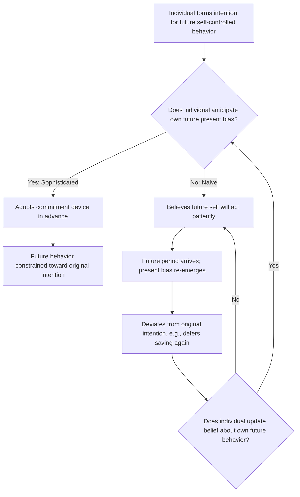

## Bounded Willpower and Bounded Self-Interest

### Definition and Positioning

Bounded willpower and bounded self-interest are two of the three canonical departures from the neoclassical rational-agent model that organize the field of behavioral economics (alongside bounded rationality, treated separately in this chapter). Where bounded rationality addresses limits on cognitive processing and information, bounded willpower and bounded self-interest address limits on two other standard assumptions: that agents always act in accordance with their own stated long-term interests, and that agents care only about their own material payoffs.

**Bounded willpower** refers to the systematic tendency of decision-makers to make choices that are inconsistent with their own long-term interests, even when they possess complete information and correctly understand the relevant tradeoffs — that is, individuals often want to want something different than what they actually do. This departs from the standard assumption of time-consistent preferences, under which an agent's ranking of future options, evaluated from any point in time, does not change simply because time has passed.

**Bounded self-interest** refers to the systematic tendency of decision-makers to care about outcomes for others — fairness, reciprocity, and the welfare of others — even at a cost to their own material payoff, departing from the standard assumption that agents are motivated exclusively by their own outcomes (narrow self-interest).

### Bounded Willpower: Mechanisms and Formal Structure

**Time-inconsistent preferences**: The standard economic model of intertemporal choice assumes exponential discounting, under which the discount factor applied between any two adjacent time periods is constant regardless of when those periods occur. Bounded willpower research, by contrast, documents that individuals tend to discount the near future much more steeply than the distant future — a pattern captured by **hyperbolic discounting** or its more tractable variant, **quasi-hyperbolic ($\beta$-$\delta$) discounting**, formalized by David Laibson and others.

Under quasi-hyperbolic discounting, the present-value weight assigned to a payoff received at time $t$ (for $t \geq 1$) is given by:

$$U_0 = u_0 + \beta \sum_{t=1}^{\infty} \delta^t u_t$$

where $\delta$ is the standard long-run discount factor and $\beta < 1$ introduces an additional, one-time discount applied specifically to the *present-versus-future* comparison, but not to comparisons among two future periods. This structure produces present bias: a strong preference for immediate gratification when a reward is available *now*, but consistent, patient preferences when the same tradeoff is instead framed as occurring entirely in the future.

**Preference reversals**: A defining empirical signature of bounded willpower, predicted directly by quasi-hyperbolic discounting, is the preference reversal: an individual may prefer $100 in 31 days over $90 in 30 days (a patient choice, since neither option is immediate), but prefer $90 today over $100 tomorrow (an impatient choice) when the same relative delay is shifted to include the present moment. This reversal cannot be produced by standard exponential discounting, regardless of the discount rate chosen, making it a key empirical test distinguishing time-consistent from time-inconsistent preference models.

**Sophistication versus naivete**: Bounded willpower research distinguishes between **sophisticated** agents, who correctly anticipate their own future self-control problems and take steps to counteract them (e.g., pre-committing to a savings plan), and **naive** agents, who fail to anticipate their own future present bias and mistakenly believe their future selves will behave patiently, leading to repeated procrastination and failed self-control across many time periods.

**Commitment devices**: Because sophisticated agents can anticipate their own bounded willpower, a substantial applied literature studies commitment devices — mechanisms that restrict or penalize an individual's own future choices in advance, precisely because the individual does not trust their future self to act in accordance with present intentions (e.g., automatic payroll retirement contributions, pre-committing to a gym membership contract, or savings products with early-withdrawal penalties, studied extensively in the "Save More Tomorrow" program research by Thaler and Benartzi).

### Bounded Self-Interest: Mechanisms and Formal Structure

**Social preferences and inequity aversion**: Bounded self-interest is most commonly modeled through social-preference utility functions that augment an individual's utility with a term reflecting the distribution of payoffs between themselves and others. The **Fehr-Schmidt inequity-aversion model** is a canonical formalization, in which an individual's utility depends not only on their own payoff $x_i$ but also on the disadvantageous and advantageous inequality relative to others:

$$U_i(x) = x_i - \alpha_i \max(x_j - x_i, 0) - \beta_i \max(x_i - x_j, 0)$$

where $\alpha_i$ captures aversion to disadvantageous inequality (envy toward those who have more) and $\beta_i$ captures aversion to advantageous inequality (guilt toward those who have less), with the empirical regularity that $\alpha_i \geq \beta_i$ for most individuals — people generally dislike being worse off relative to others more strongly than they dislike being better off.

**Reciprocity**: Related but distinct from pure outcome-based inequity aversion, reciprocity models (e.g., Rabin's fairness-equilibrium framework) posit that agents respond to the perceived *intentions* behind others' actions, rewarding perceived kindness with kindness and punishing perceived unkindness even at a cost to themselves, independent of the resulting payoff distribution alone.

**Altruistic punishment**: A well-documented behavioral phenomenon in which individuals incur a personal cost specifically to punish others perceived as behaving unfairly or non-cooperatively, even when the punisher has no prospect of future interaction with, or direct material benefit from punishing, the offending party — a pattern difficult to reconcile with narrow self-interest but readily explained by reciprocity and inequity-aversion models.

### Practical Example: The Ultimatum Game and Bounded Self-Interest

**Example**: In the ultimatum game, one player (the proposer) is given a sum of money (e.g., $10) and proposes a division between themselves and a second player (the responder). The responder can either accept the proposed division (both players receive the proposed amounts) or reject it (both players receive nothing).

Under the standard self-interest assumption, a purely self-interested responder should accept any positive offer, however small (since any positive amount is preferable to zero), and an anticipating self-interested proposer should therefore offer the smallest positive amount possible. In practice, across a large body of experimental replications spanning many countries and subject pools, responders frequently reject offers below approximately 20–30 percent of the total sum, sacrificing guaranteed positive payoff purely to punish a perceived unfair division, and proposers frequently offer amounts closer to a 50/50 split than the minimal-offer prediction, consistent with anticipating rejection of unfair offers and/or holding fairness preferences themselves. [Inference: while the general qualitative pattern (positive offers, common rejection of low offers) is highly robust across replications, the precise numerical thresholds for typical and modal offers vary meaningfully across cultural and experimental contexts and should not be treated as universal constants.]

### Practical Example: Present Bias in Savings Behavior

**Example**: An individual planning for retirement may, when asked in the present about their future saving intentions, express a clear preference to begin saving a specific fraction of income starting next month. When that future month arrives and becomes the present, the same individual — under present bias — frequently defers the decision again, preferring immediate consumption over the previously planned saving, and this pattern can repeat indefinitely if the individual is naive about their own future present bias.

This dynamic underlies the design logic of automatic-enrollment retirement savings programs, which shift the default action from "opt in to saving" to "opt out of saving," exploiting present bias and status-quo tendencies in the *opposite* direction — inertia now works to sustain the previously chosen saving commitment rather than to defer it — and represents a direct policy application of bounded-willpower research to retirement-savings design.

### Comparative Table: Bounded Willpower versus Bounded Self-Interest

| Dimension | Bounded Willpower | Bounded Self-Interest |
| --- | --- | --- |
| Standard assumption relaxed | Time-consistent preferences | Purely self-interested (own-payoff-only) preferences |
| Core phenomenon | Present bias, preference reversals over time | Fairness concerns, reciprocity, inequity aversion |
| Canonical formal model | Quasi-hyperbolic ($\beta$-$\delta$) discounting | Fehr-Schmidt inequity aversion; Rabin fairness equilibrium |
| Canonical experimental paradigm | Intertemporal choice tasks (smaller-sooner vs. larger-later) | Ultimatum game, dictator game, trust game |
| Key applied domain | Retirement savings, procrastination, addiction | Labor contracts, tax compliance, charitable giving, market fairness norms |
| Key intervention type | Commitment devices, defaults | Framing of fairness norms, transparency, reciprocal incentive design |

### Boundaries and Interactions Between the Two Domains

- **Overlap and interaction**: Bounded willpower and bounded self-interest are not fully independent; for example, charitable giving decisions can involve both a self-control dimension (resisting immediate consumption to give later, or vice versa) and a social-preference dimension (altruism toward the recipient), meaning real economic behavior often reflects a combination of all three bounded-rationality-family departures rather than a single isolated mechanism.
- **Distinguishing altruism from strategic reputation-building**: A persistent methodological challenge in bounded self-interest research is distinguishing genuine other-regarding preferences from strategic behavior aimed at building a reputation for fairness that yields future material benefit; controlled anonymous, one-shot experimental designs (e.g., single-round dictator games with no possibility of future interaction) are used specifically to rule out this confound, though even these designs face some debate about whether full anonymity and one-shot framing are ever perfectly achieved in a laboratory setting. [Inference: this is an active methodological concern in the experimental social-preference literature rather than a fully resolved design issue.]
- **Sophistication assumptions are themselves an empirical question**: Whether real individuals are predominantly sophisticated or naive about their own present bias is not settled by the quasi-hyperbolic model itself and must be empirically estimated separately in each applied context; policy designs (e.g., commitment devices) that assume sophistication may be poorly matched to a substantially naive population, and vice versa.
- **Cross-cultural variation in fairness norms**: The magnitude of fairness-related behavior in games such as the ultimatum game varies meaningfully across cultural and economic contexts, indicating that while the qualitative departure from narrow self-interest appears widespread, the specific quantitative norms are shaped by social and cultural context rather than reflecting a single universal fairness parameter. [Unverified: specific cross-cultural comparative figures should be checked against current cross-cultural experimental-economics literature rather than assumed from any single study.]

### Diagram: Present Bias and the Sophistication/Naivete Distinction

### Visual: Fehr-Schmidt Inequity Aversion (svg_diagram)

<svg xmlns="http://www.w3.org/2000/svg" viewBox="0 0 700 300" font-family="Helvetica, Arial, sans-serif">
<text x="350" y="24" text-anchor="middle" font-size="16" font-weight="bold" fill="#222">Fehr-Schmidt Inequity Aversion (svg_diagram)</text>
<line x1="100" y1="240" x2="600" y2="240" stroke="#444" stroke-width="1.5" />
<line x1="350" y1="240" x2="350" y2="50" stroke="#444" stroke-width="1.5" />
<text x="350" y="270" text-anchor="middle" font-size="11" fill="#444">x_j - x_i (other's payoff minus own)</text>
<text x="90" y="145" text-anchor="middle" font-size="11" fill="#444" transform="rotate(-90 90 145)">Utility U_i</text>
<line x1="100" y1="200" x2="350" y2="80" stroke="#c22a5e" stroke-width="2.5" />
<text x="180" y="130" text-anchor="middle" font-size="10" fill="#7a1638">Disadvantageous inequality</text>
<text x="180" y="145" text-anchor="middle" font-size="10" fill="#7a1638">(slope reflects alpha: envy)</text>
<line x1="350" y1="80" x2="600" y2="150" stroke="#1f9d55" stroke-width="2.5" />
<text x="500" y="115" text-anchor="middle" font-size="10" fill="#0f5c30">Advantageous inequality</text>
<text x="500" y="130" text-anchor="middle" font-size="10" fill="#0f5c30">(slope reflects beta: guilt)</text>
<circle cx="350" cy="80" r="4" fill="#222" />
<text x="350" y="65" text-anchor="middle" font-size="10" fill="#222">Equal split: max utility</text>

<text x="350" y="295" text-anchor="middle" font-size="10" fill="#888">Utility peaks at equality; steeper left slope reflects alpha &gt;= beta for most individuals.</text>

</svg>

### Key Points

- Bounded willpower captures systematic time-inconsistency in preferences, formalized through quasi-hyperbolic ($\beta$-$\delta$) discounting, producing present bias and predictable preference reversals between immediate and future tradeoffs.
- Sophisticated agents anticipate their own future self-control problems and may adopt commitment devices; naive agents do not, leading to repeated procrastination.
- Bounded self-interest captures systematic other-regarding preferences, formalized through inequity-aversion models (Fehr-Schmidt) and reciprocity/fairness-equilibrium models (Rabin), producing behaviors such as ultimatum-game rejections and altruistic punishment that are inconsistent with narrow self-interest.
- The ultimatum game and ongoing retirement-savings research are canonical empirical anchors for bounded self-interest and bounded willpower respectively.
- Both domains support major applied interventions: commitment devices and automatic-enrollment defaults for bounded willpower; fairness-norm design and transparency for bounded self-interest.
- Real economic behavior often reflects interaction among bounded rationality, bounded willpower, and bounded self-interest simultaneously rather than any single mechanism operating in isolation.

**Related Topics**

- Quasi-hyperbolic discounting and the $\beta$-$\delta$ model
- Present bias, procrastination, and commitment devices
- Sophistication versus naivete in intertemporal choice
- Fehr-Schmidt inequity aversion and Rabin fairness equilibrium
- Ultimatum game, dictator game, and trust game experimental paradigms
- Altruistic punishment and third-party punishment
- Automatic enrollment and "Save More Tomorrow" retirement savings design
- Cross-cultural variation in fairness norms and social preferences