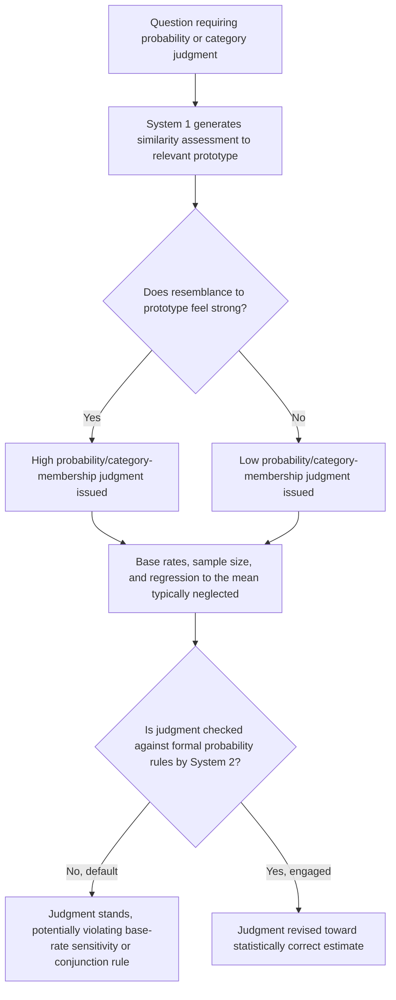

## The Representativeness Heuristic

### Definition and Origin

The representativeness heuristic is a mental shortcut, identified and formalized by Amos Tversky and Daniel Kahneman in their foundational 1974 paper "Judgment under Uncertainty: Heuristics and Biases," in which people assess the probability that an object, person, or event belongs to a particular category or was generated by a particular process by evaluating how similar it is to the typical or prototypical member of that category, rather than by applying the statistically correct principles of probability theory. Under this heuristic, judgments of likelihood are substituted with judgments of resemblance: "How likely is A to be a B?" is answered by assessing "How similar is A to the typical B?" — an instance of the broader attribute-substitution mechanism underlying System 1 processing.

The representativeness heuristic is considered one of the three original heuristics identified in Tversky and Kahneman's founding heuristics-and-biases research program, alongside the availability heuristic and the anchoring-and-adjustment heuristic, and remains among the most extensively studied and replicated findings in judgment and decision-making research.

### Mechanism

Representativeness operates by comparing a specific instance to a mental prototype or stereotype of a category, and using the degree of match as a proxy for probability. This substitution is often effective as a rough approximation, since category membership and prototype similarity are frequently correlated in the real world, but it produces systematic and predictable errors specifically because degree of resemblance is not the same statistical quantity as probability, and several other factors that are highly relevant to a correct probability judgment are neglected in the process:

- **Base rates**: The underlying prior probability or frequency of a category in the relevant population is neglected in favor of resemblance-based judgment (base-rate neglect).
- **Sample size**: The reliability of a sample as evidence for an underlying process is neglected; small samples are judged as if they were as representative of an underlying distribution as large samples (insensitivity to sample size, related to the "law of small numbers").
- **Regression to the mean**: Extreme observations are expected to persist or to be representative of an individual's or process's true underlying tendency, rather than being partially attributed to chance and expected to regress toward an average value on subsequent measurement.
- **Predictability and validity of evidence**: The reliability, or diagnostic validity, of the information used to form a resemblance judgment is often not adequately discounted, so confident category judgments are made even from weak or unreliable evidence, provided that evidence produces a vivid, resemblance-generating impression.
- **The conjunction rule**: The probability of two events occurring together cannot exceed the probability of either event occurring alone, but the representativeness heuristic can lead to systematic violations of this rule when a conjunction of characteristics matches a prototype more closely than either characteristic alone (the conjunction fallacy).

### The Conjunction Fallacy: The Linda Problem

**Example**: The best-known experimental demonstration of representativeness-driven error is Tversky and Kahneman's "Linda problem" (1983). Participants are given a description: *"Linda is 31 years old, single, outspoken, and very bright. She majored in philosophy. As a student, she was deeply concerned with issues of discrimination and social justice, and also participated in anti-nuclear demonstrations."*

Participants are then asked to rank the probability of several statements about Linda, critically including:

- "Linda is a bank teller."
- "Linda is a bank teller and is active in the feminist movement."

A substantial majority of respondents across replications rank the second, conjunctive statement as *more* probable than the first, single statement — a direct logical impossibility, since the set of bank tellers who are also active feminists is necessarily a subset of (and therefore no larger than) the set of all bank tellers. This occurs because the conjunctive description ("bank teller and feminist") is more representative of — more similar to — the prototype suggested by Linda's description than the single description ("bank teller") alone, and this resemblance-based judgment overrides the formal probability-theoretic constraint that a conjunction cannot exceed either of its constituent probabilities. The Linda problem is one of the most replicated findings in the judgment-and-decision-making literature and is used as the canonical illustration of the conjunction fallacy.

### Base-Rate Neglect: The Engineer/Lawyer Problem

**Example**: A second canonical demonstration (Kahneman and Tversky, 1973) presents participants with a description of an individual drawn, they are told, from a pool of 100 people consisting of a specified number of engineers and lawyers (e.g., either 70 engineers and 30 lawyers, or 30 engineers and 70 lawyers, varied between experimental conditions). Participants are given a brief personality sketch designed to sound stereotypically representative of an engineer (e.g., emphasizing enjoyment of mathematical puzzles and lack of interest in social or political issues) and asked to estimate the probability that the described individual is an engineer.

The correct, base-rate-sensitive answer should differ substantially between the two conditions, since Bayes' rule requires incorporating the prior probability (base rate) of engineers versus lawyers in the sample alongside the diagnostic value of the personality description. In practice, participants' probability estimates were found to be highly similar across the two base-rate conditions and driven almost entirely by the degree to which the personality description resembled a stereotypical engineer, largely ignoring the explicitly stated base rate — a pattern termed base-rate neglect. Notably, when no individuating personality description was provided at all, participants did use the base rate correctly, indicating that base-rate neglect is specifically triggered by the presence of vivid, resemblance-generating individuating information, which crowds out consideration of the less vivid statistical base rate.

### Formal Characterization: Contrast with Bayesian Updating

The normatively correct approach to the engineer/lawyer-style problem is Bayesian updating, which combines the base rate (prior probability) with the diagnostic value of the evidence (likelihood ratio):

$$P(\text{Engineer} \mid \text{Description}) = \frac{P(\text{Description} \mid \text{Engineer}) \cdot P(\text{Engineer})}{P(\text{Description} \mid \text{Engineer}) \cdot P(\text{Engineer}) + P(\text{Description} \mid \text{Lawyer}) \cdot P(\text{Lawyer})}$$

Representativeness-based judgment can be characterized as an approximation that substitutes the numerator's similarity-relevant term — an intuitive sense of how well the description matches the "engineer" prototype — for the full Bayesian calculation, while effectively treating the prior terms $P(\text{Engineer})$ and $P(\text{Lawyer})$ (the base rates) as approximately equal or irrelevant, regardless of their actual stated values. This substitution is what produces the empirically observed insensitivity to the manipulated base-rate conditions.

### Related Phenomena Explained by Representativeness

- **The gambler's fallacy**: The mistaken belief that, in a sequence of independent random events (e.g., coin flips), a run of one outcome makes the opposite outcome "due" to occur, reflecting an expectation that even short random sequences should be representative of the known long-run 50/50 distribution.
- **The "hot hand" phenomenon (as originally studied)**: Related research on perceived streaks in sequential performance (e.g., basketball shooting) examined whether people over-infer an underlying change in a performer's true ability from a representative-seeming short run of successes; the original "hot hand fallacy" literature has itself been subject to substantial methodological reanalysis and debate in more recent research regarding whether the originally claimed absence of any true hot-hand effect in basketball was itself affected by statistical bias in the analysis methods used. [Unverified: the current state of the hot-hand debate has shifted meaningfully since the original studies and should be checked against recent methodological reanalyses rather than presented as settled in either direction.]
- **Illusory correlation and stereotyping**: Representativeness contributes to the formation and persistence of social stereotypes, since vivid or salient instances that match a stereotype are more readily judged as representative of a group, independent of their actual statistical frequency within that group.
- **Misperception of randomness**: People's intuitive expectations of what a "random" sequence should look like (e.g., expecting frequent alternation and an absence of streaks) do not match the actual statistical properties of genuinely random sequences, because a sequence with clusters or streaks is judged as less representative of "randomness" than an evenly alternating sequence, even though genuinely random processes commonly produce streaks.

### Boundaries and Debates

- **Adaptive value in ecologically valid contexts**: Consistent with the "ecological rationality" critique discussed elsewhere in this chapter, some researchers argue that similarity-based judgment is a generally effective and computationally efficient strategy in many real-world environments where resemblance and category membership are indeed strongly correlated, and that laboratory demonstrations (such as the Linda problem) may specifically construct scenarios designed to isolate and highlight the heuristic's failure mode rather than reflecting its typical, more benign real-world performance.
- **Conversational-pragmatics critique of the Linda problem**: An influential methodological critique holds that some or all of the conjunction-fallacy effect in the Linda problem may result from ordinary conversational norms (e.g., participants assuming that a researcher's inclusion of the word "feminist" in an option is itself informative and not merely a logically nested category), rather than purely from a resemblance-based probability error, prompting a body of follow-up research using reworded or restructured versions of the problem to test the robustness of the effect under conditions designed to reduce this pragmatic ambiguity. [Inference: the conjunction fallacy itself replicates robustly across many reformulations, but the extent to which conversational pragmatics contributes to its magnitude in the original wording remains a live methodological question rather than fully settled.]
- **Distinguishing representativeness from availability**: In practice, representativeness and availability can be difficult to fully disentangle in a given judgment task, since a highly representative instance is often also a more available (easily recalled or imagined) one; careful experimental design is required to isolate which specific mechanism is driving a given judgment error.

### Diagram: Representativeness Judgment Process

### Visual: The Conjunction Fallacy (svg_diagram)

<svg viewBox="0 0 700 300" xmlns="http://www.w3.org/2000/svg" font-family="Helvetica, Arial, sans-serif">
<text x="350" y="24" text-anchor="middle" font-size="16" font-weight="bold" fill="#222">The Conjunction Fallacy: Linda Problem (svg_diagram)</text>
<circle cx="280" cy="170" r="120" fill="#e8f0fe" stroke="#3b5bdb" stroke-width="2" opacity="0.7"/>
<text x="180" y="90" text-anchor="middle" font-size="12" fill="#1a2b6d">All bank tellers</text>
<circle cx="330" cy="190" r="55" fill="#fbe8ee" stroke="#c22a5e" stroke-width="2" opacity="0.85"/>
<text x="330" y="190" text-anchor="middle" font-size="11" fill="#7a1638">Bank tellers</text>
<text x="330" y="205" text-anchor="middle" font-size="11" fill="#7a1638">who are also</text>
<text x="330" y="220" text-anchor="middle" font-size="11" fill="#7a1638">feminists</text>

<text x="500" y="120" text-anchor="middle" font-size="11" fill="#444">Logically:</text>

<text x="500" y="140" text-anchor="middle" font-size="11" fill="#444">P(bank teller AND feminist)</text>

<text x="500" y="158" text-anchor="middle" font-size="11" fill="#444"><= P(bank teller)</text>

<text x="500" y="200" text-anchor="middle" font-size="11" fill="#444">Judged (incorrectly):</text>

<text x="500" y="218" text-anchor="middle" font-size="11" fill="`#c22a5e`">P(bank teller AND feminist)</text>

<text x="500" y="236" text-anchor="middle" font-size="11" fill="`#c22a5e`">> P(bank teller)</text>

<text x="350" y="280" text-anchor="middle" font-size="10" fill="#888">The smaller circle (conjunction) is a strict subset but is judged more probable due to prototype match.</text>

</svg>

### Key Points

- The representativeness heuristic substitutes a judgment of resemblance to a prototype for a formal probability judgment, producing generally useful but systematically biased estimates.
- The conjunction fallacy (Linda problem) demonstrates that a conjunctive description matching a prototype can be judged more probable than one of its constituent, logically necessary components.
- Base-rate neglect (engineer/lawyer problem) demonstrates that vivid individuating information crowds out correct use of statistical prior probabilities, even when base rates are explicitly provided.
- Related phenomena explained by representativeness include the gambler's fallacy, the (contested) hot-hand phenomenon, illusory correlation/stereotyping, and misperception of randomness.
- Methodological critiques, including the conversational-pragmatics critique of the Linda problem and the ecological-rationality defense of similarity-based judgment, qualify but do not eliminate the robustness of the core representativeness findings.
- Representativeness and availability can be difficult to disentangle in practice and require careful experimental isolation.

**Related Topics**

- The availability heuristic
- Anchoring and adjustment
- Base-rate neglect and Bayesian updating
- The conjunction fallacy and its methodological critiques
- The gambler's fallacy and the hot-hand debate
- Ecological rationality and ecologically valid heuristics
- Illusory correlation and stereotype formation
- Insensitivity to sample size and the "law of small numbers"