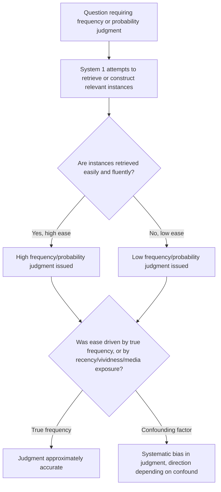

## The Availability Heuristic

### Definition and Origin

The availability heuristic is a mental shortcut, identified and formalized by Amos Tversky and Daniel Kahneman in their 1973 paper "Availability: A Heuristic for Judging Frequency and Probability" and their broader 1974 heuristics-and-biases framework, in which people estimate the frequency or probability of an event by the ease with which relevant instances come to mind, rather than by systematically retrieving or calculating the actual statistical frequency. Under this heuristic, a judgment of "how likely" or "how frequent" is substituted with a judgment of "how easily do examples come to mind" — another instance of the attribute-substitution mechanism underlying System 1 processing, alongside representativeness and anchoring.

The heuristic reflects a generally reasonable underlying regularity: in many natural environments, more frequent or more probable events genuinely are easier to recall, because repeated or common experiences tend to be better encoded and more accessible in memory. The systematic biases associated with availability arise specifically because ease of recall is also strongly influenced by factors unrelated to actual frequency — recency, vividness, emotional salience, and media coverage — causing the heuristic to produce predictable, directional errors whenever these confounding factors diverge from true statistical frequency.

### Mechanism

Availability operates through the cognitive ease, or fluency, with which instances or associations are retrieved from memory or constructed in imagination. Several distinguishable sub-mechanisms contribute to availability-based judgments:

- **Retrievability of instances**: Judgments of the frequency of a class are influenced by how easily instances of that class can be retrieved from memory, independent of the class's actual size.
- **Effectiveness of a search set**: Judgments of frequency for events defined by complex or non-obvious combinations of criteria are influenced by how easily an effective mental search strategy can be constructed to generate relevant instances.
- **Imaginability**: For events that have not actually occurred or been directly observed, judgments of frequency or probability are influenced by how easily instances can be imagined or constructed, even in the complete absence of memory-based retrieval.
- **Illusory correlation**: The perceived frequency of the co-occurrence of two events is influenced by the associative strength or availability of that pairing in memory, rather than by their actual statistical joint frequency, contributing to the persistence of spurious perceived associations (including certain stereotype-based associations).

The key distinguishing feature separating availability from representativeness is that availability is fundamentally about *ease of cognitive retrieval or construction*, whereas representativeness is fundamentally about *similarity to a prototype*; the two mechanisms often operate together in practice (a highly representative instance is frequently also highly available), which is a recognized methodological challenge in isolating their independent contributions to a given judgment error.

### Documented Biases Produced by Availability

| Bias | Mechanism |
| --- | --- |
| Overestimation of vivid or dramatic causes of death | Memorable, widely reported causes (e.g., plane crashes, shark attacks, homicide) are recalled more easily than statistically more common but less dramatic causes (e.g., diabetes, stroke), leading to systematic overestimation of the former relative to the latter |
| Recency effects in risk perception | Recent events (e.g., a recently reported natural disaster or crime) are more available and therefore judged more probable or frequent than their actual base rate would justify |
| Media-driven risk distortion | Extensive media coverage increases availability independent of actual frequency, producing perceived risk levels correlated with coverage volume rather than with underlying statistical risk |
| Egocentric bias in joint-effort estimation | Individuals more easily recall their own contributions to a joint task than those of others, leading married couples or team members to systematically overestimate their own share of a joint effort (e.g., household chores) when self-reported shares are summed across group members and found to exceed 100 percent |
| Illusory correlation and stereotype persistence | Salient or distinctive paired events (e.g., a minority group member behaving unusually) are more memorable and more available, inflating the perceived association between the group and the behavior beyond its actual statistical co-occurrence |

### Practical Example: Letter Frequency Judgment

**Example**: In one of Tversky and Kahneman's original experiments, participants were asked whether the letter "K" appears more frequently as the first letter of English words, or as the third letter of English words. A majority of respondents judged the first-letter position as more frequent, even though the third-letter position is, in fact, more common in English text.

This error arises because it is substantially easier to generate or recall words by their first letter (a natural and frequently practiced retrieval strategy, e.g., mentally scanning through "king," "kite," "kind") than by their third letter (a retrieval strategy that is rarely practiced and requires a much less natural search process). The greater *retrievability* of first-letter examples was mistaken for greater actual frequency, illustrating the "effectiveness of a search set" sub-mechanism directly: the ease of the retrieval process itself, rather than the true underlying frequency, drove the probability judgment.

### Practical Example: Risk Perception After Salient Events

**Example**: Following a highly publicized airplane crash, survey research typically finds a measurable, though often temporary, increase in the perceived probability of dying in an air travel accident and, in some studies, a corresponding short-term shift in travel behavior away from air travel toward alternative modes (e.g., driving), despite the underlying statistical risk of air travel per mile traveled remaining essentially unchanged by a single, highly salient incident, and remaining substantially lower than the statistical risk of automobile travel per mile in most well-documented comparisons. This pattern illustrates availability operating through vividness and recency: a single highly memorable, extensively covered event dramatically increases the ease of imagining or recalling an air-crash scenario, and this increased retrievability is used as a proxy for an updated probability estimate, even though a single incident provides very little valid statistical information about the underlying base rate. [Inference: the general direction and existence of this shift is well-documented across multiple studies of high-profile incidents, but the specific magnitude and duration of any given behavioral shift vary by event and study and should not be treated as a fixed, universal quantity.]

### Formal Characterization

Availability-based judgment can be characterized as substituting a subjective, memory-based ease-of-retrieval signal $E(A)$ for the objective frequency or probability $P(A)$ of an event class $A$:

$$\hat{P}(A) \approx f(E(A))$$

where $f$ is an increasing function mapping subjective retrieval ease to a probability estimate, and $E(A)$ is itself influenced not only by the true frequency of $A$ but by confounding factors $C$ (recency, vividness, media exposure, personal experience, search-strategy effectiveness):

$$E(A) = g(P(A), C)$$

Systematic bias occurs whenever $C$ diverges meaningfully from a neutral, frequency-proportional influence — for example, when a rare but vivid event class has a disproportionately large effect on $E(A)$ relative to its true, low value of $P(A)$. This formalization is a conceptual simplification intended to clarify the mechanism rather than a precisely estimated quantitative model, since the functions $f$ and $g$ are not directly observable or measured with a single standard procedure across the literature. [Inference: this is a standard expository formalization used to organize the empirical availability literature, not a validated, universally parameterized quantitative model.]

### Applications in Behavioral Economics and Policy

- **Insurance purchasing behavior**: Documented patterns show that demand for insurance against low-probability, high-salience events (e.g., flood insurance) tends to spike sharply immediately following a recent disaster and decline over subsequent years as the event becomes less available in memory, a pattern difficult to reconcile with a stable, rational updating of the underlying (largely unchanged) base rate of disaster risk.
- **Financial risk assessment**: Investor risk perception and portfolio behavior have been linked to availability effects, including heightened risk aversion following recent, salient market downturns and underweighting of risks that have not recently produced vivid, memorable losses.
- **Public health and safety communication**: Effective risk communication strategies account for availability effects by recognizing that statistical or numerical risk information alone may not shift behavior as effectively as approaches that address the vividness or recency imbalance directly, and conversely that public alarm following a highly publicized but statistically rare event may require active correction with base-rate information.
- **Litigation and regulatory risk perception**: Jury and regulatory judgments regarding the probability or typicality of specific harms (e.g., product-safety risks) have been studied for availability-driven distortion, particularly following extensive media coverage of a specific, often unrepresentative case.

### Boundaries and Debates

- **Adaptive value in typical environments**: As with representativeness, availability is generally an effective judgment strategy in stable, natural environments where recall ease and true frequency are genuinely correlated; the heuristic's failures are most pronounced specifically in environments with a mismatch between salience/exposure and true frequency (heavily mediated environments being a primary modern example), rather than reflecting a universal cognitive flaw independent of context.
- **Difficulty isolating availability from representativeness**: Because a prototype-representative instance is often also a highly available one, carefully designed experiments (such as the letter-frequency task, which is specifically constructed to isolate retrieval ease from prototype-similarity) are required to cleanly attribute a given judgment error to availability rather than representativeness or some combination of both.
- **Individual differences and expertise moderation**: Domain expertise can moderate availability effects, since experts may have more balanced, systematically organized retrieval structures for frequency judgments within their specific domain of expertise, though this moderation is not uniform and experts remain susceptible to availability effects outside their specific domain of practiced judgment. [Inference: this moderation pattern is documented in various domain-specific studies but is not established as a general, fully quantified rule across all forms of expertise.]

### Diagram: Availability Judgment Process

### Visual: Availability and Confounding Factors (svg_diagram)

<svg xmlns="http://www.w3.org/2000/svg" viewBox="0 0 700 300" font-family="Helvetica, Arial, sans-serif">
<text x="350" y="24" text-anchor="middle" font-size="16" font-weight="bold" fill="#222">Availability Heuristic: Inputs to Perceived Ease of Recall (svg_diagram)</text>
<circle cx="350" cy="170" r="55" fill="#fff6e0" stroke="#c98a1a" stroke-width="2" />
<text x="350" y="165" text-anchor="middle" font-size="11" fill="#5c3d0a">Perceived</text>
<text x="350" y="180" text-anchor="middle" font-size="11" fill="#5c3d0a">ease of recall</text>
<line x1="350" y1="115" x2="350" y2="75" stroke="#3b5bdb" stroke-width="2" />
<rect x="260" y="35" width="180" height="40" rx="6" fill="#e8f0fe" stroke="#3b5bdb" stroke-width="1.5" />
<text x="350" y="60" text-anchor="middle" font-size="11" fill="#1a2b6d">True frequency (valid signal)</text>
<line x1="300" y1="130" x2="180" y2="90" stroke="#1f9d55" stroke-width="2" />
<rect x="60" y="55" width="180" height="40" rx="6" fill="#eafaf1" stroke="#1f9d55" stroke-width="1.5" />
<text x="150" y="80" text-anchor="middle" font-size="11" fill="#0f5c30">Recency of exposure</text>
<line x1="300" y1="210" x2="180" y2="250" stroke="#c22a5e" stroke-width="2" />
<rect x="60" y="255" width="180" height="40" rx="6" fill="#fbe8ee" stroke="#c22a5e" stroke-width="1.5" />
<text x="150" y="280" text-anchor="middle" font-size="11" fill="#7a1638">Vividness / emotional salience</text>
<line x1="400" y1="210" x2="520" y2="250" stroke="#7e3ac2" stroke-width="2" />
<rect x="460" y="255" width="180" height="40" rx="6" fill="#f3e8fb" stroke="#7e3ac2" stroke-width="1.5" />
<text x="550" y="280" text-anchor="middle" font-size="11" fill="#3f1a6d">Media coverage volume</text>
<line x1="400" y1="130" x2="520" y2="90" stroke="#e07b1f" stroke-width="2" />
<rect x="460" y="55" width="180" height="40" rx="6" fill="#fef3e8" stroke="#e07b1f" stroke-width="1.5" />
<text x="550" y="80" text-anchor="middle" font-size="11" fill="#6d3a0f">Ease of mental search strategy</text>
</svg>

### Key Points

- The availability heuristic substitutes ease of recall or imagination for actual statistical frequency or probability, producing generally useful but systematically biased judgments.
- Retrievability of instances, effectiveness of a search set, imaginability, and illusory correlation are the primary sub-mechanisms through which availability operates.
- The letter-frequency experiment ("K" as first versus third letter) isolates retrieval-strategy effectiveness as a distinct source of bias, cleanly separated from representativeness.
- Documented applications include overestimation of vivid causes of death, post-disaster spikes in insurance purchasing, media-driven risk distortion, and egocentric bias in joint-effort recall.
- Availability and representativeness frequently co-occur in practice and require carefully isolated experimental designs to attribute a given judgment error to one mechanism specifically.
- The heuristic is generally adaptive in stable environments where recall ease correlates with true frequency, with systematic bias emerging specifically when recency, vividness, or media exposure diverge from actual statistical frequency.

**Related Topics**

- The representativeness heuristic
- Anchoring and adjustment
- Illusory correlation and stereotype formation
- Risk perception and media coverage effects
- Insurance demand and disaster-driven purchasing spikes
- Egocentric bias in joint-effort and contribution estimation
- Affect heuristic and emotionally-driven judgment
- Base-rate neglect and its relationship to vivid individuating information