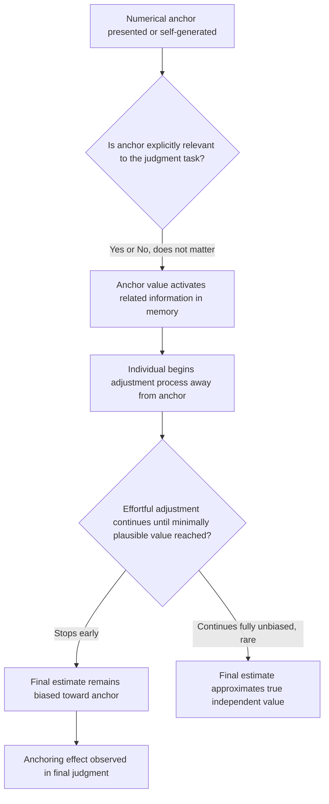

## Anchoring and Insufficient Adjustment

### Definition and Origin

Anchoring and insufficient adjustment is a mental shortcut, identified and formalized by Amos Tversky and Daniel Kahneman in their 1974 heuristics-and-biases framework, in which people form numerical estimates by starting from an initial reference value (the "anchor") and adjusting away from it to reach a final judgment, but the adjustment made is typically insufficient, causing the final estimate to remain biased toward the initial anchor. Unlike representativeness and availability, which are primarily judgments of category membership or frequency, anchoring is specifically a heuristic for producing *numerical* estimates under uncertainty, making it especially directly relevant to economic contexts involving price, quantity, and probability estimation.

A defining and much-replicated feature of anchoring is that the anchor need not be relevant, informative, or even plausibly connected to the quantity being estimated in order to exert a measurable influence on the final judgment — a property that sharply distinguishes anchoring from ordinary, rational use of a genuinely informative reference point.

### Mechanism

Two distinct mechanisms have been proposed and supported by different lines of research to explain why adjustment from an anchor is systematically insufficient:

- **Insufficient adjustment (effortful adjustment account)**: The originally proposed mechanism holds that individuals start from the anchor value and adjust away from it through an effortful, deliberate search process, but stop adjusting as soon as they reach a value that seems minimally plausible, rather than continuing to the value that would be reached by a fully unbiased, effortful search — leaving the final estimate systematically too close to the anchor. Under this account, since further adjustment is effortful, factors that reduce cognitive resources or motivation (time pressure, cognitive load) should increase the degree of insufficient adjustment, a prediction that has received empirical support.
- **Selective accessibility / anchoring-as-priming account**: A more recent and mechanistically distinct account proposes that the mere consideration of the anchor value activates anchor-consistent information in memory (e.g., considering whether a river's length is more or less than a specific anchor figure selectively activates memories and associations consistent with that specific figure), and this activated, anchor-consistent information then disproportionately informs the subsequent final judgment — a semantic priming-style mechanism that does not require any effortful "adjustment" process at all. This account is supported by demonstrations that anchoring effects can occur even for judgments made very quickly, under conditions that leave little time for an effortful adjustment process to operate. [Inference: the two mechanisms are not mutually exclusive, and current research treats them as potentially complementary explanations operating under different conditions rather than as fully competing accounts where only one can be correct.]

Both mechanisms converge on the same key empirical prediction — that final numerical estimates will be systematically biased in the direction of an initially presented value — but they differ in their proposed underlying process and in some of their more specific, distinguishing predictions (e.g., regarding the effects of time pressure or explicit warning about the anchor).

### Practical Example: The Wheel-of-Fortune Experiment

**Example**: In one of Tversky and Kahneman's original demonstrations (1974), participants observed a wheel of fortune, rigged to stop at either the number 10 or the number 65, and were then asked to estimate the percentage of African countries in the United Nations — a quantity entirely unrelated to the spun number. Participants were first asked whether the true percentage was higher or lower than the number generated by the wheel, and then asked to give their specific numerical estimate.

Participants who saw the wheel stop at 10 gave a substantially lower median estimate of the percentage than participants who saw the wheel stop at 65, despite the wheel's outcome being transparently random, unrelated to the actual quantity, and explicitly acknowledged by participants themselves as arbitrary. This result is considered particularly striking evidence for anchoring precisely because the anchor was overtly irrelevant and randomly generated, ruling out any explanation based on participants treating the anchor as genuinely informative evidence about the correct answer.

### Practical Example: Real Estate Listing Price Anchoring

**Example**: A well-known field demonstration (Northcraft and Neale, 1987) had experienced real estate agents tour an actual house and estimate its fair market value, after being shown a full information packet about the property that included a randomly varied listing price (an anchor unrelated to the property's actual characteristics or comparable sales data, which were also provided in the same packet).

Despite being professional experts with access to the same full set of objective, relevant comparable-sales information across all conditions, agents' value estimates were significantly influenced by the manipulated listing-price anchor, with higher listing prices producing higher valuation estimates. This finding is often cited as particularly important evidence against a purely novice-specific interpretation of anchoring, since it demonstrates the effect persists even among domain experts using their professional judgment on a task directly within their area of specialized competence — although some agents in the study denied that the listing price had influenced their independent estimate, consistent with anchoring's operation being often unconscious or unrecognized by the individual experiencing it.

### Formal Characterization

Anchoring can be represented as producing a final numerical estimate $\hat{V}$ that is a weighted combination of the presented anchor value $A$ and the individual's independently-formed, unbiased estimate $V^*$ that would have resulted from a fully adjusted, anchor-independent judgment process:

$$\hat{V} = w \cdot A + (1 - w) \cdot V^{*}, \quad 0 < w \leq 1$$

where $w$ represents the residual influence, or "anchoring weight," of the initial value. A value of $w = 0$ would represent full, unbiased adjustment (no anchoring effect), while insufficient adjustment corresponds empirically to values of $w$ found to be reliably greater than zero, and in many documented studies, substantially so, even for arbitrary or explicitly irrelevant anchors. This representation is a simplified, expository linear model used to summarize the empirical direction and persistence of the effect; it does not imply that the underlying cognitive process is literally a linear weighted average, and the estimated magnitude of $w$ varies considerably across specific studies, tasks, and anchor types. [Inference: this weighted-average framing is a standard way the literature summarizes anchoring's directional and persistent nature, not a claim about the precise computational process performed by the mind.]

### Distinguishing Two Related Paradigms

| Paradigm | Structure | Example |
| --- | --- | --- |
| Self-generated anchoring | Anchor arises from an initial, explicit numerical comparison judgment made by the participant themselves (e.g., "is X more or less than 65?") before a final estimate | UN percentage / wheel-of-fortune study |
| Externally provided (basic) anchoring | Anchor is presented as an external reference value without requiring an initial comparison judgment (e.g., an already-stated listing price, an initial offer in a negotiation) | Real estate listing-price study; opening offers in negotiation |

This distinction matters because the two paradigms have somewhat different theoretical implications: self-generated anchoring more directly implicates the comparison judgment itself as the source of the selective-accessibility priming effect, while externally-provided anchoring in contexts such as negotiation is more directly relevant to applied economic behavior, since opening offers, initial price quotes, and reference prices function as externally-provided anchors in many real market transactions.

### Applications in Behavioral Economics

- **Negotiation and first-offer effects**: A substantial body of research demonstrates that the first offer made in a negotiation functions as a powerful anchor, systematically shifting the final settlement price toward the first offer, a finding with direct practical implications for negotiation strategy (favoring making the first offer when an individual is reasonably informed about the relevant value range) and consumer protection.
- **Retail pricing and reference-price manipulation**: Presenting a higher "original" or "list" price alongside a discounted "sale" price is understood, in part, as an anchoring-based pricing tactic, in which the higher original price serves as an anchor that increases the perceived value of the discounted price, independent of the discounted price's absolute merit relative to the broader market.
- **Judicial sentencing and legal decision-making**: Documented research on sentencing recommendations demonstrates that even arbitrary, irrelevant numerical anchors (e.g., a number generated by rolling dice in a controlled experimental setting, presented to legal professionals) can measurably influence subsequent sentencing-length judgments, echoing the wheel-of-fortune paradigm in a professional legal-judgment context.
- **Survey design and contingent valuation**: Anchoring effects are a recognized and significant methodological concern in survey-based economic valuation methods (e.g., contingent valuation studies estimating willingness-to-pay for public goods or environmental resources), since the specific numerical values presented as example bid amounts within a survey instrument can systematically anchor respondents' subsequent valuation responses.
- **Salary negotiation**: Research on compensation negotiation indicates that an initial anchor (e.g., a candidate's stated current salary or an employer's opening offer) can systematically influence final negotiated compensation, a finding with policy relevance to debates over regulations restricting employers from requesting salary history.

### Boundaries and Debates

- **Does knowledge or expertise eliminate anchoring?**: As the real-estate agent study demonstrates, domain expertise reduces but does not eliminate anchoring susceptibility; the effect has been documented across a wide range of expert populations (judges, physicians, professional negotiators, financial analysts) in addition to novice populations, indicating the phenomenon is not simply a product of unfamiliarity or lack of knowledge. [Inference: while expertise generally attenuates anchoring's magnitude to some degree in the literature, it does not reliably eliminate it, and the degree of attenuation varies by domain and task.]
- **Can warning about the anchor prevent the effect?**: Explicitly warning participants in advance that they may be influenced by an upcoming irrelevant anchor has been found in some studies to reduce, but not reliably or fully eliminate, the resulting bias, indicating that anchoring is not purely a matter of naive unawareness that can be corrected simply by informing individuals of the phenomenon's existence.
- **Effortful-adjustment versus selective-accessibility debate**: As discussed above, whether anchoring is best explained by insufficient effortful adjustment, by selective-accessibility priming, or by some combination of both remains an active area of theoretical and empirical investigation, with different experimental manipulations (time pressure, cognitive load, quick-response tasks) providing evidence more consistent with one or the other account under different conditions.
- **Boundary conditions on anchor magnitude**: While anchoring effects are highly robust in direction, the specific quantitative magnitude of a given anchoring effect is sensitive to factors including anchor plausibility, the specific elicitation procedure used, and the domain of judgment, meaning generalized numerical claims about "how much" anchoring shifts a typical estimate should be treated cautiously rather than as a fixed, universal parameter. [Unverified: specific magnitude estimates for any given anchoring application should be checked against current domain-specific studies rather than assumed from any single foundational experiment.]

### Diagram: Anchoring and Adjustment Process

### Visual: Anchoring Weight on Final Estimate (svg_diagram)

<svg xmlns="http://www.w3.org/2000/svg" viewBox="0 0 700 300" font-family="Helvetica, Arial, sans-serif">
<text x="350" y="24" text-anchor="middle" font-size="16" font-weight="bold" fill="#222">Anchoring: Final Estimate as Weighted Blend (svg_diagram)</text>
<line x1="80" y1="220" x2="620" y2="220" stroke="#444" stroke-width="1.5" />
<text x="350" y="245" text-anchor="middle" font-size="11" fill="#444">Numerical value scale</text>
<circle cx="150" cy="220" r="6" fill="#c22a5e" />
<text x="150" y="200" text-anchor="middle" font-size="11" fill="#7a1638">Low anchor (e.g., 10)</text>
<circle cx="550" cy="220" r="6" fill="#1f9d55" />
<text x="550" y="200" text-anchor="middle" font-size="11" fill="#0f5c30">High anchor (e.g., 65)</text>
<circle cx="350" cy="220" r="6" fill="#3b5bdb" />
<text x="350" y="200" text-anchor="middle" font-size="11" fill="#1a2b6d">Unbiased estimate V*</text>
<circle cx="230" cy="260" r="6" fill="#7a1638" />
<text x="230" y="280" text-anchor="middle" font-size="10" fill="#7a1638">Final estimate (low-anchor group): pulled toward 10</text>
<circle cx="450" cy="260" r="6" fill="#0f5c30" />
<text x="450" y="280" text-anchor="middle" font-size="10" fill="#0f5c30">Final estimate (high-anchor group): pulled toward 65</text>
<line x1="150" y1="220" x2="230" y2="255" stroke="#c22a5e" stroke-width="1.5" stroke-dasharray="4,3" />
<line x1="550" y1="220" x2="450" y2="255" stroke="#1f9d55" stroke-width="1.5" stroke-dasharray="4,3" />
</svg>

### Key Points

- Anchoring and insufficient adjustment describes the systematic bias of numerical estimates toward an initially presented or self-generated reference value, even when that anchor is arbitrary or explicitly irrelevant.
- Two proposed mechanisms — effortful insufficient adjustment and selective-accessibility priming — offer complementary rather than fully competing explanations for the effect.
- The wheel-of-fortune study demonstrates anchoring with an overtly random, irrelevant anchor; the real-estate listing-price study demonstrates its persistence among domain experts on a task within their professional competence.
- Anchoring is directly and highly relevant to economic behavior through negotiation first-offer effects, retail reference pricing, contingent valuation survey design, and salary negotiation.
- Expertise and explicit warning about the anchor reduce, but do not reliably eliminate, anchoring effects, indicating the bias is not purely attributable to naivety or unawareness.
- Effect direction is highly robust and widely replicated, but specific quantitative magnitudes are sensitive to anchor plausibility, elicitation procedure, and judgment domain.

**Related Topics**

- The representativeness heuristic
- The availability heuristic
- Selective accessibility and semantic priming
- Negotiation strategy and first-offer effects
- Reference-price marketing and retail discount framing
- Contingent valuation methodology in environmental and public economics
- Cognitive load and its effect on adjustment processes
- Debiasing strategies for numerical estimation tasks