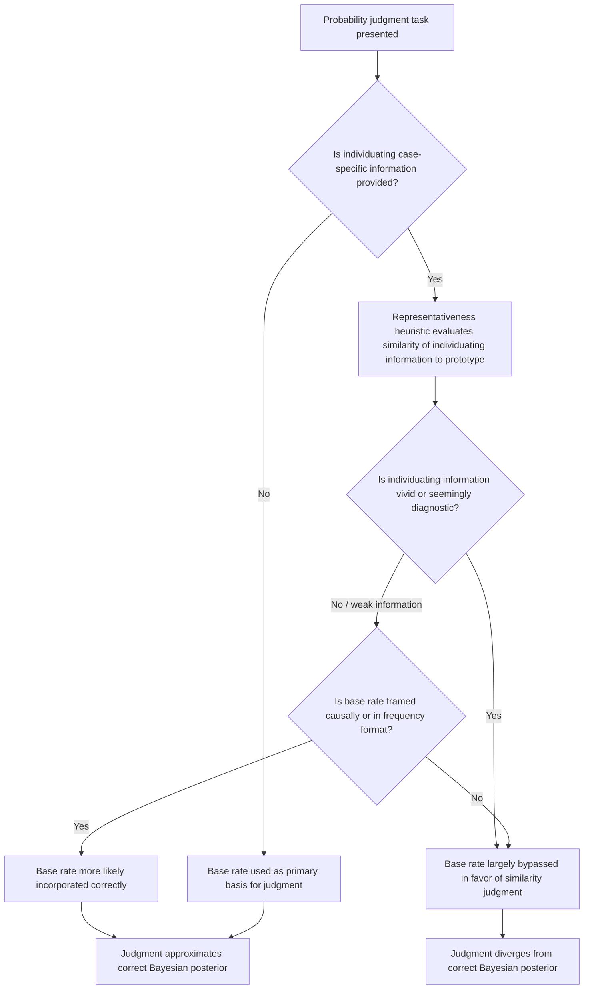

## Base Rate Neglect

### Definition and Origin

Base rate neglect is the systematic tendency to underweight or ignore prior statistical information about the frequency of an event or category (the "base rate") when forming a probability judgment, in favor of specific, individuating information about the particular case at hand, even when that individuating information is weak, unreliable, or logically should be combined with the base rate rather than substituted for it. The phenomenon was identified and named within Tversky and Kahneman's foundational heuristics-and-biases research program and is most directly generated by the representativeness heuristic, though it is treated as a distinct, independently important phenomenon within judgment-and-decision-making research because of its direct connection to formal Bayesian inference and its broad practical significance across medical, legal, and economic decision contexts.

Base rate neglect represents a specific, well-defined departure from Bayesian updating: the normatively correct procedure for combining a prior probability (the base rate) with new evidence (the individuating information) to form a posterior probability judgment.

### Mechanism

Base rate neglect occurs because vivid, specific, individuating information about a particular case is processed as highly diagnostic evidence via the representativeness heuristic (assessing how well the individuating information matches a category prototype), while the base rate — an abstract, statistical, and comparatively "colorless" piece of information about the broader population — is not naturally incorporated into this similarity-based judgment process at all. Since the representativeness computation does not have a natural mechanism for incorporating population-level frequency information, the base rate is effectively bypassed rather than deliberately weighed and found less important.

A critical, well-established empirical qualification is that base rate neglect is not universal: when no individuating case-specific information is provided at all, people generally do use base rates correctly to form a probability judgment. Base rate neglect is specifically triggered by the *presence* of vivid, individuating information that creates a competing, similarity-based basis for judgment, which then crowds out consideration of the more abstract statistical prior. This distinction is central to accurately characterizing the phenomenon, since it identifies base rate neglect as arising from a competition between two types of information (with individuating information winning) rather than from an inability to use base rates in an absolute sense.

### Formal Characterization: Bayes' Theorem

The normatively correct combination of base rate and individuating evidence follows Bayes' theorem. For a hypothesis $H$ (e.g., "this individual is an engineer") and observed evidence $E$ (e.g., a personality description), the posterior probability is:

$$P(H \mid E) = \frac{P(E \mid H) \cdot P(H)}{P(E)}$$

where $P(H)$ is the base rate (prior probability of the hypothesis in the relevant population) and $P(E \mid H)$ is the likelihood (how probable the evidence is, given the hypothesis). Base rate neglect corresponds to a judgment process that effectively substitutes an evaluation of $P(E \mid H)$-style resemblance (how well does the description match the prototype of an engineer) for the full posterior calculation, while treating $P(H)$ as approximately constant or irrelevant across the compared hypotheses, regardless of its actual, and potentially very different, stated value.

### Practical Example: The Engineer/Lawyer Problem

**Example**: As discussed in relation to the representativeness heuristic, Kahneman and Tversky's classic demonstration (1973) presented participants with a personality description drawn, they were told, from a pool explicitly described as containing either 70 engineers and 30 lawyers, or 30 engineers and 70 lawyers. When given a personality sketch designed to sound stereotypically like an engineer, participants' probability estimates that the individual was an engineer were nearly identical across the two base-rate conditions, driven almost entirely by resemblance to the engineer stereotype rather than by the explicitly stated, and substantially different, base rates. When no personality description was given at all, participants correctly used the base rate to estimate the probability, directly confirming that neglect is specifically triggered by the presence of competing individuating information rather than reflecting a general inability to reason with base rates.

### Practical Example: Medical Diagnostic Testing

**Example**: A canonical and practically significant illustration of base rate neglect arises in the interpretation of medical diagnostic test results. Consider a disease with a base rate (prevalence) of 1 in 1,000 in the relevant population, and a diagnostic test with a 5 percent false-positive rate and near-perfect sensitivity (it correctly identifies essentially all true cases). Given a positive test result, many people — including, in documented studies, a meaningful proportion of practicing physicians — substantially overestimate the probability that the individual actually has the disease, often estimating it close to 95 percent (treating the test's stated accuracy figure as if it directly answered the diagnostic question), rather than performing the correct Bayesian calculation.

The correct calculation requires combining the low base rate with the test's error characteristics: out of 1,000 people, approximately 1 person has the disease (and tests positive), while approximately 50 of the remaining 999 healthy people also test positive due to the 5 percent false-positive rate. The probability that a person with a positive result actually has the disease is therefore approximately:

$$P(\text{Disease} \mid \text{Positive}) = \frac{1}{1 + 50} \approx 2\%$$

This large and counterintuitive gap between the intuitive estimate (often close to 95 percent) and the correct Bayesian estimate (approximately 2 percent in this example) illustrates why base rate neglect in low-prevalence diagnostic contexts is considered a matter of substantial practical, not merely theoretical, importance, since it directly affects both patient anxiety and downstream clinical and policy decisions about further testing or treatment following a positive screening result. [Inference: the specific numerical example here illustrates the general mechanism using commonly cited illustrative parameters; actual base rates and test error rates vary by specific disease and test, and any real clinical application requires using the actual, current epidemiological and diagnostic parameters for the relevant condition and population rather than this illustrative figure.]

### Boundary Conditions: When Are Base Rates Used Correctly?

Research following the original demonstrations has identified several conditions under which base rate neglect is reduced or eliminated, providing important qualification to the general phenomenon:

- **Absence of individuating information**: As noted, when no case-specific description is provided, base rates are typically used correctly.
- **Causal base rates**: Base rates that are perceived as reflecting an underlying causal mechanism (e.g., a base rate framed in terms of a known causal process generating the outcome) are used more readily than base rates presented as "merely statistical" or non-causal facts about a population, a distinction demonstrated in follow-up research examining when base-rate information is spontaneously incorporated into judgment.
- **Frequency formats**: Presenting probabilistic information in natural frequency format (e.g., "10 out of 1,000 people") rather than single-event probability format (e.g., "a 1 percent probability") has been shown, in a substantial body of research associated with Gerd Gigerenzer and colleagues, to improve correct base-rate incorporation and overall Bayesian reasoning performance, including among both laypeople and professionals such as physicians, suggesting that some of the observed neglect reflects a format-dependent representational difficulty rather than a wholly fixed inability to reason with the underlying statistical logic.
- **Statistical training and explicit prompts**: Explicit statistical training, and experimental prompts that direct attention to the relevance of the base rate before individuating information is presented, have been shown in various studies to reduce, though not always fully eliminate, the degree of neglect observed.

### Applications in Behavioral Economics and Policy

- **Medical decision-making and screening policy**: Base rate neglect directly informs debates over the design and communication of medical screening programs, particularly for low-prevalence conditions, where naive interpretation of positive results (absent explicit Bayesian framing or frequency-format communication) can lead to substantial patient distress and potentially unnecessary follow-up interventions.
- **Legal and forensic judgment**: Base rate neglect is directly relevant to the "prosecutor's fallacy" in legal contexts, in which the low base rate of a coincidental forensic match (e.g., a DNA or fingerprint match arising purely by chance in an innocent individual) is neglected in favor of a vivid, seemingly compelling piece of individuating forensic evidence, contributing to potential miscarriages of justice when such evidence is presented or interpreted without proper base-rate context.
- **Credit risk and lending decisions**: Base rate neglect has been examined in relation to lending and credit decisions, in which vivid, individuating information about a specific loan applicant (e.g., a compelling personal narrative or a strong recent track record) may be overweighted relative to the relevant statistical base rate of default risk for the applicant's broader risk category.
- **Startup investment and venture capital**: Individuating, narrative-driven information about a specific entrepreneur or business plan can be overweighted by investors relative to the statistical base rate of success or failure for ventures of a similar type and stage, a pattern discussed in behavioral finance and entrepreneurship research as a potential contributor to systematic over-optimism in early-stage investment decisions. [Inference: this specific application is a reasonable and widely discussed extension of the general base-rate-neglect mechanism to the venture-investment domain, though it is less extensively and rigorously experimentally documented than the medical and legal applications above.]

### Diagram: Base Rate Neglect Process

### Visual: Bayesian Update vs. Neglected-Base-Rate Judgment (svg_diagram)

<svg xmlns="http://www.w3.org/2000/svg" viewBox="0 0 700 300" font-family="Helvetica, Arial, sans-serif">
<text x="350" y="24" text-anchor="middle" font-size="16" font-weight="bold" fill="#222">Diagnostic Testing: Correct vs. Neglected-Base-Rate Judgment (svg_diagram)</text>
<rect x="40" y="55" width="600" height="40" fill="#e8f0fe" stroke="#3b5bdb" stroke-width="1" />
<text x="340" y="80" text-anchor="middle" font-size="11" fill="#1a2b6d">Population: 1,000 people (base rate = 1 in 1,000 have disease)</text>
<rect x="40" y="110" width="6" height="30" fill="#c22a5e" />
<text x="90" y="130" text-anchor="middle" font-size="10" fill="#7a1638">~1 true case (tests positive)</text>
<rect x="55" y="150" width="290" height="30" fill="#fbe8ee" stroke="#c22a5e" stroke-width="1" />
<text x="200" y="170" text-anchor="middle" font-size="10" fill="#7a1638">~50 false positives (5% of 999 healthy)</text>

<text x="350" y="215" text-anchor="middle" font-size="12" font-weight="bold" fill="#222">Correct P(Disease | Positive) ≈ 1/51 ≈ 2%</text>

<text x="350" y="240" text-anchor="middle" font-size="12" fill="`#c22a5e`">Intuitive (base-rate-neglecting) estimate ≈ 95%</text>

<text x="350" y="275" text-anchor="middle" font-size="10" fill="#888">Test's stated accuracy figure is mistaken for the answer to the diagnostic question itself.</text>

</svg>

### Key Points

- Base rate neglect is the systematic underweighting of prior statistical (population-level) probability information in favor of vivid, individuating, case-specific information, formally corresponding to a departure from correct Bayesian updating.
- The engineer/lawyer study demonstrates that neglect is specifically triggered by the presence of competing individuating information; base rates are used correctly when no such information is present.
- The medical diagnostic testing example illustrates the large, practically significant gap that can arise between intuitive and correct posterior probability estimates in low-prevalence screening contexts.
- Neglect is reduced, though not always eliminated, by causal framing of base rates, natural frequency formats (Gigerenzer), explicit statistical training, and prompts directing attention to base rates before individuating information is presented.
- Applications span medical screening communication, the legal "prosecutor's fallacy," credit and lending risk assessment, and narrative-driven venture investment decisions.
- Base rate neglect is generated primarily through the representativeness heuristic's similarity-based judgment process, which lacks a natural mechanism for incorporating abstract statistical frequency information.

**Related Topics**

- The representativeness heuristic
- Bayesian updating and posterior probability calculation
- Natural frequency formats and Gigerenzer's research on statistical communication
- The prosecutor's fallacy in legal and forensic reasoning
- Medical screening policy and diagnostic test interpretation
- The conjunction fallacy and the Linda problem
- Statistical training and debiasing for probabilistic judgment
- Behavioral finance and narrative-driven investment decisions