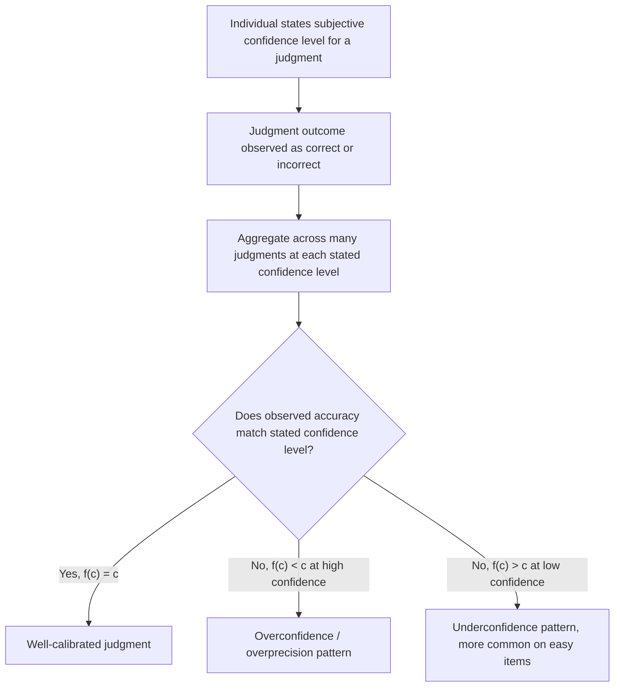

## Overconfidence and Miscalibration

### Definition and Scope

Overconfidence and miscalibration refer to a family of related but empirically and conceptually distinguishable phenomena in which individuals' subjective confidence in their own knowledge, judgments, abilities, or predictions systematically exceeds what is warranted by their actual accuracy. This is treated as a broad umbrella topic within the heuristics-and-biases literature because "overconfidence" has been operationalized and studied through several distinct experimental paradigms, each capturing a somewhat different facet of the general phenomenon, and precision about which specific form of overconfidence is being discussed is necessary for accurate technical treatment.

Three principal, empirically distinguishable forms are generally recognized in the literature:

- **Overprecision (miscalibration)**: Excessive certainty regarding the accuracy of one's own knowledge or beliefs, typically measured through confidence-interval or probability-judgment tasks.
- **Overestimation**: The tendency to overestimate one's own actual performance, ability, level of control, or chance of success on a given task.
- **Overplacement (the "better-than-average" effect)**: The tendency to believe oneself is better than others on a given dimension, measured through comparative self-other judgments.

These three forms are empirically dissociable — a body of research has documented conditions under which they behave differently or even move in opposite directions (for example, on very difficult tasks, overestimation of one's own absolute performance can coexist with *underplacement* relative to others) — which is a substantively important qualification against treating "overconfidence" as a single unified construct.

### Overprecision and Calibration Methodology

**Calibration** is measured by comparing an individual's stated subjective confidence in a judgment to the actual, objectively observed accuracy rate of judgments made at that stated confidence level. A well-calibrated judge who states "90 percent confidence" across a large number of independent judgments should be correct approximately 90 percent of the time; systematic miscalibration occurs when actual accuracy at a given stated confidence level diverges from that stated level.

The standard experimental paradigm uses general-knowledge questions (e.g., two-alternative forced-choice questions, or numerical estimation tasks with confidence-interval elicitation, such as "give a range you are 90 percent confident contains the true value of X"). A robust and extensively replicated finding across this literature is that confidence intervals elicited at high stated confidence levels (e.g., 90 or 98 percent) contain the true value substantially less often than the stated confidence level would imply — a pattern indicating systematic overprecision, since individuals construct intervals that are, in a well-documented and consistent sense, too narrow relative to their actual uncertainty.

### Formal Characterization: The Calibration Curve

Calibration is formally represented by plotting stated confidence $c$ against observed relative frequency of correctness $f(c)$ across many judgments grouped by stated confidence level. Perfect calibration corresponds to the identity relationship:

$$f(c) = c \quad \text{for all } c \in [0, 1]$$

Overconfidence (overprecision) corresponds to a calibration curve lying systematically below this identity line at high stated confidence levels — that is, $f(c) < c$ for large $c$ — indicating that judgments made with high stated confidence are correct less often than that confidence level implies. The most extensively documented form of this pattern is often described as a "hard-easy effect": overconfidence tends to be most pronounced on genuinely difficult judgment items, and can be reduced, absent, or in some documented cases even reversed (underconfidence) on relatively easy items, indicating that the degree and even direction of miscalibration is not a fixed individual trait but interacts substantially with task difficulty. [Inference: while the hard-easy effect is a well-replicated general pattern, some methodological research has also raised concerns about whether part of this specific pattern reflects statistical artifacts of item selection and regression effects rather than being purely psychological in origin, and this remains an area of some ongoing technical debate in the calibration literature.]

### Practical Example: The Planning Fallacy

**Example**: The planning fallacy, a well-documented instance of overestimation closely related to overconfidence, refers to the systematic tendency for individuals and organizations to underestimate the time, costs, and risks of future projects and actions, even when they possess accurate knowledge of comparable past projects that took substantially longer or cost substantially more than planned. A canonical example is large infrastructure and construction projects, which have been extensively documented, across a broad range of countries and project types, to frequently and substantially exceed both their originally budgeted cost and originally scheduled completion time.

This example illustrates the distinction between overestimation-type overconfidence and simple ignorance: the planning fallacy persists even among planners who are, in principle, aware of the general historical base rate of cost and schedule overruns for similar projects, because planners characteristically focus on the specific, idealized causal sequence of steps required to complete the *particular* project at hand (an "inside view") rather than adequately incorporating the statistical distribution of outcomes for a broad reference class of similar past projects (an "outside view") — a distinction and proposed corrective methodology (reference class forecasting) developed substantially by Daniel Kahneman and Amos Tversky, and later elaborated in project-management and public-policy contexts by researchers including Bent Flyvbjerg. [Inference: the general phenomenon of systematic project overruns is extremely well-documented across many large empirical studies; the precise average magnitude of overrun varies substantially by project type, sector, and country, and any specific numerical figure should be checked against current sector-specific research rather than treated as a universal constant.]

### Practical Example: Overplacement in Driving and Investing

**Example**: A widely cited demonstration of overplacement (the better-than-average effect) surveyed drivers and found that a substantial majority rated their own driving skill as above the median relative to other drivers — a statistical impossibility if the self-ratings were accurate, since only half of any population can, by definition, be genuinely above the group's true median. Similar overplacement patterns have been documented among investors, with individual investors on average overestimating their own stock-picking or market-timing skill relative to their actual, often below-benchmark, realized returns, a pattern discussed extensively in behavioral finance research as one contributing factor to excessive trading frequency, since traders who overestimate the precision of their own information or analysis will rationally (given their overconfident beliefs) trade more frequently than a correctly calibrated Bayesian trader would, and empirical research on trading records has documented that higher trading frequency is, on average, associated with lower net realized returns after accounting for transaction costs. [Inference: the specific numerical proportions found in any given driving or investor overplacement study vary by sample and methodology; the general qualitative direction of the effect is very robustly documented, but specific percentages should be checked against the relevant primary study rather than treated as universal figures.]

### Comparative Table: Three Forms of Overconfidence

| Form | Definition | Typical Measurement | Canonical Example |
| --- | --- | --- | --- |
| Overprecision | Excessive certainty in the accuracy of one's beliefs | Confidence intervals; calibration curves for probability judgments | 90% confidence intervals containing the true value less than 90% of the time |
| Overestimation | Overestimating one's own actual performance, ability, or chance of success | Comparison of predicted versus actual performance/outcome | The planning fallacy; overestimating project completion speed |
| Overplacement | Believing oneself better than others (better-than-average effect) | Self-rating relative to peer group or population median | Majority of drivers rating themselves as above-median skill |

### Mechanisms

- **Confirmatory information search and selective recall**: Individuals tend to search for, recall, and generate reasons supporting their initial belief more readily than reasons against it, inflating subjective confidence beyond what a balanced consideration of both supporting and opposing evidence would justify.
- **Inside-view versus outside-view reasoning**: As discussed regarding the planning fallacy, a focus on the specific causal narrative of the case at hand (inside view) rather than the statistical distribution of a relevant reference class of similar past cases (outside view) systematically produces overestimation, since the specific narrative typically emphasizes a smooth, idealized path to success while a reference-class distribution incorporates the full range of past obstacles and delays.
- **Difficulty of introspecting genuine uncertainty**: Constructing an accurate subjective probability distribution over one's own knowledge is a cognitively demanding task in itself, and available evidence suggests individuals systematically underestimate the range of plausible values or outcomes when asked to produce a confidence interval, contributing directly to the overprecision pattern documented in calibration research.
- **Motivated reasoning and self-enhancement**: A substantial body of research in social psychology documents a general motivational tendency toward self-enhancement — maintaining a positive self-view — which is a plausible contributing mechanism to the overplacement (better-than-average) form specifically, since a comparative "I am better than average" belief is directly self-flattering in a way that overprecision on a general-knowledge quiz is not.

### Boundaries, Critiques, and Debates

- **The three forms are not a unified single trait**: As emphasized above, overprecision, overestimation, and overplacement are empirically dissociable, and correlations across individuals between measures of the three forms are often modest, indicating that referring to "overconfidence" as a single, unitary personal disposition oversimplifies a more heterogeneous set of related phenomena.
- **Task difficulty and the hard-easy effect**: The degree, and even direction, of miscalibration depends substantially on task difficulty, with underconfidence sometimes observed on easy tasks, complicating any simple, universal claim that human judgment is uniformly overconfident across all conditions.
- **Statistical artifacts and regression effects**: Some methodological critiques argue that a portion of observed overconfidence findings, particularly some hard-easy-effect patterns, may partly reflect statistical artifacts related to item selection, difficulty-scaling procedures, or regression to the mean, rather than being purely and entirely attributable to a psychological miscalibration mechanism, an active area of methodological refinement within the field. [Unverified: the precise proportion of observed overconfidence attributable to such statistical artifacts versus genuine psychological miscalibration remains debated and should be checked against current methodological literature.]
- **Adaptive or motivational value of moderate overconfidence**: Some researchers have proposed that mild overconfidence in ability or prospects for success may carry adaptive motivational value (e.g., supporting persistence, effort, or willingness to undertake ambitious projects), suggesting the policy or practical implication is not necessarily "eliminate overconfidence entirely" but rather to manage its more costly manifestations (e.g., overprecision in high-stakes financial or safety-critical judgments) without necessarily aiming for a hypothetical, perfectly neutral baseline in all contexts. [Inference: this "adaptive moderate overconfidence" hypothesis is a genuinely debated position in the literature rather than a settled consensus finding.]

### Applications in Behavioral Economics and Policy

- **Corporate finance and mergers and acquisitions**: Executive overconfidence, particularly overestimation and overprecision regarding the expected synergies and value creation of a proposed acquisition, has been studied extensively in corporate-finance research as a contributing factor to the well-documented tendency for many mergers and acquisitions to fail to deliver their projected value.
- **Entrepreneurship and business formation**: Overestimation and overplacement regarding the likely success of a new business venture, relative to the well-documented statistical base rate of small-business failure, has been proposed as a contributing factor to persistently high rates of new business formation despite generally modest average returns to entrepreneurship.
- **Financial market trading behavior**: As discussed above, investor overplacement and overprecision are linked in behavioral finance research to excessive trading volume and, on average, reduced net investment returns.
- **Public infrastructure project appraisal**: Reference-class forecasting, developed as a direct corrective methodology for the planning fallacy, has been formally incorporated into the project-appraisal guidance of several government transportation and infrastructure agencies as a policy response to systematic cost and schedule overrun patterns.
- **Medical and expert judgment**: Overprecision has been documented among various groups of professional experts (including physicians providing diagnostic or prognostic confidence judgments), with direct implications for how expert probability judgments should be communicated, interpreted, and, where appropriate, adjusted in high-stakes decision contexts.

### Diagram: Calibration Curve Concept

### Visual: Calibration Curve (svg_diagram)

<svg xmlns="http://www.w3.org/2000/svg" viewBox="0 0 700 320" font-family="Helvetica, Arial, sans-serif">
<text x="350" y="24" text-anchor="middle" font-size="16" font-weight="bold" fill="#222">Calibration Curve: Stated Confidence vs. Observed Accuracy (svg_diagram)</text>
<line x1="80" y1="260" x2="600" y2="260" stroke="#444" stroke-width="1.5" />
<line x1="80" y1="260" x2="80" y2="50" stroke="#444" stroke-width="1.5" />
<text x="340" y="290" text-anchor="middle" font-size="11" fill="#444">Stated confidence (c)</text>
<text x="45" y="155" text-anchor="middle" font-size="11" fill="#444" transform="rotate(-90 45 155)">Observed accuracy f(c)</text>
<line x1="80" y1="260" x2="600" y2="50" stroke="#3b5bdb" stroke-width="2" stroke-dasharray="5,4" />
<text x="560" y="45" text-anchor="middle" font-size="10" fill="#1a2b6d">Perfect calibration: f(c) = c</text>
<polyline points="80,255 200,220 320,190 440,150 560,130" fill="none" stroke="#c22a5e" stroke-width="2.5" />
<text x="500" y="115" text-anchor="middle" font-size="10" fill="#7a1638">Typical overconfidence curve</text>
<text x="500" y="150" text-anchor="middle" font-size="10" fill="#7a1638">(below identity line at high c)</text>

<text x="90" y="245" text-anchor="middle" font-size="9" fill="#444">50%</text>

<text x="590" y="65" text-anchor="middle" font-size="9" fill="#444">100%</text>

<text x="350" y="310" text-anchor="middle" font-size="10" fill="#888">Gap between curves represents the degree of overprecision at each confidence level.</text>

</svg>

### Key Points

- Overconfidence comprises three empirically distinguishable forms: overprecision (excessive certainty in beliefs), overestimation (overestimating own performance or success chances), and overplacement (the better-than-average effect).
- Calibration research documents that confidence intervals stated at high confidence levels contain the true value less often than that confidence level implies, with the "hard-easy effect" indicating this pattern is most pronounced on difficult items and can reverse to underconfidence on easy items.
- The planning fallacy, driven by inside-view rather than outside-view (reference-class) reasoning, is a well-documented instance of overestimation with major practical significance for project and policy planning.
- Overplacement is well-documented in domains including driving skill self-assessment and investor self-assessment of trading skill, with the latter linked to excessive trading frequency and reduced net returns.
- The three forms are not strongly correlated with one another and should not be treated as manifestations of a single, unified overconfidence trait.
- Reference-class forecasting is a direct, formally adopted policy corrective for the planning fallacy in infrastructure project appraisal.

**Related Topics**

- The planning fallacy and reference-class forecasting
- Inside view versus outside view in prediction
- Calibration methodology and the hard-easy effect
- Better-than-average effect and self-enhancement motivation
- Overconfidence in behavioral finance and excessive trading
- Executive overconfidence in mergers and acquisitions
- Representativeness and availability as contributing mechanisms
- Debiasing techniques: considering the opposite, reference-class forecasting, calibration training