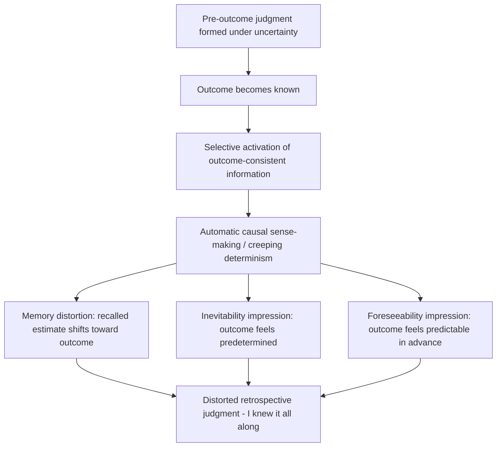

## Hindsight Bias

### Definition and Core Phenomenon

Hindsight bias, colloquially known as the "knew-it-all-along" effect, is the tendency for individuals to perceive past events as having been more predictable than they actually were before those events occurred. After an outcome is known, people systematically overestimate the extent to which they could have foreseen or predicted that outcome. This is not a memory failure in the simplest sense but rather a distortion in the *reconstruction* of one's own prior beliefs, judgments, or predictions once the actual outcome becomes known.

The phenomenon was first empirically documented and named by psychologist Baruch Fischhoff in his 1975 study "Hindsight ≠ Foresight," where he found that subjects who were told the outcome of historical events (such as a colonial conflict) rated that outcome as having been more probable than subjects who judged the same event without knowledge of its resolution. Critically, the subjects who received outcome knowledge often denied that this information had influenced their probability judgments at all, which is a hallmark feature of the bias: it operates largely outside conscious awareness.

### Distinguishing Hindsight Bias from Related Concepts

It is useful to separate hindsight bias from adjacent but distinct phenomena:

- **Hindsight bias vs. overconfidence**: Overconfidence concerns excessive certainty about *future* predictions or current knowledge; hindsight bias specifically concerns the *retrospective distortion* of what one believed or could have known before an outcome occurred.
- **Hindsight bias vs. the outcome bias**: Outcome bias refers to evaluating the *quality of a decision* based on its outcome rather than the information available at the time the decision was made (e.g., judging a reasonable gamble harshly because it happened to fail). Hindsight bias concerns the distortion of *predictability judgments and memory*, while outcome bias concerns the distortion of *decision-quality evaluations*. The two frequently co-occur and compound one another, since believing an outcome was "obvious" (hindsight bias) naturally feeds into judging that the decision-maker should have known better (outcome bias).
- **Hindsight bias vs. curse of knowledge**: The curse of knowledge is the difficulty in modeling what someone else does *not* know once you yourself know it (e.g., a teacher struggling to imagine a topic as unfamiliar to students). Hindsight bias is temporally reflexive — it distorts your own past state of knowledge, not merely your model of another person's present state.

### Three Component Processes

Hindsight bias is generally understood, following work by Neal Roese and Kathleen Vohs (2012) and earlier component models by Ulrich Hoffrage, Ralph Hertwig, and Gerd Gigerenzer, to consist of at least three partially dissociable components:

1. **Memory distortion (recollection bias)**: Individuals misremember their own prior predictions as having been closer to the actual outcome than they really were. This is a reconstructive memory error — the outcome information contaminates the retrieval of the earlier judgment.
2. **Inevitability impressions ("necessity")**: Individuals come to believe that the outcome was bound to happen, developing a sense that the event was causally determined and inevitable, often accompanied by a coherent causal narrative that seems to explain why the outcome "had to" occur.
3. **Foreseeability impressions**: Individuals believe that they, or people generally, could have or should have predicted the outcome in advance — this is the component most consequential for legal and organizational judgments of blame ("they should have seen it coming").

These components can be experimentally separated; for example, someone might correctly recall their original estimate (no memory distortion) while still judging the outcome to have been highly foreseeable in principle (foreseeability distortion), showing the components are not perfectly correlated.

### Cognitive Mechanisms

**Sense-making and the "creeping determinism" account.** Fischhoff's original explanation, often called creeping determinism, holds that once an outcome is known, people automatically and immediately begin integrating that outcome into their existing causal model of the situation. The mind reorganizes the antecedent information into a coherent causal story leading "naturally" to the known result. This automatic sense-making happens so quickly and seamlessly that people lose access to their pre-outcome state of uncertainty.

**Anchoring-and-adjustment accounts.** A complementary view treats the known outcome as an anchor. When asked to recall or reconstruct a prior judgment, people start from the anchor of the known outcome and insufficiently adjust away from it, producing a recalled estimate biased toward the true result. This connects hindsight bias to the broader anchoring-and-adjustment heuristic described by Amos Tversky and Daniel Kahneman.

**Motivated reasoning accounts.** Some theorists (e.g., work by Mark Fenton-O'Creevy on hindsight and self-image) propose a motivational component: believing "I knew it all along" supports a favorable self-image of competence and predictive skill, and protects self-esteem by implying the actual world is more orderly and controllable than it is. This motivational layer may amplify but is not necessary for the effect, since hindsight bias also appears for outcomes with no personal stake.

**Availability and selective recall.** Once the outcome is known, outcome-consistent information becomes more cognitively available and easier to retrieve, while outcome-inconsistent information becomes relatively harder to access — a selective retrieval process that biases the reconstructed narrative toward consistency with the known result.

### The SARA Model

Ulrich Hoffrage and Ralph Hertwig's SARA model (Selective Accessibility model, sometimes rendered "Reconstruction after Feedback") formalizes the mechanism: after receiving outcome feedback, retrieval processes selectively activate outcome-consistent knowledge structures. When later asked to reconstruct the original judgment, the person draws — without awareness — from this now-biased pool of accessible information, yielding a recalled estimate skewed toward the known outcome. This model is considered one of the more empirically supported process accounts because it correctly predicts specific patterns, such as hindsight bias being reduced or reversed when outcome-inconsistent information is made especially salient or when subjects are asked to generate counterarguments before recall.

### Experimental Paradigms

**Memory design (hypothetical/recall paradigm).** Participants first give an estimate or prediction (e.g., "What is the probability historical event X occurred?"). Some time later, after being told the true outcome, they are asked to recall their original estimate. Hindsight bias is measured as the gap between the recalled estimate and the actual original estimate, biased in the direction of the true outcome.

**Hypothetical design.** Different groups of participants are given identical background information but told different (possibly false) outcomes; each group then rates how predictable "the" outcome was. Since actual foreknowledge is held constant across groups (none of them had it beforehand), any difference in perceived predictability across groups isolates the causal effect of outcome knowledge itself. This was the design used in Fischhoff's original studies.

**Between-subjects vs. within-subjects sensitivity.** Effect sizes tend to be somewhat different depending on design: within-subjects (memory) designs isolate genuine memory distortion, while between-subjects (hypothetical) designs isolate pure judgmental/foreseeability distortion, since there's no individual "original" judgment being misremembered.

### Domains of Application

**Medicine.** Physicians reviewing a diagnostic case after learning the eventual (often adverse) outcome tend to judge the original diagnostic decision as having had more red flags and a more obvious correct path than physicians who evaluate the same case without knowing the outcome. This has direct implications for medical malpractice litigation and for the design of morbidity and mortality (M&M) case reviews, which try to strip outcome knowledge from process evaluation.

**Law.** Jurors and judges evaluating whether a defendant (or, e.g., a company or a security guard) was negligent tend to judge risks as having been more foreseeable after a bad outcome has occurred than they would have judged the same actions prospectively. This directly inflates findings of negligence, because legal negligence standards nominally require assessing what a reasonable person could have foreseen *ex ante*, but jurors evaluate the case *ex post*, with the harm already known. Legal scholars (e.g., Jeffrey Rachlinski) have studied this as a persistent problem for tort law and for judicial review of decisions such as regulatory agency actions or Fourth Amendment "reasonable suspicion" assessments by police.

**Finance and investing.** Investors reviewing historical market movements often feel the market crash, rally, or specific stock's rise was "obvious in retrospect," which can lead to overconfidence in their ability to predict future market moves and can distort post-mortem analyses of investment decisions (evaluating a bad-outcome trade as having been an obviously bad decision at the time, even if the ex-ante expected value was reasonable).

**Corporate and organizational decision-making.** Post-mortems of failed projects, product launches, or strategic decisions are highly susceptible to hindsight bias: reviewers conclude that warning signs were "clear" and that the failure should have been anticipated, which can produce unfair blame attribution toward decision-makers and can distort organizational learning, since the actual decision-time uncertainty gets erased from institutional memory.

**Political and historical judgment.** Historians and political commentators evaluating past political decisions (e.g., pre-war diplomatic choices, election forecasting failures) are prone to treating the eventual outcome as having been predictable, which can produce oversimplified "lessons learned" narratives that understate the genuine uncertainty faced by historical actors.

**Intelligence and security analysis.** Post-incident reviews of intelligence failures (e.g., failure to anticipate a terrorist attack or geopolitical event) are notoriously vulnerable to hindsight bias, since analysts reviewing the failure already know the attack happened and thus perceive the pre-attack intelligence picture as having contained more obvious warning signs than it did at the time — a dynamic discussed extensively in intelligence studies literature following events such as the 9/11 Commission Report.

### Moderating Factors

- **Expertise**: Domain expertise does not reliably eliminate hindsight bias and in some studies increases it for foreseeability judgments, because experts have richer causal models available to retroactively integrate the outcome into a coherent story.
- **Outcome valence and personal involvement**: Negative, personally relevant, or surprising outcomes tend to produce stronger hindsight distortion than neutral outcomes, partly through motivated reasoning and partly because surprising events trigger more elaborate sense-making.
- **Time delay**: Longer delays between the original judgment and the recall task generally increase hindsight bias, since the original judgment is more thoroughly reconstructed (rather than genuinely recalled) from memory.
- **Task and outcome type**: Hindsight bias is generally larger for judgments involving general knowledge or almanac-style factual questions than for some other outcome types, and can shrink or even reverse ("reverse hindsight bias") for particularly bizarre or highly unexpected outcomes that resist easy causal integration.

### Debiasing Strategies

**Consider-the-opposite technique.** Explicitly instructing people to generate reasons why the outcome could have turned out differently, or to list alternative outcomes that could plausibly have occurred, is among the most empirically supported debiasing methods. This works by deliberately counteracting the selective accessibility of outcome-consistent information described in the SARA model.

**Structured ex-ante documentation.** In professional contexts (medicine, corporate decision-making, forecasting), maintaining contemporaneous, timestamped records of predictions, risk assessments, and the reasoning behind decisions — before the outcome is known — provides an objective anchor that resists post-hoc reconstruction. This is a core rationale behind formal decision logs, pre-registration in research, and structured pre-mortem exercises.

**Blind or outcome-withheld review.** In legal and medical case review, some scholars and reform proposals suggest presenting the decision-relevant facts to evaluators without revealing the ultimate outcome, so that process quality can be judged independently of result. This directly targets the ex-post/ex-ante mismatch identified as central to hindsight-driven negligence findings.

**Accountability and justification requirements.** Requiring evaluators to explicitly justify their foreseeability judgments with reference to only the information available at decision-time can partially reduce (though rarely eliminates) the bias, since it forces more deliberate, effortful processing rather than an intuitive "of course they knew" judgment.

**Caveat on debiasing efficacy [Inference]**: While these interventions produce measurable reductions in laboratory settings, the degree to which they generalize to reduce hindsight bias in high-stakes, emotionally charged, real-world settings (such as an actual jury trial or an actual morbidity review with a patient death) is less consistently established and likely depends heavily on implementation fidelity and institutional incentives.

### Formal Representation

A simplified way to represent the bias is as a systematic shift in a probability estimate:

$$\hat{p}_{post} = \hat{p}_{pre} + \beta \cdot (O - \hat{p}_{pre})$$

where $\hat{p}_{pre}$ is the individual's true prior (pre-outcome) probability estimate, $O$ is the known outcome (coded, e.g., as 1 if the event occurred and 0 otherwise), $\hat{p}_{post}$ is the recalled or reconstructed estimate given after outcome knowledge, and $\beta \in (0,1]$ is a bias parameter representing the degree of anchoring-and-adjustment pull toward the known outcome. A $\beta$ of 0 indicates no hindsight bias (accurate recall/judgment), while a $\beta$ close to 1 indicates near-total assimilation of the prior belief toward the known outcome.

### Illustrative Example

**Example**: A financial analyst assigns a 30% subjective probability to a central bank raising interest rates at its next meeting. The bank does, in fact, raise rates. One month later, asked to recall the probability they originally assigned, the analyst reports "I gave it around 65–70%, the signs were all there" — inflating both the recalled estimate ($\hat{p}_{post}$ shifted toward $O=1$) and constructing a coherent narrative citing inflation data and prior hawkish commentary as having made the decision obvious, despite genuinely having been substantially uncertain at the time. A hedge fund reviewing this analyst's track record without access to time-stamped original forecasts would systematically overestimate the analyst's forecasting skill.

### Process Diagram

### Conceptual Diagram (svg_diagram)

<svg xmlns="http://www.w3.org/2000/svg" viewBox="0 0 700 340">
<text x="350" y="30" text-anchor="middle" font-size="18" font-weight="bold" fill="#1a1a1a">Hindsight Bias: Pre- vs Post-Outcome Probability Estimate (svg_diagram)</text>
<line x1="80" y1="280" x2="620" y2="280" stroke="#333" stroke-width="2" />
<line x1="80" y1="280" x2="80" y2="60" stroke="#333" stroke-width="2" />

<text x="350" y="315" text-anchor="middle" font-size="13" fill="#333">Time</text>

<text x="35" y="170" text-anchor="middle" font-size="13" fill="#333" transform="rotate(-90 35 170)">Probability estimate</text>

<line x1="80" y1="220" x2="300" y2="220" stroke="#2b6cb0" stroke-width="3" />
<circle cx="300" cy="220" r="5" fill="#2b6cb0" />
<text x="180" y="205" text-anchor="middle" font-size="12" fill="#2b6cb0">Original estimate (p_pre = 30%)</text>
<line x1="300" y1="220" x2="300" y2="90" stroke="#999" stroke-width="1" stroke-dasharray="4,4" />
<text x="300" y="70" text-anchor="middle" font-size="12" fill="#555">Outcome occurs (O = 1)</text>
<line x1="300" y1="90" x2="560" y2="90" stroke="#c53030" stroke-width="3" />
<circle cx="560" cy="90" r="5" fill="#c53030" />
<text x="470" y="75" text-anchor="middle" font-size="12" fill="#c53030">Recalled estimate (p_post = 65-70%)</text>
<line x1="300" y1="220" x2="560" y2="90" stroke="#c53030" stroke-width="1.5" stroke-dasharray="6,3" />
<text x="450" y="165" text-anchor="middle" font-size="12" fill="#805ad5" font-style="italic">Hindsight distortion (beta)</text>
<rect x="580" y="220" width="12" height="12" fill="#2b6cb0" />
<text x="598" y="230" font-size="11" fill="#333">Pre-outcome</text>
<rect x="580" y="240" width="12" height="12" fill="#c53030" />
<text x="598" y="250" font-size="11" fill="#333">Post-outcome</text>
</svg>

### Measurement Challenges

Isolating hindsight bias empirically requires disentangling it from legitimate learning. If a person genuinely updates their beliefs upon learning new information (e.g., learning *why* an event occurred, not just *that* it occurred), a shift toward the outcome is a rational Bayesian update, not a bias. Researchers control for this by comparing recalled/reconstructed judgments only to the outcome label itself (not to substantive new causal information), or by using the hypothetical (between-subjects) design where no new substantive information is actually provided beyond the outcome label — any difference in foreseeability ratings under that design cannot be attributed to rational learning.

**Related Topics**

- Availability heuristic and the role of selective memory retrieval
- Anchoring and adjustment heuristic
- Outcome bias in decision evaluation
- Curse of knowledge and perspective-taking failures
- Overconfidence and the planning fallacy
- Counterfactual reasoning and "consider-the-opposite" debiasing techniques
- Narrative fallacy and causal coherence-seeking (Nassim Taleb's framing)
- Applications in legal negligence standards and medical malpractice review
- Pre-mortem analysis as a prospective debiasing tool
- Bayesian updating vs. biased belief reconstruction