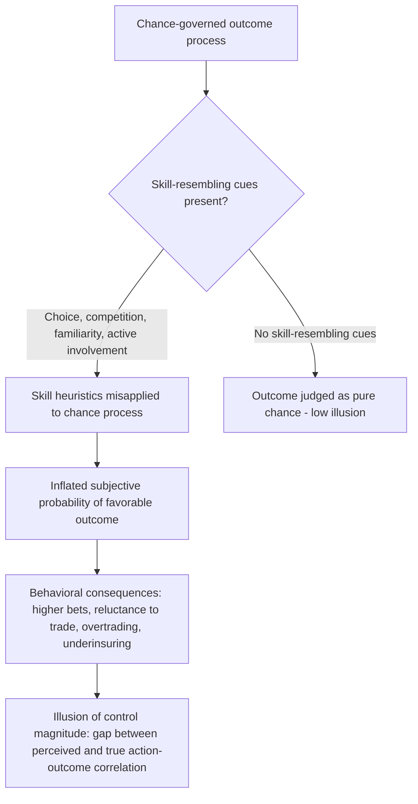

## The Illusion of Control

### Definition and Core Phenomenon

The illusion of control is the tendency for individuals to overestimate their ability to influence or control outcomes that are, objectively, determined wholly or largely by chance. The term and its foundational empirical demonstration come from Ellen Langer's 1975 paper "The Illusion of Control," which showed that people behave as though skill-relevant factors (choice, competition, familiarity, active involvement) can improve performance on tasks that are actually pure chance events, such as lotteries or coin tosses. This is a judgment bias distinct from simple optimism: it specifically concerns a mistaken causal belief that one's own agency affects an outcome-generating process that contains no genuine contingency on that agency.

Langer's central insight was that people apply cues normally diagnostic of skill situations (e.g., "practice helps," "choosing carefully helps," "competing against a weak opponent helps") to chance situations where those cues carry no actual predictive validity. The presence of skill-related *trappings* — even when logically irrelevant to a chance process — inflates subjective confidence in a favorable outcome.

### Foundational Experiments

**The lottery ticket studies.** In one of Langer's key experiments, participants either were assigned a lottery ticket at random or were allowed to choose their own ticket from a set of otherwise identical tickets. Later, when offered the chance to sell their ticket back before the drawing, participants who had chosen their own ticket demanded a significantly higher price to part with it than participants who had been given a ticket at random — despite an objectively identical probability of winning. The act of choosing induced an illusory sense of control that psychologically inflated the ticket's own subjective value.

**Competition and opponent familiarity.** In another paradigm, participants competed in a chance-based card-matching game either against a confident, well-dressed "competent-seeming" opponent or against a nervous, awkward "incompetent-seeming" opponent (a confederate). Even though the game's outcome was determined by chance regardless of the opponent's demeanor, participants bet more and expressed greater confidence in winning when facing the seemingly incompetent opponent — a competitive-skill cue was misapplied to a game with no skill component.

**Familiarity and stimulus exposure.** Participants exposed to more trials or practice on a chance task (e.g., repeated coin-toss guessing) reported increased confidence in their ability to predict subsequent outcomes, even though repetition provides no genuine information advantage in an independent, identically distributed chance process.

**Active involvement.** Tasks that involved active participant engagement — throwing dice oneself, or having more time to deliberate over a chance choice — produced higher confidence ratings than passive or rushed involvement in the same objective-probability task.

### Boundary Conditions: The Skill/Chance Continuum

Langer's original formulation proposed that the illusion is strongest for chance events that superficially resemble skill situations. Table-stakes conditions that increase the illusion include: the presence of competition, choice, familiarity/practice, and active involvement. The illusion is weaker or absent for chance events that carry no skill-resembling features at all (e.g., a purely mechanical, impersonal random number generator with no elements of choice or competition attached). This distinguishes illusion of control from generic overconfidence: the bias is triggered specifically by the *structural resemblance* of the situation to a skill domain, not merely by a desire for a positive outcome.

### Related and Contributing Mechanisms

**Depressive realism.** A body of work initiated by Lauren Alloy and Lyn Abramson (1979) found that mildly depressed individuals tend to give *more* accurate (less inflated) estimates of their actual control over chance outcomes than non-depressed individuals, who systematically overestimate control. This finding, sometimes summarized as "sadder but wiser," suggests illusion of control may be a component of a broader non-depressive positivity bias in cognition, though the depressive realism literature itself has produced mixed replications and remains debated. [Inference: the strength and generality of the depressive-realism effect beyond specific experimental paradigms is contested in later replication attempts]

**Locus of control.** Individual differences in generalized locus of control (Julian Rotter's construct, distinguishing "internal" locus — believing outcomes are contingent on one's own actions — from "external" locus — believing outcomes are due to luck, fate, or powerful others) correlate with susceptibility to the illusion. Individuals with a strong internal locus of control orientation tend to show larger illusion-of-control effects, since they are dispositionally primed to interpret ambiguous outcome-generating processes as agency-responsive.

**Self-efficacy and positive illusions.** Shelley Taylor and Jonathon Brown's "positive illusions" framework situates illusion of control alongside unrealistic optimism and self-enhancement bias as one of three interrelated positive illusions that, in moderate degree, are associated with psychological well-being, motivation, and resilience — while in excess they produce maladaptive risk-taking and poor calibration.

**Near-miss effects.** In gambling contexts specifically, "near misses" (e.g., a slot machine outcome that is close to but not a win) have been shown to activate reward-related neural circuitry similarly to actual wins and to increase subsequent illusion-of-control-driven persistence, even though a near miss carries no more predictive information about future spins than a far miss. This has been extensively studied in the neuroscience-of-gambling literature (e.g., work by Luke Clark and colleagues).

### Domains of Application

**Gambling and problem gambling.** Illusion of control is one of the most consistently implicated cognitive distortions in disordered gambling. Behaviors such as believing that a particular ritual, betting pattern, choice of numbers, or "hot streak" tracking can influence outcomes in games of pure chance (roulette, slot machines, lottery number selection) are direct manifestations. Cognitive-behavioral treatments for problem gambling often specifically target and attempt to correct illusion-of-control beliefs as a treatment mechanism.

**Financial markets and investing.** Retail investors, and even some professional traders, exhibit illusion of control with respect to stock-picking and market-timing skill in domains with substantial genuine randomness (particularly short-horizon trading). This has been linked in the behavioral finance literature (e.g., work by Terrance Odean and Brad Barber on overtrading) to excessive trading frequency, since traders who believe they can control or predict short-term price movements trade more often — typically to the detriment of net returns after transaction costs.

**Entrepreneurship.** Entrepreneurs as a population show elevated illusion-of-control tendencies relative to the general population, which some research links to the well-documented high failure base rate of new ventures: founders systematically overweight the influence of their own effort, skill, and strategic choices relative to market and environmental factors genuinely outside their control (competitor actions, macroeconomic shifts, chance timing).

**Organizational decision-making and planning.** Managers exhibiting illusion of control may underinvest in risk mitigation, hedging, or contingency planning because they overestimate their capacity to steer outcomes through active management, connecting this bias to the broader planning fallacy and to insufficient scenario planning in corporate strategy.

**Health behavior.** Illusion of control has been studied in health contexts where patients or individuals overestimate personal control over outcomes with substantial stochastic or genetic components (e.g., disease progression), which can affect both psychological adjustment (sometimes adaptively, via motivation to adhere to treatment) and maladaptive behaviors (e.g., forgoing medical treatment in favor of personally "controllable" alternative regimens).

### Distinguishing Illusion of Control from Adjacent Concepts

- **Illusion of control vs. overconfidence**: Overconfidence is a broader miscalibration between subjective confidence and objective accuracy across many judgment types; illusion of control is specifically about misattributing causal agency over chance-determined outcomes.
- **Illusion of control vs. optimism bias**: Optimism bias (unrealistic optimism) is the tendency to believe good things are more likely to happen to oneself than to others, independent of any belief about personal causal control; illusion of control specifically requires a false belief in *agency* over the outcome-generating mechanism.
- **Illusion of control vs. self-serving attribution bias**: Self-serving bias concerns attributing *past* successes to internal factors and failures to external factors after the fact; illusion of control concerns a *prospective* overestimation of one's causal influence before or during an ongoing chance process.
- **Illusion of control vs. magical thinking**: Magical thinking (studied in cognitive and clinical psychology, e.g., in the context of OCD) generally refers to belief in causal connections that violate known physical causal laws (e.g., "thinking about an event can cause it"). Illusion of control need not involve any such law-violating belief — it typically involves misapplying otherwise-valid skill heuristics to a process that happens to be chance-governed, not a belief in supernatural causation, though the two can overlap in some ritual-behavior contexts (e.g., "lucky" gambling rituals).

### Formal Representation

The bias can be represented as a discrepancy between a person's subjective estimate of the correlation between their actions and outcomes, and the true (near-zero) correlation in a chance-governed process:

$$IOC = \hat{r}_{subjective}(A, O) - r_{true}(A, O)$$

where $A$ denotes the individual's actions or choices (e.g., ticket selection, betting ritual), $O$ denotes the outcome, $r_{true}(A,O) \approx 0$ for a genuinely chance-governed process, $\hat{r}_{subjective}(A,O)$ is the individual's subjectively perceived correlation between their actions and the outcome, and $IOC$ is the resulting illusion-of-control magnitude. A positive, non-trivial $IOC$ indicates the individual believes their actions are predictive of outcomes that are, in fact, statistically independent of those actions.

A related quantity often measured empirically is willingness-to-pay (or minimum selling price) for a chance-based asset under choice versus no-choice conditions:

$$\Delta WTP = WTP_{chosen} - WTP_{assigned}$$

where a $\Delta WTP > 0$, as observed in Langer's lottery-ticket paradigm, operationalizes the illusion via a behavioral (economic) rather than purely self-report measure.

### Illustrative Example

**Example**: Two employees at a company each place an identical $50 bet on a company-sponsored raffle with a random drawing. Employee A is handed a randomly assigned raffle ticket by an administrator. Employee B is given a stack of 20 identical blank tickets and asked to personally write their name on whichever one they prefer, then drop it in a box alongside 19 similarly blank alternatives. Both tickets carry an objectively identical 1-in-N chance of winning. When later offered a chance to trade their ticket for a different, equally random one, Employee B (who exercised choice) is substantially more likely to decline the trade and to report higher subjective confidence of winning than Employee A — despite no difference whatsoever in actual win probability. This illustrates how a trivial, causally inert act of choice generates a measurable illusion of control.

### Process Diagram

### Conceptual Diagram (svg_diagram)

<svg xmlns="http://www.w3.org/2000/svg" viewBox="0 0 700 320">
<text x="350" y="30" text-anchor="middle" font-size="18" font-weight="bold" fill="#1a1a1a">Illusion of Control: Choice vs Assigned Condition (svg_diagram)</text>
<line x1="80" y1="270" x2="620" y2="270" stroke="#333" stroke-width="2" />
<line x1="80" y1="270" x2="80" y2="60" stroke="#333" stroke-width="2" />
<text x="350" y="300" text-anchor="middle" font-size="13" fill="#333">Condition</text>
<text x="35" y="165" text-anchor="middle" font-size="13" fill="#333" transform="rotate(-90 35 165)">Subjective win confidence / WTP</text>
<rect x="160" y="200" width="100" height="70" fill="#2b6cb0" />
<text x="210" y="290" text-anchor="middle" font-size="12" fill="#333">Assigned ticket</text>
<text x="210" y="190" text-anchor="middle" font-size="12" fill="#2b6cb0">Baseline</text>
<rect x="400" y="110" width="100" height="160" fill="#c53030" />
<text x="450" y="290" text-anchor="middle" font-size="12" fill="#333">Self-chosen ticket</text>
<text x="450" y="100" text-anchor="middle" font-size="12" fill="#c53030">Elevated (illusion of control)</text>
<line x1="260" y1="200" x2="400" y2="110" stroke="#805ad5" stroke-width="1.5" stroke-dasharray="6,3" />
<text x="330" y="145" text-anchor="middle" font-size="12" fill="#805ad5" font-style="italic">Delta WTP gap</text>
</svg>

### Debiasing and Mitigation Approaches

**Explicit probability disclosure and framing.** Presenting objective probability information in formats that resist skill-cue contamination (e.g., emphasizing the mechanical/random nature of a process rather than choice-related framing) has some demonstrated effect in reducing the bias, though effects are often modest and task-dependent.

**Outcome tracking and feedback.** Structured tracking of actual outcomes against predictions over repeated trials, particularly in domains like trading, can help recalibrate subjective control beliefs by providing disconfirming statistical evidence, though this requires sufficient trial volume and disciplined record-keeping to overcome the same selective-memory processes implicated in hindsight bias.

**Removing skill-resembling structural cues.** In applied contexts such as gambling-harm reduction, design interventions that strip choice, competition, and active-involvement features from chance-based products (e.g., standardized, non-customizable lottery number assignment) have been proposed as structural mitigations, on the theory that removing the triggering cues reduces the downstream illusion, independent of any individual-level cognitive correction.

**Caveat on intervention durability [Inference]**: As with many judgment-and-decision-making bias interventions, laboratory-demonstrated reductions in illusion of control do not consistently translate into durable behavior change in ecologically realistic, repeated-exposure settings such as active gambling environments, where structural and motivational reinforcement (e.g., near-miss reward cues, intermittent reinforcement schedules) may continually regenerate the bias regardless of one-time educational correction.

**Related Topics**

- Overconfidence bias and calibration of subjective probability
- Optimism bias and unrealistic comparative optimism
- Self-serving attribution bias
- Locus of control (Rotter) as an individual-difference moderator
- Depressive realism and the "sadder but wiser" effect
- Near-miss effects and reward processing in gambling neuroscience
- Positive illusions framework (Taylor and Brown)
- Planning fallacy and entrepreneurial overconfidence
- Behavioral finance: overtrading and retail investor behavior
- Cognitive-behavioral treatment approaches for problem gambling