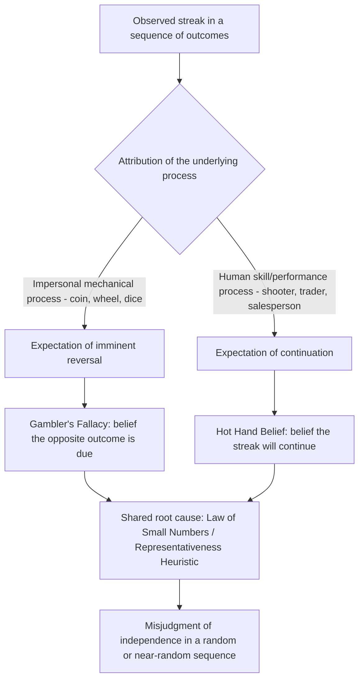

## The Gambler's Fallacy and the Hot Hand Fallacy

### Overview: Two Mirror-Image Misperceptions of Randomness

The gambler's fallacy and the hot hand fallacy are two distinct, and in a specific sense opposite, misjudgments of sequential randomness that are conventionally treated together because they arise from the same underlying cognitive source: a mistaken mental model of what a genuinely random sequence should look like. Both biases involve misperceiving statistical independence in a sequence of chance events, but they produce opposite behavioral predictions.

The **gambler's fallacy** is the belief that after a run of one outcome in an independent random process (e.g., several consecutive coin flips landing heads), the *opposite* outcome becomes more likely on the next trial ("it's due"). The **hot hand fallacy**, at least in its original formulation, refers to the belief that a person experiencing a streak of successes (e.g., a basketball player who has made several consecutive shots) is more likely to succeed on the *next* attempt — an expectation of continuation rather than reversal. Both beliefs can apply to the same objective sequence type; what differs is whether the perceiver expects reversal (gambler's fallacy) or continuation (hot hand belief).

### The Law of Small Numbers as the Shared Root Cause

Both fallacies are conventionally traced to what Amos Tversky and Daniel Kahneman (1971) termed the "belief in the law of small numbers" — the erroneous intuition that short random sequences should closely resemble the statistical properties (proportions, alternation rates) of the long-run population from which they are drawn. People implicitly expect local representativeness: a short sequence of coin flips is expected to "look random" in the sense of alternating frequently and avoiding long runs, even though genuinely random independent sequences produce long runs and streaks far more often than naive intuition predicts.

This connects both fallacies to the representativeness heuristic: a sequence like H-T-H-T-H-T is intuitively judged as "more representative" of a fair coin than H-H-H-H-H-H, even though both specific sequences are precisely equiprobable under a fair-coin model ($p = (1/2)^6$ for each). Because people use apparent representativeness rather than correct combinatorial reasoning to judge sequence likelihood, a long run of one outcome feels "overdue" for correction (gambler's fallacy), while a run of positive outcomes attributed to a *person's* changing internal skill state feels like a genuine, continuing tendency (hot hand belief) rather than a coincidental cluster.

### Gambler's Fallacy: Mechanism and Formal Statement

For a sequence of independent and identically distributed (i.i.d.) Bernoulli trials with fixed probability $p$ (e.g., $p = 0.5$ for a fair coin), the defining mathematical property is that each trial is statistically independent of all prior trials:

$$P(X_{n+1} = 1 \mid X_1, X_2, \ldots, X_n) = p \quad \text{for all } n$$

The gambler's fallacy is the false belief that:

$$P(X_{n+1} = 1 \mid X_n = X_{n-1} = \cdots = X_{n-k+1} = 1) < p$$

i.e., that a run of $k$ consecutive successes lowers the probability of a further success on the next trial, when in fact, by the independence assumption, the conditional probability remains exactly $p$ regardless of the preceding run length.

**Historical case: the Monte Carlo Casino, 1913.** The phenomenon's popular name derives from a widely cited incident at the Monte Carlo Casino in which the roulette wheel landed on black 26 times in a row. Gamblers, believing the wheel was "due" for red, progressively increased their bets on red as the streak lengthened, losing substantial sums, since each spin remained independent with the same near-50% probability (adjusted for the house-edge green zero/double-zero pockets) regardless of the preceding run.

**Distinction from a genuinely non-independent process.** The gambler's fallacy specifically applies to sampling *with replacement* (or any genuinely independent-trials process). It does not apply to sampling *without replacement* — for example, in card games, removing cards from a deck genuinely does change the conditional probability of subsequent draws, so updating one's beliefs about remaining card composition is not a fallacy but a correct application of conditional probability (this is the basis of legitimate card-counting in blackjack, as opposed to gambler's-fallacy reasoning at a roulette wheel).

### Hot Hand Fallacy / Hot Hand Belief: Mechanism and History

**The original Gilovich, Vallone, and Tversky (1985) study.** The hot hand phenomenon was first rigorously studied by Thomas Gilovich, Robert Vallone, and Amos Tversky, who analyzed shooting data from the Philadelphia 76ers, a controlled shooting experiment with Cornell University's basketball teams, and free-throw records from the Boston Celtics. Their central finding was that the probability of a player making a shot was *not* meaningfully higher following a streak of makes than following a miss or a mixed sequence — that is, statistically, shot outcomes for most players in their sample were reasonably close to independent, resembling a fixed-probability Bernoulli process rather than a process with positive serial correlation ("streakiness"). Despite this, players, coaches, and fans confidently and consistently believed in streak-dependent shooting performance, judging that a player who had just made several shots was more likely to make the next one — the researchers termed this the "hot hand fallacy," treating the *belief* in streakiness as the misperception, on the grounds that the underlying data did not support genuine streakiness beyond chance clustering.

**Reassessment: the Miller and Sanjurjo critique (2015 onward).** A significant later development in this literature came from Joshua Miller and Adam Sanjurjo, who identified a subtle but consequential statistical bias in the original Gilovich et al. analytical method. When calculating "probability of a hit following a streak of hits" from a *finite* sequence, conditioning on a streak occurring within the sequence introduces a selection effect that biases the empirical conditional hit-rate *downward*, even under the true null hypothesis of independence. Correcting for this bias, Miller and Sanjurjo found that several of the original hot-hand datasets (and additional data, including the original Cornell shooting-experiment records) actually show a small but statistically detectable *positive* correlation between consecutive shot outcomes — i.e., some genuine (if modest) hot-hand effect does appear to exist in at least some of the reanalyzed data. This reversed a near-consensus interpretation that had stood for roughly three decades and is now widely discussed as a case study in the subtlety of conditional probability estimation from finite sequences.

**Current state of the debate [Inference/Unverified nuance]**: The Miller and Sanjurjo correction is broadly accepted as methodologically sound within the statistics and behavioral economics literature, but there remains ongoing scholarly discussion about the practical magnitude of any genuine hot-hand effect across different sports, players, and shot types, and about how much of the original "hot hand fallacy" framing should be revised versus retained — the *belief* in streakiness among observers is still generally considered to be substantially stronger than any small genuine serial-correlation effect that has been detected, so "hot hand fallacy" as an overconfidence-in-magnitude phenomenon is not fully overturned even if a pure existence claim ("no hot hand exists at all") has been revised.

### Reconciling the Two Fallacies: Why Do They Point in Opposite Directions?

A key conceptual puzzle is why the same law-of-small-numbers intuition produces *opposite* predictions in the two cases — expecting reversal in one context (gambler's fallacy) and expecting continuation in the other (hot hand belief). The standard resolution, following Tversky and Gilovich's own discussion, is that the two beliefs arise in different attributional contexts:

- In an **impersonal, mechanical chance process** (coin, roulette wheel, dice), people have a strong prior that the process is fundamentally random and has no memory or "hot state" of its own, so the perceived departure from a representative alternating pattern triggers an expectation of imminent self-correction toward the "fair" long-run ratio — the reversal expectation.
- In a **human-performed skill task** (shooting a basketball, a stock picker's returns, a salesperson's closing streak), people have a prior belief that the underlying generative process (a person's skill/confidence/"form") *can* genuinely fluctuate over time due to real psychological or physiological states (confidence, focus, fatigue), so an observed streak is attributed to a temporarily elevated latent skill state that is expected to persist — the continuation expectation.

In both cases, the error is the same at its root: over-interpreting a short chance-consistent sequence as informative about an underlying non-random process (an "about to correct" wheel, or a "currently hot" shooter), when in fact — under a strict independence null — the sequence carries no such information.

### Distinguishing the Fallacies from Related Concepts

- **Gambler's fallacy vs. regression to the mean**: Regression to the mean is a real statistical phenomenon in which extreme observations tend to be followed by less extreme ones due to noise averaging out, applicable when a measured quantity has a genuine stable long-run mean and substantial measurement or trial-to-trial noise. The gambler's fallacy is a misapplication of a regression-like intuition to strictly independent trials where there is no "average" being regressed toward at the level of the next single trial — regression to the mean is a property of aggregates/repeated sampling, not a corrective force on any individual next outcome.
- **Gambler's fallacy vs. the hot hand as applied to non-independent processes**: Applying "streak thinking" to a process that genuinely has positive serial dependence (e.g., true momentum effects in some financial markets over specific horizons, or genuinely improving equipment/technique over a practice session) is not a fallacy — the fallacy label applies specifically when the underlying generative process is actually independent (or the correlation is far smaller than believed).
- **Hot hand fallacy vs. overfitting/pattern-matching more broadly**: The hot hand fallacy is a specific instance of the broader human tendency toward apophenia (perceiving meaningful patterns in random or noisy data), related to but narrower than general pattern-overfitting biases discussed in the heuristics-and-biases literature.

### Domains of Application

**Casino and lottery gambling.** The gambler's fallacy is one of the most extensively documented cognitive drivers of problematic betting behavior, particularly in roulette, craps, and lottery number selection (e.g., avoiding recently drawn lottery numbers under the belief they are "less due"), and is a standard target of responsible-gambling educational interventions.

**Sports analytics and coaching decisions.** Belief in the hot hand influences real coaching decisions (e.g., preferentially passing to a player perceived as "hot," or increasing a pitcher's/shooter's workload during a perceived streak), which the Miller-Sanjurjo reassessment suggests may not be entirely unfounded, though the practical decision-relevant magnitude of any real effect remains a live empirical question across specific sports contexts.

**Financial markets.** Both fallacies appear in investor behavior: gambler's-fallacy-style reasoning appears when investors expect a stock or asset class that has risen for several consecutive periods to be "due for a correction" absent any fundamental information change, while hot-hand-style reasoning appears when investors chase recent fund or manager outperformance under the belief that recent strong returns indicate a persistent skill-driven "hot streak" — a belief directly targeted by standard disclosure language such as "past performance is not indicative of future results."

**Judicial and administrative decision sequences.** Some studies (e.g., research on refugee asylum judges and loan officers) have found evidence consistent with gambler's-fallacy-style patterns in sequential decision-making, where decision-makers reviewing a sequence of cases become more likely to rule in the opposite direction of their preceding several decisions, independent of case-specific merits — suggesting the fallacy can operate even in professional, high-stakes, non-gambling sequential judgment contexts.

**Quality control and manufacturing.** Operators monitoring a random-failure process (e.g., defect rates assumed independent across production batches) can exhibit gambler's-fallacy-consistent expectations that a run of defect-free batches makes a defective batch "due," which can distort statistical process control interpretation if not corrected by proper control-chart methodology.

### Illustrative Examples

**Example (gambler's fallacy)**: A roulette player observes the ball land on red eight times in a row at a European roulette table (37 pockets: 18 red, 18 black, 1 green zero). Believing black is now "due," the player places an increasingly large bet on black for the ninth spin. In fact, the probability of red versus black on the ninth spin remains essentially unchanged at roughly 18/37 ≈ 48.6% for each color (with 1/37 for green), completely independent of the preceding eight outcomes, since the wheel has no memory of past spins.

**Example (hot hand belief)**: A basketball commentator, observing a player make five consecutive three-point shots, states that the player is "feeling it" and should keep shooting, while the opposing coach calls a timeout specifically to "cool off" the streaking player. Under the original Gilovich et al. analysis this reflects pure narrative overlay on a chance-consistent clustering; under the Miller-Sanjurjo reanalysis, a small genuine uptick in make-probability may be statistically present for at least some players, but almost certainly far smaller than the confident, near-certain framing implied by the commentator's language.

### Process Diagram

### Conceptual Diagram (svg_diagram)

<svg xmlns="http://www.w3.org/2000/svg" viewBox="0 0 700 340">
<text x="350" y="28" text-anchor="middle" font-size="17" font-weight="bold" fill="#1a1a1a">Gambler's Fallacy vs Hot Hand Belief: Opposite Predictions from the Same Root (svg_diagram)</text>
<rect x="60" y="60" width="580" height="50" fill="#edf2f7" stroke="#333" />
<text x="350" y="90" text-anchor="middle" font-size="13" fill="#333">Shared root: Law of Small Numbers / Representativeness Heuristic</text>
<line x1="350" y1="110" x2="200" y2="150" stroke="#333" stroke-width="1.5" />
<line x1="350" y1="110" x2="500" y2="150" stroke="#333" stroke-width="1.5" />
<rect x="80" y="150" width="240" height="60" fill="#2b6cb0" />
<text x="200" y="175" text-anchor="middle" font-size="12" fill="#fff">Impersonal chance process</text>
<text x="200" y="195" text-anchor="middle" font-size="12" fill="#fff">(coin, roulette wheel)</text>
<rect x="380" y="150" width="240" height="60" fill="#c53030" />
<text x="500" y="175" text-anchor="middle" font-size="12" fill="#fff">Human skill process</text>
<text x="500" y="195" text-anchor="middle" font-size="12" fill="#fff">(shooter, trader)</text>
<line x1="200" y1="210" x2="200" y2="250" stroke="#333" stroke-width="1.5" />
<line x1="500" y1="210" x2="500" y2="250" stroke="#333" stroke-width="1.5" />
<rect x="80" y="250" width="240" height="60" fill="#2b6cb0" opacity="0.7" />
<text x="200" y="275" text-anchor="middle" font-size="12" fill="#fff">Gambler's Fallacy</text>
<text x="200" y="295" text-anchor="middle" font-size="12" fill="#fff">expects reversal</text>
<rect x="380" y="250" width="240" height="60" fill="#c53030" opacity="0.7" />
<text x="500" y="275" text-anchor="middle" font-size="12" fill="#fff">Hot Hand Belief</text>
<text x="500" y="295" text-anchor="middle" font-size="12" fill="#fff">expects continuation</text>
</svg>

### Empirical Detection and Statistical Caveats

**The finite-sequence conditioning bias.** As established by Miller and Sanjurjo, any researcher (or practitioner) computing an empirical "probability of success given a preceding streak of length $k$" from a *finite* recorded sequence must correct for a mechanical downward bias inherent in the conditioning procedure itself, distinct from any genuine behavioral or psychological effect. This is a subtle methodological point: it does not indicate that the original hot-hand researchers reasoned incorrectly in a naive sense, but that a specific conditional-probability estimator commonly used across the finite-sequence streak literature was measurably biased, prompting a substantial portion of the field to revisit prior conclusions.

**Base-rate and sample-size sensitivity.** Detecting genuine (if small) serial dependence in real-world sequences (shooting data, trading returns) generally requires substantially larger sample sizes than intuitively expected, since true effect sizes — where they exist — tend to be small relative to the noise inherent in binary or near-binary outcome sequences, making both false-negative (missing a real small effect) and false-positive (perceiving a spurious effect, i.e., the fallacy itself) errors common in small or casually examined datasets.

### Debiasing Strategies

**Explicit independence instruction with worked demonstration.** Directly teaching the mathematical independence property of the relevant generative process, ideally paired with a concrete demonstration (e.g., simulating many independent coin-flip sequences and showing the frequency of long runs), has some documented effectiveness in reducing gambler's-fallacy judgments in controlled settings, though effects on actual gambling behavior outside the lab are less well established. [Inference]

**Structured decision protocols in sequential professional judgment.** In domains such as loan approval or judicial rulings where gambler's-fallacy-consistent sequential drift has been documented, procedural interventions such as randomized case-order review, structured case-independent scoring rubrics, or workload/break scheduling designed to reduce fatigue-driven pattern-seeking have been proposed as mitigations, though evidence on their real-world effectiveness at scale is limited.

**Correct conditional-probability estimators.** For any practitioner or researcher attempting to empirically test for streakiness in a finite dataset (sports statistics, trading records, quality-control logs), applying the Miller-Sanjurjo-corrected estimator (or an equivalent permutation-based or simulation-based null-distribution approach) rather than the naive conditional hit-rate is now considered best practice to avoid reintroducing the very bias the correction was designed to fix.

**Related Topics**

- Representativeness heuristic and the "law of small numbers"
- Regression to the mean as a genuine statistical phenomenon distinct from the gambler's fallacy
- Apophenia and pattern perception in random data
- Miller and Sanjurjo's finite-sequence conditioning bias correction
- Sequential decision-making biases in professional judgment (judges, loan officers, umpires)
- Momentum and mean-reversion effects in financial asset pricing
- Base-rate neglect and probability judgment under uncertainty
- Illusion of control (related chance-process misjudgment)
- Behavioral finance: performance chasing and fund flows
- Responsible-gambling cognitive-distortion interventions