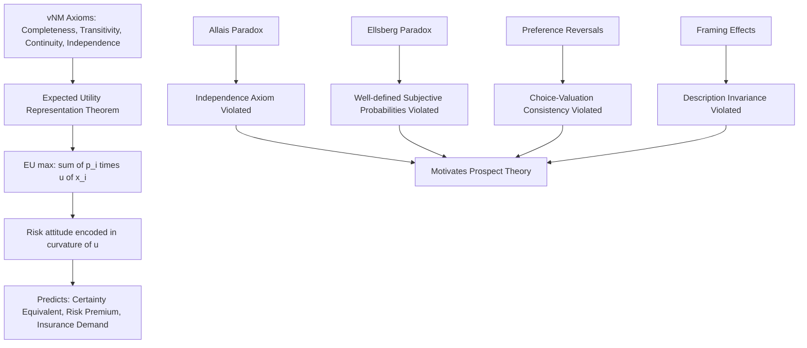

## Expected Utility Theory as the Classical Benchmark

### Purpose and Role in Behavioral Economics

Expected utility theory (EUT) is the classical normative and, for much of the twentieth century, the dominant descriptive model of decision-making under risk. It is introduced in a behavioral economics curriculum not primarily as a standalone economic theory but as the *benchmark* against which behavioral departures — most notably prospect theory — are defined and measured. Understanding EUT's axiomatic structure, its predictions, and specifically the ways those predictions fail empirically is a necessary prerequisite to understanding why prospect theory was developed and what problems it was built to solve.

### Historical Development

**Von Neumann and Morgenstern (1944).** The modern axiomatic formulation of expected utility theory originates in John von Neumann and Oskar Morgenstern's *Theory of Games and Economic Behavior*, which derived expected utility as a *representation theorem*: given a small set of plausible axioms about preferences over lotteries, a decision-maker's choices must be representable as maximizing the mathematical expectation of some utility function. This was a significant advance over earlier expected-value reasoning because it grounded the use of a nonlinear utility function (rather than raw monetary value) in explicit, testable axioms about preference structure, rather than treating diminishing marginal utility as an ad hoc assumption.

**Precursors: the St. Petersburg Paradox.** The conceptual groundwork long predates von Neumann and Morgenstern. Daniel Bernoulli's 1738 resolution of the St. Petersburg Paradox — a gamble with infinite expected monetary value that people are nonetheless unwilling to pay a large sum to play — proposed that individuals maximize the expectation of a concave (diminishing marginal) utility function of wealth rather than the expectation of monetary value itself, foreshadowing the core structure of later expected utility theory by roughly two centuries.

**Savage's subjective expected utility (1954).** Leonard Savage extended the framework to situations of *uncertainty* (where objective probabilities are not given, unlike von Neumann-Morgenstern's setting of known-probability lotteries), deriving subjective expected utility theory: decision-makers act as if they hold personal (subjective) probability beliefs over uncertain states of the world and maximize the expectation of a utility function under those subjective beliefs. This extension is foundational to later Bayesian decision theory and to much of modern economics' treatment of decision-making under genuine uncertainty (as opposed to quantified risk).

### The Axiomatic Structure

The von Neumann-Morgenstern (vNM) expected utility representation theorem rests on a small number of axioms applied to a preference relation $\succsim$ over lotteries (probability distributions over outcomes):

**Completeness.** For any two lotteries $L_1$ and $L_2$, the decision-maker can rank them: either $L_1 \succsim L_2$, $L_2 \succsim L_1$, or both (indifference).

**Transitivity.** If $L_1 \succsim L_2$ and $L_2 \succsim L_3$, then $L_1 \succsim L_3$. Preferences must be internally consistent and not cyclical.

**Continuity (Archimedean axiom).** If $L_1 \succ L_2 \succ L_3$, there exists some probability $p \in (0,1)$ such that the decision-maker is indifferent between $L_2$ and a compound lottery yielding $L_1$ with probability $p$ and $L_3$ with probability $1-p$. This rules out lexicographic preferences (where no finite probability trade-off could compensate for a categorical ranking).

**Independence (the substitution axiom).** If $L_1 \succsim L_2$, then for any third lottery $L_3$ and any probability $p \in (0,1]$, a compound lottery mixing $L_1$ with $L_3$ must be weakly preferred to the corresponding mixture of $L_2$ with $L_3$:

$$L_1 \succsim L_2 \implies pL_1 + (1-p)L_3 \succsim pL_2 + (1-p)L_3$$

The independence axiom is the most economically substantive and, as discussed below, the most empirically contested of the four axioms — it is the specific axiom whose systematic violation motivated prospect theory.

**Representation theorem.** Given these four axioms, von Neumann and Morgenstern proved that there exists a utility function $u(\cdot)$, unique up to positive affine (linear) transformation, such that for any two lotteries $L_1$ and $L_2$:

$$L_1 \succsim L_2 \iff \mathbb{E}[u(L_1)] \geq \mathbb{E}[u(L_2)]$$

That is, the decision-maker behaves *as if* maximizing the mathematical expectation of a utility function over final outcomes — this is the formal justification for expected utility maximization as a decision rule, rather than an assumption imposed without foundation.

### The Expected Utility Formula and Risk Attitudes

For a lottery $L$ offering outcome $x_i$ with probability $p_i$ (for $i = 1, \ldots, n$, with $\sum_i p_i = 1$), expected utility is:

$$EU(L) = \sum_{i=1}^{n} p_i \, u(x_i)$$

or, for a continuous outcome distribution with density $f(x)$:

$$EU(L) = \int u(x) \, f(x) \, dx$$

**Risk attitude is encoded entirely in the curvature of $u(\cdot)$**, which is a central conceptual point in EUT and a key contrast point with prospect theory's separate treatment of risk attitude (via the value function) and probability weighting (via a distinct probability weighting function):

- **Risk aversion**: $u(\cdot)$ is concave ($u'' < 0$). A risk-averse individual prefers a certain payment equal to a lottery's expected value over the lottery itself.
- **Risk neutrality**: $u(\cdot)$ is linear ($u'' = 0$). The individual is indifferent between a lottery and its expected value for certain, and simply maximizes expected monetary value.
- **Risk seeking**: $u(\cdot)$ is convex ($u'' > 0$). The individual prefers the lottery over its certain expected value.

**Arrow-Pratt measures of risk aversion.** Kenneth Arrow and John Pratt independently formalized the degree of risk aversion via the coefficient of absolute risk aversion:

$$A(x) = -\frac{u''(x)}{u'(x)}$$

and the coefficient of relative risk aversion:

$$R(x) = -x \cdot \frac{u''(x)}{u'(x)} = x \cdot A(x)$$

These measures allow comparison of risk attitudes across different utility functions and are foundational to applied fields such as insurance economics, portfolio choice theory, and asset pricing, where specific functional forms (e.g., constant relative risk aversion, CRRA; constant absolute risk aversion, CARA) are commonly assumed for tractability.

**Common functional forms.** Widely used utility functions in applied EUT work include:

- CRRA (constant relative risk aversion): $u(x) = \dfrac{x^{1-\gamma}}{1-\gamma}$ for $\gamma \neq 1$, and $u(x) = \ln(x)$ for $\gamma = 1$, where $\gamma$ is the coefficient of relative risk aversion.
- CARA (constant absolute risk aversion): $u(x) = -e^{-\alpha x}$, where $\alpha$ is the coefficient of absolute risk aversion.
- Quadratic utility: $u(x) = x - \dfrac{b}{2}x^2$, historically used in mean-variance portfolio theory for its tractability, despite implying implausible increasing absolute risk aversion at high wealth levels.

### The Certainty Equivalent and Risk Premium

Two applied constructs derived from EUT are used extensively in both theoretical and applied (e.g., insurance, asset pricing) contexts:

**Certainty equivalent** $CE$: the certain sum of money that yields the same utility as the lottery: $u(CE) = EU(L)$, i.e., $CE = u^{-1}(EU(L))$.

**Risk premium** $\pi$: the difference between the lottery's expected value and its certainty equivalent: $\pi = \mathbb{E}[L] - CE$. For a risk-averse individual, $\pi > 0$, representing the amount of expected value the individual is willing to sacrifice to avoid bearing the risk — this quantity underlies the theoretical justification for the existence of insurance markets under EUT.

### Empirical Violations: Why EUT Fails as a Descriptive Theory

The behavioral economics curriculum's treatment of EUT centers on its role as a *normatively coherent but descriptively falsified* benchmark. The key documented violations, each targeting a specific axiom or implication, include:

**The Allais Paradox (Maurice Allais, 1953).** Perhaps the most influential single empirical challenge to EUT, the Allais paradox presents two pairs of choices between lotteries constructed so that consistent application of the independence axiom requires a specific pattern of preferences, yet the large majority of experimental subjects (including, famously, many EUT-sympathetic economists themselves when first presented with the choices) violate that predicted pattern. The standard version:

*Choice 1*: A: $1 million for certain, vs. B: 10% chance of $5 million, 89% chance of $1 million, 1% chance of $0.

*Choice 2*: C: 11% chance of $1 million, 89% chance of $0, vs. D: 10% chance of $5 million, 90% chance of $0.

Most people choose A over B (preferring certainty) and D over C (preferring the higher-payoff gamble once certainty is no longer on the table) — but this combined pattern (A≻B, D≻C) directly violates the independence axiom, since both choice pairs differ from each other only by substituting an 89% chance of $1 million (present in both A and C) for an 89% chance of $0 (present in both B and D); a decision-maker who correctly applies independence should either prefer A and C together, or B and D together, but not the empirically dominant A-and-D pattern. This pattern is now understood as reflecting what prospect theory calls the "certainty effect" — people overweight outcomes that are certain relative to outcomes that are merely probable, a form of nonlinear probability weighting that violates the independence axiom's implicit linearity in probabilities.

**The Ellsberg Paradox (Daniel Ellsberg, 1961).** A related but distinct challenge targets subjective expected utility's assumption of well-defined subjective probabilities under ambiguity. Given an urn with 90 balls, 30 known red and 60 unknown (black or yellow in unknown proportion), most people prefer betting on red (known probability 1/3) over black (ambiguous probability, could range from 0 to 2/3) — and, in the classic paired-choice design, simultaneously prefer betting on "black or yellow" over "red or yellow," a joint pattern that cannot be reconciled with any single well-defined subjective probability assignment to black, demonstrating genuine ambiguity aversion distinct from ordinary risk aversion. This paradox is generally treated as a separate, though related, challenge from prospect theory proper, and motivated a distinct later literature on ambiguity-sensitive decision theory (e.g., Gilboa and Schmeidler's maxmin expected utility).

**Preference reversals (Lichtenstein and Slovic, 1971; Grether and Plott, 1979).** Experimental subjects frequently state a higher willingness-to-pay (or selling price) for a low-probability, high-payoff ("long-shot") lottery than for a high-probability, modest-payoff lottery, while simultaneously choosing the high-probability lottery over the long-shot when asked to choose directly between the two — a direct violation of the EUT prediction that valuation and choice should be governed by the same consistent underlying preference ordering. Grether and Plott's economically incentivized replication, originally designed specifically to rule out the phenomenon as an artifact of poor experimental methodology, instead robustly confirmed it, which was highly influential in establishing that EUT violations were not merely artifacts of hypothetical, low-stakes survey methodology.

**Framing effects and reference dependence.** EUT is defined entirely over final wealth states or final outcome levels, with no formal role for a reference point or for how a given prospect is described (framed). Empirical work — most prominently Kahneman and Tversky's own Asian disease problem — demonstrates that logically equivalent descriptions of the identical underlying outcomes (framed as gains versus framed as losses relative to a reference point) produce systematically different choices, directly violating EUT's implicit invariance/description-independence assumption, which is not one of the four core vNM axioms per se but is a standard auxiliary assumption required for EUT to generate unique behavioral predictions from any given decision problem.

### EUT as the Formal Point of Departure for Prospect Theory

Prospect theory (Kahneman and Tversky, 1979), covered as the subsequent topic in this chapter, was explicitly constructed as a direct response to the specific, replicated EUT violations described above, and its major structural departures map directly onto specific EUT failures:

| EUT Assumption | Empirical Violation | Prospect Theory's Departure |
| --- | --- | --- |
| Utility defined over final wealth states | Framing effects, endowment effect | Value function defined over gains/losses relative to a reference point |
| Diminishing marginal utility (concave throughout) | Risk-seeking for losses (e.g., Allais-type patterns, insurance/lottery co-holding) | S-shaped value function: concave for gains, convex for losses |
| Losses and gains weighted symmetrically | Losses loom larger than equivalent gains | Loss aversion coefficient ($\lambda \approx 2$–2.5 in canonical estimates) |
| Linear weighting of probabilities (independence axiom) | Allais paradox, certainty effect, preference reversals | Nonlinear probability weighting function $w(p)$ overweighting small probabilities and underweighting moderate-to-high probabilities |

This table is a preview/bridge rather than the substantive content of prospect theory itself, which receives its own dedicated treatment; it is included here specifically to make explicit why EUT functions as the benchmark model against which the rest of the "choice under risk" chapter is structured.

### Continued Normative and Applied Role

Despite its descriptive failures, EUT retains substantial and largely unchallenged standing as a **normative** theory — that is, as a coherent account of how a rational agent *should* choose under the stated axioms, and as the workhorse model in large areas of applied economics (asset pricing, insurance theory, contract theory, public finance) where its tractability and axiomatic grounding are valued even when its descriptive accuracy for individual choice is acknowledged to be imperfect. This dual status — normatively authoritative, descriptively falsified in specific, systematic ways — is itself a recurring theme in behavioral economics methodology and is part of why behavioral economists generally position their work as a *complement to* rather than a *wholesale replacement of* standard economic decision theory.

### Illustrative Example

**Example**: An individual with CRRA utility $u(x) = \dfrac{x^{1-\gamma}}{1-\gamma}$ and $\gamma = 2$ is offered a lottery paying $100 with probability 0.5 and $0 with probability 0.5 (expected value $50), versus a certain payment. Their expected utility from the lottery is $EU = 0.5 \cdot u(100) + 0.5 \cdot u(0^+)$; since $u(x) \to -\infty$ as $x \to 0$ for $\gamma = 2$, this particular functional form implies extreme aversion to any positive probability of zero wealth, illustrating how the choice of functional form for $u(\cdot)$ carries strong, sometimes empirically implausible, implications — a modeling sensitivity that is itself part of the applied critique of naive EUT calibration exercises. [Inference: whether a given real decision-maker's revealed risk aversion is well captured by a specific closed-form utility function such as CRRA is an empirical calibration question, not something guaranteed by the theory itself]

### Process Diagram

### Conceptual Diagram: Utility Function Shapes by Risk Attitude (svg_diagram)

<svg xmlns="http://www.w3.org/2000/svg" viewBox="0 0 700 340">
<text x="350" y="28" text-anchor="middle" font-size="17" font-weight="bold" fill="#1a1a1a">Utility Function Curvature and Risk Attitude (svg_diagram)</text>
<line x1="80" y1="290" x2="640" y2="290" stroke="#333" stroke-width="2" />
<line x1="80" y1="290" x2="80" y2="50" stroke="#333" stroke-width="2" />
<text x="360" y="320" text-anchor="middle" font-size="13" fill="#333">Wealth (x)</text>
<text x="35" y="170" text-anchor="middle" font-size="13" fill="#333" transform="rotate(-90 35 170)">Utility u(x)</text>
<path d="M 80 280 Q 300 100 620 70" fill="none" stroke="#2b6cb0" stroke-width="3" />
<text x="500" y="90" font-size="12" fill="#2b6cb0">Concave: Risk-Averse</text>
<line x1="80" y1="280" x2="620" y2="90" stroke="#38a169" stroke-width="3" />
<text x="500" y="180" font-size="12" fill="#38a169">Linear: Risk-Neutral</text>
<path d="M 80 280 Q 300 260 620 90" fill="none" stroke="#c53030" stroke-width="3" />
<text x="500" y="270" font-size="12" fill="#c53030">Convex: Risk-Seeking</text>
</svg>

**Next Steps**

- Prospect Theory: the S-shaped value function and the fourfold pattern of risk attitudes
- Reference points and the coding of outcomes as gains versus losses
- Loss aversion and its empirical estimation
- Probability weighting functions and the certainty/possibility effects
- The Allais and Ellsberg paradoxes as continuing motivators for ambiguity-sensitive decision theory
- Arrow-Pratt risk aversion measures in applied asset-pricing and insurance models
- Rank-dependent utility theory as an intermediate model between EUT and prospect theory
- Cumulative prospect theory's integration of probability weighting with the S-shaped value function