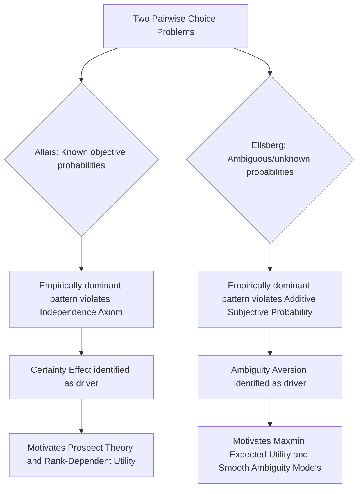

## The Allais Paradox and the Ellsberg Paradox

### Overview: Two Distinct Challenges to Rational Choice Theory

The Allais paradox and the Ellsberg paradox are the two most historically influential experimental demonstrations that human choice behavior systematically violates the axioms of expected utility theory (EUT) and subjective expected utility theory (SEUT), respectively. Although frequently discussed together as companion paradoxes in the choice-under-risk literature, they target different theoretical assumptions and different classes of decision problem: the Allais paradox concerns choice under **risk** (where objective probabilities are known and given) and specifically indicts the independence axiom, while the Ellsberg paradox concerns choice under **ambiguity** (where probabilities are unknown or imprecisely specified) and indicts the very possibility of representing beliefs with a single well-defined subjective probability distribution. Both paradoxes were pivotal in establishing that rational-choice axioms, however normatively compelling in the abstract, fail as descriptive accounts of real human decision-making, and both directly motivated major branches of subsequent decision theory.

### The Allais Paradox

**Origin.** The paradox was introduced by French economist Maurice Allais in 1953, in part as a direct critique of the American decision-theoretic tradition associated with von Neumann, Morgenstern, and Savage, presented at a conference in Paris that both Savage and Allais attended — notably, Savage himself, when subsequently presented with Allais's choice problems, exhibited the very preference pattern that violates his own axioms, which became one of the most frequently cited details in the paradox's subsequent retelling, illustrating that the violation was not merely a matter of naive or untrained subjects.

**The common consequence version (canonical form).** Consider two pairwise choices:

*Choice 1*:

- Option A: $1,000,000 with certainty (probability 1)
- Option B: $5,000,000 with probability 0.10, $1,000,000 with probability 0.89, $0 with probability 0.01

*Choice 2*:

- Option C: $1,000,000 with probability 0.11, $0 with probability 0.89
- Option D: $5,000,000 with probability 0.10, $0 with probability 0.90

The empirically dominant pattern across many replications is A ≻ B (choice 1) and D ≻ C (choice 2). This combined pattern violates the independence axiom of expected utility theory. To see why: both choice pairs share a common "sub-lottery" of an 89% chance of $1,000,000 (embedded in A and C) versus an 89% chance of $0 (embedded in B and D) mixed with an identical remaining 11%-weighted sub-lottery in each pair. The independence axiom requires that preferences between two lotteries be unaffected by mixing both with a common third lottery in the same proportion — so a decision-maker who prefers A to B (which differ from C and D only by this common 89% component) should also prefer C to D, and vice versa. Preferring A over B while also preferring D over C directly contradicts this requirement, for any expected-utility-consistent utility function $u(\cdot)$.

**Formal demonstration of the contradiction.** If EUT held, then A ≻ B implies:

$$u(1M) > 0.10\,u(5M) + 0.89\,u(1M) + 0.01\,u(0)$$

$$0.11\,u(1M) > 0.10\,u(5M) + 0.01\,u(0)$$

And this same inequality, rearranged, is precisely the condition required for C ≻ D:

$$0.11\,u(1M) + 0.89\,u(0) > 0.10\,u(5M) + 0.90\,u(0)$$

which reduces to the identical inequality above. Thus A ≻ B if and only if C ≻ D under any expected-utility-consistent preferences — meaning the empirically dominant A-and-D pattern is logically inconsistent with expected utility maximization under any utility function whatsoever, not merely under a poorly calibrated one.

**Interpretation: the certainty effect.** The standard behavioral interpretation, later formalized within prospect theory, is that people assign disproportionate psychological weight to outcomes that are certain (probability exactly 1) relative to outcomes that are merely very likely (e.g., probability 0.89 or 0.99), a phenomenon Kahneman and Tversky termed the "certainty effect." Option A's certainty carries a psychological premium beyond what its 100% objective probability alone would justify under linear probability weighting, so switching to Option B — which introduces even a small 1% risk of getting nothing — feels disproportionately unattractive relative to what the objective probabilities would predict; once certainty is removed from the choice set entirely (choice 2), the comparison reverts to a more expected-value-driven basis, and the actuarially larger prize under Option D dominates.

**The common ratio variant.** A related version of the Allais paradox holds the ratio between winning probabilities constant across a pair of choices while scaling both down, and finds that preferences still shift, again inconsistent with independence. For example, people often prefer a certain $3,000 over an 80% chance of $4,000, but prefer a 20% chance of $4,000 over a 25% chance of $3,000 — even though the second pair is simply the first pair's probabilities scaled down by a common factor of 0.25, which should not (under independence) reverse the preference ranking.

### The Ellsberg Paradox

**Origin.** Daniel Ellsberg introduced the paradox in his 1961 paper "Risk, Ambiguity, and the Savage Axioms," directly targeting Leonard Savage's subjective expected utility framework, which assumes that a rational decision-maker's beliefs about uncertain events can always be represented by a single, coherent (additive) subjective probability distribution, even absent objective probability information.

**The two-urn (or single-urn) thought experiment.** The classic version presents an urn containing 90 balls: 30 are known to be red, and the remaining 60 are black or yellow in an unknown proportion (anywhere from 0 black/60 yellow to 60 black/0 yellow). Subjects are asked to choose between bets in two separate pairwise comparisons:

*Choice 1*: Bet on Red (win a prize if a red ball is drawn) vs. Bet on Black (win the same prize if a black ball is drawn).

*Choice 2*: Bet on "Red or Yellow" (win if red or yellow is drawn) vs. Bet on "Black or Yellow" (win if black or yellow is drawn).

The modal empirical finding is a preference for Red over Black in Choice 1, and simultaneously a preference for Black-or-Yellow over Red-or-Yellow in Choice 2.

**Formal demonstration of the contradiction.** If a subject's revealed preference for Red over Black in Choice 1 reflects a subjective belief that $P(\text{Red}) > P(\text{Black})$ — i.e., a subjective probability assignment where the known 1/3 chance of red is judged more likely than the ambiguous chance of black — then, by the additivity of any coherent probability measure, it must also be true that $P(\text{Red}) + P(\text{Yellow}) > P(\text{Black}) + P(\text{Yellow})$, since $P(\text{Yellow})$ is added identically to both sides. This directly implies the subject should prefer Red-or-Yellow over Black-or-Yellow in Choice 2. Yet the empirically dominant pattern is the reverse preference in Choice 2, which cannot be reconciled with *any* single, coherent subjective probability distribution over the three colors — the paradox is not merely a case of unusual beliefs but a demonstration that the two jointly-observed preference patterns are incompatible with the existence of well-defined subjective probabilities at all.

**Interpretation: ambiguity aversion.** The standard interpretation is that people systematically prefer bets with objectively known (or "unambiguous") probabilities over bets with equally-favorable-in-expectation but ambiguous or imprecisely specified probabilities — a preference for known risk over unknown risk that Ellsberg termed ambiguity aversion (sometimes called "uncertainty aversion" in earlier literature, though this term is now generally reserved for a distinct, if related, family of models). In both choices, subjects gravitate toward the option involving the *known* 30-red composition, avoiding the ambiguous black/yellow split regardless of which specific color pairing is being bet on — this consistent pull toward unambiguous options, rather than any specific belief about black versus yellow per se, is the actual driver of the paradoxical joint pattern.

### Comparing the Two Paradoxes

| Dimension | Allais Paradox | Ellsberg Paradox |
| --- | --- | --- |
| Decision setting | Choice under risk (known objective probabilities) | Choice under ambiguity (unknown/imprecise probabilities) |
| Theory challenged | Von Neumann-Morgenstern expected utility theory | Savage's subjective expected utility theory |
| Axiom/assumption violated | Independence axiom | Existence of a coherent, additive subjective probability measure |
| Core behavioral driver | Certainty effect (overweighting certain outcomes) | Ambiguity aversion (preference for known over unknown probabilities) |
| Primary theoretical descendant | Prospect theory; rank-dependent utility theory | Maxmin expected utility (Gilboa and Schmeidler); smooth ambiguity models (Klibanoff, Marinacci, Mukerji) |

Both paradoxes share a deeper commonality: each demonstrates that a set of individually intuitive, seemingly innocuous pairwise preferences, when examined jointly, cannot be reconciled with the specific formal rationality axioms (independence, in Allais's case; probabilistic coherence, in Ellsberg's case) that the classical theories require — and in both cases, the violating preference pattern proved highly robust across replications, incentive structures, and subject populations, including among trained economists and decision theorists, distinguishing these findings from artifacts attributable simply to subject confusion or lack of expertise.

### Theoretical Responses and Descendant Models

**Responses to the Allais paradox.** Beyond prospect theory (covered separately in this chapter), several formal generalizations of expected utility theory were developed specifically to accommodate Allais-type violations while retaining as much axiomatic structure as possible, including rank-dependent expected utility (John Quiggin, 1982) and Chew's weighted utility theory, both of which relax the independence axiom in specific, more limited ways than prospect theory's fuller departure, allowing a restricted class of certainty-effect-consistent preference patterns while preserving other desirable properties such as first-order stochastic dominance.

**Responses to the Ellsberg paradox.** The most influential formal response is Itzhak Gilboa and David Schmeidler's maxmin expected utility model (1989), in which a decision-maker facing ambiguity is represented as holding not a single subjective probability distribution but a *set* of plausible distributions, and evaluates each option according to its worst-case expected utility across that set — formally capturing a cautious, ambiguity-averse decision rule. Later refinements include the smooth ambiguity model of Peter Klibanoff, Massimo Marinacci, and Sujoy Mukerji (2005), which allows for a smoother, more flexible degree of ambiguity aversion than the maxmin model's extreme worst-case focus, and Schmeidler's earlier Choquet expected utility framework, which generalizes additive probability to non-additive "capacities."

### Domains of Application

**Insurance and financial product design.** Ambiguity aversion documented by the Ellsberg paradox helps explain empirical patterns in insurance demand and financial product pricing that are difficult to reconcile with standard risk-aversion-only models — for instance, willingness to pay a premium for products with clearly specified, unambiguous terms over otherwise similar products with vaguer or harder-to-quantify risk profiles, even when expected payouts are comparable.

**Public policy and regulatory decision-making under scientific uncertainty.** Both paradoxes are frequently invoked in discussions of policy decisions made under conditions of genuine scientific ambiguity (e.g., certain environmental or public health risks where probability estimates themselves are contested or poorly known), where standard cost-benefit analysis built on point-estimate probabilities may not capture decision-makers' or the public's actual, ambiguity-sensitive risk evaluations.

**Behavioral finance and asset pricing.** Ambiguity aversion has been proposed as a contributing explanation for several asset-pricing anomalies, including the equity premium puzzle (the empirically large historical excess return of stocks over bonds, larger than standard risk-aversion-calibrated models predict) and "home bias" in international investment portfolios (investors' persistent overweighting of domestic, more familiar/less ambiguous assets relative to what standard diversification models would prescribe).

**Legal and jury decision-making.** The Allais paradox's certainty effect has been discussed in the context of settlement-versus-trial decisions in litigation, where a certain settlement amount may be disproportionately preferred over an uncertain trial outcome with a higher expected value, beyond what risk aversion over monetary outcomes alone would predict.

### Illustrative Examples

**Example (Allais-type reasoning in practice)**: A retiree choosing between a pension annuity offering a guaranteed fixed monthly payment versus an otherwise actuarially superior investment portfolio with a small probability of a shortfall exhibits Allais-consistent behavior when they strongly prefer the guaranteed option even though a purely expected-utility-maximizing, moderately risk-averse agent (under standard, empirically calibrated risk-aversion parameters) would find the investment portfolio only modestly worse, if at all — reflecting a certainty-effect premium on the guaranteed option's zero-ambiguity, zero-shortfall-probability status.

**Example (Ellsberg-type reasoning in practice)**: A venture capital investor choosing between two term sheets with identical expected returns — one based on a well-understood, extensively backtested business model (unambiguous risk) and one based on a novel, unprecedented business model where even the range of plausible outcomes is poorly characterized (ambiguous risk) — exhibits Ellsberg-consistent ambiguity aversion by systematically favoring the well-understood model, even when both are represented to have the same point-estimate expected return, illustrating the practical relevance of ambiguity aversion to real capital-allocation decisions beyond stylized urn experiments.

### Process Diagram

### Conceptual Diagram: The Ellsberg Urn (svg_diagram)

<svg xmlns="http://www.w3.org/2000/svg" viewBox="0 0 700 320">
<text x="350" y="28" text-anchor="middle" font-size="17" font-weight="bold" fill="#1a1a1a">The Ellsberg Urn: 90 Balls (svg_diagram)</text>
<ellipse cx="350" cy="200" rx="180" ry="90" fill="#f7fafc" stroke="#333" stroke-width="2" />
<rect x="200" y="160" width="120" height="80" fill="#c53030" />
<text x="260" y="205" text-anchor="middle" font-size="13" fill="#fff">30 Red</text>
<text x="260" y="222" text-anchor="middle" font-size="11" fill="#fff">(known)</text>
<rect x="330" y="160" width="120" height="80" fill="#2d3748" />
<text x="390" y="200" text-anchor="middle" font-size="12" fill="#fff">Black + Yellow</text>
<text x="390" y="216" text-anchor="middle" font-size="11" fill="#fff">60 total</text>
<text x="390" y="230" text-anchor="middle" font-size="10" fill="#fff">(unknown split)</text>

<text x="350" y="280" text-anchor="middle" font-size="12" fill="#555">Choice 1: Red vs Black | Choice 2: Red-or-Yellow vs Black-or-Yellow</text>

</svg>

**Next Steps**

- Prospect theory's value function and probability weighting function as formal responses to the certainty effect
- Rank-dependent utility theory (Quiggin) as an intermediate generalization of EUT
- Maxmin expected utility and Choquet expected utility as formal ambiguity-aversion models
- Smooth ambiguity models (Klibanoff, Marinacci, Mukerji)
- The equity premium puzzle and ambiguity-based asset pricing explanations
- Experimental replications and incentive-compatibility debates in paradox research
- Savage's subjective expected utility axioms in full
- Applications of ambiguity aversion to insurance market design and climate policy under deep uncertainty