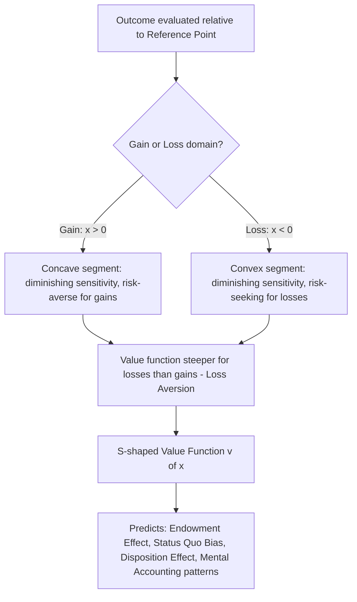

## Prospect Theory and the Shape of the Value Function

### Origins and Purpose

Prospect theory, introduced by Daniel Kahneman and Amos Tversky in their 1979 *Econometrica* paper "Prospect Theory: An Analysis of Decision under Risk," is the foundational descriptive model of behavioral economics for choice under risk, and remains one of the most cited papers in economics. It was constructed explicitly as a direct empirical response to the systematic violations of expected utility theory (EUT) documented by the Allais paradox, preference reversals, and framing effects — its central design goal was to replace EUT's normatively-derived but descriptively falsified axioms with a model that accurately predicts observed choice behavior, even at the cost of abandoning strict axiomatic rationality. Prospect theory has two core structural components: the **value function**, which replaces EUT's utility-over-final-wealth-states framework, and the **probability weighting function**, covered as a related but distinct topic; this entry focuses on the value function specifically.

### The Core Departure: Reference Dependence

The single most consequential structural break from expected utility theory is that prospect theory's value function is defined over **gains and losses relative to a reference point**, rather than over absolute final wealth or asset positions as in EUT. Formally, where EUT evaluates a prospect via $u(w)$ for final wealth $w$, prospect theory evaluates it via $v(x)$ where $x = w - r$ is the deviation of the outcome from a reference point $r$ (commonly, though not necessarily, current wealth or the status quo).

This reference-dependence is motivated directly by the observation, central to the Asian disease problem and related framing studies, that logically identical outcomes described relative to different reference points (e.g., "200 of 600 people saved" versus "400 of 600 people will die") produce systematically different choices — a pattern EUT, which is defined without any reference point, cannot accommodate without additional ad hoc assumptions. The choice of reference point itself is not fixed by the theory and can be influenced by framing, expectations, social comparison, or recent experience, which is both a source of prospect theory's explanatory flexibility and a frequently noted point of criticism regarding the theory's falsifiability (addressed further below).

### The Three Defining Properties of the Value Function

Kahneman and Tversky specified the value function $v(x)$ to have three characteristic properties, each directly derived from systematic patterns in their experimental data:

**1. Concave for gains, convex for losses (diminishing sensitivity).** The value function is concave in the domain of gains ($x > 0$) and convex in the domain of losses ($x < 0$). This produces risk-averse behavior for gains (people prefer a certain gain over a risky gain of equal expected value) and risk-seeking behavior for losses (people prefer a risky loss over a certain loss of equal expected value) — a pattern that stands in direct contrast to standard EUT, which typically assumes uniform concavity (risk aversion) across the entire outcome domain. This joint pattern is termed the **fourfold pattern of risk attitudes** when combined with the probability weighting function (covered separately), but the gain/loss asymmetry in risk attitude specifically derives from the value function's curvature.

**2. Loss aversion: steeper for losses than for gains.** The value function is steeper in the loss domain than in the gain domain around the reference point — formally, $|v(-x)| > v(x)$ for $x > 0$, meaning a loss of a given magnitude produces a larger decrease in value than the value increase produced by an equivalent-magnitude gain. This is the formal basis of the widely cited finding that "losses loom larger than gains," and is considered the single most robust and widely replicated component of prospect theory across the subsequent behavioral economics literature.

**3. Diminishing sensitivity away from the reference point.** The marginal impact of a change in outcome magnitude decreases as the outcome moves further from the reference point, in both the gain and loss directions — this is the same diminishing-sensitivity intuition underlying standard concave utility in EUT, but here applied separately and symmetrically outward from a reference point rather than globally over absolute wealth. It implies, for instance, that the subjective difference between a $0 and $100 gain feels larger than the subjective difference between a $900 and $1,000 gain, even though both represent an identical $100 objective difference.

### The S-Shaped Curve

These three properties jointly produce the characteristic **S-shaped value function**: concave and relatively flat for large gains, convex and relatively flat for large losses, but steep and asymmetric around the reference point, with the loss side of the curve steeper than the gain side. This S-shape is the single most recognizable visual signature of prospect theory in the behavioral economics literature.

### Formal Specification

Kahneman and Tversky's original 1979 functional form, and the more widely used power-function specification later estimated by Tversky and Kahneman in their 1992 cumulative prospect theory extension, is:

$$v(x) = \begin{cases} x^{\alpha} & \text{if } x \geq 0 \\ -\lambda(-x)^{\beta} & \text{if } x < 0 \end{cases}$$

where:

- $x$ is the outcome expressed as a deviation from the reference point (positive for gains, negative for losses)
- $\alpha$ and $\beta$ are curvature parameters governing diminishing sensitivity in the gain and loss domains respectively (with $0 < \alpha, \beta < 1$ producing the required concave-for-gains, convex-for-losses shape)
- $\lambda > 1$ is the **loss aversion coefficient**, scaling losses to be more impactful than equivalently-sized gains

Tversky and Kahneman's 1992 median parameter estimates from their experimental data were $\alpha = \beta \approx 0.88$ and $\lambda \approx 2.25$, figures that have become the most commonly cited canonical calibration values in the subsequent literature, though numerous later studies have estimated somewhat different values depending on elicitation method, stakes, population, and domain (see caveats below).

### Interpreting the Parameters

**$\alpha, \beta$ (curvature/diminishing sensitivity).** Values closer to 1 indicate value approximately linear in outcome magnitude (less diminishing sensitivity); values closer to 0 indicate strongly diminishing sensitivity. The original Kahneman-Tversky estimates assumed $\alpha = \beta$ for parsimony, though this symmetry assumption is not theoretically required and some later estimates relax it.

**$\lambda$ (loss aversion).** This single parameter is the most extensively used and cited number in applied behavioral economics, underlying explanations of the endowment effect, status quo bias, equity premium puzzle contributions, and myopic loss aversion in the disposition effect literature. A $\lambda = 2.25$ implies that a loss of a given dollar amount is, on average, experienced as roughly 2.25 times as psychologically impactful as an equivalently sized gain.

**Caveat on parameter stability [Unverified generality]**: While $\lambda \approx 2$–2.5 is the most frequently cited range, subsequent meta-analytic and replication work (including large-scale studies published in the 2010s and 2020s) has found substantially more heterogeneity in estimated loss aversion coefficients across studies, elicitation methods, and stakes than the canonical figure suggests, with some studies estimating $\lambda$ close to 1 (no meaningful loss aversion) under certain experimental conditions, particularly for small stakes or specific elicitation formats. The general *qualitative* pattern (losses loom larger, on average, across most populations and contexts studied) is considered far more robust than any specific *quantitative* point estimate of $\lambda$.

### Behavioral Implications Derived from the Value Function Shape

**The fourfold pattern of risk attitudes** (jointly with probability weighting, but the gain/loss curvature asymmetry is central): risk aversion for gains of moderate-to-high probability, risk seeking for losses of moderate-to-high probability, risk seeking for small-probability gains, and risk aversion for small-probability losses — the latter two cells depend substantially on the probability weighting function rather than the value function curvature alone.

**The endowment effect.** Once an item is incorporated into one's reference point (e.g., after acquiring it), giving it up is coded as a loss rather than forgoing an equivalent gain, and since losses loom larger than gains under the value function's asymmetric steepness, the minimum acceptable selling price for an owned item systematically exceeds the maximum willingness-to-pay to acquire the same item — a gap directly attributable to loss aversion around a shifted reference point, first demonstrated experimentally by Kahneman, Knetsch, and Thaler (1990) using coffee mugs.

**Status quo bias.** Because any departure from the current state is coded as containing a loss component (whatever is given up) weighted more heavily than the gain component (whatever is received), the value function's asymmetry predicts a general bias toward maintaining the status quo even when an objectively superior alternative is available, independent of any switching costs or inertia.

**Disposition effect in investing.** Investors' well-documented tendency to sell winning stock positions too early (locking in gains, consistent with risk-averse, concave value-function behavior in the gain domain) while holding losing positions too long (consistent with risk-seeking, convex value-function behavior in the loss domain, hoping to "get back to even" and avoid realizing the loss) is a direct behavioral prediction of the value function's differing curvature on either side of the reference point, extensively documented in the behavioral finance literature (e.g., Terrance Odean's trading-record studies).

**Mental accounting interactions.** The value function's concavity/convexity structure interacts with mental accounting (covered as a related topic) to produce specific predictions about how people prefer to segregate multiple gains (since concavity for gains means two separate smaller gains are jointly valued higher than one combined larger gain: $v(x) + v(y) > v(x+y)$ for gains) and integrate multiple losses (since convexity for losses means one combined larger loss is valued less negatively than two separate smaller losses experienced individually: $v(-x-y) > v(-x) + v(-y)$) — a pattern with direct applied relevance to pricing strategy (e.g., bundling rebates versus itemizing them) and to how firms frame fees versus discounts.

### Reference Point Determination: An Open Modeling Question

Prospect theory as originally specified does not provide a complete, mechanistic theory of how the reference point itself is determined in any given decision context — it may be current wealth/status quo, an expectation-based reference point (as in later expectations-based reference-dependence models, e.g., Kőszegi and Rabin, 2006), a socially or contextually cued anchor, or a goal/target level. This underdetermination is one of the most significant and frequently raised theoretical critiques of prospect theory: without an independent, ex-ante specification of the reference point, the theory risks being applied post hoc to rationalize any observed choice pattern by selecting whichever reference point renders the theory's predictions consistent with the data, reducing its out-of-sample predictive power unless reference-point selection is constrained by an auxiliary, independently motivated rule.

### Distinguishing the Value Function from Related Constructs

- **Value function vs. utility function**: The value function $v(x)$ operates on gains/losses relative to a reference point; the EUT utility function $u(w)$ operates on absolute final wealth levels. They are not interchangeable, and prospect theory's predictions (e.g., simultaneous risk aversion for gains and risk seeking for losses at the same underlying wealth level) cannot be replicated by any single globally concave or globally convex $u(w)$.
- **Value function vs. probability weighting function**: The value function transforms objective *outcome magnitudes*; the probability weighting function (a separate component of prospect theory) transforms objective *probabilities*. Both are needed jointly to compute a prospect's overall subjective value; the value function alone does not determine choice under prospect theory without also applying decision weights derived from the probability weighting function.
- **Value function vs. Kőszegi-Rabin expectations-based reference dependence**: A later and influential refinement proposes that the reference point itself should be modeled as the decision-maker's own rational expectations about outcomes, rather than a fixed status quo, generating additional testable predictions (e.g., anticipated versus surprise price changes should have different behavioral effects) not present in the original, reference-point-agnostic 1979 formulation.

### Illustrative Example

**Example**: Consider an employee with an annual bonus reference point of $10,000 (their expectation based on past years). Under Kahneman-Tversky parameters ($\alpha = \beta = 0.88$, $\lambda = 2.25$), receiving a $12,000 bonus (a $2,000 gain relative to reference) yields $v(2000) = 2000^{0.88} \approx 1,096$ value units, while receiving an $8,000 bonus (a $2,000 loss relative to reference) yields $v(-2000) = -2.25 \times 2000^{0.88} \approx -2,466$ value units. Despite the objectively identical $2,000 magnitude of deviation from the reference point in both directions, the loss is experienced as more than twice as psychologically impactful as the equivalent gain — illustrating, in a concrete compensation-design context, why firms are often advised to avoid even modest downward deviations from an established or expected bonus baseline, since the loss-aversion-driven employee reaction to a shortfall is predicted to be disproportionately larger than the corresponding goodwill generated by an equivalent-sized bonus increase.

### Process Diagram

### Conceptual Diagram: The S-Shaped Value Function (svg_diagram)

<svg xmlns="http://www.w3.org/2000/svg" viewBox="0 0 700 400">
<text x="350" y="28" text-anchor="middle" font-size="17" font-weight="bold" fill="#1a1a1a">Prospect Theory Value Function v(x) (svg_diagram)</text>
<line x1="60" y1="200" x2="640" y2="200" stroke="#333" stroke-width="2" />
<line x1="350" y1="40" x2="350" y2="360" stroke="#333" stroke-width="2" />
<text x="640" y="195" font-size="12" fill="#333">Gains (x)</text>
<text x="65" y="195" font-size="12" fill="#333">Losses (x)</text>
<text x="355" y="55" font-size="12" fill="#333">v(x)</text>
<text x="355" y="350" font-size="12" fill="#333">-v(x)</text>
<path d="M 350 200 Q 420 100 640 75" fill="none" stroke="#2b6cb0" stroke-width="3" />
<text x="480" y="90" font-size="12" fill="#2b6cb0">Concave (gains)</text>
<path d="M 350 200 Q 280 320 60 355" fill="none" stroke="#c53030" stroke-width="3" />
<text x="120" y="340" font-size="12" fill="#c53030">Convex (losses) - steeper slope</text>
<circle cx="350" cy="200" r="5" fill="#333" />
<text x="360" y="215" font-size="11" fill="#333">Reference Point</text>
<line x1="450" y1="200" x2="450" y2="130" stroke="#999" stroke-dasharray="3,3" />
<line x1="250" y1="200" x2="250" y2="285" stroke="#999" stroke-dasharray="3,3" />
<text x="460" y="165" font-size="10" fill="#555">gain of magnitude m</text>
<text x="140" y="245" font-size="10" fill="#555">loss of magnitude m: larger drop</text>
</svg>

**Next Steps**

- The probability weighting function and the certainty/possibility effects
- The fourfold pattern of risk attitudes (integrating value function and weighting function)
- Cumulative prospect theory (1992) and rank-dependent decision weights
- Reference point formation: status quo versus expectations-based models (Kőszegi-Rabin)
- The endowment effect and experimental demonstrations
- Mental accounting and the segregation/integration of gains and losses
- The disposition effect in investor behavior
- Loss aversion parameter estimation methods and replication heterogeneity
- Applications to compensation design, pricing strategy, and consumer behavior